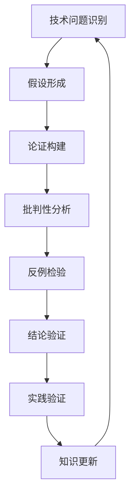

# 2.8 系统化工程论证与批判性分析 / Systematic Engineering Arguments and Critical Analysis

[返回2.技术栈与框架](./2.技术栈与框架/README.md) |  [返回Refactor总览](./2.技术栈与框架/../README.md)

---

## 目录 / Table of Contents

- [2.8 系统化工程论证与批判性分析](#28-系统化工程论证与批判性分析--systematic-engineering-arguments-and-critical-analysis)
- [目录 / Table of Contents](#目录--table-of-contents)
- [1. 概述 / Overview](#1-概述--overview)
- [2. 工程论证方法论 / Engineering Argumentation Methodology](#2-工程论证方法论--engineering-argumentation-methodology)
- [3. 批判性分析框架 / Critical Analysis Framework](#3-批判性分析框架--critical-analysis-framework)
- [4. 形式化论证技术 / Formal Argumentation Techniques](#4-形式化论证技术--formal-argumentation-techniques)
- [5. 工程实践案例 / Engineering Practice Cases](#5-工程实践案例--engineering-practice-cases)
- [6. 相关性引用 / Related References](#6-相关性引用--related-references)
- [7. 参考文献 / Bibliography](#7-参考文献--bibliography)

---

## 1. 概述 / Overview

系统化工程论证与批判性分析是前端技术栈中确保技术决策合理性、系统可靠性和设计质量的核心方法论。通过形式化论证、批判性思维和工程实践验证，建立科学的技术评估体系。

**Systematic Engineering Arguments and Critical Analysis is the core methodology in frontend technology stack for ensuring the rationality of technical decisions, system reliability, and design quality. Through formal argumentation, critical thinking, and engineering practice validation, it establishes a scientific technical evaluation system.**

## 1.1 核心价值 / Core Value

- **技术决策合理性 / Technical Decision Rationality**: 通过系统化论证确保技术选择的合理性
- **系统可靠性保证 / System Reliability Assurance**: 通过批判性分析识别潜在风险
- **设计质量提升 / Design Quality Enhancement**: 通过工程实践验证设计假设
- **知识体系完备性 / Knowledge System Completeness**: 通过交叉验证确保知识完整性

## 1.2 论证流程 / Argumentation Process



---

## 2. 工程论证方法论 / Engineering Argumentation Methodology

## 2.1 论证结构 / Argument Structure

### 2.1.1 Toulmin论证模型 / Toulmin Argument Model

```typescript
interface ToulminArgument {
  claim: string;              // 主张 / Claim
  grounds: string[];          // 论据 / Grounds
  warrant: string;            // 保证 / Warrant
  backing: string[];          // 支持 / Backing
  qualifier: string;          // 限定 / Qualifier
  rebuttal: string[];         // 反驳 / Rebuttal
}

class ToulminAnalyzer {
  analyzeArgument(argument: ToulminArgument): ArgumentAnalysis {
    return {
      strength: this.calculateStrength(argument),
      validity: this.checkValidity(argument),
      soundness: this.checkSoundness(argument),
      completeness: this.checkCompleteness(argument)
    };
  }
  
  private calculateStrength(argument: ToulminArgument): number {
    const groundsStrength = this.evaluateGrounds(argument.grounds);
    const warrantStrength = this.evaluateWarrant(argument.warrant);
    const backingStrength = this.evaluateBacking(argument.backing);
    
    return (groundsStrength + warrantStrength + backingStrength) / 3;
  }
}
```

### 2.1.2 技术决策论证 / Technical Decision Argumentation

```typescript
interface TechnicalDecision {
  problem: string;            // 问题描述 / Problem Description
  alternatives: Alternative[]; // 替代方案 / Alternatives
  criteria: Criterion[];      // 评估标准 / Evaluation Criteria
  decision: Alternative;      // 最终决策 / Final Decision
  justification: string;      // 决策理由 / Justification
}

interface Alternative {
  id: string;
  name: string;
  description: string;
  pros: string[];
  cons: string[];
  riskAssessment: RiskAssessment;
  costBenefitAnalysis: CostBenefitAnalysis;
}

class TechnicalDecisionMaker {
  makeDecision(problem: string, alternatives: Alternative[]): TechnicalDecision {
    const criteria = this.defineCriteria(problem);
    const evaluations = alternatives.map(alt => 
      this.evaluateAlternative(alt, criteria)
    );
    
    const bestAlternative = this.selectBestAlternative(alternatives, evaluations);
    
    return {
      problem,
      alternatives,
      criteria,
      decision: bestAlternative,
      justification: this.generateJustification(bestAlternative, evaluations)
    };
  }
}
```

## 2.2 批判性思维工具 / Critical Thinking Tools

### 2.2.1 SWOT分析 / SWOT Analysis

```typescript
interface SWOTAnalysis {
  strengths: Strength[];      // 优势 / Strengths
  weaknesses: Weakness[];     // 劣势 / Weaknesses
  opportunities: Opportunity[]; // 机会 / Opportunities
  threats: Threat[];          // 威胁 / Threats
}

interface Strength {
  description: string;
  impact: 'high' | 'medium' | 'low';
  evidence: string[];
}

class SWOTAnalyzer {
  analyzeTechnology(technology: Technology): SWOTAnalysis {
    return {
      strengths: this.identifyStrengths(technology),
      weaknesses: this.identifyWeaknesses(technology),
      opportunities: this.identifyOpportunities(technology),
      threats: this.identifyThreats(technology)
    };
  }
  
  private identifyStrengths(technology: Technology): Strength[] {
    return [
      {
        description: '技术成熟度高',
        impact: 'high',
        evidence: ['社区活跃', '文档完善', '生态丰富']
      },
      {
        description: '性能优异',
        impact: 'high',
        evidence: ['基准测试结果', '实际应用案例']
      }
    ];
  }
}
```

### 2.2.2 五问法 / Five Whys Method

```typescript
interface FiveWhysAnalysis {
  problem: string;
  why1: string;
  why2: string;
  why3: string;
  why4: string;
  why5: string;
  rootCause: string;
  solution: string;
}

class FiveWhysAnalyzer {
  analyzeProblem(problem: string): FiveWhysAnalysis {
    const why1 = this.askWhy(problem);
    const why2 = this.askWhy(why1);
    const why3 = this.askWhy(why2);
    const why4 = this.askWhy(why3);
    const why5 = this.askWhy(why4);
    
    const rootCause = this.identifyRootCause(why5);
    const solution = this.generateSolution(rootCause);
    
    return {
      problem, why1, why2, why3, why4, why5, rootCause, solution
    };
  }
}
```

---

## 3. 批判性分析框架 / Critical Analysis Framework

## 3.1 假设检验 / Hypothesis Testing

### 3.1.1 技术假设检验 / Technical Hypothesis Testing

```typescript
interface TechnicalHypothesis {
  hypothesis: string;         // 假设 / Hypothesis
  nullHypothesis: string;     // 零假设 / Null Hypothesis
  alternativeHypothesis: string; // 备择假设 / Alternative Hypothesis
  testMethod: string;         // 检验方法 / Test Method
  significanceLevel: number;  // 显著性水平 / Significance Level
  result: HypothesisTestResult;
}

interface HypothesisTestResult {
  testStatistic: number;      // 检验统计量 / Test Statistic
  pValue: number;            // P值 / P-Value
  conclusion: 'reject' | 'fail_to_reject'; // 结论 / Conclusion
  confidence: number;         // 置信度 / Confidence
}

class HypothesisTester {
  testHypothesis(hypothesis: TechnicalHypothesis): HypothesisTestResult {
    const data = this.collectData(hypothesis);
    const testStatistic = this.calculateTestStatistic(data, hypothesis);
    const pValue = this.calculatePValue(testStatistic, hypothesis);
    
    return {
      testStatistic,
      pValue,
      conclusion: pValue < hypothesis.significanceLevel ? 'reject' : 'fail_to_reject',
      confidence: 1 - hypothesis.significanceLevel
    };
  }
}
```

### 3.1.2 性能假设检验 / Performance Hypothesis Testing

```typescript
interface PerformanceHypothesis extends TechnicalHypothesis {
  baseline: PerformanceMetrics;
  expected: PerformanceMetrics;
  threshold: PerformanceThreshold;
}

class PerformanceHypothesisTester extends HypothesisTester {
  testPerformanceHypothesis(hypothesis: PerformanceHypothesis): PerformanceTestResult {
    const baselineData = this.measureBaselinePerformance(hypothesis.baseline);
    const newData = this.measureNewPerformance(hypothesis.expected);
    
    const testResult = this.performStatisticalTest(baselineData, newData);
    
    return {
      ...testResult,
      performanceImprovement: this.calculateImprovement(baselineData, newData),
      practicalSignificance: this.assessPracticalSignificance(testResult)
    };
  }
}
```

## 3.2 反例分析 / Counterexample Analysis

### 3.2.1 技术反例 / Technical Counterexamples

```typescript
interface Counterexample {
  scenario: string;           // 场景描述 / Scenario Description
  expectedBehavior: string;   // 预期行为 / Expected Behavior
  actualBehavior: string;     // 实际行为 / Actual Behavior
  impact: 'critical' | 'high' | 'medium' | 'low';
  mitigation: string;         // 缓解措施 / Mitigation
}

class CounterexampleAnalyzer {
  findCounterexamples(technology: Technology): Counterexample[] {
    return [
      this.findEdgeCaseCounterexamples(technology),
      this.findPerformanceCounterexamples(technology),
      this.findSecurityCounterexamples(technology),
      this.findCompatibilityCounterexamples(technology)
    ].flat();
  }
  
  private findEdgeCaseCounterexamples(technology: Technology): Counterexample[] {
    return [
      {
        scenario: '极端数据量情况',
        expectedBehavior: '正常处理',
        actualBehavior: '内存溢出',
        impact: 'high',
        mitigation: '实现分页处理'
      },
      {
        scenario: '网络异常情况',
        expectedBehavior: '优雅降级',
        actualBehavior: '应用崩溃',
        impact: 'critical',
        mitigation: '添加错误边界'
      }
    ];
  }
}
```

---

## 4. 形式化论证技术 / Formal Argumentation Techniques

## 4.1 逻辑论证 / Logical Arguments

### 4.1.1 命题逻辑 / Propositional Logic

```typescript
interface Proposition {
  statement: string;          // 命题陈述 / Proposition Statement
  truthValue: boolean;        // 真值 / Truth Value
  proof: Proof;              // 证明 / Proof
}

interface Proof {
  premises: Proposition[];    // 前提 / Premises
  conclusion: Proposition;    // 结论 / Conclusion
  inferenceRules: InferenceRule[]; // 推理规则 / Inference Rules
}

enum InferenceRule {
  MODUS_PONENS = 'modus_ponens',
  MODUS_TOLLENS = 'modus_tollens',
  HYPOTHETICAL_SYLLOGISM = 'hypothetical_syllogism',
  DISJUNCTIVE_SYLLOGISM = 'disjunctive_syllogism'
}

class LogicalReasoner {
  validateArgument(premises: Proposition[], conclusion: Proposition): boolean {
    const proof = this.constructProof(premises, conclusion);
    return this.verifyProof(proof);
  }
  
  private constructProof(premises: Proposition[], conclusion: Proposition): Proof {
    // 构建逻辑证明 / Construct Logical Proof
    const inferenceRules = this.identifyInferenceRules(premises, conclusion);
    return {
      premises,
      conclusion,
      inferenceRules
    };
  }
}
```

### 4.1.2 技术决策逻辑 / Technical Decision Logic

```typescript
interface TechnicalProposition extends Proposition {
  technology: Technology;
  context: Context;
  constraints: Constraint[];
}

class TechnicalLogicAnalyzer {
  analyzeTechnicalDecision(proposition: TechnicalProposition): DecisionAnalysis {
    const validity = this.checkLogicalValidity(proposition);
    const soundness = this.checkSoundness(proposition);
    const completeness = this.checkCompleteness(proposition);
    
    return {
      validity,
      soundness,
      completeness,
      confidence: this.calculateConfidence(validity, soundness, completeness)
    };
  }
}
```

## 4.2 因果论证 / Causal Arguments

### 4.2.1 因果图 / Causal Diagrams

```typescript
interface CausalNode {
  id: string;
  variable: string;
  type: 'cause' | 'effect' | 'mediator' | 'confounder';
  evidence: Evidence[];
}

interface CausalEdge {
  from: string;
  to: string;
  strength: number;           // 因果强度 / Causal Strength
  direction: 'positive' | 'negative';
  evidence: Evidence[];
}

interface CausalGraph {
  nodes: CausalNode[];
  edges: CausalEdge[];
}

class CausalAnalyzer {
  analyzeCausality(graph: CausalGraph): CausalAnalysis {
    return {
      directEffects: this.findDirectEffects(graph),
      indirectEffects: this.findIndirectEffects(graph),
      confoundingFactors: this.findConfoundingFactors(graph),
      causalStrength: this.calculateCausalStrength(graph)
    };
  }
  
  private findDirectEffects(graph: CausalGraph): CausalEffect[] {
    return graph.edges
      .filter(edge => edge.type === 'direct')
      .map(edge => ({
        cause: edge.from,
        effect: edge.to,
        strength: edge.strength
      }));
  }
}
```

### 4.2.2 技术因果分析 / Technical Causal Analysis

```typescript
interface TechnicalCausalAnalysis extends CausalAnalysis {
  technologyFactors: TechnologyFactor[];
  performanceImpacts: PerformanceImpact[];
  riskFactors: RiskFactor[];
}

class TechnicalCausalAnalyzer extends CausalAnalyzer {
  analyzeTechnologyCausality(technology: Technology): TechnicalCausalAnalysis {
    const causalGraph = this.buildTechnologyCausalGraph(technology);
    const baseAnalysis = this.analyzeCausality(causalGraph);
    
    return {
      ...baseAnalysis,
      technologyFactors: this.identifyTechnologyFactors(technology),
      performanceImpacts: this.analyzePerformanceImpacts(technology),
      riskFactors: this.identifyRiskFactors(technology)
    };
  }
}
```

---

## 5. 工程实践案例 / Engineering Practice Cases

## 5.1 框架选择论证 / Framework Selection Argumentation

### 5.1.1 React vs Vue 选择论证 / React vs Vue Selection Argumentation

```typescript
interface FrameworkComparison {
  criteria: ComparisonCriterion[];
  react: FrameworkEvaluation;
  vue: FrameworkEvaluation;
  conclusion: FrameworkDecision;
}

interface ComparisonCriterion {
  name: string;
  weight: number;
  description: string;
  measurement: string;
}

interface FrameworkEvaluation {
  framework: 'React' | 'Vue';
  scores: CriterionScore[];
  totalScore: number;
  strengths: string[];
  weaknesses: string[];
}

class FrameworkSelector {
  compareFrameworks(): FrameworkComparison {
    const criteria = this.defineComparisonCriteria();
    const reactEvaluation = this.evaluateFramework('React', criteria);
    const vueEvaluation = this.evaluateFramework('Vue', criteria);
    
    return {
      criteria,
      react: reactEvaluation,
      vue: vueEvaluation,
      conclusion: this.makeDecision(reactEvaluation, vueEvaluation)
    };
  }
  
  private defineComparisonCriteria(): ComparisonCriterion[] {
    return [
      {
        name: '生态系统',
        weight: 0.25,
        description: '社区活跃度、第三方库支持',
        measurement: 'GitHub stars, npm downloads'
      },
      {
        name: '学习曲线',
        weight: 0.20,
        description: '开发人员上手难度',
        measurement: '文档质量、示例丰富度'
      },
      {
        name: '性能表现',
        weight: 0.25,
        description: '运行时性能、渲染效率',
        measurement: '基准测试、实际应用性能'
      },
      {
        name: '企业支持',
        weight: 0.15,
        description: '商业支持、长期维护',
        measurement: '公司背景、更新频率'
      },
      {
        name: '开发体验',
        weight: 0.15,
        description: '开发工具、调试体验',
        measurement: 'DevTools质量、开发效率'
      }
    ];
  }
}
```

### 5.1.2 性能优化论证 / Performance Optimization Argumentation

```typescript
interface PerformanceOptimization {
  problem: PerformanceProblem;
  solutions: OptimizationSolution[];
  analysis: OptimizationAnalysis;
  recommendation: OptimizationRecommendation;
}

interface PerformanceProblem {
  description: string;
  metrics: PerformanceMetrics;
  impact: 'critical' | 'high' | 'medium' | 'low';
  rootCause: string;
}

interface OptimizationSolution {
  name: string;
  description: string;
  implementation: string;
  expectedImprovement: PerformanceImprovement;
  cost: OptimizationCost;
  risk: OptimizationRisk;
}

class PerformanceOptimizer {
  analyzeOptimization(problem: PerformanceProblem): PerformanceOptimization {
    const solutions = this.generateSolutions(problem);
    const analysis = this.analyzeSolutions(solutions, problem);
    const recommendation = this.makeRecommendation(analysis);
    
    return {
      problem,
      solutions,
      analysis,
      recommendation
    };
  }
  
  private generateSolutions(problem: PerformanceProblem): OptimizationSolution[] {
    return [
      {
        name: '代码分割',
        description: '将大型包分割为更小的块',
        implementation: '使用动态import()和React.lazy()',
        expectedImprovement: {
          bundleSize: -30,
          loadTime: -25,
          runtimePerformance: 0
        },
        cost: { developmentTime: 2, complexity: 'medium' },
        risk: { level: 'low', description: '可能增加HTTP请求数' }
      },
      {
        name: '虚拟化',
        description: '只渲染可见的列表项',
        implementation: '使用react-window或react-virtualized',
        expectedImprovement: {
          bundleSize: 0,
          loadTime: 0,
          runtimePerformance: 50
        },
        cost: { developmentTime: 1, complexity: 'low' },
        risk: { level: 'low', description: '可能影响滚动体验' }
      }
    ];
  }
}
```

## 5.2 架构设计论证 / Architecture Design Argumentation

### 5.2.1 微前端架构论证 / Micro-frontend Architecture Argumentation

```typescript
interface MicroFrontendArgument {
  context: BusinessContext;
  requirements: ArchitectureRequirement[];
  alternatives: ArchitectureAlternative[];
  analysis: ArchitectureAnalysis;
  decision: ArchitectureDecision;
}

interface BusinessContext {
  teamSize: number;
  technologyDiversity: string[];
  deploymentFrequency: string;
  scalabilityNeeds: string;
}

interface ArchitectureRequirement {
  category: 'functional' | 'non-functional' | 'constraint';
  description: string;
  priority: 'high' | 'medium' | 'low';
  acceptanceCriteria: string[];
}

class MicroFrontendArchitect {
  designArchitecture(context: BusinessContext): MicroFrontendArgument {
    const requirements = this.defineRequirements(context);
    const alternatives = this.generateAlternatives(requirements);
    const analysis = this.analyzeAlternatives(alternatives, requirements);
    const decision = this.makeDecision(analysis);
    
    return {
      context,
      requirements,
      alternatives,
      analysis,
      decision
    };
  }
  
  private defineRequirements(context: BusinessContext): ArchitectureRequirement[] {
    return [
      {
        category: 'functional',
        description: '独立开发和部署',
        priority: 'high',
        acceptanceCriteria: ['团队可独立开发', '可独立部署', '技术栈自由']
      },
      {
        category: 'non-functional',
        description: '性能要求',
        priority: 'high',
        acceptanceCriteria: ['首屏加载时间 < 2s', '运行时性能无显著下降']
      },
      {
        category: 'constraint',
        description: '团队技能限制',
        priority: 'medium',
        acceptanceCriteria: ['学习成本可控', '维护复杂度适中']
      }
    ];
  }
}
```

---

## 6. 相关性引用 / Related References

- [2.1 前端主流框架](./2.技术栈与框架/2.1 前端主流框架.md)
- [2.2 跨端框架](./2.技术栈与框架/2.2 跨端框架.md)
- [2.3 Rust前端全栈](./2.技术栈与框架/2.3 Rust前端全栈.md)
- [2.6 Web核心技术](./2.技术栈与框架/2.6 Web核心技术.md)
- [2.7 现代前端工程化](./2.技术栈与框架/2.7 现代前端工程化.md)
- [4.1 GoF设计模式](./2.技术栈与框架/../4.设计模式与架构/4.1 GoF设计模式.md)
- [4.3 组件化与架构模式](./2.技术栈与框架/../4.设计模式与架构/4.3 组件化与架构模式.md)
- [4.4 哲学与认知批判性分析](./2.技术栈与框架/../4.设计模式与架构/4.4 哲学与认知批判性分析.md)
- [5.3 性能优化与工程实践](./2.技术栈与框架/../5.技术规范与标准/5.3 性能优化与工程实践.md)
- [6.4 AI工程实践与伦理](./2.技术栈与框架/../6.人工智能原理与算法/6.4 AI工程实践与伦理.md)

---

## 7. 参考文献 / Bibliography

1. **Toulmin, S. E. (1958).** *The Uses of Argument*. Cambridge University Press.
2. **Walton, D. (2006).** *Fundamentals of Critical Argumentation*. Cambridge University Press.
3. **Fisher, A. (2004).** *The Logic of Real Arguments*. Cambridge University Press.
4. **Kuhn, D. (1991).** *The Skills of Argument*. Cambridge University Press.
5. **Perelman, C., & Olbrechts-Tyteca, L. (1969).** *The New Rhetoric: A Treatise on Argumentation*. University of Notre Dame Press.
6. **ISO/IEC 25010:2011.** Systems and software engineering — Systems and software Quality Requirements and Evaluation (SQuaRE) — System and software quality models.
7. **IEEE 1012-2016.** IEEE Standard for System, Software, and Hardware Verification and Validation.
8. **SEI (2018).** *Technical Debt*. Software Engineering Institute, Carnegie Mellon University.

---

> **补充说明 / Additional Notes:**
>
> 系统化工程论证与批判性分析是确保前端技术决策科学性和合理性的重要方法论。通过形式化论证、批判性思维和工程实践验证，我们可以建立更加可靠和可维护的技术体系。在快速发展的前端技术生态中，这种系统化的分析方法显得尤为重要。
>
> **Systematic Engineering Arguments and Critical Analysis is an important methodology for ensuring the scientific nature and rationality of frontend technical decisions. Through formal argumentation, critical thinking, and engineering practice validation, we can establish more reliable and maintainable technical systems. In the rapidly developing frontend technology ecosystem, this systematic analytical approach becomes particularly important.**
