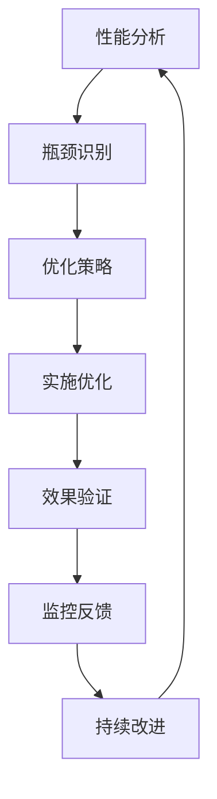

# 2.9 系统化性能优化与工程实践 / Systematic Performance Optimization and Engineering Practice

[返回2.技术栈与框架](./2.技术栈与框架/README.md) |  [返回Refactor总览](./2.技术栈与框架/../README.md)

---

## 目录 / Table of Contents

- [2.9 系统化性能优化与工程实践](#29-系统化性能优化与工程实践--systematic-performance-optimization-and-engineering-practice)
- [目录 / Table of Contents](#目录--table-of-contents)
- [1. 概述 / Overview](#1-概述--overview)
- [2. 性能优化方法论 / Performance Optimization Methodology](#2-性能优化方法论--performance-optimization-methodology)
- [3. 工程实践体系 / Engineering Practice System](#3-工程实践体系--engineering-practice-system)
- [4. 形式化性能分析 / Formal Performance Analysis](#4-形式化性能分析--formal-performance-analysis)
- [5. 相关性引用 / Related References](#5-相关性引用--related-references)
- [6. 参考文献 / Bibliography](#6-参考文献--bibliography)

---

## 1. 概述 / Overview

系统化性能优化与工程实践是前端技术栈中确保应用性能、用户体验和系统可靠性的核心方法论。通过科学化的性能分析、工程化的优化实践和系统化的监控体系，建立全面的性能保证机制。

**Systematic Performance Optimization and Engineering Practice is the core methodology for ensuring application performance, user experience, and system reliability in frontend technology stack. Through scientific performance analysis, engineering optimization practices, and systematic monitoring systems, it establishes a comprehensive performance assurance mechanism.**

## 1.1 核心目标 / Core Objectives

- **性能优化 / Performance Optimization**: 建立科学的性能优化方法论
- **工程实践 / Engineering Practice**: 构建系统化的工程实践体系
- **监控体系 / Monitoring System**: 建立全面的性能监控体系
- **持续改进 / Continuous Improvement**: 实现性能的持续优化和改进

## 1.2 性能优化流程 / Performance Optimization Process



---

## 2. 性能优化方法论 / Performance Optimization Methodology

## 2.1 多维度性能模型 / Multi-dimensional Performance Model

### 2.1.1 加载性能 / Loading Performance

```typescript
interface LoadingPerformance {
  metrics: {
    firstContentfulPaint: number;    // 首次内容绘制 / First Contentful Paint
    largestContentfulPaint: number;  // 最大内容绘制 / Largest Contentful Paint
    firstInputDelay: number;         // 首次输入延迟 / First Input Delay
    timeToInteractive: number;       // 可交互时间 / Time to Interactive
  };
  optimization: {
    bundleSize: number;              // 包大小 / Bundle Size
    resourceLoading: ResourceLoading; // 资源加载 / Resource Loading
    caching: CachingStrategy;        // 缓存策略 / Caching Strategy
  };
}

class LoadingPerformanceOptimizer {
  optimizeLoading(application: Application): LoadingPerformance {
    return {
      metrics: this.measureLoadingMetrics(application),
      optimization: this.optimizeLoadingStrategy(application)
    };
  }
  
  private measureLoadingMetrics(application: Application): LoadingMetrics {
    return {
      firstContentfulPaint: this.measureFCP(application),
      largestContentfulPaint: this.measureLCP(application),
      firstInputDelay: this.measureFID(application),
      timeToInteractive: this.measureTTI(application)
    };
  }
}
```

### 2.1.2 运行时性能 / Runtime Performance

```typescript
interface RuntimePerformance {
  metrics: {
    frameRate: number;               // 帧率 / Frame Rate
    memoryUsage: number;             // 内存使用 / Memory Usage
    cpuUsage: number;                // CPU使用 / CPU Usage
    batteryConsumption: number;      // 电池消耗 / Battery Consumption
  };
  optimization: {
    rendering: RenderingOptimization; // 渲染优化 / Rendering Optimization
    memory: MemoryOptimization;       // 内存优化 / Memory Optimization
    computation: ComputationOptimization; // 计算优化 / Computation Optimization
  };
}

class RuntimePerformanceOptimizer {
  optimizeRuntime(application: Application): RuntimePerformance {
    return {
      metrics: this.measureRuntimeMetrics(application),
      optimization: this.optimizeRuntimeStrategy(application)
    };
  }
}
```

### 2.1.3 网络性能 / Network Performance

```typescript
interface NetworkPerformance {
  metrics: {
    bandwidth: number;               // 带宽 / Bandwidth
    latency: number;                 // 延迟 / Latency
    throughput: number;              // 吞吐量 / Throughput
    packetLoss: number;              // 丢包率 / Packet Loss
  };
  optimization: {
    compression: CompressionStrategy; // 压缩策略 / Compression Strategy
    caching: NetworkCaching;         // 网络缓存 / Network Caching
    cdn: CDNOptimization;            // CDN优化 / CDN Optimization
  };
}

class NetworkPerformanceOptimizer {
  optimizeNetwork(application: Application): NetworkPerformance {
    return {
      metrics: this.measureNetworkMetrics(application),
      optimization: this.optimizeNetworkStrategy(application)
    };
  }
}
```

## 2.2 性能优化策略 / Performance Optimization Strategies

### 2.2.1 代码分割 / Code Splitting

```typescript
interface CodeSplittingStrategy {
  strategy: 'route' | 'component' | 'dynamic' | 'vendor';
  chunks: CodeChunk[];
  optimization: {
    minification: boolean;
    treeShaking: boolean;
    deadCodeElimination: boolean;
  };
}

class CodeSplittingOptimizer {
  optimizeCodeSplitting(bundle: Bundle): CodeSplittingStrategy {
    return {
      strategy: this.determineSplittingStrategy(bundle),
      chunks: this.createOptimalChunks(bundle),
      optimization: this.applyOptimizations(bundle)
    };
  }
  
  private determineSplittingStrategy(bundle: Bundle): string {
    const analysis = this.analyzeBundle(bundle);
    
    if (analysis.routeBased) return 'route';
    if (analysis.componentBased) return 'component';
    if (analysis.dynamicImports) return 'dynamic';
    return 'vendor';
  }
}
```

### 2.2.2 资源优化 / Resource Optimization

```typescript
interface ResourceOptimization {
  images: ImageOptimization;
  fonts: FontOptimization;
  scripts: ScriptOptimization;
  styles: StyleOptimization;
}

interface ImageOptimization {
  format: 'webp' | 'avif' | 'jpeg' | 'png';
  compression: number;
  responsive: boolean;
  lazyLoading: boolean;
}

class ResourceOptimizer {
  optimizeResources(resources: Resource[]): ResourceOptimization {
    return {
      images: this.optimizeImages(resources.images),
      fonts: this.optimizeFonts(resources.fonts),
      scripts: this.optimizeScripts(resources.scripts),
      styles: this.optimizeStyles(resources.styles)
    };
  }
  
  private optimizeImages(images: Image[]): ImageOptimization {
    return {
      format: this.selectOptimalFormat(images),
      compression: this.calculateOptimalCompression(images),
      responsive: this.shouldUseResponsive(images),
      lazyLoading: this.shouldUseLazyLoading(images)
    };
  }
}
```

---

## 3. 工程实践体系 / Engineering Practice System

## 3.1 构建优化 / Build Optimization

### 3.1.1 构建工具优化 / Build Tool Optimization

```typescript
interface BuildOptimization {
  bundler: BundlerConfig;
  minification: MinificationConfig;
  compression: CompressionConfig;
  caching: CachingConfig;
}

interface BundlerConfig {
  type: 'webpack' | 'vite' | 'rollup' | 'esbuild';
  optimization: {
    treeShaking: boolean;
    codeSplitting: boolean;
    moduleConcatenation: boolean;
  };
}

class BuildOptimizer {
  optimizeBuild(config: BuildConfig): BuildOptimization {
    return {
      bundler: this.optimizeBundler(config.bundler),
      minification: this.optimizeMinification(config.minification),
      compression: this.optimizeCompression(config.compression),
      caching: this.optimizeCaching(config.caching)
    };
  }
  
  private optimizeBundler(bundler: BundlerConfig): BundlerConfig {
    return {
      ...bundler,
      optimization: {
        treeShaking: true,
        codeSplitting: true,
        moduleConcatenation: true
      }
    };
  }
}
```

### 3.1.2 依赖优化 / Dependency Optimization

```typescript
interface DependencyOptimization {
  analysis: DependencyAnalysis;
  optimization: {
    treeShaking: boolean;
    deadCodeElimination: boolean;
    dependencyInjection: boolean;
  };
  recommendations: OptimizationRecommendation[];
}

class DependencyOptimizer {
  optimizeDependencies(dependencies: Dependency[]): DependencyOptimization {
    const analysis = this.analyzeDependencies(dependencies);
    
    return {
      analysis,
      optimization: this.determineOptimizations(analysis),
      recommendations: this.generateRecommendations(analysis)
    };
  }
  
  private analyzeDependencies(dependencies: Dependency[]): DependencyAnalysis {
    return {
      size: this.calculateTotalSize(dependencies),
      duplicates: this.findDuplicates(dependencies),
      unused: this.findUnused(dependencies),
      outdated: this.findOutdated(dependencies)
    };
  }
}
```

## 3.2 部署优化 / Deployment Optimization

### 3.2.1 CDN优化 / CDN Optimization

```typescript
interface CDNOptimization {
  strategy: CDNStrategy;
  caching: CDNCaching;
  compression: CDNCompression;
  monitoring: CDNMonitoring;
}

interface CDNStrategy {
  type: 'static' | 'dynamic' | 'hybrid';
  regions: string[];
  fallback: FallbackStrategy;
}

class CDNOptimizer {
  optimizeCDN(config: CDNConfig): CDNOptimization {
    return {
      strategy: this.optimizeCDNStrategy(config.strategy),
      caching: this.optimizeCDNCaching(config.caching),
      compression: this.optimizeCDNCompression(config.compression),
      monitoring: this.setupCDNMonitoring(config.monitoring)
    };
  }
}
```

### 3.2.2 缓存策略 / Caching Strategy

```typescript
interface CachingStrategy {
  browser: BrowserCaching;
  server: ServerCaching;
  cdn: CDNCaching;
  application: ApplicationCaching;
}

interface BrowserCaching {
  static: CacheConfig;
  dynamic: CacheConfig;
  api: CacheConfig;
}

class CachingOptimizer {
  optimizeCaching(config: CachingConfig): CachingStrategy {
    return {
      browser: this.optimizeBrowserCaching(config.browser),
      server: this.optimizeServerCaching(config.server),
      cdn: this.optimizeCDNCaching(config.cdn),
      application: this.optimizeApplicationCaching(config.application)
    };
  }
}
```

---

## 4. 形式化性能分析 / Formal Performance Analysis

## 4.1 性能模型 / Performance Models

### 4.1.1 性能预测模型 / Performance Prediction Model

```typescript
interface PerformancePrediction {
  model: PerformanceModel;
  parameters: ModelParameters;
  predictions: PerformancePrediction[];
}

interface PerformanceModel {
  type: 'linear' | 'exponential' | 'logarithmic';
  formula: string;
  accuracy: number;
}

class PerformancePredictor {
  predictPerformance(data: PerformanceData): PerformancePrediction {
    const model = this.selectOptimalModel(data);
    const parameters = this.fitModel(model, data);
    const predictions = this.generatePredictions(model, parameters);
    
    return {
      model,
      parameters,
      predictions
    };
  }
  
  private selectOptimalModel(data: PerformanceData): PerformanceModel {
    const models = [
      this.createLinearModel(),
      this.createExponentialModel(),
      this.createLogarithmicModel()
    ];
    
    return models.reduce((best, current) => 
      current.accuracy > best.accuracy ? current : best
    );
  }
}
```

### 4.1.2 瓶颈分析模型 / Bottleneck Analysis Model

```typescript
interface BottleneckAnalysis {
  bottlenecks: Bottleneck[];
  impact: ImpactAnalysis;
  recommendations: OptimizationRecommendation[];
}

interface Bottleneck {
  type: 'cpu' | 'memory' | 'network' | 'disk';
  severity: 'low' | 'medium' | 'high' | 'critical';
  location: string;
  description: string;
}

class BottleneckAnalyzer {
  analyzeBottlenecks(performance: PerformanceData): BottleneckAnalysis {
    const bottlenecks = this.identifyBottlenecks(performance);
    const impact = this.analyzeImpact(bottlenecks);
    const recommendations = this.generateRecommendations(bottlenecks);
    
    return {
      bottlenecks,
      impact,
      recommendations
    };
  }
  
  private identifyBottlenecks(performance: PerformanceData): Bottleneck[] {
    return [
      ...this.analyzeCPUBottlenecks(performance),
      ...this.analyzeMemoryBottlenecks(performance),
      ...this.analyzeNetworkBottlenecks(performance),
      ...this.analyzeDiskBottlenecks(performance)
    ];
  }
}
```

## 4.2 性能监控 / Performance Monitoring

### 4.2.1 实时监控 / Real-time Monitoring

```typescript
interface PerformanceMonitor {
  metrics: PerformanceMetrics;
  alerts: PerformanceAlert[];
  dashboard: PerformanceDashboard;
}

interface PerformanceMetrics {
  current: CurrentMetrics;
  historical: HistoricalMetrics;
  trends: TrendAnalysis;
}

class PerformanceMonitor {
  async monitorPerformance(application: Application): Promise<PerformanceMonitor> {
    const metrics = await this.collectMetrics(application);
    const alerts = this.checkAlerts(metrics);
    const dashboard = this.updateDashboard(metrics);
    
    return {
      metrics,
      alerts,
      dashboard
    };
  }
  
  private async collectMetrics(application: Application): Promise<PerformanceMetrics> {
    return {
      current: await this.collectCurrentMetrics(application),
      historical: await this.collectHistoricalMetrics(application),
      trends: await this.analyzeTrends(application)
    };
  }
}
```

### 4.2.2 性能报告 / Performance Reports

```typescript
interface PerformanceReport {
  summary: PerformanceSummary;
  details: PerformanceDetails;
  recommendations: PerformanceRecommendation[];
  trends: PerformanceTrends;
}

class PerformanceReporter {
  generateReport(metrics: PerformanceMetrics[]): PerformanceReport {
    return {
      summary: this.generateSummary(metrics),
      details: this.generateDetails(metrics),
      recommendations: this.generateRecommendations(metrics),
      trends: this.analyzeTrends(metrics)
    };
  }
  
  private generateSummary(metrics: PerformanceMetrics[]): PerformanceSummary {
    const latest = metrics[metrics.length - 1];
    
    return {
      overallScore: this.calculateOverallScore(latest),
      criticalIssues: this.countCriticalIssues(latest),
      improvementAreas: this.identifyImprovementAreas(latest),
      status: this.determineOverallStatus(latest)
    };
  }
}
```

---

## 5. 相关性引用 / Related References

- [2.1 前端主流框架](./2.技术栈与框架/2.1 前端主流框架.md)
- [2.7 现代前端工程化](./2.技术栈与框架/2.7 现代前端工程化.md)
- [2.8 系统化工程论证与批判性分析](./2.技术栈与框架/2.8 系统化工程论证与批判性分析.md)
- [5.3 性能优化与工程实践](./5.技术规范与标准/5.3 性能优化与工程实践.md)
- [5.5 系统化质量评估与验证](./5.技术规范与标准/5.5 系统化质量评估与验证.md)
- [3.6 函数式编程与类型系统](./3.编程语言范式/3.6 函数式编程与类型系统.md)
- [4.4 哲学与认知批判性分析](./4.设计模式与架构/4.4 哲学与认知批判性分析.md)

---

## 6. 参考文献 / Bibliography

1. **Google (2020).** *Web Vitals*. Google Developers.
2. **Mozilla (2021).** *Performance Best Practices*. MDN Web Docs.
3. **WebPageTest (2022).** *Performance Testing Methodology*. WebPageTest.org.
4. **Lighthouse (2023).** *Performance Auditing Guide*. Google Lighthouse.
5. **Addy Osmani (2020).** *Web Performance Optimization*. O'Reilly Media.
6. **Steve Souders (2008).** *High Performance Web Sites*. O'Reilly Media.
7. **Ilya Grigorik (2013).** *High Performance Browser Networking*. O'Reilly Media.
8. **Philip Walton (2019).** *Web Performance in Practice*. Manning Publications.

---

> **补充说明 / Additional Notes:**
>
> 系统化性能优化与工程实践是确保前端应用高性能、高质量的关键环节。通过科学化的性能分析、工程化的优化实践和系统化的监控体系，建立全面的性能保证机制，为用户提供卓越的体验。
>
> **Systematic Performance Optimization and Engineering Practice is a key component for ensuring high performance and quality of frontend applications. Through scientific performance analysis, engineering optimization practices, and systematic monitoring systems, it establishes a comprehensive performance assurance mechanism, providing users with excellent experience.**
