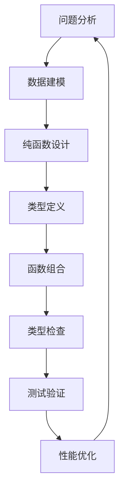

# 3.6 函数式编程与类型系统 / Functional Programming and Type Systems

[返回3.编程语言范式](./3.编程语言范式/README.md) |  [返回Refactor总览](./3.编程语言范式/../README.md)

---

## 目录 / Table of Contents

- [3.6 函数式编程与类型系统](#36-函数式编程与类型系统--functional-programming-and-type-systems)
- [目录 / Table of Contents](#目录--table-of-contents)
- [1. 概述 / Overview](#1-概述--overview)
- [2. 函数式编程范式 / Functional Programming Paradigm](#2-函数式编程范式--functional-programming-paradigm)
- [3. 类型系统理论 / Type System Theory](#3-类型系统理论--type-system-theory)
- [4. 形式化验证 / Formal Verification](#4-形式化验证--formal-verification)
- [5. 工程实践应用 / Engineering Practice Applications](#5-工程实践应用--engineering-practice-applications)
- [6. 相关性引用 / Related References](#6-相关性引用--related-references)
- [7. 参考文献 / Bibliography](#7-参考文献--bibliography)

---

## 1. 概述 / Overview

函数式编程与类型系统是现代前端开发中确保代码质量、可维护性和正确性的核心理论基础。通过数学形式化、类型安全、纯函数等概念，建立科学可靠的编程方法论。

**Functional Programming and Type Systems are the core theoretical foundations for ensuring code quality, maintainability, and correctness in modern frontend development. Through mathematical formalization, type safety, pure functions, and other concepts, they establish a scientific and reliable programming methodology.**

## 1.1 核心概念 / Core Concepts

- **纯函数 / Pure Functions**: 无副作用、引用透明的函数
- **不可变性 / Immutability**: 数据不可修改，创建新数据
- **高阶函数 / Higher-Order Functions**: 函数作为参数或返回值
- **类型安全 / Type Safety**: 编译时类型检查，防止运行时错误
- **代数数据类型 / Algebraic Data Types**: 复合类型的数学表示

## 1.2 函数式编程流程 / Functional Programming Process



---

## 2. 函数式编程范式 / Functional Programming Paradigm

## 2.1 纯函数与副作用 / Pure Functions and Side Effects

### 2.1.1 纯函数定义 / Pure Function Definition

```typescript
// 纯函数示例 / Pure Function Example
interface PureFunction<T, U> {
  (input: T): U;
  isPure: boolean;
  sideEffects: SideEffect[];
}

// 纯函数：无副作用，相同输入总是产生相同输出
const add = (a: number, b: number): number => a + b;

// 非纯函数：有副作用，依赖外部状态
const getCurrentTime = (): number => Date.now();

// 纯函数：数学运算
const square = (x: number): number => x * x;

// 非纯函数：修改外部状态
const updateCounter = (counter: { value: number }): void => {
  counter.value += 1; // 副作用：修改外部状态
};
```

### 2.1.2 副作用管理 / Side Effect Management

```typescript
interface SideEffect {
  type: 'io' | 'state' | 'exception' | 'random';
  description: string;
  impact: 'local' | 'global';
}

class SideEffectManager {
  // IO副作用封装 / IO Side Effect Encapsulation
  static async withIO<T>(io: () => Promise<T>): Promise<Result<T, Error>> {
    try {
      const result = await io();
      return { success: true, data: result };
    } catch (error) {
      return { success: false, error: error as Error };
    }
  }
  
  // 状态副作用封装 / State Side Effect Encapsulation
  static withState<T, S>(
    initialState: S,
    computation: (state: S) => [T, S]
  ): T {
    const [result, newState] = computation(initialState);
    return result;
  }
}
```

## 2.2 高阶函数 / Higher-Order Functions

### 2.2.1 函数组合 / Function Composition

```typescript
// 函数组合类型 / Function Composition Type
type Compose<A, B, C> = (f: (b: B) => C, g: (a: A) => B) => (a: A) => C;

// 函数组合实现 / Function Composition Implementation
const compose = <A, B, C>(f: (b: B) => C, g: (a: A) => B): (a: A) => C => {
  return (a: A) => f(g(a));
};

// 管道操作符 / Pipeline Operator
const pipe = <T>(...functions: Array<(arg: T) => T>): (arg: T) => T => {
  return (arg: T) => functions.reduce((result, fn) => fn(result), arg);
};

// 使用示例 / Usage Examples
const addOne = (x: number): number => x + 1;
const multiplyByTwo = (x: number): number => x * 2;
const square = (x: number): number => x * x;

// 组合函数 / Composed Function
const transform = pipe(addOne, multiplyByTwo, square);
const result = transform(3); // ((3 + 1) * 2)² = 64
```

### 2.2.2 柯里化 / Currying

```typescript
// 柯里化类型 / Currying Type
type Curry<F> = F extends (...args: infer A) => infer R
  ? A extends [infer First, ...infer Rest]
    ? Rest extends []
      ? F
      : (arg: First) => Curry<(...args: Rest) => R>
    : F
  : never;

// 柯里化实现 / Currying Implementation
const curry = <T extends any[], R>(
  fn: (...args: T) => R
): Curry<(...args: T) => R> => {
  return ((...args: any[]) => {
    if (args.length >= fn.length) {
      return fn(...args);
    }
    return (...moreArgs: any[]) => 
      curry(fn.bind(null, ...args))(...moreArgs);
  }) as any;
};

// 使用示例 / Usage Examples
const add = (a: number, b: number): number => a + b;
const curriedAdd = curry(add);
const addFive = curriedAdd(5);
const result = addFive(3); // 8
```

## 2.3 不可变数据结构 / Immutable Data Structures

### 2.3.1 不可变数组 / Immutable Arrays

```typescript
interface ImmutableArray<T> {
  readonly values: readonly T[];
  push(value: T): ImmutableArray<T>;
  pop(): [T | undefined, ImmutableArray<T>];
  map<U>(fn: (value: T, index: number) => U): ImmutableArray<U>;
  filter(fn: (value: T, index: number) => boolean): ImmutableArray<T>;
}

class ImmutableArrayImpl<T> implements ImmutableArray<T> {
  constructor(public readonly values: readonly T[]) {}
  
  push(value: T): ImmutableArray<T> {
    return new ImmutableArrayImpl([...this.values, value]);
  }
  
  pop(): [T | undefined, ImmutableArray<T>] {
    const newValues = this.values.slice(0, -1);
    return [this.values[this.values.length - 1], new ImmutableArrayImpl(newValues)];
  }
  
  map<U>(fn: (value: T, index: number) => U): ImmutableArray<U> {
    return new ImmutableArrayImpl(this.values.map(fn));
  }
  
  filter(fn: (value: T, index: number) => boolean): ImmutableArray<T> {
    return new ImmutableArrayImpl(this.values.filter(fn));
  }
}
```

### 2.3.2 不可变对象 / Immutable Objects

```typescript
interface ImmutableObject<T> {
  readonly data: Readonly<T>;
  set<K extends keyof T>(key: K, value: T[K]): ImmutableObject<T>;
  update<K extends keyof T>(key: K, updater: (value: T[K]) => T[K]): ImmutableObject<T>;
  merge(partial: Partial<T>): ImmutableObject<T>;
}

class ImmutableObjectImpl<T> implements ImmutableObject<T> {
  constructor(public readonly data: Readonly<T>) {}
  
  set<K extends keyof T>(key: K, value: T[K]): ImmutableObject<T> {
    return new ImmutableObjectImpl({ ...this.data, [key]: value });
  }
  
  update<K extends keyof T>(key: K, updater: (value: T[K]) => T[K]): ImmutableObject<T> {
    return new ImmutableObjectImpl({
      ...this.data,
      [key]: updater(this.data[key])
    });
  }
  
  merge(partial: Partial<T>): ImmutableObject<T> {
    return new ImmutableObjectImpl({ ...this.data, ...partial });
  }
}
```

---

## 3. 类型系统理论 / Type System Theory

## 3.1 类型安全 / Type Safety

### 3.1.1 静态类型检查 / Static Type Checking

```typescript
// 类型安全示例 / Type Safety Examples
interface User {
  id: number;
  name: string;
  email: string;
}

// 类型安全的函数 / Type Safe Function
const createUser = (id: number, name: string, email: string): User => ({
  id,
  name,
  email
});

// 编译时类型检查 / Compile-time Type Checking
const user = createUser(1, "John", "john@example.com");
// user.name = 123; // 编译错误：类型不匹配

// 泛型类型安全 / Generic Type Safety
interface Container<T> {
  value: T;
  map<U>(fn: (value: T) => U): Container<U>;
}

class SafeContainer<T> implements Container<T> {
  constructor(public value: T) {}
  
  map<U>(fn: (value: T) => U): Container<U> {
    return new SafeContainer(fn(this.value));
  }
}
```

### 3.1.2 类型推断 / Type Inference

```typescript
// 类型推断示例 / Type Inference Examples
const numbers = [1, 2, 3, 4, 5]; // 推断为 number[]
const names = ["Alice", "Bob", "Charlie"]; // 推断为 string[]

// 函数类型推断 / Function Type Inference
const add = (a: number, b: number) => a + b; // 推断返回类型为 number
const greet = (name: string) => `Hello, ${name}!`; // 推断返回类型为 string

// 泛型类型推断 / Generic Type Inference
const identity = <T>(value: T): T => value;
const result = identity("hello"); // 推断 T 为 string
const numberResult = identity(42); // 推断 T 为 number
```

## 3.2 代数数据类型 / Algebraic Data Types

### 3.2.1 联合类型 / Union Types

```typescript
// 联合类型定义 / Union Type Definition
type Result<T, E> = Success<T> | Failure<E>;

interface Success<T> {
  type: 'success';
  data: T;
}

interface Failure<E> {
  type: 'failure';
  error: E;
}

// 联合类型使用 / Union Type Usage
const createSuccess = <T>(data: T): Success<T> => ({
  type: 'success',
  data
});

const createFailure = <E>(error: E): Failure<E> => ({
  type: 'failure',
  error
});

// 类型守卫 / Type Guards
const isSuccess = <T, E>(result: Result<T, E>): result is Success<T> => {
  return result.type === 'success';
};

const isFailure = <T, E>(result: Result<T, E>): result is Failure<E> => {
  return result.type === 'failure';
};
```

### 3.2.2 乘积类型 / Product Types

```typescript
// 乘积类型定义 / Product Type Definition
interface Tuple<T, U> {
  first: T;
  second: U;
}

interface Record<K extends string, V> {
  [key in K]: V;
}

// 乘积类型使用 / Product Type Usage
const createTuple = <T, U>(first: T, second: U): Tuple<T, U> => ({
  first,
  second
});

const createRecord = <K extends string, V>(
  keys: K[],
  values: V[]
): Record<K, V> => {
  const record = {} as Record<K, V>;
  keys.forEach((key, index) => {
    record[key] = values[index];
  });
  return record;
};
```

## 3.3 高阶类型 / Higher-Order Types

### 3.3.1 函子 / Functors

```typescript
// 函子接口 / Functor Interface
interface Functor<T> {
  map<U>(fn: (value: T) => U): Functor<U>;
}

// 函子实现 / Functor Implementation
class Maybe<T> implements Functor<T> {
  constructor(private value: T | null) {}
  
  map<U>(fn: (value: T) => U): Maybe<U> {
    if (this.value === null) {
      return new Maybe<U>(null);
    }
    return new Maybe<U>(fn(this.value));
  }
  
  static just<T>(value: T): Maybe<T> {
    return new Maybe(value);
  }
  
  static nothing<T>(): Maybe<T> {
    return new Maybe<T>(null);
  }
}
```

### 3.3.2 单子 / Monads

```typescript
// 单子接口 / Monad Interface
interface Monad<T> extends Functor<T> {
  flatMap<U>(fn: (value: T) => Monad<U>): Monad<U>;
  pure<U>(value: U): Monad<U>;
}

// 单子实现 / Monad Implementation
class Either<T, E> implements Monad<T> {
  constructor(
    private value: { type: 'left'; value: E } | { type: 'right'; value: T }
  ) {}
  
  map<U>(fn: (value: T) => U): Either<U, E> {
    if (this.value.type === 'left') {
      return new Either<U, E>(this.value);
    }
    return new Either<U, E>({ type: 'right', value: fn(this.value.value) });
  }
  
  flatMap<U>(fn: (value: T) => Either<U, E>): Either<U, E> {
    if (this.value.type === 'left') {
      return new Either<U, E>(this.value);
    }
    return fn(this.value.value);
  }
  
  pure<U>(value: U): Either<U, E> {
    return new Either<U, E>({ type: 'right', value });
  }
  
  static left<T, E>(error: E): Either<T, E> {
    return new Either<T, E>({ type: 'left', value: error });
  }
  
  static right<T, E>(value: T): Either<T, E> {
    return new Either<T, E>({ type: 'right', value });
  }
}
```

---

## 4. 形式化验证 / Formal Verification

## 4.1 类型系统形式化 / Type System Formalization

### 4.1.1 类型规则 / Type Rules

```typescript
// 类型规则定义 / Type Rules Definition
interface TypeRule {
  premise: TypeJudgment[];
  conclusion: TypeJudgment;
  name: string;
}

interface TypeJudgment {
  context: TypeContext;
  expression: Expression;
  type: Type;
}

// 类型规则实现 / Type Rules Implementation
class TypeChecker {
  // 变量规则 / Variable Rule
  static variableRule(context: TypeContext, name: string): TypeJudgment {
    const type = context.get(name);
    if (!type) {
      throw new Error(`Variable ${name} not found in context`);
    }
    return { context, expression: { type: 'variable', name }, type };
  }
  
  // 应用规则 / Application Rule
  static applicationRule(
    context: TypeContext,
    func: Expression,
    arg: Expression
  ): TypeJudgment {
    const funcType = this.checkType(context, func);
    const argType = this.checkType(context, arg);
    
    if (funcType.type !== 'function') {
      throw new Error('Expression is not a function');
    }
    
    if (!this.typesEqual(funcType.parameterType, argType.type)) {
      throw new Error('Argument type does not match function parameter type');
    }
    
    return {
      context,
      expression: { type: 'application', func, arg },
      type: funcType.returnType
    };
  }
}
```

### 4.1.2 类型推导 / Type Inference

```typescript
// 类型推导算法 / Type Inference Algorithm
class TypeInferrer {
  private typeVariables = new Map<string, Type>();
  private constraints: TypeConstraint[] = [];
  
  inferType(context: TypeContext, expression: Expression): Type {
    switch (expression.type) {
      case 'variable':
        return this.inferVariable(context, expression);
      case 'lambda':
        return this.inferLambda(context, expression);
      case 'application':
        return this.inferApplication(context, expression);
      default:
        throw new Error(`Unknown expression type: ${expression.type}`);
    }
  }
  
  private inferVariable(context: TypeContext, expression: VariableExpression): Type {
    const type = context.get(expression.name);
    if (!type) {
      throw new Error(`Variable ${expression.name} not found in context`);
    }
    return type;
  }
  
  private inferLambda(context: TypeContext, expression: LambdaExpression): Type {
    const parameterType = this.inferType(context, expression.parameter);
    const bodyContext = context.extend(expression.parameter.name, parameterType);
    const bodyType = this.inferType(bodyContext, expression.body);
    
    return {
      type: 'function',
      parameterType,
      returnType: bodyType
    };
  }
}
```

## 4.2 程序验证 / Program Verification

### 4.2.1 霍尔逻辑 / Hoare Logic

```typescript
// 霍尔三元组 / Hoare Triple
interface HoareTriple {
  precondition: Predicate;
  program: Program;
  postcondition: Predicate;
}

interface Predicate {
  expression: string;
  variables: string[];
  evaluate(state: State): boolean;
}

class HoareLogicVerifier {
  verifyTriple(triple: HoareTriple): boolean {
    // 验证霍尔三元组 / Verify Hoare Triple
    const allStates = this.generateAllStates(triple.program);
    
    for (const state of allStates) {
      if (triple.precondition.evaluate(state)) {
        const finalState = this.executeProgram(triple.program, state);
        if (!triple.postcondition.evaluate(finalState)) {
          return false;
        }
      }
    }
    
    return true;
  }
  
  private executeProgram(program: Program, state: State): State {
    // 程序执行 / Program Execution
    switch (program.type) {
      case 'assignment':
        return this.executeAssignment(program, state);
      case 'sequence':
        return this.executeSequence(program, state);
      case 'conditional':
        return this.executeConditional(program, state);
      case 'loop':
        return this.executeLoop(program, state);
      default:
        throw new Error(`Unknown program type: ${program.type}`);
    }
  }
}
```

### 4.2.2 模型检查 / Model Checking

```typescript
// 模型检查器 / Model Checker
class ModelChecker {
  checkProperty(model: Model, property: Property): ModelCheckingResult {
    const states = this.generateStates(model);
    const violations: State[] = [];
    
    for (const state of states) {
      if (!this.satisfiesProperty(state, property)) {
        violations.push(state);
      }
    }
    
    return {
      satisfied: violations.length === 0,
      violations,
      counterexample: violations.length > 0 ? violations[0] : null
    };
  }
  
  private satisfiesProperty(state: State, property: Property): boolean {
    switch (property.type) {
      case 'safety':
        return this.checkSafetyProperty(state, property);
      case 'liveness':
        return this.checkLivenessProperty(state, property);
      case 'fairness':
        return this.checkFairnessProperty(state, property);
      default:
        throw new Error(`Unknown property type: ${property.type}`);
    }
  }
}
```

---

## 5. 工程实践应用 / Engineering Practice Applications

## 5.1 前端框架中的函数式编程 / Functional Programming in Frontend Frameworks

### 5.1.1 React Hooks / React Hooks

```typescript
// 函数式组件 / Functional Component
interface FunctionalComponent<P = {}> {
  (props: P): ReactElement | null;
  displayName?: string;
}

// 自定义Hook / Custom Hook
const useCounter = (initialValue: number = 0) => {
  const [count, setCount] = useState(initialValue);
  
  const increment = useCallback(() => {
    setCount(prev => prev + 1);
  }, []);
  
  const decrement = useCallback(() => {
    setCount(prev => prev - 1);
  }, []);
  
  const reset = useCallback(() => {
    setCount(initialValue);
  }, [initialValue]);
  
  return { count, increment, decrement, reset };
};

// 使用示例 / Usage Example
const Counter: FunctionalComponent = () => {
  const { count, increment, decrement, reset } = useCounter(0);
  
  return (
    <div>
      <p>Count: {count}</p>
      <button onClick={increment}>Increment</button>
      <button onClick={decrement}>Decrement</button>
      <button onClick={reset}>Reset</button>
    </div>
  );
};
```

### 5.1.2 Redux中的纯函数 / Pure Functions in Redux

```typescript
// 纯Reducer / Pure Reducer
interface Reducer<S, A> {
  (state: S, action: A): S;
}

// 不可变状态更新 / Immutable State Updates
const todoReducer: Reducer<TodoState, TodoAction> = (state, action) => {
  switch (action.type) {
    case 'ADD_TODO':
      return {
        ...state,
        todos: [...state.todos, action.payload]
      };
    
    case 'TOGGLE_TODO':
      return {
        ...state,
        todos: state.todos.map(todo =>
          todo.id === action.payload
            ? { ...todo, completed: !todo.completed }
            : todo
        )
      };
    
    case 'REMOVE_TODO':
      return {
        ...state,
        todos: state.todos.filter(todo => todo.id !== action.payload)
      };
    
    default:
      return state;
  }
};

// 选择器函数 / Selector Functions
const selectTodos = (state: AppState) => state.todos;
const selectCompletedTodos = (state: AppState) => 
  state.todos.filter(todo => todo.completed);
const selectActiveTodos = (state: AppState) => 
  state.todos.filter(todo => !todo.completed);
```

## 5.2 类型安全的前端开发 / Type-Safe Frontend Development

### 5.2.1 TypeScript类型系统 / TypeScript Type System

```typescript
// 高级类型 / Advanced Types
type DeepPartial<T> = {
  [P in keyof T]?: T[P] extends object ? DeepPartial<T[P]> : T[P];
};

type RequiredFields<T, K extends keyof T> = T & {
  [P in K]-?: T[P];
};

type OptionalFields<T, K extends keyof T> = Omit<T, K> & {
  [P in K]?: T[P];
};

// 条件类型 / Conditional Types
type NonNullable<T> = T extends null | undefined ? never : T;
type ReturnType<T> = T extends (...args: any[]) => infer R ? R : never;
type Parameters<T> = T extends (...args: infer P) => any ? P : never;

// 映射类型 / Mapped Types
type Readonly<T> = {
  readonly [P in keyof T]: T[P];
};

type Partial<T> = {
  [P in keyof T]?: T[P];
};

type Pick<T, K extends keyof T> = {
  [P in K]: T[P];
};

type Record<K extends keyof any, T> = {
  [P in K]: T;
};
```

### 5.2.2 运行时类型检查 / Runtime Type Checking

```typescript
// 类型守卫 / Type Guards
const isString = (value: unknown): value is string => {
  return typeof value === 'string';
};

const isNumber = (value: unknown): value is number => {
  return typeof value === 'number';
};

const isArray = <T>(value: unknown): value is T[] => {
  return Array.isArray(value);
};

const isObject = (value: unknown): value is object => {
  return typeof value === 'object' && value !== null;
};

// 模式匹配 / Pattern Matching
const match = <T, R>(
  value: T,
  patterns: Array<{ test: (value: T) => boolean; action: (value: T) => R }>
): R => {
  for (const pattern of patterns) {
    if (pattern.test(value)) {
      return pattern.action(value);
    }
  }
  throw new Error('No matching pattern found');
};

// 使用示例 / Usage Example
const processValue = (value: unknown) => {
  return match(value, [
    {
      test: isString,
      action: (str: string) => `String: ${str.toUpperCase()}`
    },
    {
      test: isNumber,
      action: (num: number) => `Number: ${num * 2}`
    },
    {
      test: isArray,
      action: (arr: unknown[]) => `Array with ${arr.length} items`
    }
  ]);
};
```

---

## 6. 相关性引用 / Related References

- [3.1 Rust](./3.编程语言范式/3.1 Rust.md)
- [3.2 Haskell](./3.编程语言范式/3.2 Haskell.md)
- [3.3 Scala](./3.编程语言范式/3.3 Scala.md)
- [3.4 TypeScript-JavaScript](./3.编程语言范式/3.4 TypeScript-JavaScript.md)
- [3.5 Dart-Flutter](./3.编程语言范式/3.5 Dart-Flutter.md)
- [4.1 GoF设计模式](./3.编程语言范式/../4.设计模式与架构/4.1 GoF设计模式.md)
- [4.4 哲学与认知批判性分析](./3.编程语言范式/../4.设计模式与架构/4.4 哲学与认知批判性分析.md)
- [5.4 代码示例与形式化证明](./3.编程语言范式/../5.技术规范与标准/5.4 代码示例与形式化证明.md)
- [5.5 系统化质量评估与验证](./3.编程语言范式/../5.技术规范与标准/5.5 系统化质量评估与验证.md)
- [2.8 系统化工程论证与批判性分析](./3.编程语言范式/../2.技术栈与框架/2.8 系统化工程论证与批判性分析.md)

---

## 7. 参考文献 / Bibliography

1. **Hudak, P. (2000).** *The Haskell School of Expression: Learning Functional Programming Through Multimedia*. Cambridge University Press.
2. **Pierce, B. C. (2002).** *Types and Programming Languages*. MIT Press.
3. **Bird, R. (1998).** *Introduction to Functional Programming Using Haskell*. Prentice Hall.
4. **Thompson, S. (1999).** *Haskell: The Craft of Functional Programming*. Addison-Wesley.
5. **Wadler, P. (1992).** Monads for functional programming. *Advanced Functional Programming*, 24-52.
6. **Milner, R. (1978).** A theory of type polymorphism in programming. *Journal of Computer and System Sciences*, 17(3), 348-375.
7. **Reynolds, J. C. (1974).** Towards a theory of type structure. *Programming Symposium*, 408-425.
8. **Girard, J. Y. (1972).** Interprétation fonctionnelle et élimination des coupures dans l'arithmétique d'ordre supérieur. *Thèse de Doctorat d'État*, Université Paris VII.

---

> **补充说明 / Additional Notes:**
>
> 函数式编程与类型系统为前端开发提供了强大的理论基础和实践工具。通过纯函数、不可变性、高阶函数等概念，以及严格的类型系统，可以构建更加可靠、可维护和可验证的软件系统。
>
> **Functional Programming and Type Systems provide powerful theoretical foundations and practical tools for frontend development. Through concepts such as pure functions, immutability, higher-order functions, and strict type systems, we can build more reliable, maintainable, and verifiable software systems.**
