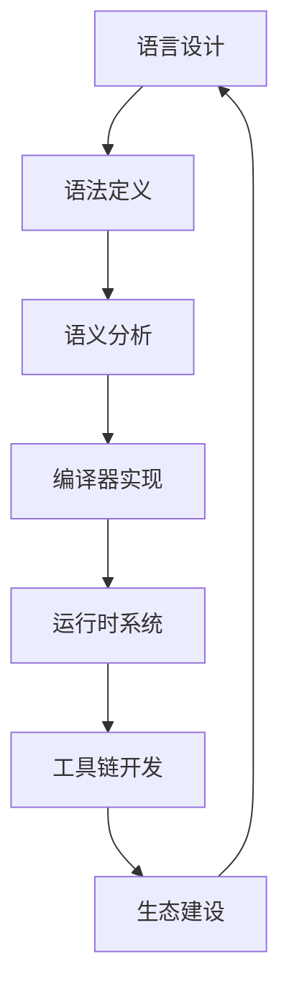

# 3.7 系统化编程语言理论与工程实践 / Systematic Programming Language Theory and Engineering Practice

[返回3.编程语言范式](./3.编程语言范式/README.md) |  [返回Refactor总览](./3.编程语言范式/../README.md)

---

## 目录 / Table of Contents

- [3.7 系统化编程语言理论与工程实践](#37-系统化编程语言理论与工程实践--systematic-programming-language-theory-and-engineering-practice)
- [目录 / Table of Contents](#目录--table-of-contents)
- [1. 概述 / Overview](#1-概述--overview)
- [2. 编程语言理论 / Programming Language Theory](#2-编程语言理论--programming-language-theory)
- [3. 工程实践体系 / Engineering Practice System](#3-工程实践体系--engineering-practice-system)
- [4. 形式化语言分析 / Formal Language Analysis](#4-形式化语言分析--formal-language-analysis)
- [5. 相关性引用 / Related References](#5-相关性引用--related-references)
- [6. 参考文献 / Bibliography](#6-参考文献--bibliography)

---

## 1. 概述 / Overview

系统化编程语言理论与工程实践是前端技术栈中确保语言设计科学性、实现可靠性和应用有效性的核心方法论。通过科学化的语言理论、工程化的语言实践和系统化的语言评估，建立全面的编程语言保证机制。

**Systematic Programming Language Theory and Engineering Practice is the core methodology for ensuring scientific language design, reliable implementation, and effective application in frontend technology stack. Through scientific language theory, engineering language practices, and systematic language evaluation, it establishes a comprehensive programming language assurance mechanism.**

## 1.1 核心目标 / Core Objectives

- **语言理论 / Language Theory**: 建立科学的编程语言理论基础
- **工程实践 / Engineering Practice**: 构建系统化的语言工程实践体系
- **评估体系 / Evaluation System**: 建立全面的语言评估体系
- **持续演进 / Continuous Evolution**: 实现语言的持续演进和改进

## 1.2 编程语言开发流程 / Programming Language Development Process



---

## 2. 编程语言理论 / Programming Language Theory

## 2.1 多维度语言模型 / Multi-dimensional Language Model

### 2.1.1 语法理论 / Syntax Theory

```typescript
interface SyntaxTheory {
  grammar: Grammar;
  parser: Parser;
  ast: AbstractSyntaxTree;
  transformations: Transformation[];
}

interface Grammar {
  rules: GrammarRule[];
  precedence: PrecedenceRules;
  associativity: AssociativityRules;
  conflicts: ConflictResolution;
}

class SyntaxAnalyzer {
  analyzeSyntax(language: Language): SyntaxTheory {
    const grammar = this.defineGrammar(language);
    const parser = this.buildParser(grammar);
    const ast = this.buildAST(parser);
    const transformations = this.defineTransformations(ast);
    
    return {
      grammar,
      parser,
      ast,
      transformations
    };
  }
  
  private defineGrammar(language: Language): Grammar {
    return {
      rules: this.defineGrammarRules(language),
      precedence: this.definePrecedence(language),
      associativity: this.defineAssociativity(language),
      conflicts: this.resolveConflicts(language)
    };
  }
}
```

### 2.1.2 语义理论 / Semantics Theory

```typescript
interface SemanticsTheory {
  static: StaticSemantics;
  dynamic: DynamicSemantics;
  type: TypeSemantics;
  operational: OperationalSemantics;
}

interface StaticSemantics {
  typeChecking: TypeChecker;
  scopeAnalysis: ScopeAnalyzer;
  bindingAnalysis: BindingAnalyzer;
}

class SemanticsAnalyzer {
  analyzeSemantics(language: Language): SemanticsTheory {
    const static = this.defineStaticSemantics(language);
    const dynamic = this.defineDynamicSemantics(language);
    const type = this.defineTypeSemantics(language);
    const operational = this.defineOperationalSemantics(language);
    
    return {
      static,
      dynamic,
      type,
      operational
    };
  }
  
  private defineStaticSemantics(language: Language): StaticSemantics {
    return {
      typeChecking: this.buildTypeChecker(language),
      scopeAnalysis: this.buildScopeAnalyzer(language),
      bindingAnalysis: this.buildBindingAnalyzer(language)
    };
  }
}
```

### 2.1.3 类型理论 / Type Theory

```typescript
interface TypeTheory {
  system: TypeSystem;
  inference: TypeInference;
  checking: TypeChecking;
  safety: TypeSafety;
}

interface TypeSystem {
  types: Type[];
  rules: TypeRule[];
  constraints: TypeConstraint[];
  unification: UnificationAlgorithm;
}

class TypeTheorist {
  defineTypeTheory(language: Language): TypeTheory {
    const system = this.defineTypeSystem(language);
    const inference = this.buildTypeInference(system);
    const checking = this.buildTypeChecking(system);
    const safety = this.defineTypeSafety(system);
    
    return {
      system,
      inference,
      checking,
      safety
    };
  }
  
  private defineTypeSystem(language: Language): TypeSystem {
    return {
      types: this.defineTypes(language),
      rules: this.defineTypeRules(language),
      constraints: this.defineTypeConstraints(language),
      unification: this.buildUnificationAlgorithm(language)
    };
  }
}
```

## 2.2 语言设计原则 / Language Design Principles

### 2.2.1 设计哲学 / Design Philosophy

```typescript
interface DesignPhilosophy {
  principles: DesignPrinciple[];
  tradeoffs: DesignTradeoff[];
  evaluation: DesignEvaluation;
  evolution: DesignEvolution;
}

interface DesignPrinciple {
  name: string;
  description: string;
  importance: number;
  implementation: ImplementationStrategy;
}

class LanguageDesigner {
  defineDesignPhilosophy(language: Language): DesignPhilosophy {
    const principles = this.definePrinciples(language);
    const tradeoffs = this.analyzeTradeoffs(principles);
    const evaluation = this.evaluateDesign(principles, tradeoffs);
    const evolution = this.planEvolution(language);
    
    return {
      principles,
      tradeoffs,
      evaluation,
      evolution
    };
  }
  
  private definePrinciples(language: Language): DesignPrinciple[] {
    return [
      this.defineSimplicityPrinciple(language),
      this.defineExpressivenessPrinciple(language),
      this.defineSafetyPrinciple(language),
      this.definePerformancePrinciple(language),
      this.defineInteroperabilityPrinciple(language)
    ];
  }
}
```

### 2.2.2 语言比较 / Language Comparison

```typescript
interface LanguageComparison {
  languages: Language[];
  criteria: ComparisonCriteria[];
  metrics: ComparisonMetric[];
  analysis: ComparisonAnalysis;
}

interface ComparisonCriteria {
  name: string;
  weight: number;
  measurement: MeasurementMethod;
}

class LanguageComparer {
  compareLanguages(languages: Language[]): LanguageComparison {
    const criteria = this.defineCriteria();
    const metrics = this.measureMetrics(languages, criteria);
    const analysis = this.analyzeComparison(languages, metrics);
    
    return {
      languages,
      criteria,
      metrics,
      analysis
    };
  }
  
  private defineCriteria(): ComparisonCriteria[] {
    return [
      { name: 'expressiveness', weight: 0.3, measurement: this.measureExpressiveness },
      { name: 'safety', weight: 0.25, measurement: this.measureSafety },
      { name: 'performance', weight: 0.2, measurement: this.measurePerformance },
      { name: 'tooling', weight: 0.15, measurement: this.measureTooling },
      { name: 'ecosystem', weight: 0.1, measurement: this.measureEcosystem }
    ];
  }
}
```

---

## 3. 工程实践体系 / Engineering Practice System

## 3.1 编译器工程 / Compiler Engineering

### 3.1.1 编译器架构 / Compiler Architecture

```typescript
interface CompilerArchitecture {
  frontend: CompilerFrontend;
  middleend: CompilerMiddleend;
  backend: CompilerBackend;
  optimization: OptimizationPass[];
}

interface CompilerFrontend {
  lexer: Lexer;
  parser: Parser;
  semanticAnalyzer: SemanticAnalyzer;
  ast: AbstractSyntaxTree;
}

class CompilerEngineer {
  buildCompiler(language: Language): CompilerArchitecture {
    const frontend = this.buildFrontend(language);
    const middleend = this.buildMiddleend(language);
    const backend = this.buildBackend(language);
    const optimization = this.defineOptimizations(language);
    
    return {
      frontend,
      middleend,
      backend,
      optimization
    };
  }
  
  private buildFrontend(language: Language): CompilerFrontend {
    return {
      lexer: this.buildLexer(language),
      parser: this.buildParser(language),
      semanticAnalyzer: this.buildSemanticAnalyzer(language),
      ast: this.buildAST(language)
    };
  }
}
```

### 3.1.2 优化技术 / Optimization Techniques

```typescript
interface OptimizationTechniques {
  passes: OptimizationPass[];
  analysis: AnalysisPass[];
  transformations: TransformationPass[];
  evaluation: OptimizationEvaluation;
}

interface OptimizationPass {
  name: string;
  type: 'analysis' | 'transformation';
  algorithm: OptimizationAlgorithm;
  effectiveness: EffectivenessMetric;
}

class OptimizationEngineer {
  defineOptimizations(language: Language): OptimizationTechniques {
    const passes = this.definePasses(language);
    const analysis = this.defineAnalysisPasses(language);
    const transformations = this.defineTransformationPasses(language);
    const evaluation = this.evaluateOptimizations(passes);
    
    return {
      passes,
      analysis,
      transformations,
      evaluation
    };
  }
}
```

## 3.2 运行时系统 / Runtime System

### 3.2.1 内存管理 / Memory Management

```typescript
interface MemoryManagement {
  allocation: AllocationStrategy;
  garbageCollection: GarbageCollector;
  memoryLayout: MemoryLayout;
  optimization: MemoryOptimization;
}

interface GarbageCollector {
  type: 'mark-sweep' | 'copying' | 'generational' | 'concurrent';
  algorithm: GCAlgorithm;
  performance: GCPerformance;
}

class RuntimeEngineer {
  buildRuntimeSystem(language: Language): RuntimeSystem {
    const memoryManagement = this.buildMemoryManagement(language);
    const executionEngine = this.buildExecutionEngine(language);
    const standardLibrary = this.buildStandardLibrary(language);
    const concurrency = this.buildConcurrency(language);
    
    return {
      memoryManagement,
      executionEngine,
      standardLibrary,
      concurrency
    };
  }
  
  private buildMemoryManagement(language: Language): MemoryManagement {
    return {
      allocation: this.defineAllocationStrategy(language),
      garbageCollection: this.buildGarbageCollector(language),
      memoryLayout: this.defineMemoryLayout(language),
      optimization: this.defineMemoryOptimizations(language)
    };
  }
}
```

### 3.2.2 并发模型 / Concurrency Model

```typescript
interface ConcurrencyModel {
  threads: ThreadModel;
  synchronization: SynchronizationPrimitive[];
  communication: CommunicationModel;
  scheduling: Scheduler;
}

class ConcurrencyEngineer {
  buildConcurrencyModel(language: Language): ConcurrencyModel {
    const threads = this.defineThreadModel(language);
    const synchronization = this.defineSynchronization(language);
    const communication = this.defineCommunication(language);
    const scheduling = this.buildScheduler(language);
    
    return {
      threads,
      synchronization,
      communication,
      scheduling
    };
  }
}
```

---

## 4. 形式化语言分析 / Formal Language Analysis

## 4.1 语言理论分析 / Language Theory Analysis

### 4.1.1 形式化语义 / Formal Semantics

```typescript
interface FormalSemantics {
  denotational: DenotationalSemantics;
  operational: OperationalSemantics;
  axiomatic: AxiomaticSemantics;
  algebraic: AlgebraicSemantics;
}

interface DenotationalSemantics {
  domains: SemanticDomain[];
  functions: SemanticFunction[];
  composition: CompositionRules;
}

class FormalSemanticist {
  defineFormalSemantics(language: Language): FormalSemantics {
    const denotational = this.defineDenotationalSemantics(language);
    const operational = this.defineOperationalSemantics(language);
    const axiomatic = this.defineAxiomaticSemantics(language);
    const algebraic = this.defineAlgebraicSemantics(language);
    
    return {
      denotational,
      operational,
      axiomatic,
      algebraic
    };
  }
  
  private defineDenotationalSemantics(language: Language): DenotationalSemantics {
    return {
      domains: this.defineSemanticDomains(language),
      functions: this.defineSemanticFunctions(language),
      composition: this.defineCompositionRules(language)
    };
  }
}
```

### 4.1.2 类型系统分析 / Type System Analysis

```typescript
interface TypeSystemAnalysis {
  soundness: SoundnessProof;
  completeness: CompletenessProof;
  decidability: DecidabilityAnalysis;
  complexity: ComplexityAnalysis;
}

class TypeSystemAnalyst {
  analyzeTypeSystem(language: Language): TypeSystemAnalysis {
    const soundness = this.proveSoundness(language);
    const completeness = this.proveCompleteness(language);
    const decidability = this.analyzeDecidability(language);
    const complexity = this.analyzeComplexity(language);
    
    return {
      soundness,
      completeness,
      decidability,
      complexity
    };
  }
}
```

## 4.2 语言验证 / Language Verification

### 4.2.1 编译器验证 / Compiler Verification

```typescript
interface CompilerVerification {
  correctness: CorrectnessProof;
  optimization: OptimizationVerification;
  security: SecurityVerification;
  testing: CompilerTesting;
}

class CompilerVerifier {
  verifyCompiler(compiler: Compiler): CompilerVerification {
    const correctness = this.proveCorrectness(compiler);
    const optimization = this.verifyOptimizations(compiler);
    const security = this.verifySecurity(compiler);
    const testing = this.testCompiler(compiler);
    
    return {
      correctness,
      optimization,
      security,
      testing
    };
  }
}
```

### 4.2.2 语言标准验证 / Language Standard Verification

```typescript
interface LanguageStandardVerification {
  compliance: ComplianceCheck;
  conformance: ConformanceTest;
  interoperability: InteroperabilityTest;
  certification: LanguageCertification;
}

class LanguageStandardVerifier {
  verifyLanguageStandard(language: Language): LanguageStandardVerification {
    const compliance = this.checkCompliance(language);
    const conformance = this.testConformance(language);
    const interoperability = this.testInteroperability(language);
    const certification = this.certifyLanguage(language);
    
    return {
      compliance,
      conformance,
      interoperability,
      certification
    };
  }
}
```

---

## 5. 相关性引用 / Related References

- [3.1 Rust](./3.编程语言范式/3.1 Rust.md)
- [3.2 Haskell](./3.编程语言范式/3.2 Haskell.md)
- [3.3 Scala](./3.编程语言范式/3.3 Scala.md)
- [3.4 TypeScript-JavaScript](./3.编程语言范式/3.4 TypeScript-JavaScript.md)
- [3.5 Dart-Flutter](./3.编程语言范式/3.5 Dart-Flutter.md)
- [3.6 函数式编程与类型系统](./3.编程语言范式/3.6 函数式编程与类型系统.md)
- [2.8 系统化工程论证与批判性分析](./2.技术栈与框架/2.8 系统化工程论证与批判性分析.md)
- [4.5 系统化架构设计与工程实践](./4.设计模式与架构/4.5 系统化架构设计与工程实践.md)
- [5.5 系统化质量评估与验证](./5.技术规范与标准/5.5 系统化质量评估与验证.md)
- [6.9 系统化AI应用与工程实践](./6.人工智能原理与算法/6.9 系统化AI应用与工程实践.md)

---

## 6. 参考文献 / Bibliography

1. **Pierce, B. C. (2002).** *Types and Programming Languages*. MIT Press.
2. **Abelson, H., & Sussman, G. J. (1996).** *Structure and Interpretation of Computer Programs*. MIT Press.
3. **Aho, A. V., Lam, M. S., Sethi, R., & Ullman, J. D. (2006).** *Compilers: Principles, Techniques, and Tools*. Pearson.
4. **Mitchell, J. C. (2003).** *Concepts in Programming Languages*. Cambridge University Press.
5. **Scott, M. L. (2015).** *Programming Language Pragmatics*. Morgan Kaufmann.
6. **Winskel, G. (1993).** *The Formal Semantics of Programming Languages*. MIT Press.
7. **Cardelli, L., & Wegner, P. (1985).** *On Understanding Types, Data Abstraction, and Polymorphism*. ACM Computing Surveys.
8. **Reynolds, J. C. (1998).** *Theories of Programming Languages*. Cambridge University Press.

---

> **补充说明 / Additional Notes:**
>
> 系统化编程语言理论与工程实践是确保编程语言设计科学性、实现可靠性和应用有效性的关键环节。通过科学化的语言理论、工程化的语言实践和系统化的语言评估，建立全面的编程语言保证机制，为语言发展提供可靠的理论基础。
>
> **Systematic Programming Language Theory and Engineering Practice is a key component for ensuring scientific language design, reliable implementation, and effective application. Through scientific language theory, engineering language practices, and systematic language evaluation, it establishes a comprehensive programming language assurance mechanism, providing a reliable theoretical foundation for language development.**
