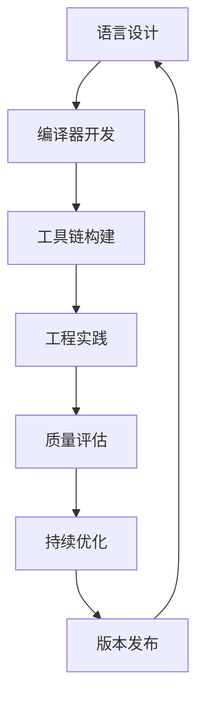

# 3.8 系统化编程语言工程实践与工具链 / Systematic Programming Language Engineering Practice and Toolchain

[返回3.编程语言范式](./3.编程语言范式/README.md) |  [返回Refactor总览](./3.编程语言范式/../README.md)

---

## 目录 / Table of Contents

- [3.8 系统化编程语言工程实践与工具链](#38-系统化编程语言工程实践与工具链--systematic-programming-language-engineering-practice-and-toolchain)
- [目录 / Table of Contents](#目录--table-of-contents)
- [1. 概述 / Overview](#1-概述--overview)
- [2. 编程语言工程理论 / Programming Language Engineering Theory](#2-编程语言工程理论--programming-language-engineering-theory)
- [3. 工具链工程体系 / Toolchain Engineering System](#3-工具链工程体系--toolchain-engineering-system)
- [4. 形式化工程分析 / Formal Engineering Analysis](#4-形式化工程分析--formal-engineering-analysis)
- [5. 相关性引用 / Related References](#5-相关性引用--related-references)
- [6. 参考文献 / Bibliography](#6-参考文献--bibliography)

---

## 1. 概述 / Overview

系统化编程语言工程实践与工具链是前端技术栈中确保编程语言高效开发、质量保证和工具链完整性的核心方法论。通过科学化的工程理论、工程化的实践体系和系统化的工具链管理，建立全面的编程语言工程保证机制。

**Systematic Programming Language Engineering Practice and Toolchain is the core methodology for ensuring efficient programming language development, quality assurance, and toolchain integrity in frontend technology stack. Through scientific engineering theory, engineering practice system, and systematic toolchain management, it establishes a comprehensive programming language engineering assurance mechanism.**

## 1.1 核心目标 / Core Objectives

- **工程理论 / Engineering Theory**: 建立科学的编程语言工程理论基础
- **工具链管理 / Toolchain Management**: 构建系统化的工具链管理实践体系
- **评估体系 / Evaluation System**: 建立全面的工程评估体系
- **持续改进 / Continuous Improvement**: 实现工程实践的持续改进和优化

## 1.2 编程语言工程流程 / Programming Language Engineering Process



---

## 2. 编程语言工程理论 / Programming Language Engineering Theory

## 2.1 多维度工程模型 / Multi-dimensional Engineering Model

### 2.1.1 语言设计工程 / Language Design Engineering

```typescript
interface LanguageDesignEngineering {
  syntax: SyntaxDesign;
  semantics: SemanticsDesign;
  type: TypeSystemDesign;
  runtime: RuntimeDesign;
}

interface SyntaxDesign {
  grammar: GrammarDefinition;
  parser: ParserDesign;
  ast: ASTDesign;
  transformations: TransformationDesign;
}

class LanguageDesignEngineer {
  designLanguage(requirements: Requirements): LanguageDesignEngineering {
    const syntax = this.designSyntax(requirements);
    const semantics = this.designSemantics(requirements);
    const type = this.designTypeSystem(requirements);
    const runtime = this.designRuntime(requirements);
    
    return {
      syntax,
      semantics,
      type,
      runtime
    };
  }
  
  private designSyntax(requirements: Requirements): SyntaxDesign {
    return {
      grammar: this.defineGrammar(requirements),
      parser: this.designParser(requirements),
      ast: this.designAST(requirements),
      transformations: this.designTransformations(requirements)
    };
  }
}
```

### 2.1.2 编译器工程 / Compiler Engineering

```typescript
interface CompilerEngineering {
  frontend: FrontendCompiler;
  middleend: MiddleendCompiler;
  backend: BackendCompiler;
  optimization: OptimizationEngine;
}

interface FrontendCompiler {
  lexer: LexerDesign;
  parser: ParserDesign;
  ast: ASTBuilder;
  semantic: SemanticAnalyzer;
}

class CompilerEngineer {
  buildCompiler(requirements: Requirements): CompilerEngineering {
    const frontend = this.buildFrontend(requirements);
    const middleend = this.buildMiddleend(requirements);
    const backend = this.buildBackend(requirements);
    const optimization = this.buildOptimization(requirements);
    
    return {
      frontend,
      middleend,
      backend,
      optimization
    };
  }
  
  private buildFrontend(requirements: Requirements): FrontendCompiler {
    return {
      lexer: this.designLexer(requirements),
      parser: this.designParser(requirements),
      ast: this.designASTBuilder(requirements),
      semantic: this.designSemanticAnalyzer(requirements)
    };
  }
}
```

### 2.1.3 运行时工程 / Runtime Engineering

```typescript
interface RuntimeEngineering {
  memory: MemoryManagement;
  garbage: GarbageCollection;
  concurrency: ConcurrencyModel;
  security: SecurityModel;
}

interface MemoryManagement {
  allocation: AllocationStrategy;
  deallocation: DeallocationStrategy;
  optimization: MemoryOptimization;
}

class RuntimeEngineer {
  buildRuntime(requirements: Requirements): RuntimeEngineering {
    const memory = this.buildMemoryManagement(requirements);
    const garbage = this.buildGarbageCollection(requirements);
    const concurrency = this.buildConcurrencyModel(requirements);
    const security = this.buildSecurityModel(requirements);
    
    return {
      memory,
      garbage,
      concurrency,
      security
    };
  }
}
```

## 2.2 工程设计原则 / Engineering Design Principles

### 2.2.1 语言设计原则 / Language Design Principles

```typescript
interface LanguageDesignPrinciples {
  simplicity: SimplicityPrinciple;
  expressiveness: ExpressivenessPrinciple;
  safety: SafetyPrinciple;
  performance: PerformancePrinciple;
}

interface SimplicityPrinciple {
  minimalism: MinimalismDesign;
  consistency: ConsistencyDesign;
  orthogonality: OrthogonalityDesign;
}

class LanguageDesigner {
  applyDesignPrinciples(requirements: Requirements): LanguageDesignPrinciples {
    const simplicity = this.applySimplicity(requirements);
    const expressiveness = this.applyExpressiveness(requirements);
    const safety = this.applySafety(requirements);
    const performance = this.applyPerformance(requirements);
    
    return {
      simplicity,
      expressiveness,
      safety,
      performance
    };
  }
}
```

### 2.2.2 编译器设计原则 / Compiler Design Principles

```typescript
interface CompilerDesignPrinciples {
  modularity: ModularityPrinciple;
  efficiency: EfficiencyPrinciple;
  correctness: CorrectnessPrinciple;
  maintainability: MaintainabilityPrinciple;
}

class CompilerDesigner {
  applyCompilerPrinciples(requirements: Requirements): CompilerDesignPrinciples {
    const modularity = this.applyModularity(requirements);
    const efficiency = this.applyEfficiency(requirements);
    const correctness = this.applyCorrectness(requirements);
    const maintainability = this.applyMaintainability(requirements);
    
    return {
      modularity,
      efficiency,
      correctness,
      maintainability
    };
  }
}
```

---

## 3. 工具链工程体系 / Toolchain Engineering System

## 3.1 开发工具链 / Development Toolchain

### 3.1.1 语言服务器 / Language Server

```typescript
interface LanguageServer {
  protocol: LanguageServerProtocol;
  features: LanguageFeatures;
  extensions: ExtensionSystem;
  diagnostics: DiagnosticSystem;
}

interface LanguageFeatures {
  completion: CompletionProvider;
  definition: DefinitionProvider;
  references: ReferencesProvider;
  formatting: FormattingProvider;
}

class LanguageServerEngineer {
  buildLanguageServer(requirements: Requirements): LanguageServer {
    const protocol = this.implementProtocol(requirements);
    const features = this.implementFeatures(requirements);
    const extensions = this.implementExtensions(requirements);
    const diagnostics = this.implementDiagnostics(requirements);
    
    return {
      protocol,
      features,
      extensions,
      diagnostics
    };
  }
  
  private implementFeatures(requirements: Requirements): LanguageFeatures {
    return {
      completion: this.buildCompletionProvider(requirements),
      definition: this.buildDefinitionProvider(requirements),
      references: this.buildReferencesProvider(requirements),
      formatting: this.buildFormattingProvider(requirements)
    };
  }
}
```

### 3.1.2 包管理器 / Package Manager

```typescript
interface PackageManager {
  registry: PackageRegistry;
  resolution: DependencyResolution;
  installation: PackageInstallation;
  security: SecurityValidation;
}

interface PackageRegistry {
  packages: Package[];
  metadata: PackageMetadata;
  versioning: VersionManagement;
  distribution: DistributionSystem;
}

class PackageManagerEngineer {
  buildPackageManager(requirements: Requirements): PackageManager {
    const registry = this.buildRegistry(requirements);
    const resolution = this.buildResolution(requirements);
    const installation = this.buildInstallation(requirements);
    const security = this.buildSecurity(requirements);
    
    return {
      registry,
      resolution,
      installation,
      security
    };
  }
}
```

### 3.1.3 构建工具 / Build Tools

```typescript
interface BuildTools {
  bundler: Bundler;
  transpiler: Transpiler;
  minifier: Minifier;
  optimizer: Optimizer;
}

interface Bundler {
  entry: EntryPoint;
  modules: ModuleResolution;
  output: OutputGeneration;
  plugins: PluginSystem;
}

class BuildToolsEngineer {
  buildBuildTools(requirements: Requirements): BuildTools {
    const bundler = this.buildBundler(requirements);
    const transpiler = this.buildTranspiler(requirements);
    const minifier = this.buildMinifier(requirements);
    const optimizer = this.buildOptimizer(requirements);
    
    return {
      bundler,
      transpiler,
      minifier,
      optimizer
    };
  }
}
```

## 3.2 质量保证工具链 / Quality Assurance Toolchain

### 3.2.1 静态分析工具 / Static Analysis Tools

```typescript
interface StaticAnalysisTools {
  linter: Linter;
  typeChecker: TypeChecker;
  securityScanner: SecurityScanner;
  complexityAnalyzer: ComplexityAnalyzer;
}

interface Linter {
  rules: LintingRules;
  configuration: LinterConfig;
  reporting: LinterReporting;
  fix: AutoFix;
}

class StaticAnalysisEngineer {
  buildStaticAnalysis(requirements: Requirements): StaticAnalysisTools {
    const linter = this.buildLinter(requirements);
    const typeChecker = this.buildTypeChecker(requirements);
    const securityScanner = this.buildSecurityScanner(requirements);
    const complexityAnalyzer = this.buildComplexityAnalyzer(requirements);
    
    return {
      linter,
      typeChecker,
      securityScanner,
      complexityAnalyzer
    };
  }
}
```

### 3.2.2 测试工具链 / Testing Toolchain

```typescript
interface TestingToolchain {
  unitTesting: UnitTestingFramework;
  integrationTesting: IntegrationTestingFramework;
  performanceTesting: PerformanceTestingFramework;
  securityTesting: SecurityTestingFramework;
}

interface UnitTestingFramework {
  testRunner: TestRunner;
  assertions: AssertionLibrary;
  mocking: MockingFramework;
  coverage: CoverageTool;
}

class TestingToolchainEngineer {
  buildTestingToolchain(requirements: Requirements): TestingToolchain {
    const unitTesting = this.buildUnitTesting(requirements);
    const integrationTesting = this.buildIntegrationTesting(requirements);
    const performanceTesting = this.buildPerformanceTesting(requirements);
    const securityTesting = this.buildSecurityTesting(requirements);
    
    return {
      unitTesting,
      integrationTesting,
      performanceTesting,
      securityTesting
    };
  }
}
```

---

## 4. 形式化工程分析 / Formal Engineering Analysis

## 4.1 工程理论分析 / Engineering Theory Analysis

### 4.1.1 语言设计完备性分析 / Language Design Completeness Analysis

```typescript
interface LanguageDesignCompletenessAnalysis {
  syntax: SyntaxCompleteness;
  semantics: SemanticsCompleteness;
  type: TypeCompleteness;
  runtime: RuntimeCompleteness;
}

interface SyntaxCompleteness {
  expressiveness: ExpressivenessAnalysis;
  consistency: ConsistencyAnalysis;
  completeness: CompletenessAnalysis;
  usability: UsabilityAnalysis;
}

class LanguageDesignCompletenessAnalyzer {
  analyzeCompleteness(design: LanguageDesign): LanguageDesignCompletenessAnalysis {
    const syntax = this.analyzeSyntaxCompleteness(design);
    const semantics = this.analyzeSemanticsCompleteness(design);
    const type = this.analyzeTypeCompleteness(design);
    const runtime = this.analyzeRuntimeCompleteness(design);
    
    return {
      syntax,
      semantics,
      type,
      runtime
    };
  }
  
  private analyzeSyntaxCompleteness(design: LanguageDesign): SyntaxCompleteness {
    return {
      expressiveness: this.analyzeExpressiveness(design),
      consistency: this.analyzeConsistency(design),
      completeness: this.analyzeCompleteness(design),
      usability: this.analyzeUsability(design)
    };
  }
}
```

### 4.1.2 工具链有效性分析 / Toolchain Effectiveness Analysis

```typescript
interface ToolchainEffectivenessAnalysis {
  efficiency: ToolchainEfficiencyAnalysis;
  reliability: ToolchainReliabilityAnalysis;
  usability: ToolchainUsabilityAnalysis;
  maintainability: ToolchainMaintainabilityAnalysis;
}

class ToolchainEffectivenessAnalyzer {
  analyzeEffectiveness(toolchain: Toolchain): ToolchainEffectivenessAnalysis {
    const efficiency = this.analyzeEfficiency(toolchain);
    const reliability = this.analyzeReliability(toolchain);
    const usability = this.analyzeUsability(toolchain);
    const maintainability = this.analyzeMaintainability(toolchain);
    
    return {
      efficiency,
      reliability,
      usability,
      maintainability
    };
  }
}
```

## 4.2 工程验证 / Engineering Verification

### 4.2.1 语言设计正确性验证 / Language Design Correctness Verification

```typescript
interface LanguageDesignCorrectnessVerification {
  syntax: SyntaxCorrectnessVerification;
  semantics: SemanticsCorrectnessVerification;
  type: TypeCorrectnessVerification;
  runtime: RuntimeCorrectnessVerification;
}

class LanguageDesignCorrectnessVerifier {
  verifyCorrectness(design: LanguageDesign): LanguageDesignCorrectnessVerification {
    const syntax = this.verifySyntaxCorrectness(design);
    const semantics = this.verifySemanticsCorrectness(design);
    const type = this.verifyTypeCorrectness(design);
    const runtime = this.verifyRuntimeCorrectness(design);
    
    return {
      syntax,
      semantics,
      type,
      runtime
    };
  }
}
```

### 4.2.2 工具链性能验证 / Toolchain Performance Verification

```typescript
interface ToolchainPerformanceVerification {
  speed: SpeedVerification;
  memory: MemoryVerification;
  scalability: ScalabilityVerification;
  stability: StabilityVerification;
}

class ToolchainPerformanceVerifier {
  verifyPerformance(toolchain: Toolchain): ToolchainPerformanceVerification {
    const speed = this.verifySpeed(toolchain);
    const memory = this.verifyMemory(toolchain);
    const scalability = this.verifyScalability(toolchain);
    const stability = this.verifyStability(toolchain);
    
    return {
      speed,
      memory,
      scalability,
      stability
    };
  }
}
```

---

## 5. 相关性引用 / Related References

- [3.1 Rust](./3.编程语言范式/3.1 Rust.md)
- [3.2 Haskell](./3.编程语言范式/3.2 Haskell.md)
- [3.4 TypeScript-JavaScript](./3.编程语言范式/3.4 TypeScript-JavaScript.md)
- [3.6 函数式编程与类型系统](./3.编程语言范式/3.6 函数式编程与类型系统.md)
- [3.7 系统化编程语言理论与工程实践](./3.编程语言范式/3.7 系统化编程语言理论与工程实践.md)
- [2.7 现代前端工程化](./2.技术栈与框架/2.7 现代前端工程化.md)
- [2.10 系统化前端工程化与DevOps实践](./2.技术栈与框架/2.10 系统化前端工程化与DevOps实践.md)
- [5.5 系统化质量评估与验证](./5.技术规范与标准/5.5 系统化质量评估与验证.md)
- [5.7 系统化前端测试与质量保证](./5.技术规范与标准/5.7 系统化前端测试与质量保证.md)
- [4.6 系统化设计模式与工程实践](./4.设计模式与架构/4.6 系统化设计模式与工程实践.md)

---

## 6. 参考文献 / Bibliography

1. **Aho, A. V., Lam, M. S., Sethi, R., & Ullman, J. D. (2006).** *Compilers: Principles, Techniques, and Tools*. Pearson.
2. **Appel, A. W. (1998).** *Modern Compiler Implementation in ML*. Cambridge University Press.
3. **Pierce, B. C. (2002).** *Types and Programming Languages*. MIT Press.
4. **Mitchell, J. C. (2003).** *Concepts in Programming Languages*. Cambridge University Press.
5. **Scott, M. L. (2015).** *Programming Language Pragmatics*. Morgan Kaufmann.
6. **Winskel, G. (1993).** *The Formal Semantics of Programming Languages*. MIT Press.
7. **Nielson, F., Nielson, H. R., & Hankin, C. (1999).** *Principles of Program Analysis*. Springer.
8. **Muchnick, S. S. (1997).** *Advanced Compiler Design and Implementation*. Morgan Kaufmann.

---

> **补充说明 / Additional Notes:**
>
> 系统化编程语言工程实践与工具链是确保编程语言高效开发、质量保证和工具链完整性的关键环节。通过科学化的工程理论、工程化的实践体系和系统化的工具链管理，建立全面的编程语言工程保证机制，为编程语言发展提供可靠的工程基础。
>
> **Systematic Programming Language Engineering Practice and Toolchain is a key component for ensuring efficient programming language development, quality assurance, and toolchain integrity. Through scientific engineering theory, engineering practice system, and systematic toolchain management, it establishes a comprehensive programming language engineering assurance mechanism, providing a reliable engineering foundation for programming language development.**
