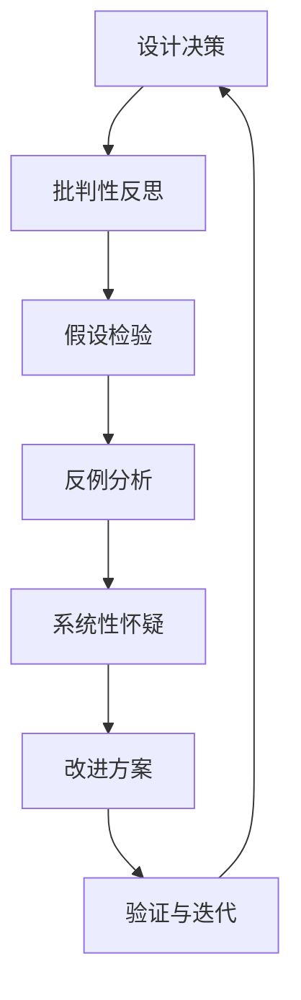
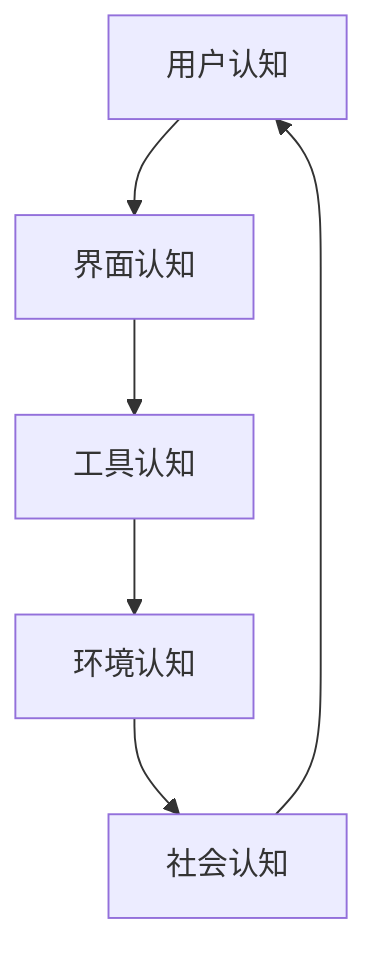
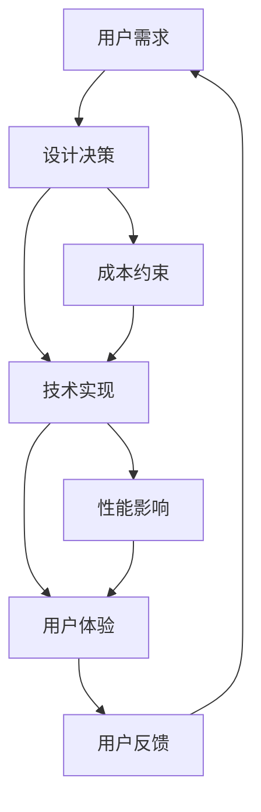

# 4.4 哲学与认知批判性分析 / Philosophical and Cognitive Critical Analysis

[返回4.设计模式与架构](./4.设计模式与架构/README.md) |  [返回Refactor总览](./4.设计模式与架构/../README.md)

---

## 目录 / Table of Contents

- [4.4 哲学与认知批判性分析](#44-哲学与认知批判性分析--philosophical-and-cognitive-critical-analysis)
- [目录 / Table of Contents](#目录--table-of-contents)
- [1. 概述 / Overview](#1-概述--overview)
- [2. 哲学基础与认识论 / Philosophical Foundations and Epistemology](#2-哲学基础与认识论--philosophical-foundations-and-epistemology)
- [3. 认知科学与交互设计 / Cognitive Science and Interaction Design](#3-认知科学与交互设计--cognitive-science-and-interaction-design)
- [4. 批判性思维框架 / Critical Thinking Framework](#4-批判性思维框架--critical-thinking-framework)
- [5. 形式化论证与多表征 / Formal Arguments and Multi-Representation](#5-形式化论证与多表征--formal-arguments-and-multi-representation)
- [6. 工程实践与伦理考量 / Engineering Practice and Ethical Considerations](#6-工程实践与伦理考量--engineering-practice-and-ethical-considerations)
- [7. 相关性引用 / Related References](#7-相关性引用--related-references)
- [8. 参考文献 / Bibliography](#8-参考文献--bibliography)

---

## 1. 概述 / Overview

哲学与认知批判性分析关注软件设计、架构与用户体验背后的本体论、认识论和方法论基础。通过批判性思维，反思技术选择、设计范式与认知偏见，提升系统的合理性与人本关怀。

**Philosophical and cognitive critical analysis focuses on the ontological, epistemological, and methodological foundations behind software design, architecture, and user experience. Through critical thinking, it reflects on technical choices, design paradigms, and cognitive biases to enhance system rationality and human-centered care.**

## 1.1 核心问题 / Core Questions

- **本体论问题 / Ontological Questions**: 什么是"好的"设计？设计对象的本质是什么？
- **认识论问题 / Epistemological Questions**: 我们如何知道设计是有效的？知识如何构建？
- **方法论问题 / Methodological Questions**: 如何系统性地进行批判性分析？如何验证设计假设？

## 1.2 批判性分析的价值 / Value of Critical Analysis



---

## 2. 哲学基础与认识论 / Philosophical Foundations and Epistemology

## 2.1 设计哲学流派 / Design Philosophy Schools

### 2.1.1 形式主义 / Formalism

**核心主张**: 设计的美学价值独立于功能性和实用性
**Core Claim**: The aesthetic value of design is independent of functionality and utility

```typescript
// 形式主义设计示例 / Formalist Design Example
interface FormalistComponent {
  aesthetic: {
    symmetry: number;      // 对称性 / Symmetry
    proportion: number;     // 比例 / Proportion
    harmony: number;        // 和谐 / Harmony
  };
  functionality: {
    usability: number;      // 可用性 / Usability
    efficiency: number;     // 效率 / Efficiency
  };
}
```

### 2.1.2 实用主义 / Pragmatism

**核心主张**: 设计的价值在于其实际效果和解决问题的能力
**Core Claim**: The value of design lies in its practical effects and problem-solving capabilities

```typescript
// 实用主义设计示例 / Pragmatic Design Example
interface PragmaticComponent {
  problemSolving: {
    userNeeds: string[];    // 用户需求 / User Needs
    businessGoals: string[]; // 业务目标 / Business Goals
    technicalConstraints: string[]; // 技术约束 / Technical Constraints
  };
  effectiveness: {
    successMetrics: Metric[]; // 成功指标 / Success Metrics
    userSatisfaction: number; // 用户满意度 / User Satisfaction
  };
}
```

### 2.1.3 人本主义 / Humanism

**核心主张**: 设计应以人的需求和价值为中心
**Core Claim**: Design should be centered on human needs and values

```typescript
// 人本主义设计示例 / Humanistic Design Example
interface HumanisticComponent {
  humanCentered: {
    accessibility: AccessibilityLevel; // 可访问性 / Accessibility
    inclusivity: InclusivityLevel;    // 包容性 / Inclusivity
    empathy: EmpathyScore;           // 同理心 / Empathy
  };
  ethical: {
    privacy: PrivacyLevel;           // 隐私保护 / Privacy
    transparency: TransparencyLevel;  // 透明度 / Transparency
    fairness: FairnessScore;         // 公平性 / Fairness
  };
}
```

## 2.2 认识论框架 / Epistemological Framework

### 2.2.1 建构主义认识论 / Constructivist Epistemology

**LaTeX公式 / LaTeX Formula**:
$$
\text{Knowledge} = \text{Construction}(Experience, Context, Culture)
$$

### 2.2.2 实证主义认识论 / Positivist Epistemology

**LaTeX公式 / LaTeX Formula**:
$$
\text{Truth} = \text{Verification}(Observation, Experiment, Measurement)
$$

---

## 3. 认知科学与交互设计 / Cognitive Science and Interaction Design

## 3.1 认知负荷理论 / Cognitive Load Theory

### 3.1.1 内在认知负荷 / Intrinsic Cognitive Load

**定义**: 学习材料本身的复杂性
**Definition**: The inherent complexity of learning materials

```typescript
interface CognitiveLoad {
  intrinsic: {
    complexity: number;     // 复杂度 / Complexity
    elementInteractivity: number; // 元素交互性 / Element Interactivity
  };
  extraneous: {
    presentation: number;   // 呈现方式 / Presentation
    layout: number;        // 布局 / Layout
  };
  germane: {
    schemaConstruction: number; // 图式构建 / Schema Construction
    automation: number;     // 自动化 / Automation
  };
}
```

### 3.1.2 外在认知负荷 / Extraneous Cognitive Load

**定义**: 由教学设计不当引起的额外认知负担
**Definition**: Additional cognitive burden caused by poor instructional design

```typescript
// 认知负荷优化示例 / Cognitive Load Optimization Example
class CognitiveLoadOptimizer {
  reduceExtraneousLoad(design: UIComponent): UIComponent {
    return {
      ...design,
      visualComplexity: this.minimizeVisualComplexity(design),
      informationDensity: this.optimizeInformationDensity(design),
      navigationDepth: this.reduceNavigationDepth(design)
    };
  }
}
```

## 3.2 分布式认知 / Distributed Cognition

### 3.2.1 认知分布模型 / Distributed Cognition Model



### 3.2.2 认知工件 / Cognitive Artifacts

```typescript
interface CognitiveArtifact {
  type: 'external' | 'internal' | 'social';
  function: 'memory' | 'computation' | 'communication';
  representation: 'symbolic' | 'spatial' | 'temporal';
}
```

## 3.3 感知-行动环 / Perception-Action Loop

### 3.3.1 交互循环模型 / Interaction Loop Model

```typescript
interface PerceptionActionLoop {
  perception: {
    sensoryInput: SensoryData;    // 感觉输入 / Sensory Input
    attention: AttentionFocus;     // 注意力焦点 / Attention Focus
    interpretation: Interpretation; // 解释 / Interpretation
  };
  action: {
    decision: Decision;           // 决策 / Decision
    execution: Action;            // 执行 / Action
    feedback: Feedback;           // 反馈 / Feedback
  };
}
```

---

## 4. 批判性思维框架 / Critical Thinking Framework

## 4.1 批判性分析工具 / Critical Analysis Tools

### 4.1.1 SWOT分析 / SWOT Analysis

```typescript
interface SWOTAnalysis {
  strengths: string[];      // 优势 / Strengths
  weaknesses: string[];     // 劣势 / Weaknesses
  opportunities: string[];  // 机会 / Opportunities
  threats: string[];        // 威胁 / Threats
}

class DesignSWOTAnalyzer {
  analyze(design: Design): SWOTAnalysis {
    return {
      strengths: this.identifyStrengths(design),
      weaknesses: this.identifyWeaknesses(design),
      opportunities: this.identifyOpportunities(design),
      threats: this.identifyThreats(design)
    };
  }
}
```

### 4.1.2 五问法 / Five Whys Method

```typescript
interface FiveWhysAnalysis {
  problem: string;
  why1: string;
  why2: string;
  why3: string;
  why4: string;
  why5: string;
  rootCause: string;
  solution: string;
}
```

### 4.1.3 假设检验 / Hypothesis Testing

```typescript
interface HypothesisTest {
  nullHypothesis: string;   // 零假设 / Null Hypothesis
  alternativeHypothesis: string; // 备择假设 / Alternative Hypothesis
  significanceLevel: number; // 显著性水平 / Significance Level
  testStatistic: number;    // 检验统计量 / Test Statistic
  pValue: number;          // P值 / P-Value
  conclusion: 'reject' | 'fail_to_reject'; // 结论 / Conclusion
}
```

## 4.2 系统性怀疑 / Systematic Doubt

### 4.2.1 笛卡尔怀疑方法 / Cartesian Doubt Method

```typescript
interface CartesianDoubt {
  step1: 'Doubt all sensory perceptions';     // 怀疑所有感官知觉
  step2: 'Doubt mathematical truths';         // 怀疑数学真理
  step3: 'Doubt logical reasoning';           // 怀疑逻辑推理
  step4: 'Find indubitable foundation';       // 寻找不可怀疑的基础
}
```

### 4.2.2 设计假设检验 / Design Assumption Testing

```typescript
class DesignAssumptionTester {
  testAssumptions(design: Design): AssumptionTestResult[] {
    return [
      this.testUserAssumptions(design),
      this.testTechnicalAssumptions(design),
      this.testBusinessAssumptions(design),
      this.testEthicalAssumptions(design)
    ];
  }
}
```

---

## 5. 形式化论证与多表征 / Formal Arguments and Multi-Representation

## 5.1 命题逻辑 / Propositional Logic

### 5.1.1 设计决策逻辑 / Design Decision Logic

```typescript
interface DesignProposition {
  premise: string[];        // 前提 / Premises
  conclusion: string;       // 结论 / Conclusion
  validity: boolean;        // 有效性 / Validity
  soundness: boolean;       // 可靠性 / Soundness
}
```

### 5.1.2 逻辑运算符 / Logical Operators

```typescript
enum LogicalOperator {
  AND = '∧',
  OR = '∨',
  NOT = '¬',
  IMPLIES = '→',
  EQUIVALENT = '↔'
}

interface LogicalExpression {
  operator: LogicalOperator;
  operands: (LogicalExpression | boolean)[];
}
```

## 5.2 因果图 / Causal Diagrams

### 5.2.1 设计因果关系 / Design Causality



### 5.2.2 因果分析代码 / Causal Analysis Code

```typescript
interface CausalNode {
  id: string;
  variables: string[];
  parents: string[];
  children: string[];
}

interface CausalGraph {
  nodes: CausalNode[];
  edges: CausalEdge[];
}

class CausalAnalyzer {
  analyzeCausality(graph: CausalGraph): CausalAnalysis {
    return {
      directEffects: this.findDirectEffects(graph),
      indirectEffects: this.findIndirectEffects(graph),
      confoundingFactors: this.findConfoundingFactors(graph)
    };
  }
}
```

## 5.3 认知流程图 / Cognitive Flow Diagrams

### 5.3.1 用户认知流程 / User Cognitive Flow

```typescript
interface CognitiveFlow {
  stages: CognitiveStage[];
  transitions: CognitiveTransition[];
  decisionPoints: DecisionPoint[];
}

interface CognitiveStage {
  name: string;
  duration: number;
  cognitiveLoad: number;
  actions: UserAction[];
}
```

---

## 6. 工程实践与伦理考量 / Engineering Practice and Ethical Considerations

## 6.1 可访问性设计 / Accessibility Design

### 6.1.1 WCAG 2.1 合规性 / WCAG 2.1 Compliance

```typescript
interface AccessibilityCompliance {
  level: 'A' | 'AA' | 'AAA';
  criteria: WCAGCriteria[];
  violations: AccessibilityViolation[];
  score: number;
}

interface WCAGCriteria {
  id: string;
  level: 'A' | 'AA' | 'AAA';
  description: string;
  testMethod: string;
  status: 'pass' | 'fail' | 'not_applicable';
}
```

### 6.1.2 可访问性测试代码 / Accessibility Testing Code

```typescript
class AccessibilityTester {
  async testComponent(component: ReactComponent): Promise<AccessibilityReport> {
    const violations = [];
    
    // 测试键盘导航 / Test keyboard navigation
    if (!this.testKeyboardNavigation(component)) {
      violations.push({
        type: 'keyboard_navigation',
        severity: 'high',
        description: 'Component not keyboard accessible'
      });
    }
    
    // 测试屏幕阅读器 / Test screen reader
    if (!this.testScreenReader(component)) {
      violations.push({
        type: 'screen_reader',
        severity: 'high',
        description: 'Component not screen reader accessible'
      });
    }
    
    return {
      violations,
      score: this.calculateScore(violations),
      recommendations: this.generateRecommendations(violations)
    };
  }
}
```

## 6.2 公平性与偏见检测 / Fairness and Bias Detection

### 6.2.1 算法公平性度量 / Algorithm Fairness Metrics

```typescript
interface FairnessMetrics {
  demographicParity: number;    // 人口统计学公平性 / Demographic Parity
  equalizedOdds: number;        // 均衡赔率 / Equalized Odds
  equalOpportunity: number;     // 平等机会 / Equal Opportunity
  individualFairness: number;   // 个体公平性 / Individual Fairness
}

class FairnessAnalyzer {
  calculateFairnessMetrics(predictions: Prediction[], 
                          protectedAttributes: string[]): FairnessMetrics {
    return {
      demographicParity: this.calculateDemographicParity(predictions, protectedAttributes),
      equalizedOdds: this.calculateEqualizedOdds(predictions, protectedAttributes),
      equalOpportunity: this.calculateEqualOpportunity(predictions, protectedAttributes),
      individualFairness: this.calculateIndividualFairness(predictions, protectedAttributes)
    };
  }
}
```

### 6.2.2 偏见检测算法 / Bias Detection Algorithm

```typescript
interface BiasDetectionResult {
  biasType: 'statistical' | 'representation' | 'evaluation';
  severity: 'low' | 'medium' | 'high';
  affectedGroups: string[];
  mitigationStrategies: string[];
}

class BiasDetector {
  detectBias(data: Dataset, model: Model): BiasDetectionResult[] {
    return [
      this.detectStatisticalBias(data, model),
      this.detectRepresentationBias(data),
      this.detectEvaluationBias(data, model)
    ];
  }
}
```

## 6.3 隐私保护设计 / Privacy-Preserving Design

### 6.3.1 隐私设计模式 / Privacy Design Patterns

```typescript
interface PrivacyPattern {
  type: 'data_minimization' | 'purpose_limitation' | 'storage_limitation';
  implementation: string;
  effectiveness: number;
  tradeoffs: string[];
}

class PrivacyDesigner {
  applyPrivacyPatterns(design: Design): PrivacyEnhancedDesign {
    return {
      ...design,
      dataMinimization: this.implementDataMinimization(design),
      purposeLimitation: this.implementPurposeLimitation(design),
      storageLimitation: this.implementStorageLimitation(design)
    };
  }
}
```

---

## 7. 相关性引用 / Related References

- [4.1 GoF设计模式](./4.设计模式与架构/4.1 GoF设计模式.md)
- [4.2 结构型-行为型-创建型模式](./4.设计模式与架构/4.2 结构型-行为型-创建型模式.md)
- [4.3 组件化与架构模式](./4.设计模式与架构/4.3 组件化与架构模式.md)
- [5.2 可访问性与国际化](./4.设计模式与架构/../5.技术规范与标准/5.2 可访问性与国际化.md)
- [5.3 性能优化与工程实践](./4.设计模式与架构/../5.技术规范与标准/5.3 性能优化与工程实践.md)
- [6.1 AI基础原理](./4.设计模式与架构/../6.人工智能原理与算法/6.1 AI基础原理.md)
- [6.4 AI工程实践与伦理](./4.设计模式与架构/../6.人工智能原理与算法/6.4 AI工程实践与伦理.md)
- [6.5 AI与哲学](./4.设计模式与架构/../6.人工智能原理与算法/6.5 AI与哲学.md)
- [6.6 AI与认知科学](./4.设计模式与架构/../6.人工智能原理与算法/6.6 AI与认知科学.md)

---

## 8. 参考文献 / Bibliography

1. **Norman, D. A. (1988).** *The Design of Everyday Things*. Basic Books.
2. **Sweller, J. (1988).** Cognitive load during problem solving: Effects on learning. *Cognitive Science*, 12(2), 257-285.
3. **Hutchins, E. (1995).** *Cognition in the Wild*. MIT Press.
4. **ISO 9241-210:2019.** Ergonomics of human-system interaction — Part 210: Human-centred design for interactive systems.
5. **WCAG 2.1 Guidelines.** Web Content Accessibility Guidelines.
6. **Barocas, S., & Selbst, A. D. (2016).** Big data's disparate impact. *California Law Review*, 104(3), 671-732.
7. **Nissenbaum, H. (2004).** Privacy as contextual integrity. *Washington Law Review*, 79(1), 119-158.

---

> **补充说明 / Additional Notes:**
>
> UI通用架构模型（如MVC、MVVM、MVP等）不仅是技术实现的产物，更深受哲学范式（如形式主义与人本主义）、认知科学（如认知负荷、分布式认知）影响。合理的架构模式有助于降低认知负担、提升可解释性与可维护性，促进以人为本的系统设计。在AI时代，架构模式的可解释性、公平性和伦理考量变得尤为重要。
>
> **UI Universal Architecture Models (such as MVC, MVVM, MVP, etc.) are not only products of technical implementation, but are deeply influenced by philosophical paradigms (such as formalism and humanism) and cognitive science (such as cognitive load, distributed cognition). Reasonable architectural patterns help reduce cognitive burden, improve interpretability and maintainability, and promote human-centered system design. In the AI era, the interpretability, fairness, and ethical considerations of architectural patterns become particularly important.**
