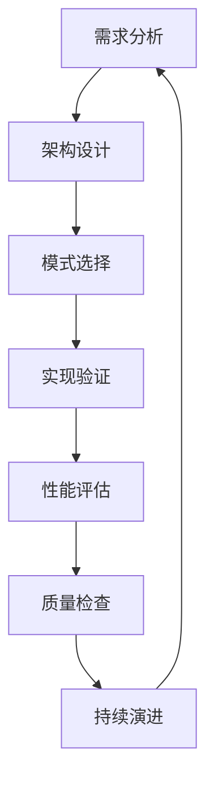

# 4.5 系统化架构设计与工程实践 / Systematic Architecture Design and Engineering Practice

[返回4.设计模式与架构](./4.设计模式与架构/README.md) |  [返回Refactor总览](./4.设计模式与架构/../README.md)

---

## 目录 / Table of Contents

- [4.5 系统化架构设计与工程实践](#45-系统化架构设计与工程实践--systematic-architecture-design-and-engineering-practice)
- [目录 / Table of Contents](#目录--table-of-contents)
- [1. 概述 / Overview](#1-概述--overview)
- [2. 架构设计方法论 / Architecture Design Methodology](#2-架构设计方法论--architecture-design-methodology)
- [3. 工程实践体系 / Engineering Practice System](#3-工程实践体系--engineering-practice-system)
- [4. 形式化架构分析 / Formal Architecture Analysis](#4-形式化架构分析--formal-architecture-analysis)
- [5. 相关性引用 / Related References](#5-相关性引用--related-references)
- [6. 参考文献 / Bibliography](#6-参考文献--bibliography)

---

## 1. 概述 / Overview

系统化架构设计与工程实践是前端技术栈中确保系统可扩展性、可维护性和可演进性的核心方法论。通过科学化的架构设计、工程化的架构实践和系统化的架构评估，建立全面的架构保证机制。

**Systematic Architecture Design and Engineering Practice is the core methodology for ensuring system scalability, maintainability, and evolvability in frontend technology stack. Through scientific architecture design, engineering architecture practices, and systematic architecture evaluation, it establishes a comprehensive architecture assurance mechanism.**

## 1.1 核心目标 / Core Objectives

- **架构设计 / Architecture Design**: 建立科学的架构设计方法论
- **工程实践 / Engineering Practice**: 构建系统化的架构工程实践体系
- **评估体系 / Evaluation System**: 建立全面的架构评估体系
- **持续演进 / Continuous Evolution**: 实现架构的持续演进和改进

## 1.2 架构设计流程 / Architecture Design Process



---

## 2. 架构设计方法论 / Architecture Design Methodology

## 2.1 多维度架构模型 / Multi-dimensional Architecture Model

### 2.1.1 分层架构 / Layered Architecture

```typescript
interface LayeredArchitecture {
  layers: ArchitectureLayer[];
  dependencies: LayerDependency[];
  interfaces: LayerInterface[];
  patterns: ArchitecturePattern[];
}

interface ArchitectureLayer {
  name: string;
  responsibility: string;
  components: Component[];
  interfaces: Interface[];
  dependencies: string[];
}

class LayeredArchitectureDesigner {
  designLayeredArchitecture(requirements: Requirements): LayeredArchitecture {
    const layers = this.defineLayers(requirements);
    const dependencies = this.defineDependencies(layers);
    const interfaces = this.defineInterfaces(layers);
    const patterns = this.selectPatterns(layers);
    
    return {
      layers,
      dependencies,
      interfaces,
      patterns
    };
  }
  
  private defineLayers(requirements: Requirements): ArchitectureLayer[] {
    return [
      this.createPresentationLayer(requirements),
      this.createBusinessLayer(requirements),
      this.createDataLayer(requirements),
      this.createInfrastructureLayer(requirements)
    ];
  }
}
```

### 2.1.2 微服务架构 / Microservices Architecture

```typescript
interface MicroservicesArchitecture {
  services: Microservice[];
  communication: ServiceCommunication;
  deployment: ServiceDeployment;
  monitoring: ServiceMonitoring;
}

interface Microservice {
  name: string;
  responsibility: string;
  api: ServiceAPI;
  data: ServiceData;
  dependencies: ServiceDependency[];
}

class MicroservicesArchitectureDesigner {
  designMicroservicesArchitecture(requirements: Requirements): MicroservicesArchitecture {
    const services = this.defineServices(requirements);
    const communication = this.defineCommunication(services);
    const deployment = this.defineDeployment(services);
    const monitoring = this.defineMonitoring(services);
    
    return {
      services,
      communication,
      deployment,
      monitoring
    };
  }
  
  private defineServices(requirements: Requirements): Microservice[] {
    return this.decomposeSystem(requirements).map(domain => ({
      name: domain.name,
      responsibility: domain.responsibility,
      api: this.designServiceAPI(domain),
      data: this.designServiceData(domain),
      dependencies: this.identifyDependencies(domain)
    }));
  }
}
```

### 2.1.3 事件驱动架构 / Event-Driven Architecture

```typescript
interface EventDrivenArchitecture {
  events: Event[];
  producers: EventProducer[];
  consumers: EventConsumer[];
  brokers: EventBroker[];
}

interface Event {
  type: string;
  payload: any;
  metadata: EventMetadata;
  schema: EventSchema;
}

class EventDrivenArchitectureDesigner {
  designEventDrivenArchitecture(requirements: Requirements): EventDrivenArchitecture {
    const events = this.defineEvents(requirements);
    const producers = this.defineProducers(events);
    const consumers = this.defineConsumers(events);
    const brokers = this.defineBrokers(events);
    
    return {
      events,
      producers,
      consumers,
      brokers
    };
  }
}
```

## 2.2 架构模式选择 / Architecture Pattern Selection

### 2.2.1 模式评估框架 / Pattern Evaluation Framework

```typescript
interface PatternEvaluation {
  pattern: ArchitecturePattern;
  criteria: EvaluationCriteria;
  scores: PatternScore[];
  recommendation: PatternRecommendation;
}

interface EvaluationCriteria {
  scalability: number;
  maintainability: number;
  performance: number;
  complexity: number;
  cost: number;
}

class PatternEvaluator {
  evaluatePattern(pattern: ArchitecturePattern, context: Context): PatternEvaluation {
    const criteria = this.defineCriteria(context);
    const scores = this.evaluateScores(pattern, criteria);
    const recommendation = this.generateRecommendation(scores);
    
    return {
      pattern,
      criteria,
      scores,
      recommendation
    };
  }
  
  private evaluateScores(pattern: ArchitecturePattern, criteria: EvaluationCriteria): PatternScore[] {
    return [
      this.evaluateScalability(pattern, criteria.scalability),
      this.evaluateMaintainability(pattern, criteria.maintainability),
      this.evaluatePerformance(pattern, criteria.performance),
      this.evaluateComplexity(pattern, criteria.complexity),
      this.evaluateCost(pattern, criteria.cost)
    ];
  }
}
```

### 2.2.2 架构决策矩阵 / Architecture Decision Matrix

```typescript
interface ArchitectureDecisionMatrix {
  alternatives: ArchitectureAlternative[];
  criteria: DecisionCriteria[];
  weights: Weight[];
  scores: DecisionScore[][];
  recommendation: ArchitectureAlternative;
}

class ArchitectureDecisionMaker {
  makeDecision(context: Context): ArchitectureDecisionMatrix {
    const alternatives = this.generateAlternatives(context);
    const criteria = this.defineCriteria(context);
    const weights = this.assignWeights(criteria);
    const scores = this.evaluateAlternatives(alternatives, criteria);
    const recommendation = this.selectBestAlternative(scores, weights);
    
    return {
      alternatives,
      criteria,
      weights,
      scores,
      recommendation
    };
  }
}
```

---

## 3. 工程实践体系 / Engineering Practice System

## 3.1 架构实现 / Architecture Implementation

### 3.1.1 代码架构 / Code Architecture

```typescript
interface CodeArchitecture {
  structure: CodeStructure;
  patterns: CodePattern[];
  conventions: CodeConvention[];
  quality: CodeQuality;
}

interface CodeStructure {
  modules: Module[];
  dependencies: Dependency[];
  interfaces: Interface[];
  abstractions: Abstraction[];
}

class CodeArchitectureImplementer {
  implementArchitecture(design: ArchitectureDesign): CodeArchitecture {
    const structure = this.createCodeStructure(design);
    const patterns = this.applyPatterns(design);
    const conventions = this.defineConventions(design);
    const quality = this.assessQuality(structure, patterns);
    
    return {
      structure,
      patterns,
      conventions,
      quality
    };
  }
  
  private createCodeStructure(design: ArchitectureDesign): CodeStructure {
    return {
      modules: this.createModules(design),
      dependencies: this.createDependencies(design),
      interfaces: this.createInterfaces(design),
      abstractions: this.createAbstractions(design)
    };
  }
}
```

### 3.1.2 测试架构 / Testing Architecture

```typescript
interface TestingArchitecture {
  strategy: TestingStrategy;
  levels: TestLevel[];
  tools: TestingTool[];
  coverage: TestCoverage;
}

interface TestingStrategy {
  approach: 'unit' | 'integration' | 'system' | 'acceptance';
  automation: AutomationLevel;
  coverage: CoverageTarget;
}

class TestingArchitectureDesigner {
  designTestingArchitecture(architecture: Architecture): TestingArchitecture {
    const strategy = this.defineTestingStrategy(architecture);
    const levels = this.defineTestLevels(architecture);
    const tools = this.selectTestingTools(architecture);
    const coverage = this.defineTestCoverage(architecture);
    
    return {
      strategy,
      levels,
      tools,
      coverage
    };
  }
}
```

## 3.2 架构评估 / Architecture Evaluation

### 3.2.1 质量属性评估 / Quality Attribute Evaluation

```typescript
interface QualityAttributeEvaluation {
  attributes: QualityAttribute[];
  metrics: QualityMetric[];
  assessment: QualityAssessment;
  recommendations: QualityRecommendation[];
}

interface QualityAttribute {
  name: string;
  importance: number;
  currentValue: number;
  targetValue: number;
  status: 'satisfied' | 'partially' | 'unsatisfied';
}

class QualityAttributeEvaluator {
  evaluateQualityAttributes(architecture: Architecture): QualityAttributeEvaluation {
    const attributes = this.defineQualityAttributes(architecture);
    const metrics = this.measureQualityMetrics(architecture);
    const assessment = this.assessQuality(attributes, metrics);
    const recommendations = this.generateRecommendations(assessment);
    
    return {
      attributes,
      metrics,
      assessment,
      recommendations
    };
  }
  
  private defineQualityAttributes(architecture: Architecture): QualityAttribute[] {
    return [
      this.defineScalability(architecture),
      this.defineMaintainability(architecture),
      this.definePerformance(architecture),
      this.defineReliability(architecture),
      this.defineSecurity(architecture)
    ];
  }
}
```

### 3.2.2 架构评审 / Architecture Review

```typescript
interface ArchitectureReview {
  reviewers: Reviewer[];
  criteria: ReviewCriteria[];
  findings: ReviewFinding[];
  recommendations: ReviewRecommendation[];
  status: ReviewStatus;
}

class ArchitectureReviewer {
  reviewArchitecture(architecture: Architecture): ArchitectureReview {
    const reviewers = this.selectReviewers(architecture);
    const criteria = this.defineReviewCriteria(architecture);
    const findings = this.conductReview(architecture, criteria);
    const recommendations = this.generateRecommendations(findings);
    const status = this.determineStatus(findings);
    
    return {
      reviewers,
      criteria,
      findings,
      recommendations,
      status
    };
  }
}
```

---

## 4. 形式化架构分析 / Formal Architecture Analysis

## 4.1 架构模型分析 / Architecture Model Analysis

### 4.1.1 架构复杂度分析 / Architecture Complexity Analysis

```typescript
interface ArchitectureComplexityAnalysis {
  metrics: ComplexityMetric[];
  analysis: ComplexityAnalysis;
  recommendations: ComplexityRecommendation[];
}

interface ComplexityMetric {
  type: 'cyclomatic' | 'coupling' | 'cohesion' | 'depth';
  value: number;
  threshold: number;
  status: 'low' | 'medium' | 'high';
}

class ArchitectureComplexityAnalyzer {
  analyzeComplexity(architecture: Architecture): ArchitectureComplexityAnalysis {
    const metrics = this.calculateComplexityMetrics(architecture);
    const analysis = this.analyzeComplexity(metrics);
    const recommendations = this.generateRecommendations(analysis);
    
    return {
      metrics,
      analysis,
      recommendations
    };
  }
  
  private calculateComplexityMetrics(architecture: Architecture): ComplexityMetric[] {
    return [
      this.calculateCyclomaticComplexity(architecture),
      this.calculateCouplingComplexity(architecture),
      this.calculateCohesionComplexity(architecture),
      this.calculateDepthComplexity(architecture)
    ];
  }
}
```

### 4.1.2 架构依赖分析 / Architecture Dependency Analysis

```typescript
interface DependencyAnalysis {
  dependencies: Dependency[];
  cycles: DependencyCycle[];
  violations: DependencyViolation[];
  recommendations: DependencyRecommendation[];
}

class DependencyAnalyzer {
  analyzeDependencies(architecture: Architecture): DependencyAnalysis {
    const dependencies = this.extractDependencies(architecture);
    const cycles = this.detectCycles(dependencies);
    const violations = this.detectViolations(dependencies);
    const recommendations = this.generateRecommendations(cycles, violations);
    
    return {
      dependencies,
      cycles,
      violations,
      recommendations
    };
  }
}
```

## 4.2 架构验证 / Architecture Verification

### 4.2.1 架构一致性验证 / Architecture Consistency Verification

```typescript
interface ConsistencyVerification {
  rules: ConsistencyRule[];
  violations: ConsistencyViolation[];
  compliance: ComplianceReport;
  recommendations: ConsistencyRecommendation[];
}

class ConsistencyVerifier {
  verifyConsistency(architecture: Architecture): ConsistencyVerification {
    const rules = this.defineConsistencyRules(architecture);
    const violations = this.checkViolations(architecture, rules);
    const compliance = this.assessCompliance(violations);
    const recommendations = this.generateRecommendations(violations);
    
    return {
      rules,
      violations,
      compliance,
      recommendations
    };
  }
}
```

### 4.2.2 架构性能验证 / Architecture Performance Verification

```typescript
interface PerformanceVerification {
  scenarios: PerformanceScenario[];
  metrics: PerformanceMetric[];
  results: PerformanceResult[];
  recommendations: PerformanceRecommendation[];
}

class PerformanceVerifier {
  verifyPerformance(architecture: Architecture): PerformanceVerification {
    const scenarios = this.definePerformanceScenarios(architecture);
    const metrics = this.definePerformanceMetrics(architecture);
    const results = this.executePerformanceTests(architecture, scenarios);
    const recommendations = this.generateRecommendations(results);
    
    return {
      scenarios,
      metrics,
      results,
      recommendations
    };
  }
}
```

---

## 5. 相关性引用 / Related References

- [4.1 GoF设计模式](./4.设计模式与架构/4.1 GoF设计模式.md)
- [4.2 结构型-行为型-创建型模式](./4.设计模式与架构/4.2 结构型-行为型-创建型模式.md)
- [4.3 组件化与架构模式](./4.设计模式与架构/4.3 组件化与架构模式.md)
- [4.4 哲学与认知批判性分析](./4.设计模式与架构/4.4 哲学与认知批判性分析.md)
- [2.8 系统化工程论证与批判性分析](./2.技术栈与框架/2.8 系统化工程论证与批判性分析.md)
- [2.9 系统化性能优化与工程实践](./2.技术栈与框架/2.9 系统化性能优化与工程实践.md)
- [5.5 系统化质量评估与验证](./5.技术规范与标准/5.5 系统化质量评估与验证.md)
- [6.9 系统化AI应用与工程实践](./6.人工智能原理与算法/6.9 系统化AI应用与工程实践.md)

---

## 6. 参考文献 / Bibliography

1. **Martin, R. C. (2017).** *Clean Architecture: A Craftsman's Guide to Software Structure and Design*. Prentice Hall.
2. **Evans, E. (2003).** *Domain-Driven Design: Tackling Complexity in the Heart of Software*. Addison-Wesley.
3. **Fowler, M. (2018).** *Patterns of Enterprise Application Architecture*. Addison-Wesley.
4. **Hohpe, G., & Woolf, B. (2003).** *Enterprise Integration Patterns: Designing, Building, and Deploying Messaging Solutions*. Addison-Wesley.
5. **Newman, S. (2021).** *Building Microservices: Designing Fine-Grained Systems*. O'Reilly Media.
6. **Bass, L., Clements, P., & Kazman, R. (2012).** *Software Architecture in Practice*. Addison-Wesley.
7. **Rozanski, N., & Woods, E. (2011).** *Software Systems Architecture: Working With Stakeholders Using Viewpoints and Perspectives*. Addison-Wesley.
8. **Shaw, M., & Garlan, D. (1996).** *Software Architecture: Perspectives on an Emerging Discipline*. Prentice Hall.

---

> **补充说明 / Additional Notes:**
>
> 系统化架构设计与工程实践是确保前端系统可扩展性、可维护性和可演进性的关键环节。通过科学化的架构设计、工程化的架构实践和系统化的架构评估，建立全面的架构保证机制，为系统发展提供可靠的基础。
>
> **Systematic Architecture Design and Engineering Practice is a key component for ensuring system scalability, maintainability, and evolvability. Through scientific architecture design, engineering architecture practices, and systematic architecture evaluation, it establishes a comprehensive architecture assurance mechanism, providing a reliable foundation for system development.**
