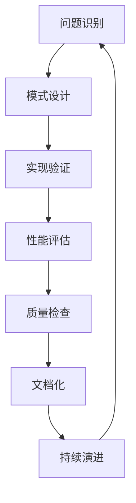

# 4.6 系统化设计模式与工程实践 / Systematic Design Patterns and Engineering Practice

[返回4.设计模式与架构](./4.设计模式与架构/README.md) |  [返回Refactor总览](./4.设计模式与架构/../README.md)

---

## 目录 / Table of Contents

- [4.6 系统化设计模式与工程实践](#46-系统化设计模式与工程实践--systematic-design-patterns-and-engineering-practice)
- [目录 / Table of Contents](#目录--table-of-contents)
- [1. 概述 / Overview](#1-概述--overview)
- [2. 设计模式理论 / Design Pattern Theory](#2-设计模式理论--design-pattern-theory)
- [3. 工程实践体系 / Engineering Practice System](#3-工程实践体系--engineering-practice-system)
- [4. 形式化模式分析 / Formal Pattern Analysis](#4-形式化模式分析--formal-pattern-analysis)
- [5. 相关性引用 / Related References](#5-相关性引用--related-references)
- [6. 参考文献 / Bibliography](#6-参考文献--bibliography)

---

## 1. 概述 / Overview

系统化设计模式与工程实践是前端技术栈中确保代码可维护性、可扩展性和可重用性的核心方法论。通过科学化的模式理论、工程化的模式实践和系统化的模式评估，建立全面的设计模式保证机制。

**Systematic Design Patterns and Engineering Practice is the core methodology for ensuring code maintainability, extensibility, and reusability in frontend technology stack. Through scientific pattern theory, engineering pattern practices, and systematic pattern evaluation, it establishes a comprehensive design pattern assurance mechanism.**

## 1.1 核心目标 / Core Objectives

- **模式理论 / Pattern Theory**: 建立科学的设计模式理论基础
- **工程实践 / Engineering Practice**: 构建系统化的模式工程实践体系
- **评估体系 / Evaluation System**: 建立全面的模式评估体系
- **持续演进 / Continuous Evolution**: 实现模式的持续演进和改进

## 1.2 设计模式开发流程 / Design Pattern Development Process



---

## 2. 设计模式理论 / Design Pattern Theory

## 2.1 多维度模式模型 / Multi-dimensional Pattern Model

### 2.1.1 创建型模式 / Creational Patterns

```typescript
interface CreationalPatterns {
  singleton: SingletonPattern;
  factory: FactoryPattern;
  builder: BuilderPattern;
  prototype: PrototypePattern;
  abstractFactory: AbstractFactoryPattern;
}

interface SingletonPattern {
  implementation: SingletonImplementation;
  threadSafety: ThreadSafety;
  lazyLoading: LazyLoading;
  testing: SingletonTesting;
}

class CreationalPatternDesigner {
  designCreationalPatterns(requirements: Requirements): CreationalPatterns {
    const singleton = this.designSingleton(requirements);
    const factory = this.designFactory(requirements);
    const builder = this.designBuilder(requirements);
    const prototype = this.designPrototype(requirements);
    const abstractFactory = this.designAbstractFactory(requirements);
    
    return {
      singleton,
      factory,
      builder,
      prototype,
      abstractFactory
    };
  }
  
  private designSingleton(requirements: Requirements): SingletonPattern {
    return {
      implementation: this.implementSingleton(requirements),
      threadSafety: this.ensureThreadSafety(requirements),
      lazyLoading: this.implementLazyLoading(requirements),
      testing: this.setupSingletonTesting(requirements)
    };
  }
}
```

### 2.1.2 结构型模式 / Structural Patterns

```typescript
interface StructuralPatterns {
  adapter: AdapterPattern;
  bridge: BridgePattern;
  composite: CompositePattern;
  decorator: DecoratorPattern;
  facade: FacadePattern;
  flyweight: FlyweightPattern;
  proxy: ProxyPattern;
}

interface AdapterPattern {
  target: TargetInterface;
  adaptee: AdapteeClass;
  adapter: AdapterClass;
  client: ClientCode;
}

class StructuralPatternDesigner {
  designStructuralPatterns(requirements: Requirements): StructuralPatterns {
    const adapter = this.designAdapter(requirements);
    const bridge = this.designBridge(requirements);
    const composite = this.designComposite(requirements);
    const decorator = this.designDecorator(requirements);
    const facade = this.designFacade(requirements);
    const flyweight = this.designFlyweight(requirements);
    const proxy = this.designProxy(requirements);
    
    return {
      adapter,
      bridge,
      composite,
      decorator,
      facade,
      flyweight,
      proxy
    };
  }
}
```

### 2.1.3 行为型模式 / Behavioral Patterns

```typescript
interface BehavioralPatterns {
  chainOfResponsibility: ChainOfResponsibilityPattern;
  command: CommandPattern;
  interpreter: InterpreterPattern;
  iterator: IteratorPattern;
  mediator: MediatorPattern;
  memento: MementoPattern;
  observer: ObserverPattern;
  state: StatePattern;
  strategy: StrategyPattern;
  templateMethod: TemplateMethodPattern;
  visitor: VisitorPattern;
}

interface ObserverPattern {
  subject: Subject;
  observers: Observer[];
  notification: NotificationMechanism;
  subscription: SubscriptionManagement;
}

class BehavioralPatternDesigner {
  designBehavioralPatterns(requirements: Requirements): BehavioralPatterns {
    const chainOfResponsibility = this.designChainOfResponsibility(requirements);
    const command = this.designCommand(requirements);
    const interpreter = this.designInterpreter(requirements);
    const iterator = this.designIterator(requirements);
    const mediator = this.designMediator(requirements);
    const memento = this.designMemento(requirements);
    const observer = this.designObserver(requirements);
    const state = this.designState(requirements);
    const strategy = this.designStrategy(requirements);
    const templateMethod = this.designTemplateMethod(requirements);
    const visitor = this.designVisitor(requirements);
    
    return {
      chainOfResponsibility,
      command,
      interpreter,
      iterator,
      mediator,
      memento,
      observer,
      state,
      strategy,
      templateMethod,
      visitor
    };
  }
}
```

## 2.2 模式设计原则 / Pattern Design Principles

### 2.2.1 SOLID原则 / SOLID Principles

```typescript
interface SOLIDPrinciples {
  singleResponsibility: SingleResponsibilityPrinciple;
  openClosed: OpenClosedPrinciple;
  liskovSubstitution: LiskovSubstitutionPrinciple;
  interfaceSegregation: InterfaceSegregationPrinciple;
  dependencyInversion: DependencyInversionPrinciple;
}

interface SingleResponsibilityPrinciple {
  responsibility: string;
  cohesion: CohesionLevel;
  coupling: CouplingLevel;
  evaluation: ResponsibilityEvaluation;
}

class SOLIDDesigner {
  applySOLIDPrinciples(design: Design): SOLIDPrinciples {
    const singleResponsibility = this.applySingleResponsibility(design);
    const openClosed = this.applyOpenClosed(design);
    const liskovSubstitution = this.applyLiskovSubstitution(design);
    const interfaceSegregation = this.applyInterfaceSegregation(design);
    const dependencyInversion = this.applyDependencyInversion(design);
    
    return {
      singleResponsibility,
      openClosed,
      liskovSubstitution,
      interfaceSegregation,
      dependencyInversion
    };
  }
  
  private applySingleResponsibility(design: Design): SingleResponsibilityPrinciple {
    return {
      responsibility: this.defineResponsibility(design),
      cohesion: this.measureCohesion(design),
      coupling: this.measureCoupling(design),
      evaluation: this.evaluateResponsibility(design)
    };
  }
}
```

### 2.2.2 DRY原则 / DRY Principles

```typescript
interface DRYPrinciples {
  donotRepeat: DoNotRepeatPrinciple;
  abstraction: AbstractionPrinciple;
  generalization: GeneralizationPrinciple;
  refactoring: RefactoringStrategy;
}

class DRYDesigner {
  applyDRYPrinciples(design: Design): DRYPrinciples {
    const donotRepeat = this.applyDoNotRepeat(design);
    const abstraction = this.applyAbstraction(design);
    const generalization = this.applyGeneralization(design);
    const refactoring = this.planRefactoring(design);
    
    return {
      donotRepeat,
      abstraction,
      generalization,
      refactoring
    };
  }
}
```

---

## 3. 工程实践体系 / Engineering Practice System

## 3.1 模式实现工程 / Pattern Implementation Engineering

### 3.1.1 模式实现 / Pattern Implementation

```typescript
interface PatternImplementation {
  design: PatternDesign;
  implementation: PatternCode;
  testing: PatternTesting;
  documentation: PatternDocumentation;
}

interface PatternDesign {
  structure: PatternStructure;
  relationships: PatternRelationships;
  interfaces: PatternInterfaces;
  constraints: PatternConstraints;
}

class PatternImplementer {
  implementPattern(requirements: Requirements): PatternImplementation {
    const design = this.designPattern(requirements);
    const implementation = this.implementPattern(design);
    const testing = this.testPattern(implementation);
    const documentation = this.documentPattern(design, implementation);
    
    return {
      design,
      implementation,
      testing,
      documentation
    };
  }
  
  private designPattern(requirements: Requirements): PatternDesign {
    return {
      structure: this.defineStructure(requirements),
      relationships: this.defineRelationships(requirements),
      interfaces: this.defineInterfaces(requirements),
      constraints: this.defineConstraints(requirements)
    };
  }
}
```

### 3.1.2 模式测试 / Pattern Testing

```typescript
interface PatternTesting {
  unitTests: UnitTest[];
  integrationTests: IntegrationTest[];
  performanceTests: PerformanceTest[];
  coverage: TestCoverage;
}

class PatternTester {
  testPattern(pattern: Pattern): PatternTesting {
    const unitTests = this.writeUnitTests(pattern);
    const integrationTests = this.writeIntegrationTests(pattern);
    const performanceTests = this.writePerformanceTests(pattern);
    const coverage = this.measureCoverage(pattern);
    
    return {
      unitTests,
      integrationTests,
      performanceTests,
      coverage
    };
  }
}
```

## 3.2 模式评估工程 / Pattern Evaluation Engineering

### 3.2.1 模式质量评估 / Pattern Quality Evaluation

```typescript
interface PatternQualityEvaluation {
  maintainability: MaintainabilityMetrics;
  extensibility: ExtensibilityMetrics;
  reusability: ReusabilityMetrics;
  performance: PerformanceMetrics;
}

interface MaintainabilityMetrics {
  complexity: ComplexityScore;
  readability: ReadabilityScore;
  testability: TestabilityScore;
  documentation: DocumentationScore;
}

class PatternQualityEvaluator {
  evaluatePattern(pattern: Pattern): PatternQualityEvaluation {
    const maintainability = this.evaluateMaintainability(pattern);
    const extensibility = this.evaluateExtensibility(pattern);
    const reusability = this.evaluateReusability(pattern);
    const performance = this.evaluatePerformance(pattern);
    
    return {
      maintainability,
      extensibility,
      reusability,
      performance
    };
  }
  
  private evaluateMaintainability(pattern: Pattern): MaintainabilityMetrics {
    return {
      complexity: this.measureComplexity(pattern),
      readability: this.measureReadability(pattern),
      testability: this.measureTestability(pattern),
      documentation: this.measureDocumentation(pattern)
    };
  }
}
```

### 3.2.2 模式适用性评估 / Pattern Applicability Evaluation

```typescript
interface PatternApplicabilityEvaluation {
  context: ContextAnalysis;
  alternatives: AlternativeAnalysis;
  tradeoffs: TradeoffAnalysis;
  recommendation: PatternRecommendation;
}

class PatternApplicabilityEvaluator {
  evaluateApplicability(context: Context): PatternApplicabilityEvaluation {
    const contextAnalysis = this.analyzeContext(context);
    const alternatives = this.analyzeAlternatives(context);
    const tradeoffs = this.analyzeTradeoffs(alternatives);
    const recommendation = this.makeRecommendation(tradeoffs);
    
    return {
      context: contextAnalysis,
      alternatives,
      tradeoffs,
      recommendation
    };
  }
}
```

---

## 4. 形式化模式分析 / Formal Pattern Analysis

## 4.1 模式理论分析 / Pattern Theory Analysis

### 4.1.1 模式正确性分析 / Pattern Correctness Analysis

```typescript
interface PatternCorrectnessAnalysis {
  proofs: MathematicalProof[];
  invariants: Invariant[];
  properties: PatternProperty[];
  verification: PatternVerification;
}

interface MathematicalProof {
  statement: string;
  proof: ProofStep[];
  assumptions: Assumption[];
  conclusions: Conclusion[];
}

class PatternCorrectnessAnalyzer {
  analyzeCorrectness(pattern: Pattern): PatternCorrectnessAnalysis {
    const proofs = this.proveCorrectness(pattern);
    const invariants = this.defineInvariants(pattern);
    const properties = this.defineProperties(pattern);
    const verification = this.verifyPattern(pattern);
    
    return {
      proofs,
      invariants,
      properties,
      verification
    };
  }
}
```

### 4.1.2 模式完备性分析 / Pattern Completeness Analysis

```typescript
interface PatternCompletenessAnalysis {
  coverage: CoverageAnalysis;
  gaps: GapAnalysis;
  extensions: ExtensionAnalysis;
  limitations: LimitationAnalysis;
}

class PatternCompletenessAnalyzer {
  analyzeCompleteness(pattern: Pattern): PatternCompletenessAnalysis {
    const coverage = this.analyzeCoverage(pattern);
    const gaps = this.identifyGaps(pattern);
    const extensions = this.analyzeExtensions(pattern);
    const limitations = this.analyzeLimitations(pattern);
    
    return {
      coverage,
      gaps,
      extensions,
      limitations
    };
  }
}
```

## 4.2 模式验证 / Pattern Verification

### 4.2.1 模式实现验证 / Pattern Implementation Verification

```typescript
interface PatternImplementationVerification {
  correctness: ImplementationCorrectness;
  performance: ImplementationPerformance;
  security: ImplementationSecurity;
  compatibility: ImplementationCompatibility;
}

class PatternImplementationVerifier {
  verifyImplementation(implementation: PatternImplementation): PatternImplementationVerification {
    const correctness = this.verifyCorrectness(implementation);
    const performance = this.verifyPerformance(implementation);
    const security = this.verifySecurity(implementation);
    const compatibility = this.verifyCompatibility(implementation);
    
    return {
      correctness,
      performance,
      security,
      compatibility
    };
  }
}
```

### 4.2.2 模式使用验证 / Pattern Usage Verification

```typescript
interface PatternUsageVerification {
  appropriateness: AppropriatenessCheck;
  efficiency: EfficiencyCheck;
  maintainability: MaintainabilityCheck;
  scalability: ScalabilityCheck;
}

class PatternUsageVerifier {
  verifyUsage(pattern: Pattern, usage: PatternUsage): PatternUsageVerification {
    const appropriateness = this.checkAppropriateness(pattern, usage);
    const efficiency = this.checkEfficiency(pattern, usage);
    const maintainability = this.checkMaintainability(pattern, usage);
    const scalability = this.checkScalability(pattern, usage);
    
    return {
      appropriateness,
      efficiency,
      maintainability,
      scalability
    };
  }
}
```

---

## 5. 相关性引用 / Related References

- [4.1 GoF设计模式](./4.设计模式与架构/4.1 GoF设计模式.md)
- [4.2 结构型-行为型-创建型模式](./4.设计模式与架构/4.2 结构型-行为型-创建型模式.md)
- [4.3 组件化与架构模式](./4.设计模式与架构/4.3 组件化与架构模式.md)
- [4.4 哲学与认知批判性分析](./4.设计模式与架构/4.4 哲学与认知批判性分析.md)
- [4.5 系统化架构设计与工程实践](./4.设计模式与架构/4.5 系统化架构设计与工程实践.md)
- [2.8 系统化工程论证与批判性分析](./2.技术栈与框架/2.8 系统化工程论证与批判性分析.md)
- [5.5 系统化质量评估与验证](./5.技术规范与标准/5.5 系统化质量评估与验证.md)
- [6.9 系统化AI应用与工程实践](./6.人工智能原理与算法/6.9 系统化AI应用与工程实践.md)

---

## 6. 参考文献 / Bibliography

1. **Gamma, E., Helm, R., Johnson, R., & Vlissides, J. (1994).** *Design Patterns: Elements of Reusable Object-Oriented Software*. Addison-Wesley.
2. **Martin, R. C. (2000).** *Design Principles and Design Patterns*. Object Mentor.
3. **Freeman, E., Robson, E., Sierra, K., & Bates, B. (2004).** *Head First Design Patterns*. O'Reilly Media.
4. **Larman, C. (2004).** *Applying UML and Patterns: An Introduction to Object-Oriented Analysis and Design and Iterative Development*. Prentice Hall.
5. **Fowler, M. (2018).** *Refactoring: Improving the Design of Existing Code*. Addison-Wesley.
6. **Evans, E. (2003).** *Domain-Driven Design: Tackling Complexity in the Heart of Software*. Addison-Wesley.
7. **Hunt, A., & Thomas, D. (1999).** *The Pragmatic Programmer: From Journeyman to Master*. Addison-Wesley.
8. **Beck, K. (2002).** *Test Driven Development: By Example*. Addison-Wesley.

---

> **补充说明 / Additional Notes:**
>
> 系统化设计模式与工程实践是确保代码可维护性、可扩展性和可重用性的关键环节。通过科学化的模式理论、工程化的模式实践和系统化的模式评估，建立全面的设计模式保证机制，为代码发展提供可靠的设计基础。
>
> **Systematic Design Patterns and Engineering Practice is a key component for ensuring code maintainability, extensibility, and reusability. Through scientific pattern theory, engineering pattern practices, and systematic pattern evaluation, it establishes a comprehensive design pattern assurance mechanism, providing a reliable design foundation for code development.**
