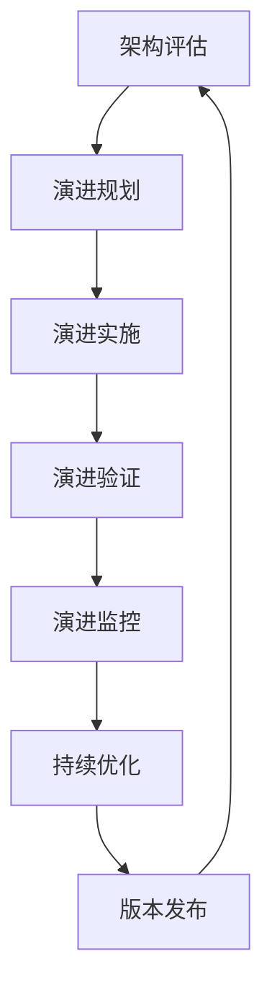

# 4.7 系统化架构演进与工程实践 / Systematic Architecture Evolution and Engineering Practice

[返回4.设计模式与架构](./4.设计模式与架构/README.md) |  [返回Refactor总览](./4.设计模式与架构/../README.md)

---

## 目录 / Table of Contents

- [4.7 系统化架构演进与工程实践](#47-系统化架构演进与工程实践--systematic-architecture-evolution-and-engineering-practice)
- [目录 / Table of Contents](#目录--table-of-contents)
- [1. 概述 / Overview](#1-概述--overview)
- [2. 架构演进理论 / Architecture Evolution Theory](#2-架构演进理论--architecture-evolution-theory)
- [3. 工程实践体系 / Engineering Practice System](#3-工程实践体系--engineering-practice-system)
- [4. 形式化演进分析 / Formal Evolution Analysis](#4-形式化演进分析--formal-evolution-analysis)
- [5. 相关性引用 / Related References](#5-相关性引用--related-references)
- [6. 参考文献 / Bibliography](#6-参考文献--bibliography)

---

## 1. 概述 / Overview

系统化架构演进与工程实践是前端技术栈中确保架构设计持续优化、演进管理和工程化实施的核心方法论。通过科学化的演进理论、工程化的实践体系和系统化的演进管理，建立全面的架构演进保证机制。

**Systematic Architecture Evolution and Engineering Practice is the core methodology for ensuring continuous optimization of architecture design, evolution management, and engineering implementation in frontend technology stack. Through scientific evolution theory, engineering practice system, and systematic evolution management, it establishes a comprehensive architecture evolution assurance mechanism.**

## 1.1 核心目标 / Core Objectives

- **演进理论 / Evolution Theory**: 建立科学的架构演进理论基础
- **演进管理 / Evolution Management**: 构建系统化的架构演进管理实践体系
- **评估体系 / Evaluation System**: 建立全面的演进评估体系
- **持续改进 / Continuous Improvement**: 实现架构演进的持续改进和优化

## 1.2 架构演进流程 / Architecture Evolution Process



---

## 2. 架构演进理论 / Architecture Evolution Theory

## 2.1 多维度演进模型 / Multi-dimensional Evolution Model

### 2.1.1 架构演进工程 / Architecture Evolution Engineering

```typescript
interface ArchitectureEvolutionEngineering {
  assessment: ArchitectureAssessment;
  planning: EvolutionPlanning;
  implementation: EvolutionImplementation;
  monitoring: EvolutionMonitoring;
}

interface ArchitectureAssessment {
  current: CurrentArchitecture;
  target: TargetArchitecture;
  gap: GapAnalysis;
  risks: RiskAssessment;
}

class ArchitectureEvolutionEngineer {
  designEvolution(requirements: Requirements): ArchitectureEvolutionEngineering {
    const assessment = this.designAssessment(requirements);
    const planning = this.designPlanning(requirements);
    const implementation = this.designImplementation(requirements);
    const monitoring = this.designMonitoring(requirements);
    
    return {
      assessment,
      planning,
      implementation,
      monitoring
    };
  }
  
  private designAssessment(requirements: Requirements): ArchitectureAssessment {
    return {
      current: this.assessCurrentArchitecture(requirements),
      target: this.defineTargetArchitecture(requirements),
      gap: this.analyzeGap(requirements),
      risks: this.assessRisks(requirements)
    };
  }
}
```

### 2.1.2 演进策略工程 / Evolution Strategy Engineering

```typescript
interface EvolutionStrategyEngineering {
  strategy: EvolutionStrategy;
  roadmap: EvolutionRoadmap;
  milestones: EvolutionMilestones;
  rollback: RollbackStrategy;
}

interface EvolutionStrategy {
  type: 'gradual' | 'big-bang' | 'strangler-fig';
  phases: EvolutionPhase[];
  dependencies: DependencyMapping;
  constraints: ConstraintAnalysis;
}

class EvolutionStrategyEngineer {
  buildEvolutionStrategy(requirements: Requirements): EvolutionStrategyEngineering {
    const strategy = this.buildStrategy(requirements);
    const roadmap = this.buildRoadmap(requirements);
    const milestones = this.defineMilestones(requirements);
    const rollback = this.buildRollbackStrategy(requirements);
    
    return {
      strategy,
      roadmap,
      milestones,
      rollback
    };
  }
  
  private buildStrategy(requirements: Requirements): EvolutionStrategy {
    return {
      type: this.selectStrategyType(requirements),
      phases: this.definePhases(requirements),
      dependencies: this.mapDependencies(requirements),
      constraints: this.analyzeConstraints(requirements)
    };
  }
}
```

### 2.1.3 演进管理工程 / Evolution Management Engineering

```typescript
interface EvolutionManagementEngineering {
  governance: EvolutionGovernance;
  communication: CommunicationStrategy;
  training: TrainingProgram;
  documentation: DocumentationStrategy;
}

interface EvolutionGovernance {
  roles: RoleDefinition[];
  processes: ProcessDefinition[];
  policies: PolicyDefinition[];
  metrics: MetricDefinition[];
}

class EvolutionManagementEngineer {
  buildManagementSystem(requirements: Requirements): EvolutionManagementEngineering {
    const governance = this.buildGovernance(requirements);
    const communication = this.buildCommunication(requirements);
    const training = this.buildTraining(requirements);
    const documentation = this.buildDocumentation(requirements);
    
    return {
      governance,
      communication,
      training,
      documentation
    };
  }
  
  private buildGovernance(requirements: Requirements): EvolutionGovernance {
    return {
      roles: this.defineRoles(requirements),
      processes: this.defineProcesses(requirements),
      policies: this.definePolicies(requirements),
      metrics: this.defineMetrics(requirements)
    };
  }
}
```

## 2.2 演进设计原则 / Evolution Design Principles

### 2.2.1 演进策略原则 / Evolution Strategy Principles

```typescript
interface EvolutionStrategyPrinciples {
  incremental: IncrementalPrinciple;
  backward: BackwardCompatibilityPrinciple;
  risk: RiskMitigationPrinciple;
  value: ValueDeliveryPrinciple;
}

interface IncrementalPrinciple {
  phases: PhaseDefinition[];
  validation: ValidationStrategy;
  feedback: FeedbackLoop;
}

class EvolutionStrategyDesigner {
  applyStrategyPrinciples(requirements: Requirements): EvolutionStrategyPrinciples {
    const incremental = this.applyIncremental(requirements);
    const backward = this.applyBackwardCompatibility(requirements);
    const risk = this.applyRiskMitigation(requirements);
    const value = this.applyValueDelivery(requirements);
    
    return {
      incremental,
      backward,
      risk,
      value
    };
  }
}
```

### 2.2.2 演进管理原则 / Evolution Management Principles

```typescript
interface EvolutionManagementPrinciples {
  transparency: TransparencyPrinciple;
  collaboration: CollaborationPrinciple;
  learning: LearningPrinciple;
  adaptation: AdaptationPrinciple;
}

class EvolutionManagementDesigner {
  applyManagementPrinciples(requirements: Requirements): EvolutionManagementPrinciples {
    const transparency = this.applyTransparency(requirements);
    const collaboration = this.applyCollaboration(requirements);
    const learning = this.applyLearning(requirements);
    const adaptation = this.applyAdaptation(requirements);
    
    return {
      transparency,
      collaboration,
      learning,
      adaptation
    };
  }
}
```

---

## 3. 工程实践体系 / Engineering Practice System

## 3.1 演进实施工具链 / Evolution Implementation Toolchain

### 3.1.1 架构评估工具 / Architecture Assessment Tools

```typescript
interface ArchitectureAssessmentTools {
  analysis: ArchitectureAnalysis;
  metrics: ArchitectureMetrics;
  visualization: ArchitectureVisualization;
  reporting: AssessmentReporting;
}

interface ArchitectureAnalysis {
  complexity: ComplexityAnalysis;
  coupling: CouplingAnalysis;
  cohesion: CohesionAnalysis;
  maintainability: MaintainabilityAnalysis;
}

class ArchitectureAssessmentEngineer {
  buildAssessmentTools(requirements: Requirements): ArchitectureAssessmentTools {
    const analysis = this.buildAnalysis(requirements);
    const metrics = this.buildMetrics(requirements);
    const visualization = this.buildVisualization(requirements);
    const reporting = this.buildReporting(requirements);
    
    return {
      analysis,
      metrics,
      visualization,
      reporting
    };
  }
  
  private buildAnalysis(requirements: Requirements): ArchitectureAnalysis {
    return {
      complexity: this.buildComplexityAnalysis(requirements),
      coupling: this.buildCouplingAnalysis(requirements),
      cohesion: this.buildCohesionAnalysis(requirements),
      maintainability: this.buildMaintainabilityAnalysis(requirements)
    };
  }
}
```

### 3.1.2 演进规划工具 / Evolution Planning Tools

```typescript
interface EvolutionPlanningTools {
  roadmap: RoadmapPlanning;
  dependency: DependencyAnalysis;
  timeline: TimelinePlanning;
  resource: ResourcePlanning;
}

interface RoadmapPlanning {
  phases: PhasePlanning[];
  milestones: MilestonePlanning[];
  deliverables: DeliverablePlanning[];
  risks: RiskPlanning[];
}

class EvolutionPlanningEngineer {
  buildPlanningTools(requirements: Requirements): EvolutionPlanningTools {
    const roadmap = this.buildRoadmap(requirements);
    const dependency = this.buildDependencyAnalysis(requirements);
    const timeline = this.buildTimeline(requirements);
    const resource = this.buildResourcePlanning(requirements);
    
    return {
      roadmap,
      dependency,
      timeline,
      resource
    };
  }
}
```

### 3.1.3 演进监控工具 / Evolution Monitoring Tools

```typescript
interface EvolutionMonitoringTools {
  progress: ProgressMonitoring;
  quality: QualityMonitoring;
  performance: PerformanceMonitoring;
  alerts: AlertSystem;
}

interface ProgressMonitoring {
  metrics: ProgressMetrics;
  dashboards: ProgressDashboards;
  reporting: ProgressReporting;
  automation: ProgressAutomation;
}

class EvolutionMonitoringEngineer {
  buildMonitoringTools(requirements: Requirements): EvolutionMonitoringTools {
    const progress = this.buildProgressMonitoring(requirements);
    const quality = this.buildQualityMonitoring(requirements);
    const performance = this.buildPerformanceMonitoring(requirements);
    const alerts = this.buildAlertSystem(requirements);
    
    return {
      progress,
      quality,
      performance,
      alerts
    };
  }
}
```

## 3.2 演进验证工具链 / Evolution Verification Toolchain

### 3.2.1 演进测试工具 / Evolution Testing Tools

```typescript
interface EvolutionTestingTools {
  unit: UnitTesting;
  integration: IntegrationTesting;
  system: SystemTesting;
  regression: RegressionTesting;
}

interface UnitTesting {
  components: ComponentTesting;
  functions: FunctionTesting;
  utilities: UtilityTesting;
  coverage: TestCoverage;
}

class EvolutionTestingEngineer {
  buildTestingTools(requirements: Requirements): EvolutionTestingTools {
    const unit = this.buildUnitTesting(requirements);
    const integration = this.buildIntegrationTesting(requirements);
    const system = this.buildSystemTesting(requirements);
    const regression = this.buildRegressionTesting(requirements);
    
    return {
      unit,
      integration,
      system,
      regression
    };
  }
}
```

### 3.2.2 演进质量工具 / Evolution Quality Tools

```typescript
interface EvolutionQualityTools {
  review: CodeReview;
  analysis: StaticAnalysis;
  metrics: QualityMetrics;
  automation: QualityAutomation;
}

interface CodeReview {
  process: ReviewProcess;
  checklist: ReviewChecklist;
  automation: ReviewAutomation;
  feedback: ReviewFeedback;
}

class EvolutionQualityEngineer {
  buildQualityTools(requirements: Requirements): EvolutionQualityTools {
    const review = this.buildCodeReview(requirements);
    const analysis = this.buildStaticAnalysis(requirements);
    const metrics = this.buildQualityMetrics(requirements);
    const automation = this.buildQualityAutomation(requirements);
    
    return {
      review,
      analysis,
      metrics,
      automation
    };
  }
}
```

---

## 4. 形式化演进分析 / Formal Evolution Analysis

## 4.1 演进理论分析 / Evolution Theory Analysis

### 4.1.1 架构演进完备性分析 / Architecture Evolution Completeness Analysis

```typescript
interface ArchitectureEvolutionCompletenessAnalysis {
  assessment: AssessmentCompleteness;
  planning: PlanningCompleteness;
  implementation: ImplementationCompleteness;
  monitoring: MonitoringCompleteness;
}

interface AssessmentCompleteness {
  current: CurrentArchitectureCompleteness;
  target: TargetArchitectureCompleteness;
  gap: GapAnalysisCompleteness;
  risks: RiskAssessmentCompleteness;
}

class ArchitectureEvolutionCompletenessAnalyzer {
  analyzeCompleteness(evolution: ArchitectureEvolution): ArchitectureEvolutionCompletenessAnalysis {
    const assessment = this.analyzeAssessmentCompleteness(evolution);
    const planning = this.analyzePlanningCompleteness(evolution);
    const implementation = this.analyzeImplementationCompleteness(evolution);
    const monitoring = this.analyzeMonitoringCompleteness(evolution);
    
    return {
      assessment,
      planning,
      implementation,
      monitoring
    };
  }
  
  private analyzeAssessmentCompleteness(evolution: ArchitectureEvolution): AssessmentCompleteness {
    return {
      current: this.analyzeCurrentArchitectureCompleteness(evolution),
      target: this.analyzeTargetArchitectureCompleteness(evolution),
      gap: this.analyzeGapAnalysisCompleteness(evolution),
      risks: this.analyzeRiskAssessmentCompleteness(evolution)
    };
  }
}
```

### 4.1.2 演进策略有效性分析 / Evolution Strategy Effectiveness Analysis

```typescript
interface EvolutionStrategyEffectivenessAnalysis {
  efficiency: StrategyEfficiencyAnalysis;
  reliability: StrategyReliabilityAnalysis;
  usability: StrategyUsabilityAnalysis;
  maintainability: StrategyMaintainabilityAnalysis;
}

class EvolutionStrategyEffectivenessAnalyzer {
  analyzeEffectiveness(strategy: EvolutionStrategy): EvolutionStrategyEffectivenessAnalysis {
    const efficiency = this.analyzeEfficiency(strategy);
    const reliability = this.analyzeReliability(strategy);
    const usability = this.analyzeUsability(strategy);
    const maintainability = this.analyzeMaintainability(strategy);
    
    return {
      efficiency,
      reliability,
      usability,
      maintainability
    };
  }
}
```

## 4.2 演进验证 / Evolution Verification

### 4.2.1 架构演进正确性验证 / Architecture Evolution Correctness Verification

```typescript
interface ArchitectureEvolutionCorrectnessVerification {
  assessment: AssessmentCorrectnessVerification;
  planning: PlanningCorrectnessVerification;
  implementation: ImplementationCorrectnessVerification;
  monitoring: MonitoringCorrectnessVerification;
}

class ArchitectureEvolutionCorrectnessVerifier {
  verifyCorrectness(evolution: ArchitectureEvolution): ArchitectureEvolutionCorrectnessVerification {
    const assessment = this.verifyAssessmentCorrectness(evolution);
    const planning = this.verifyPlanningCorrectness(evolution);
    const implementation = this.verifyImplementationCorrectness(evolution);
    const monitoring = this.verifyMonitoringCorrectness(evolution);
    
    return {
      assessment,
      planning,
      implementation,
      monitoring
    };
  }
}
```

### 4.2.2 演进性能验证 / Evolution Performance Verification

```typescript
interface EvolutionPerformanceVerification {
  speed: SpeedVerification;
  resource: ResourceVerification;
  scalability: ScalabilityVerification;
  stability: StabilityVerification;
}

class EvolutionPerformanceVerifier {
  verifyPerformance(evolution: ArchitectureEvolution): EvolutionPerformanceVerification {
    const speed = this.verifySpeed(evolution);
    const resource = this.verifyResource(evolution);
    const scalability = this.verifyScalability(evolution);
    const stability = this.verifyStability(evolution);
    
    return {
      speed,
      resource,
      scalability,
      stability
    };
  }
}
```

---

## 5. 相关性引用 / Related References

- [4.1 GoF设计模式](./4.设计模式与架构/4.1 GoF设计模式.md)
- [4.2 结构型-行为型-创建型模式](./4.设计模式与架构/4.2 结构型-行为型-创建型模式.md)
- [4.3 组件化与架构模式](./4.设计模式与架构/4.3 组件化与架构模式.md)
- [4.4 哲学与认知批判性分析](./4.设计模式与架构/4.4 哲学与认知批判性分析.md)
- [4.5 系统化架构设计与工程实践](./4.设计模式与架构/4.5 系统化架构设计与工程实践.md)
- [4.6 系统化设计模式与工程实践](./4.设计模式与架构/4.6 系统化设计模式与工程实践.md)
- [2.8 系统化工程论证与批判性分析](./2.技术栈与框架/2.8 系统化工程论证与批判性分析.md)
- [2.10 系统化前端工程化与DevOps实践](./2.技术栈与框架/2.10 系统化前端工程化与DevOps实践.md)
- [5.5 系统化质量评估与验证](./5.技术规范与标准/5.5 系统化质量评估与验证.md)
- [5.7 系统化前端测试与质量保证](./5.技术规范与标准/5.7 系统化前端测试与质量保证.md)
- [3.7 系统化编程语言理论与工程实践](./3.编程语言范式/3.7 系统化编程语言理论与工程实践.md)
- [3.8 系统化编程语言工程实践与工具链](./3.编程语言范式/3.8 系统化编程语言工程实践与工具链.md)
- [6.10 系统化AI理论与工程实践](./6.人工智能原理与算法/6.10 系统化AI理论与工程实践.md)
- [6.12 系统化AI工程实践与工具链](./6.人工智能原理与算法/6.12 系统化AI工程实践与工具链.md)

---

## 6. 参考文献 / Bibliography

1. **Fowler, M. (2018).** *Refactoring: Improving the Design of Existing Code*. Addison-Wesley.
2. **Evans, E. (2003).** *Domain-Driven Design: Tackling Complexity in the Heart of Software*. Addison-Wesley.
3. **Martin, R. C. (2017).** *Clean Architecture: A Craftsman's Guide to Software Structure and Design*. Prentice Hall.
4. **Hohpe, G., & Woolf, B. (2003).** *Enterprise Integration Patterns: Designing, Building, and Deploying Messaging Solutions*. Addison-Wesley.
5. **Gamma, E., Helm, R., Johnson, R., & Vlissides, J. (1994).** *Design Patterns: Elements of Reusable Object-Oriented Software*. Addison-Wesley.
6. **Bass, L., Clements, P., & Kazman, R. (2012).** *Software Architecture in Practice*. Addison-Wesley.
7. **Rozanski, N., & Woods, E. (2011).** *Software Systems Architecture: Working with Stakeholders Using Viewpoints and Perspectives*. Addison-Wesley.
8. **Coplien, J. O., & Bjørnvig, G. (2010).** *Lean Architecture: for Agile Software Development*. Wiley.

---

> **补充说明 / Additional Notes:**
>
> 系统化架构演进与工程实践是确保架构设计持续优化、演进管理和工程化实施的关键环节。通过科学化的演进理论、工程化的实践体系和系统化的演进管理，建立全面的架构演进保证机制，为架构发展提供可靠的工程基础。
>
> **Systematic Architecture Evolution and Engineering Practice is a key component for ensuring continuous optimization of architecture design, evolution management, and engineering implementation. Through scientific evolution theory, engineering practice system, and systematic evolution management, it establishes a comprehensive architecture evolution assurance mechanism, providing a reliable engineering foundation for architecture development.**
