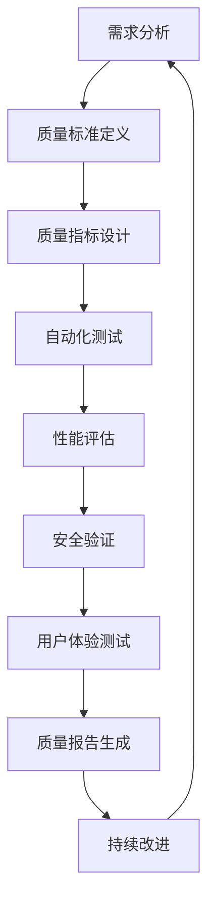

# 5.5 系统化质量评估与验证 / Systematic Quality Assessment and Verification

[返回5.技术规范与标准](./5.技术规范与标准/README.md) |  [返回Refactor总览](./5.技术规范与标准/../README.md)

---

## 目录 / Table of Contents

- [5.5 系统化质量评估与验证](#55-系统化质量评估与验证--systematic-quality-assessment-and-verification)
- [目录 / Table of Contents](#目录--table-of-contents)
- [1. 概述 / Overview](#1-概述--overview)
- [2. 质量评估框架 / Quality Assessment Framework](#2-质量评估框架--quality-assessment-framework)
- [3. 形式化验证方法 / Formal Verification Methods](#3-形式化验证方法--formal-verification-methods)
- [4. 工程实践验证 / Engineering Practice Verification](#4-工程实践验证--engineering-practice-verification)
- [5. 自动化质量保证 / Automated Quality Assurance](#5-自动化质量保证--automated-quality-assurance)
- [6. 相关性引用 / Related References](#6-相关性引用--related-references)
- [7. 参考文献 / Bibliography](#7-参考文献--bibliography)

---

## 1. 概述 / Overview

系统化质量评估与验证是确保前端技术栈质量、可靠性和可维护性的核心方法论。通过形式化验证、自动化测试、工程实践验证等方法，建立科学的质量保证体系。

**Systematic Quality Assessment and Verification is the core methodology for ensuring the quality, reliability, and maintainability of frontend technology stack. Through formal verification, automated testing, engineering practice verification, and other methods, it establishes a scientific quality assurance system.**

## 1.1 核心目标 / Core Objectives

- **质量保证 / Quality Assurance**: 建立全面的质量评估体系
- **可靠性验证 / Reliability Verification**: 确保系统的稳定性和可靠性
- **性能优化 / Performance Optimization**: 通过量化指标优化系统性能
- **可维护性保证 / Maintainability Assurance**: 确保代码的可读性和可维护性

## 1.2 质量评估流程 / Quality Assessment Process



---

## 2. 质量评估框架 / Quality Assessment Framework

## 2.1 多维度质量模型 / Multi-dimensional Quality Model

### 2.1.1 功能质量 / Functional Quality

```typescript
interface FunctionalQuality {
  correctness: {
    accuracy: number;        // 准确性 / Accuracy
    completeness: number;    // 完整性 / Completeness
    consistency: number;     // 一致性 / Consistency
  };
  reliability: {
    availability: number;    // 可用性 / Availability
    faultTolerance: number; // 容错性 / Fault Tolerance
    recoverability: number; // 可恢复性 / Recoverability
  };
  usability: {
    understandability: number; // 可理解性 / Understandability
    learnability: number;      // 可学习性 / Learnability
    operability: number;       // 可操作性 / Operability
  };
}

class FunctionalQualityAssessor {
  assessFunctionalQuality(system: System): FunctionalQuality {
    return {
      correctness: this.assessCorrectness(system),
      reliability: this.assessReliability(system),
      usability: this.assessUsability(system)
    };
  }
  
  private assessCorrectness(system: System): CorrectnessMetrics {
    return {
      accuracy: this.calculateAccuracy(system),
      completeness: this.calculateCompleteness(system),
      consistency: this.calculateConsistency(system)
    };
  }
}
```

### 2.1.2 性能质量 / Performance Quality

```typescript
interface PerformanceQuality {
  efficiency: {
    timeBehavior: number;    // 时间行为 / Time Behavior
    resourceUtilization: number; // 资源利用率 / Resource Utilization
    capacity: number;        // 容量 / Capacity
  };
  compatibility: {
    coExistence: number;     // 共存性 / Co-existence
    interoperability: number; // 互操作性 / Interoperability
  };
  portability: {
    adaptability: number;    // 适应性 / Adaptability
    installability: number;  // 可安装性 / Installability
    replaceability: number;  // 可替换性 / Replaceability
  };
}

class PerformanceQualityAssessor {
  assessPerformanceQuality(system: System): PerformanceQuality {
    return {
      efficiency: this.assessEfficiency(system),
      compatibility: this.assessCompatibility(system),
      portability: this.assessPortability(system)
    };
  }
}
```

### 2.1.3 安全质量 / Security Quality

```typescript
interface SecurityQuality {
  confidentiality: {
    dataProtection: number;  // 数据保护 / Data Protection
    accessControl: number;   // 访问控制 / Access Control
    encryption: number;      // 加密 / Encryption
  };
  integrity: {
    dataIntegrity: number;   // 数据完整性 / Data Integrity
    systemIntegrity: number; // 系统完整性 / System Integrity
  };
  availability: {
    serviceContinuity: number; // 服务连续性 / Service Continuity
    disasterRecovery: number;  // 灾难恢复 / Disaster Recovery
  };
}

class SecurityQualityAssessor {
  assessSecurityQuality(system: System): SecurityQuality {
    return {
      confidentiality: this.assessConfidentiality(system),
      integrity: this.assessIntegrity(system),
      availability: this.assessAvailability(system)
    };
  }
}
```

## 2.2 质量度量指标 / Quality Metrics

### 2.2.1 代码质量指标 / Code Quality Metrics

```typescript
interface CodeQualityMetrics {
  complexity: {
    cyclomaticComplexity: number; // 圈复杂度 / Cyclomatic Complexity
    cognitiveComplexity: number;   // 认知复杂度 / Cognitive Complexity
    depthOfInheritance: number;   // 继承深度 / Depth of Inheritance
  };
  maintainability: {
    maintainabilityIndex: number; // 可维护性指数 / Maintainability Index
    technicalDebt: number;        // 技术债务 / Technical Debt
    codeSmells: number;          // 代码异味 / Code Smells
  };
  reliability: {
    bugDensity: number;          // 缺陷密度 / Bug Density
    defectRate: number;          // 缺陷率 / Defect Rate
    meanTimeToFailure: number;   // 平均故障时间 / Mean Time to Failure
  };
}

class CodeQualityAnalyzer {
  analyzeCodeQuality(codebase: Codebase): CodeQualityMetrics {
    return {
      complexity: this.analyzeComplexity(codebase),
      maintainability: this.analyzeMaintainability(codebase),
      reliability: this.analyzeReliability(codebase)
    };
  }
  
  private analyzeComplexity(codebase: Codebase): ComplexityMetrics {
    return {
      cyclomaticComplexity: this.calculateCyclomaticComplexity(codebase),
      cognitiveComplexity: this.calculateCognitiveComplexity(codebase),
      depthOfInheritance: this.calculateDepthOfInheritance(codebase)
    };
  }
}
```

### 2.2.2 性能质量指标 / Performance Quality Metrics

```typescript
interface PerformanceMetrics {
  loadTime: {
    firstContentfulPaint: number; // 首次内容绘制 / First Contentful Paint
    largestContentfulPaint: number; // 最大内容绘制 / Largest Contentful Paint
    timeToInteractive: number;    // 可交互时间 / Time to Interactive
  };
  runtime: {
    frameRate: number;           // 帧率 / Frame Rate
    memoryUsage: number;         // 内存使用 / Memory Usage
    cpuUsage: number;           // CPU使用 / CPU Usage
  };
  network: {
    bandwidthUtilization: number; // 带宽利用率 / Bandwidth Utilization
    requestLatency: number;      // 请求延迟 / Request Latency
    throughput: number;          // 吞吐量 / Throughput
  };
}

class PerformanceAnalyzer {
  analyzePerformance(application: Application): PerformanceMetrics {
    return {
      loadTime: this.analyzeLoadTime(application),
      runtime: this.analyzeRuntime(application),
      network: this.analyzeNetwork(application)
    };
  }
}
```

---

## 3. 形式化验证方法 / Formal Verification Methods

## 3.1 静态分析 / Static Analysis

### 3.1.1 代码静态分析 / Code Static Analysis

```typescript
interface StaticAnalysis {
  linting: LintingResult;
  typeChecking: TypeCheckingResult;
  securityScanning: SecurityScanResult;
  complexityAnalysis: ComplexityAnalysisResult;
}

interface LintingResult {
  errors: LintError[];
  warnings: LintWarning[];
  suggestions: LintSuggestion[];
  score: number;
}

class StaticAnalyzer {
  performStaticAnalysis(code: string): StaticAnalysis {
    return {
      linting: this.performLinting(code),
      typeChecking: this.performTypeChecking(code),
      securityScanning: this.performSecurityScanning(code),
      complexityAnalysis: this.performComplexityAnalysis(code)
    };
  }
  
  private performLinting(code: string): LintingResult {
    const linter = new ESLint();
    const results = linter.lintText(code);
    
    return {
      errors: results.filter(r => r.severity === 2),
      warnings: results.filter(r => r.severity === 1),
      suggestions: results.filter(r => r.severity === 0),
      score: this.calculateLintScore(results)
    };
  }
}
```

### 3.1.2 类型检查 / Type Checking

```typescript
interface TypeCheckingResult {
  typeErrors: TypeError[];
  typeWarnings: TypeWarning[];
  coverage: number;
  score: number;
}

class TypeChecker {
  performTypeChecking(code: string): TypeCheckingResult {
    const compiler = new TypeScriptCompiler();
    const diagnostics = compiler.checkTypes(code);
    
    return {
      typeErrors: diagnostics.filter(d => d.category === DiagnosticCategory.Error),
      typeWarnings: diagnostics.filter(d => d.category === DiagnosticCategory.Warning),
      coverage: this.calculateTypeCoverage(code),
      score: this.calculateTypeScore(diagnostics)
    };
  }
}
```

## 3.2 动态分析 / Dynamic Analysis

### 3.2.1 运行时分析 / Runtime Analysis

```typescript
interface RuntimeAnalysis {
  performance: PerformanceMetrics;
  memory: MemoryMetrics;
  errors: ErrorMetrics;
  userInteractions: UserInteractionMetrics;
}

class RuntimeAnalyzer {
  analyzeRuntime(application: Application): RuntimeAnalysis {
    return {
      performance: this.analyzePerformance(application),
      memory: this.analyzeMemory(application),
      errors: this.analyzeErrors(application),
      userInteractions: this.analyzeUserInteractions(application)
    };
  }
  
  private analyzeMemory(application: Application): MemoryMetrics {
    return {
      heapUsage: this.getHeapUsage(application),
      memoryLeaks: this.detectMemoryLeaks(application),
      garbageCollection: this.analyzeGarbageCollection(application)
    };
  }
}
```

### 3.2.2 安全分析 / Security Analysis

```typescript
interface SecurityAnalysis {
  vulnerabilities: Vulnerability[];
  threats: Threat[];
  riskScore: number;
  recommendations: SecurityRecommendation[];
}

class SecurityAnalyzer {
  analyzeSecurity(application: Application): SecurityAnalysis {
    return {
      vulnerabilities: this.detectVulnerabilities(application),
      threats: this.identifyThreats(application),
      riskScore: this.calculateRiskScore(application),
      recommendations: this.generateSecurityRecommendations(application)
    };
  }
  
  private detectVulnerabilities(application: Application): Vulnerability[] {
    return [
      this.scanForXSS(application),
      this.scanForCSRF(application),
      this.scanForSQLInjection(application),
      this.scanForInsecureDependencies(application)
    ].flat();
  }
}
```

---

## 4. 工程实践验证 / Engineering Practice Verification

## 4.1 自动化测试 / Automated Testing

### 4.1.1 单元测试 / Unit Testing

```typescript
interface UnitTestSuite {
  tests: UnitTest[];
  coverage: TestCoverage;
  results: TestResults;
  metrics: TestMetrics;
}

interface UnitTest {
  name: string;
  description: string;
  testFunction: () => Promise<TestResult>;
  expectedResult: any;
  timeout: number;
}

class UnitTestRunner {
  async runTests(testSuite: UnitTestSuite): Promise<TestResults> {
    const results: TestResult[] = [];
    
    for (const test of testSuite.tests) {
      try {
        const result = await test.testFunction();
        results.push({
          test: test.name,
          status: result === test.expectedResult ? 'pass' : 'fail',
          actual: result,
          expected: test.expectedResult,
          duration: this.measureDuration(test.testFunction)
        });
      } catch (error) {
        results.push({
          test: test.name,
          status: 'error',
          error: error.message,
          duration: 0
        });
      }
    }
    
    return {
      results,
      summary: this.generateSummary(results),
      coverage: this.calculateCoverage(results)
    };
  }
}
```

### 4.1.2 集成测试 / Integration Testing

```typescript
interface IntegrationTest {
  name: string;
  description: string;
  setup: () => Promise<void>;
  test: () => Promise<TestResult>;
  teardown: () => Promise<void>;
  dependencies: string[];
}

class IntegrationTestRunner {
  async runIntegrationTests(tests: IntegrationTest[]): Promise<IntegrationTestResults> {
    const results: IntegrationTestResult[] = [];
    
    for (const test of tests) {
      try {
        await test.setup();
        const result = await test.test();
        await test.teardown();
        
        results.push({
          test: test.name,
          status: 'pass',
          result,
          duration: this.measureDuration(test.test)
        });
      } catch (error) {
        results.push({
          test: test.name,
          status: 'fail',
          error: error.message,
          duration: 0
        });
      }
    }
    
    return {
      results,
      summary: this.generateSummary(results)
    };
  }
}
```

### 4.1.3 端到端测试 / End-to-End Testing

```typescript
interface E2ETest {
  name: string;
  description: string;
  steps: TestStep[];
  assertions: Assertion[];
  timeout: number;
}

interface TestStep {
  action: 'navigate' | 'click' | 'type' | 'wait' | 'assert';
  target: string;
  value?: any;
  condition?: string;
}

class E2ETestRunner {
  async runE2ETests(tests: E2ETest[]): Promise<E2ETestResults> {
    const results: E2ETestResult[] = [];
    
    for (const test of tests) {
      try {
        const browser = await this.launchBrowser();
        const page = await browser.newPage();
        
        for (const step of test.steps) {
          await this.executeStep(page, step);
        }
        
        for (const assertion of test.assertions) {
          await this.executeAssertion(page, assertion);
        }
        
        await browser.close();
        
        results.push({
          test: test.name,
          status: 'pass',
          duration: this.measureDuration(test)
        });
      } catch (error) {
        results.push({
          test: test.name,
          status: 'fail',
          error: error.message,
          duration: 0
        });
      }
    }
    
    return {
      results,
      summary: this.generateSummary(results)
    };
  }
}
```

## 4.2 性能测试 / Performance Testing

### 4.2.1 负载测试 / Load Testing

```typescript
interface LoadTest {
  name: string;
  description: string;
  scenarios: LoadScenario[];
  metrics: PerformanceMetrics;
}

interface LoadScenario {
  users: number;
  duration: number;
  rampUp: number;
  actions: UserAction[];
}

class LoadTestRunner {
  async runLoadTest(test: LoadTest): Promise<LoadTestResults> {
    const results: LoadTestResult[] = [];
    
    for (const scenario of test.scenarios) {
      const result = await this.executeLoadScenario(scenario);
      results.push(result);
    }
    
    return {
      test: test.name,
      scenarios: results,
      summary: this.generateLoadTestSummary(results),
      recommendations: this.generateLoadTestRecommendations(results)
    };
  }
  
  private async executeLoadScenario(scenario: LoadScenario): Promise<LoadScenarioResult> {
    const startTime = Date.now();
    const metrics: PerformanceMetric[] = [];
    
    // 模拟用户负载 / Simulate user load
    for (let i = 0; i < scenario.users; i++) {
      const userMetrics = await this.simulateUser(scenario.actions);
      metrics.push(...userMetrics);
    }
    
    return {
      scenario: scenario,
      metrics: this.aggregateMetrics(metrics),
      duration: Date.now() - startTime
    };
  }
}
```

### 4.2.2 压力测试 / Stress Testing

```typescript
interface StressTest {
  name: string;
  description: string;
  maxLoad: number;
  stepIncrement: number;
  breakpoint: BreakpointCondition;
}

interface BreakpointCondition {
  type: 'responseTime' | 'errorRate' | 'throughput';
  threshold: number;
  duration: number;
}

class StressTestRunner {
  async runStressTest(test: StressTest): Promise<StressTestResults> {
    let currentLoad = test.stepIncrement;
    const results: StressTestResult[] = [];
    
    while (currentLoad <= test.maxLoad) {
      const result = await this.executeStressScenario(currentLoad, test);
      results.push(result);
      
      if (this.checkBreakpoint(result, test.breakpoint)) {
        break;
      }
      
      currentLoad += test.stepIncrement;
    }
    
    return {
      test: test.name,
      results,
      breakpoint: this.findBreakpoint(results, test.breakpoint),
      recommendations: this.generateStressTestRecommendations(results)
    };
  }
}
```

---

## 5. 自动化质量保证 / Automated Quality Assurance

## 5.1 持续集成 / Continuous Integration

### 5.1.1 CI/CD流水线 / CI/CD Pipeline

```typescript
interface CICDPipeline {
  stages: PipelineStage[];
  triggers: PipelineTrigger[];
  artifacts: PipelineArtifact[];
}

interface PipelineStage {
  name: string;
  steps: PipelineStep[];
  conditions: StageCondition[];
  timeout: number;
}

class CICDRunner {
  async runPipeline(pipeline: CICDPipeline): Promise<PipelineResult> {
    const results: StageResult[] = [];
    
    for (const stage of pipeline.stages) {
      if (this.shouldExecuteStage(stage, results)) {
        const result = await this.executeStage(stage);
        results.push(result);
        
        if (result.status === 'failed') {
          break;
        }
      }
    }
    
    return {
      pipeline: pipeline,
      stages: results,
      status: this.determinePipelineStatus(results),
      duration: this.calculatePipelineDuration(results)
    };
  }
  
  private async executeStage(stage: PipelineStage): Promise<StageResult> {
    const startTime = Date.now();
    const stepResults: StepResult[] = [];
    
    for (const step of stage.steps) {
      const result = await this.executeStep(step);
      stepResults.push(result);
      
      if (result.status === 'failed') {
        break;
      }
    }
    
    return {
      stage: stage.name,
      steps: stepResults,
      status: this.determineStageStatus(stepResults),
      duration: Date.now() - startTime
    };
  }
}
```

### 5.1.2 质量门禁 / Quality Gates

```typescript
interface QualityGate {
  name: string;
  conditions: QualityCondition[];
  thresholds: QualityThreshold;
  actions: QualityAction[];
}

interface QualityCondition {
  metric: string;
  operator: 'gt' | 'lt' | 'eq' | 'gte' | 'lte';
  value: number;
}

class QualityGateChecker {
  async checkQualityGates(gates: QualityGate[], metrics: QualityMetrics): Promise<QualityGateResults> {
    const results: QualityGateResult[] = [];
    
    for (const gate of gates) {
      const result = await this.evaluateQualityGate(gate, metrics);
      results.push(result);
      
      if (result.status === 'failed') {
        await this.executeQualityActions(gate.actions, result);
      }
    }
    
    return {
      gates: results,
      overallStatus: this.determineOverallStatus(results),
      recommendations: this.generateQualityRecommendations(results)
    };
  }
  
  private async evaluateQualityGate(gate: QualityGate, metrics: QualityMetrics): Promise<QualityGateResult> {
    const evaluations: ConditionEvaluation[] = [];
    
    for (const condition of gate.conditions) {
      const metricValue = this.getMetricValue(metrics, condition.metric);
      const evaluation = this.evaluateCondition(condition, metricValue);
      evaluations.push(evaluation);
    }
    
    return {
      gate: gate.name,
      evaluations,
      status: this.determineGateStatus(evaluations),
      passed: evaluations.every(e => e.passed)
    };
  }
}
```

## 5.2 质量监控 / Quality Monitoring

### 5.2.1 实时监控 / Real-time Monitoring

```typescript
interface QualityMonitor {
  metrics: MonitoringMetric[];
  alerts: Alert[];
  dashboards: Dashboard[];
}

interface MonitoringMetric {
  name: string;
  value: number;
  timestamp: Date;
  threshold: MetricThreshold;
}

class QualityMonitor {
  async monitorQuality(application: Application): Promise<MonitoringResults> {
    const metrics = await this.collectMetrics(application);
    const alerts = this.checkAlerts(metrics);
    const dashboards = this.updateDashboards(metrics);
    
    return {
      metrics,
      alerts,
      dashboards,
      summary: this.generateMonitoringSummary(metrics, alerts)
    };
  }
  
  private async collectMetrics(application: Application): Promise<MonitoringMetric[]> {
    return [
      await this.collectPerformanceMetrics(application),
      await this.collectErrorMetrics(application),
      await this.collectUserMetrics(application),
      await this.collectSecurityMetrics(application)
    ].flat();
  }
}
```

### 5.2.2 质量报告 / Quality Reports

```typescript
interface QualityReport {
  summary: QualitySummary;
  details: QualityDetails;
  trends: QualityTrends;
  recommendations: QualityRecommendation[];
}

class QualityReporter {
  generateQualityReport(metrics: QualityMetrics[]): QualityReport {
    return {
      summary: this.generateSummary(metrics),
      details: this.generateDetails(metrics),
      trends: this.analyzeTrends(metrics),
      recommendations: this.generateRecommendations(metrics)
    };
  }
  
  private generateSummary(metrics: QualityMetrics[]): QualitySummary {
    const latest = metrics[metrics.length - 1];
    
    return {
      overallScore: this.calculateOverallScore(latest),
      criticalIssues: this.countCriticalIssues(latest),
      improvementAreas: this.identifyImprovementAreas(latest),
      status: this.determineOverallStatus(latest)
    };
  }
}
```

---

## 6. 相关性引用 / Related References

- [5.1 UI-UE-UX设计规范](./5.技术规范与标准/5.1 UI-UE-UX设计规范.md)
- [5.2 可访问性与国际化](./5.技术规范与标准/5.2 可访问性与国际化.md)
- [5.3 性能优化与工程实践](./5.技术规范与标准/5.3 性能优化与工程实践.md)
- [5.4 代码示例与形式化证明](./5.技术规范与标准/5.4 代码示例与形式化证明.md)
- [2.7 现代前端工程化](./5.技术规范与标准/../2.技术栈与框架/2.7 现代前端工程化.md)
- [2.8 系统化工程论证与批判性分析](./5.技术规范与标准/../2.技术栈与框架/2.8 系统化工程论证与批判性分析.md)
- [4.4 哲学与认知批判性分析](./5.技术规范与标准/../4.设计模式与架构/4.4 哲学与认知批判性分析.md)
- [6.4 AI工程实践与伦理](./5.技术规范与标准/../6.人工智能原理与算法/6.4 AI工程实践与伦理.md)

---

## 7. 参考文献 / Bibliography

1. **ISO/IEC 25010:2011.** Systems and software engineering — Systems and software Quality Requirements and Evaluation (SQuaRE) — System and software quality models.
2. **IEEE 1012-2016.** IEEE Standard for System, Software, and Hardware Verification and Validation.
3. **SEI (2018).** *Technical Debt*. Software Engineering Institute, Carnegie Mellon University.
4. **Martin, R. C. (2008).** *Clean Code: A Handbook of Agile Software Craftsmanship*. Prentice Hall.
5. **Fowler, M. (2018).** *Refactoring: Improving the Design of Existing Code*. Addison-Wesley.
6. **Feathers, M. C. (2004).** *Working Effectively with Legacy Code*. Prentice Hall.
7. **Hunt, A., & Thomas, D. (1999).** *The Pragmatic Programmer: Your Journey to Mastery*. Addison-Wesley.
8. **McConnell, S. (2004).** *Code Complete: A Practical Handbook of Software Construction*. Microsoft Press.

---

> **补充说明 / Additional Notes:**
>
> 系统化质量评估与验证是确保前端技术栈质量、可靠性和可维护性的关键环节。通过形式化验证、自动化测试、工程实践验证等方法，建立科学的质量保证体系，为技术决策提供可靠的质量依据。
>
> **Systematic Quality Assessment and Verification is a key component for ensuring the quality, reliability, and maintainability of frontend technology stack. Through formal verification, automated testing, engineering practice verification, and other methods, it establishes a scientific quality assurance system, providing reliable quality basis for technical decisions.**
