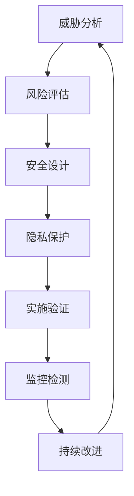

# 5.6 系统化安全与隐私保护 / Systematic Security and Privacy Protection

[返回5.技术规范与标准](./5.技术规范与标准/README.md) |  [返回Refactor总览](./5.技术规范与标准/../README.md)

---

## 目录 / Table of Contents

- [5.6 系统化安全与隐私保护](#56-系统化安全与隐私保护--systematic-security-and-privacy-protection)
- [目录 / Table of Contents](#目录--table-of-contents)
- [1. 概述 / Overview](#1-概述--overview)
- [2. 安全防护体系 / Security Protection System](#2-安全防护体系--security-protection-system)
- [3. 隐私保护机制 / Privacy Protection Mechanism](#3-隐私保护机制--privacy-protection-mechanism)
- [4. 形式化安全分析 / Formal Security Analysis](#4-形式化安全分析--formal-security-analysis)
- [5. 相关性引用 / Related References](#5-相关性引用--related-references)
- [6. 参考文献 / Bibliography](#6-参考文献--bibliography)

---

## 1. 概述 / Overview

系统化安全与隐私保护是前端技术栈中确保应用安全性、数据保护和用户隐私的核心方法论。通过科学化的安全设计、工程化的安全实践和系统化的隐私保护，建立全面的安全保证机制。

**Systematic Security and Privacy Protection is the core methodology for ensuring application security, data protection, and user privacy in frontend technology stack. Through scientific security design, engineering security practices, and systematic privacy protection, it establishes a comprehensive security assurance mechanism.**

## 1.1 核心目标 / Core Objectives

- **安全防护 / Security Protection**: 建立全面的安全防护体系
- **隐私保护 / Privacy Protection**: 构建系统化的隐私保护机制
- **合规性 / Compliance**: 确保符合相关法律法规要求
- **持续监控 / Continuous Monitoring**: 建立持续的安全监控体系

## 1.2 安全与隐私保护流程 / Security and Privacy Protection Process



---

## 2. 安全防护体系 / Security Protection System

## 2.1 多维度安全模型 / Multi-dimensional Security Model

### 2.1.1 网络安全 / Network Security

```typescript
interface NetworkSecurity {
  protocols: SecurityProtocol[];
  encryption: EncryptionConfig;
  authentication: AuthenticationConfig;
  authorization: AuthorizationConfig;
}

interface SecurityProtocol {
  type: 'https' | 'wss' | 'sftp' | 'ssh';
  version: string;
  cipherSuites: string[];
  certificate: Certificate;
}

class NetworkSecurityManager {
  configureNetworkSecurity(config: SecurityConfig): NetworkSecurity {
    const protocols = this.configureProtocols(config.protocols);
    const encryption = this.configureEncryption(config.encryption);
    const authentication = this.configureAuthentication(config.authentication);
    const authorization = this.configureAuthorization(config.authorization);
    
    return {
      protocols,
      encryption,
      authentication,
      authorization
    };
  }
  
  private configureProtocols(protocolConfigs: ProtocolConfig[]): SecurityProtocol[] {
    return protocolConfigs.map(config => ({
      type: config.type,
      version: config.version,
      cipherSuites: this.selectCipherSuites(config),
      certificate: this.generateCertificate(config)
    }));
  }
}
```

### 2.1.2 应用安全 / Application Security

```typescript
interface ApplicationSecurity {
  inputValidation: InputValidation;
  outputEncoding: OutputEncoding;
  sessionManagement: SessionManagement;
  accessControl: AccessControl;
}

interface InputValidation {
  sanitization: SanitizationRule[];
  validation: ValidationRule[];
  encoding: EncodingConfig;
}

class ApplicationSecurityManager {
  configureApplicationSecurity(config: AppSecurityConfig): ApplicationSecurity {
    const inputValidation = this.configureInputValidation(config.inputValidation);
    const outputEncoding = this.configureOutputEncoding(config.outputEncoding);
    const sessionManagement = this.configureSessionManagement(config.sessionManagement);
    const accessControl = this.configureAccessControl(config.accessControl);
    
    return {
      inputValidation,
      outputEncoding,
      sessionManagement,
      accessControl
    };
  }
  
  private configureInputValidation(config: InputValidationConfig): InputValidation {
    return {
      sanitization: this.defineSanitizationRules(config.sanitization),
      validation: this.defineValidationRules(config.validation),
      encoding: this.configureEncoding(config.encoding)
    };
  }
}
```

### 2.1.3 数据安全 / Data Security

```typescript
interface DataSecurity {
  encryption: DataEncryption;
  backup: DataBackup;
  retention: DataRetention;
  disposal: DataDisposal;
}

interface DataEncryption {
  algorithm: EncryptionAlgorithm;
  keyManagement: KeyManagement;
  atRest: AtRestEncryption;
  inTransit: InTransitEncryption;
}

class DataSecurityManager {
  configureDataSecurity(config: DataSecurityConfig): DataSecurity {
    const encryption = this.configureEncryption(config.encryption);
    const backup = this.configureBackup(config.backup);
    const retention = this.configureRetention(config.retention);
    const disposal = this.configureDisposal(config.disposal);
    
    return {
      encryption,
      backup,
      retention,
      disposal
    };
  }
}
```

## 2.2 安全防护策略 / Security Protection Strategies

### 2.2.1 威胁防护 / Threat Protection

```typescript
interface ThreatProtection {
  threats: Threat[];
  countermeasures: Countermeasure[];
  monitoring: ThreatMonitoring;
  response: ThreatResponse;
}

interface Threat {
  type: 'xss' | 'csrf' | 'sqli' | 'injection' | 'dos';
  severity: 'low' | 'medium' | 'high' | 'critical';
  description: string;
  impact: ThreatImpact;
}

class ThreatProtectionManager {
  configureThreatProtection(config: ThreatProtectionConfig): ThreatProtection {
    const threats = this.identifyThreats(config.threats);
    const countermeasures = this.defineCountermeasures(threats);
    const monitoring = this.setupMonitoring(threats);
    const response = this.setupResponse(threats);
    
    return {
      threats,
      countermeasures,
      monitoring,
      response
    };
  }
  
  private identifyThreats(threatConfigs: ThreatConfig[]): Threat[] {
    return threatConfigs.map(config => ({
      type: config.type,
      severity: this.assessSeverity(config),
      description: config.description,
      impact: this.assessImpact(config)
    }));
  }
}
```

### 2.2.2 漏洞管理 / Vulnerability Management

```typescript
interface VulnerabilityManagement {
  scanning: VulnerabilityScanning;
  assessment: VulnerabilityAssessment;
  remediation: VulnerabilityRemediation;
  tracking: VulnerabilityTracking;
}

class VulnerabilityManager {
  manageVulnerabilities(config: VulnerabilityConfig): VulnerabilityManagement {
    const scanning = this.setupScanning(config.scanning);
    const assessment = this.setupAssessment(config.assessment);
    const remediation = this.setupRemediation(config.remediation);
    const tracking = this.setupTracking(config.tracking);
    
    return {
      scanning,
      assessment,
      remediation,
      tracking
    };
  }
}
```

---

## 3. 隐私保护机制 / Privacy Protection Mechanism

## 3.1 数据隐私保护 / Data Privacy Protection

### 3.1.1 数据分类 / Data Classification

```typescript
interface DataClassification {
  categories: DataCategory[];
  sensitivity: SensitivityLevel[];
  handling: DataHandling[];
  protection: DataProtection[];
}

interface DataCategory {
  name: string;
  type: 'personal' | 'sensitive' | 'confidential' | 'public';
  sensitivity: SensitivityLevel;
  protection: ProtectionLevel;
}

class DataClassificationManager {
  classifyData(data: Data[]): DataClassification {
    const categories = this.categorizeData(data);
    const sensitivity = this.assessSensitivity(categories);
    const handling = this.defineHandling(categories);
    const protection = this.defineProtection(categories);
    
    return {
      categories,
      sensitivity,
      handling,
      protection
    };
  }
  
  private categorizeData(data: Data[]): DataCategory[] {
    return data.map(item => ({
      name: item.name,
      type: this.determineType(item),
      sensitivity: this.assessSensitivity(item),
      protection: this.determineProtection(item)
    }));
  }
}
```

### 3.1.2 数据脱敏 / Data Anonymization

```typescript
interface DataAnonymization {
  techniques: AnonymizationTechnique[];
  policies: AnonymizationPolicy[];
  implementation: AnonymizationImplementation;
  validation: AnonymizationValidation;
}

interface AnonymizationTechnique {
  type: 'masking' | 'hashing' | 'encryption' | 'generalization';
  algorithm: string;
  parameters: AnonymizationParameters;
}

class DataAnonymizationManager {
  configureAnonymization(config: AnonymizationConfig): DataAnonymization {
    const techniques = this.selectTechniques(config.techniques);
    const policies = this.definePolicies(config.policies);
    const implementation = this.implementAnonymization(techniques, policies);
    const validation = this.setupValidation(implementation);
    
    return {
      techniques,
      policies,
      implementation,
      validation
    };
  }
}
```

## 3.2 用户隐私保护 / User Privacy Protection

### 3.2.1 同意管理 / Consent Management

```typescript
interface ConsentManagement {
  collection: ConsentCollection;
  storage: ConsentStorage;
  withdrawal: ConsentWithdrawal;
  audit: ConsentAudit;
}

interface ConsentCollection {
  methods: ConsentMethod[];
  granularity: ConsentGranularity;
  transparency: TransparencyLevel;
}

class ConsentManager {
  manageConsent(config: ConsentConfig): ConsentManagement {
    const collection = this.setupCollection(config.collection);
    const storage = this.setupStorage(config.storage);
    const withdrawal = this.setupWithdrawal(config.withdrawal);
    const audit = this.setupAudit(config.audit);
    
    return {
      collection,
      storage,
      withdrawal,
      audit
    };
  }
}
```

### 3.2.2 用户权利 / User Rights

```typescript
interface UserRights {
  access: RightOfAccess;
  rectification: RightOfRectification;
  erasure: RightOfErasure;
  portability: RightOfPortability;
}

class UserRightsManager {
  manageUserRights(config: UserRightsConfig): UserRights {
    const access = this.setupAccess(config.access);
    const rectification = this.setupRectification(config.rectification);
    const erasure = this.setupErasure(config.erasure);
    const portability = this.setupPortability(config.portability);
    
    return {
      access,
      rectification,
      erasure,
      portability
    };
  }
}
```

---

## 4. 形式化安全分析 / Formal Security Analysis

## 4.1 安全模型分析 / Security Model Analysis

### 4.1.1 威胁建模 / Threat Modeling

```typescript
interface ThreatModeling {
  assets: Asset[];
  threats: Threat[];
  vulnerabilities: Vulnerability[];
  risks: Risk[];
}

interface Asset {
  name: string;
  type: 'data' | 'system' | 'service';
  value: AssetValue;
  protection: ProtectionLevel;
}

class ThreatModeler {
  modelThreats(system: System): ThreatModeling {
    const assets = this.identifyAssets(system);
    const threats = this.identifyThreats(assets);
    const vulnerabilities = this.identifyVulnerabilities(system);
    const risks = this.assessRisks(threats, vulnerabilities);
    
    return {
      assets,
      threats,
      vulnerabilities,
      risks
    };
  }
  
  private identifyAssets(system: System): Asset[] {
    return system.components.map(component => ({
      name: component.name,
      type: this.determineAssetType(component),
      value: this.assessValue(component),
      protection: this.determineProtection(component)
    }));
  }
}
```

### 4.1.2 风险评估 / Risk Assessment

```typescript
interface RiskAssessment {
  risks: Risk[];
  likelihood: LikelihoodAssessment;
  impact: ImpactAssessment;
  mitigation: RiskMitigation[];
}

interface Risk {
  id: string;
  threat: Threat;
  vulnerability: Vulnerability;
  likelihood: Likelihood;
  impact: Impact;
  severity: RiskSeverity;
}

class RiskAssessor {
  assessRisks(threats: Threat[], vulnerabilities: Vulnerability[]): RiskAssessment {
    const risks = this.identifyRisks(threats, vulnerabilities);
    const likelihood = this.assessLikelihood(risks);
    const impact = this.assessImpact(risks);
    const mitigation = this.defineMitigation(risks);
    
    return {
      risks,
      likelihood,
      impact,
      mitigation
    };
  }
}
```

## 4.2 安全验证 / Security Verification

### 4.2.1 安全测试 / Security Testing

```typescript
interface SecurityTesting {
  types: SecurityTestType[];
  tools: SecurityTestTool[];
  coverage: SecurityTestCoverage;
  reporting: SecurityTestReporting;
}

interface SecurityTestType {
  type: 'penetration' | 'vulnerability' | 'code' | 'configuration';
  scope: TestScope;
  methodology: TestMethodology;
}

class SecurityTester {
  conductSecurityTesting(config: SecurityTestConfig): SecurityTesting {
    const types = this.selectTestTypes(config.types);
    const tools = this.selectTools(types);
    const coverage = this.defineCoverage(types);
    const reporting = this.setupReporting(config.reporting);
    
    return {
      types,
      tools,
      coverage,
      reporting
    };
  }
}
```

### 4.2.2 合规性验证 / Compliance Verification

```typescript
interface ComplianceVerification {
  standards: ComplianceStandard[];
  requirements: ComplianceRequirement[];
  assessment: ComplianceAssessment;
  reporting: ComplianceReporting;
}

interface ComplianceStandard {
  name: string;
  version: string;
  requirements: ComplianceRequirement[];
  controls: ComplianceControl[];
}

class ComplianceVerifier {
  verifyCompliance(config: ComplianceConfig): ComplianceVerification {
    const standards = this.defineStandards(config.standards);
    const requirements = this.defineRequirements(standards);
    const assessment = this.conductAssessment(requirements);
    const reporting = this.setupReporting(assessment);
    
    return {
      standards,
      requirements,
      assessment,
      reporting
    };
  }
}
```

---

## 5. 相关性引用 / Related References

- [5.1 UI-UE-UX设计规范](./5.技术规范与标准/5.1 UI-UE-UX设计规范.md)
- [5.2 可访问性与国际化](./5.技术规范与标准/5.2 可访问性与国际化.md)
- [5.3 性能优化与工程实践](./5.技术规范与标准/5.3 性能优化与工程实践.md)
- [5.4 代码示例与形式化证明](./5.技术规范与标准/5.4 代码示例与形式化证明.md)
- [5.5 系统化质量评估与验证](./5.技术规范与标准/5.5 系统化质量评估与验证.md)
- [2.8 系统化工程论证与批判性分析](./2.技术栈与框架/2.8 系统化工程论证与批判性分析.md)
- [4.5 系统化架构设计与工程实践](./4.设计模式与架构/4.5 系统化架构设计与工程实践.md)
- [6.4 AI工程实践与伦理](./6.人工智能原理与算法/6.4 AI工程实践与伦理.md)

---

## 6. 参考文献 / Bibliography

1. **OWASP Foundation (2021).** *OWASP Top Ten*. OWASP Foundation.
2. **NIST (2018).** *Framework for Improving Critical Infrastructure Cybersecurity*. NIST.
3. **ISO/IEC 27001:2013.** *Information technology — Security techniques — Information security management systems — Requirements*.
4. **GDPR (2018).** *General Data Protection Regulation*. European Union.
5. **CCPA (2020).** *California Consumer Privacy Act*. State of California.
6. **Schneier, B. (2015).** *Applied Cryptography: Protocols, Algorithms, and Source Code in C*. Wiley.
7. **Stallings, W. (2017).** *Cryptography and Network Security: Principles and Practice*. Pearson.
8. **Pfleeger, C. P., & Pfleeger, S. L. (2015).** *Security in Computing*. Prentice Hall.

---

> **补充说明 / Additional Notes:**
>
> 系统化安全与隐私保护是确保前端应用安全性和用户隐私的关键环节。通过科学化的安全设计、工程化的安全实践和系统化的隐私保护，建立全面的安全保证机制，为用户提供安全可靠的应用环境。
>
> **Systematic Security and Privacy Protection is a key component for ensuring frontend application security and user privacy. Through scientific security design, engineering security practices, and systematic privacy protection, it establishes a comprehensive security assurance mechanism, providing users with a secure and reliable application environment.**
