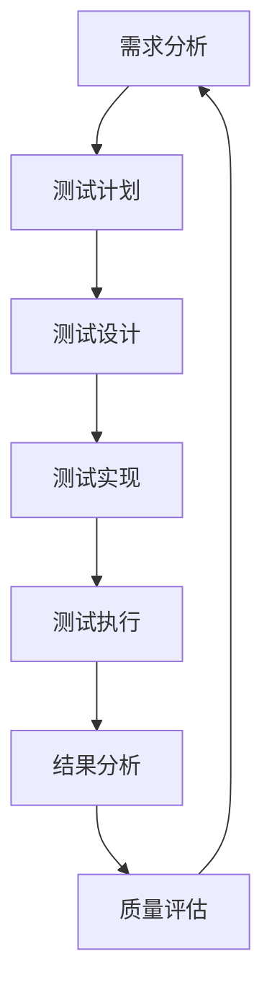

# 5.7 系统化前端测试与质量保证 / Systematic Frontend Testing and Quality Assurance

[返回5.技术规范与标准](./5.技术规范与标准/README.md) |  [返回Refactor总览](./5.技术规范与标准/../README.md)

---

## 目录 / Table of Contents

- [5.7 系统化前端测试与质量保证](#57-系统化前端测试与质量保证--systematic-frontend-testing-and-quality-assurance)
- [目录 / Table of Contents](#目录--table-of-contents)
- [1. 概述 / Overview](#1-概述--overview)
- [2. 前端测试理论 / Frontend Testing Theory](#2-前端测试理论--frontend-testing-theory)
- [3. 质量保证体系 / Quality Assurance System](#3-质量保证体系--quality-assurance-system)
- [4. 形式化测试分析 / Formal Testing Analysis](#4-形式化测试分析--formal-testing-analysis)
- [5. 相关性引用 / Related References](#5-相关性引用--related-references)
- [6. 参考文献 / Bibliography](#6-参考文献--bibliography)

---

## 1. 概述 / Overview

系统化前端测试与质量保证是前端技术栈中确保代码质量、功能可靠性和用户体验稳定性的核心方法论。通过科学化的测试理论、工程化的测试实践和系统化的质量保证，建立全面的前端测试保证机制。

**Systematic Frontend Testing and Quality Assurance is the core methodology for ensuring code quality, functional reliability, and user experience stability in frontend technology stack. Through scientific testing theory, engineering testing practices, and systematic quality assurance, it establishes a comprehensive frontend testing assurance mechanism.**

## 1.1 核心目标 / Core Objectives

- **测试理论 / Testing Theory**: 建立科学的前端测试理论基础
- **质量保证 / Quality Assurance**: 构建系统化的质量保证实践体系
- **评估体系 / Evaluation System**: 建立全面的测试评估体系
- **持续改进 / Continuous Improvement**: 实现测试的持续改进和优化

## 1.2 前端测试流程 / Frontend Testing Process



---

## 2. 前端测试理论 / Frontend Testing Theory

## 2.1 多维度测试模型 / Multi-dimensional Testing Model

### 2.1.1 单元测试 / Unit Testing

```typescript
interface UnitTesting {
  components: ComponentTest[];
  functions: FunctionTest[];
  utilities: UtilityTest[];
  coverage: TestCoverage;
}

interface ComponentTest {
  component: Component;
  props: PropsTest;
  state: StateTest;
  events: EventTest;
  rendering: RenderingTest;
}

class UnitTestEngineer {
  designUnitTests(requirements: Requirements): UnitTesting {
    const components = this.testComponents(requirements);
    const functions = this.testFunctions(requirements);
    const utilities = this.testUtilities(requirements);
    const coverage = this.measureCoverage(requirements);
    
    return {
      components,
      functions,
      utilities,
      coverage
    };
  }
  
  private testComponents(requirements: Requirements): ComponentTest[] {
    return requirements.components.map(component => ({
      component,
      props: this.testProps(component),
      state: this.testState(component),
      events: this.testEvents(component),
      rendering: this.testRendering(component)
    }));
  }
}
```

### 2.1.2 集成测试 / Integration Testing

```typescript
interface IntegrationTesting {
  modules: ModuleIntegrationTest[];
  services: ServiceIntegrationTest[];
  apis: APIIntegrationTest[];
  workflows: WorkflowIntegrationTest[];
}

interface ModuleIntegrationTest {
  modules: Module[];
  interactions: ModuleInteraction[];
  dataFlow: DataFlowTest;
  errorHandling: ErrorHandlingTest;
}

class IntegrationTestEngineer {
  designIntegrationTests(requirements: Requirements): IntegrationTesting {
    const modules = this.testModuleIntegration(requirements);
    const services = this.testServiceIntegration(requirements);
    const apis = this.testAPIIntegration(requirements);
    const workflows = this.testWorkflowIntegration(requirements);
    
    return {
      modules,
      services,
      apis,
      workflows
    };
  }
}
```

### 2.1.3 端到端测试 / End-to-End Testing

```typescript
interface EndToEndTesting {
  scenarios: TestScenario[];
  userFlows: UserFlowTest[];
  crossBrowser: CrossBrowserTest[];
  performance: PerformanceTest[];
}

interface TestScenario {
  name: string;
  steps: TestStep[];
  assertions: Assertion[];
  data: TestData;
}

class E2ETestEngineer {
  designE2ETests(requirements: Requirements): EndToEndTesting {
    const scenarios = this.defineScenarios(requirements);
    const userFlows = this.testUserFlows(requirements);
    const crossBrowser = this.testCrossBrowser(requirements);
    const performance = this.testPerformance(requirements);
    
    return {
      scenarios,
      userFlows,
      crossBrowser,
      performance
    };
  }
}
```

## 2.2 测试设计原则 / Testing Design Principles

### 2.2.1 测试金字塔原则 / Testing Pyramid Principles

```typescript
interface TestingPyramid {
  unit: UnitTestLayer;
  integration: IntegrationTestLayer;
  e2e: E2ETestLayer;
  distribution: TestDistribution;
}

interface UnitTestLayer {
  count: number;
  speed: TestSpeed;
  cost: TestCost;
  coverage: CoverageLevel;
}

class TestingPyramidDesigner {
  designTestingPyramid(requirements: Requirements): TestingPyramid {
    const unit = this.designUnitLayer(requirements);
    const integration = this.designIntegrationLayer(requirements);
    const e2e = this.designE2ELayer(requirements);
    const distribution = this.defineDistribution(unit, integration, e2e);
    
    return {
      unit,
      integration,
      e2e,
      distribution
    };
  }
  
  private designUnitLayer(requirements: Requirements): UnitTestLayer {
    return {
      count: this.calculateUnitTestCount(requirements),
      speed: this.defineUnitTestSpeed(requirements),
      cost: this.calculateUnitTestCost(requirements),
      coverage: this.defineUnitTestCoverage(requirements)
    };
  }
}
```

### 2.2.2 测试驱动开发原则 / Test-Driven Development Principles

```typescript
interface TDDPrinciples {
  red: RedPhase;
  green: GreenPhase;
  refactor: RefactorPhase;
  cycle: TDDCycle;
}

interface RedPhase {
  failingTest: Test;
  requirements: Requirements;
  acceptance: AcceptanceCriteria;
}

class TDDEngineer {
  applyTDDPrinciples(requirements: Requirements): TDDPrinciples {
    const red = this.implementRedPhase(requirements);
    const green = this.implementGreenPhase(red);
    const refactor = this.implementRefactorPhase(green);
    const cycle = this.defineTDDCycle(red, green, refactor);
    
    return {
      red,
      green,
      refactor,
      cycle
    };
  }
}
```

---

## 3. 质量保证体系 / Quality Assurance System

## 3.1 自动化测试工程 / Automated Testing Engineering

### 3.1.1 测试自动化 / Test Automation

```typescript
interface TestAutomation {
  framework: TestingFramework;
  runners: TestRunner[];
  reporters: TestReporter[];
  ci: CIIntegration;
}

interface TestingFramework {
  name: string;
  type: 'unit' | 'integration' | 'e2e';
  configuration: FrameworkConfig;
  plugins: Plugin[];
}

class TestAutomationEngineer {
  buildTestAutomation(requirements: Requirements): TestAutomation {
    const framework = this.selectFramework(requirements);
    const runners = this.setupRunners(framework);
    const reporters = this.setupReporters(framework);
    const ci = this.integrateCI(framework);
    
    return {
      framework,
      runners,
      reporters,
      ci
    };
  }
  
  private selectFramework(requirements: Requirements): TestingFramework {
    return {
      name: this.chooseFrameworkName(requirements),
      type: this.defineFrameworkType(requirements),
      configuration: this.configureFramework(requirements),
      plugins: this.selectPlugins(requirements)
    };
  }
}
```

### 3.1.2 持续测试 / Continuous Testing

```typescript
interface ContinuousTesting {
  pipeline: TestPipeline;
  triggers: TestTrigger[];
  monitoring: TestMonitoring;
  feedback: TestFeedback;
}

interface TestPipeline {
  stages: TestStage[];
  parallelization: ParallelizationConfig;
  optimization: OptimizationConfig;
}

class ContinuousTestingEngineer {
  buildContinuousTesting(requirements: Requirements): ContinuousTesting {
    const pipeline = this.buildPipeline(requirements);
    const triggers = this.defineTriggers(requirements);
    const monitoring = this.setupMonitoring(requirements);
    const feedback = this.setupFeedback(requirements);
    
    return {
      pipeline,
      triggers,
      monitoring,
      feedback
    };
  }
}
```

## 3.2 质量监控工程 / Quality Monitoring Engineering

### 3.2.1 测试质量监控 / Test Quality Monitoring

```typescript
interface TestQualityMonitoring {
  metrics: QualityMetric[];
  alerts: QualityAlert[];
  dashboards: QualityDashboard[];
  reports: QualityReport[];
}

interface QualityMetric {
  name: string;
  value: number;
  threshold: number;
  trend: TrendAnalysis;
}

class QualityMonitoringEngineer {
  buildQualityMonitoring(requirements: Requirements): TestQualityMonitoring {
    const metrics = this.defineMetrics(requirements);
    const alerts = this.setupAlerts(metrics);
    const dashboards = this.buildDashboards(metrics);
    const reports = this.generateReports(metrics);
    
    return {
      metrics,
      alerts,
      dashboards,
      reports
    };
  }
  
  private defineMetrics(requirements: Requirements): QualityMetric[] {
    return [
      this.defineCoverageMetric(requirements),
      this.definePassRateMetric(requirements),
      this.definePerformanceMetric(requirements),
      this.defineReliabilityMetric(requirements)
    ];
  }
}
```

### 3.2.2 缺陷管理 / Defect Management

```typescript
interface DefectManagement {
  tracking: DefectTracking;
  analysis: DefectAnalysis;
  resolution: DefectResolution;
  prevention: DefectPrevention;
}

interface DefectTracking {
  defects: Defect[];
  status: DefectStatus[];
  priority: DefectPriority[];
  assignment: DefectAssignment;
}

class DefectManagementEngineer {
  buildDefectManagement(requirements: Requirements): DefectManagement {
    const tracking = this.setupTracking(requirements);
    const analysis = this.setupAnalysis(requirements);
    const resolution = this.setupResolution(requirements);
    const prevention = this.setupPrevention(requirements);
    
    return {
      tracking,
      analysis,
      resolution,
      prevention
    };
  }
}
```

---

## 4. 形式化测试分析 / Formal Testing Analysis

## 4.1 测试理论分析 / Testing Theory Analysis

### 4.1.1 测试完备性分析 / Testing Completeness Analysis

```typescript
interface TestingCompletenessAnalysis {
  coverage: CoverageAnalysis;
  gaps: GapAnalysis;
  risks: RiskAnalysis;
  recommendations: Recommendation[];
}

interface CoverageAnalysis {
  codeCoverage: CodeCoverage;
  branchCoverage: BranchCoverage;
  pathCoverage: PathCoverage;
  mutationCoverage: MutationCoverage;
}

class TestingCompletenessAnalyzer {
  analyzeCompleteness(testing: Testing): TestingCompletenessAnalysis {
    const coverage = this.analyzeCoverage(testing);
    const gaps = this.identifyGaps(testing);
    const risks = this.analyzeRisks(testing);
    const recommendations = this.makeRecommendations(coverage, gaps, risks);
    
    return {
      coverage,
      gaps,
      risks,
      recommendations
    };
  }
  
  private analyzeCoverage(testing: Testing): CoverageAnalysis {
    return {
      codeCoverage: this.measureCodeCoverage(testing),
      branchCoverage: this.measureBranchCoverage(testing),
      pathCoverage: this.measurePathCoverage(testing),
      mutationCoverage: this.measureMutationCoverage(testing)
    };
  }
}
```

### 4.1.2 测试有效性分析 / Testing Effectiveness Analysis

```typescript
interface TestingEffectivenessAnalysis {
  efficiency: EfficiencyAnalysis;
  accuracy: AccuracyAnalysis;
  reliability: ReliabilityAnalysis;
  maintainability: MaintainabilityAnalysis;
}

class TestingEffectivenessAnalyzer {
  analyzeEffectiveness(testing: Testing): TestingEffectivenessAnalysis {
    const efficiency = this.analyzeEfficiency(testing);
    const accuracy = this.analyzeAccuracy(testing);
    const reliability = this.analyzeReliability(testing);
    const maintainability = this.analyzeMaintainability(testing);
    
    return {
      efficiency,
      accuracy,
      reliability,
      maintainability
    };
  }
}
```

## 4.2 测试验证 / Testing Verification

### 4.2.1 测试正确性验证 / Testing Correctness Verification

```typescript
interface TestingCorrectnessVerification {
  logic: LogicVerification;
  assertions: AssertionVerification;
  oracles: OracleVerification;
  consistency: ConsistencyVerification;
}

class TestingCorrectnessVerifier {
  verifyCorrectness(testing: Testing): TestingCorrectnessVerification {
    const logic = this.verifyLogic(testing);
    const assertions = this.verifyAssertions(testing);
    const oracles = this.verifyOracles(testing);
    const consistency = this.verifyConsistency(testing);
    
    return {
      logic,
      assertions,
      oracles,
      consistency
    };
  }
}
```

### 4.2.2 测试性能验证 / Testing Performance Verification

```typescript
interface TestingPerformanceVerification {
  speed: SpeedVerification;
  resource: ResourceVerification;
  scalability: ScalabilityVerification;
  stability: StabilityVerification;
}

class TestingPerformanceVerifier {
  verifyPerformance(testing: Testing): TestingPerformanceVerification {
    const speed = this.verifySpeed(testing);
    const resource = this.verifyResource(testing);
    const scalability = this.verifyScalability(testing);
    const stability = this.verifyStability(testing);
    
    return {
      speed,
      resource,
      scalability,
      stability
    };
  }
}
```

---

## 5. 相关性引用 / Related References

- [5.3 性能优化与工程实践](./5.技术规范与标准/5.3 性能优化与工程实践.md)
- [5.4 代码示例与形式化证明](./5.技术规范与标准/5.4 代码示例与形式化证明.md)
- [5.5 系统化质量评估与验证](./5.技术规范与标准/5.5 系统化质量评估与验证.md)
- [5.6 系统化安全与隐私保护](./5.技术规范与标准/5.6 系统化安全与隐私保护.md)
- [2.8 系统化工程论证与批判性分析](./2.技术栈与框架/2.8 系统化工程论证与批判性分析.md)
- [2.10 系统化前端工程化与DevOps实践](./2.技术栈与框架/2.10 系统化前端工程化与DevOps实践.md)
- [4.6 系统化设计模式与工程实践](./4.设计模式与架构/4.6 系统化设计模式与工程实践.md)
- [6.9 系统化AI应用与工程实践](./6.人工智能原理与算法/6.9 系统化AI应用与工程实践.md)

---

## 6. 参考文献 / Bibliography

1. **Beck, K. (2002).** *Test Driven Development: By Example*. Addison-Wesley.
2. **Martin, R. C. (2008).** *Clean Code: A Handbook of Agile Software Craftsmanship*. Prentice Hall.
3. **Fowler, M. (2018).** *Refactoring: Improving the Design of Existing Code*. Addison-Wesley.
4. **Crispin, L., & Gregory, J. (2009).** *Agile Testing: A Practical Guide for Testers and Agile Teams*. Addison-Wesley.
5. **Hendrickson, E. (2013).** *Explore It!: Reduce Risk and Increase Confidence with Exploratory Testing*. Pragmatic Bookshelf.
6. **Pettichord, B. (2004).** *Homebrew Test Automation*. ThoughtWorks.
7. **Kaner, C., Bach, J., & Pettichord, B. (2001).** *Lessons Learned in Software Testing: A Context-Driven Approach*. Wiley.
8. **Myers, G. J., Sandler, C., & Badgett, T. (2011).** *The Art of Software Testing*. Wiley.

---

> **补充说明 / Additional Notes:**
>
> 系统化前端测试与质量保证是确保代码质量、功能可靠性和用户体验稳定性的关键环节。通过科学化的测试理论、工程化的测试实践和系统化的质量保证，建立全面的前端测试保证机制，为前端发展提供可靠的测试基础。
>
> **Systematic Frontend Testing and Quality Assurance is a key component for ensuring code quality, functional reliability, and user experience stability. Through scientific testing theory, engineering testing practices, and systematic quality assurance, it establishes a comprehensive frontend testing assurance mechanism, providing a reliable testing foundation for frontend development.**
