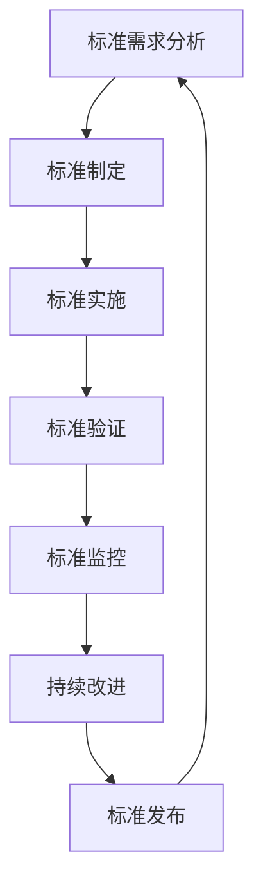

# 5.8 系统化技术标准与工程实践 / Systematic Technical Standards and Engineering Practice

[返回5.技术规范与标准](./5.技术规范与标准/README.md) |  [返回Refactor总览](./5.技术规范与标准/../README.md)

---

## 目录 / Table of Contents

- [5.8 系统化技术标准与工程实践](#58-系统化技术标准与工程实践--systematic-technical-standards-and-engineering-practice)
- [目录 / Table of Contents](#目录--table-of-contents)
- [1. 概述 / Overview](#1-概述--overview)
- [2. 技术标准理论 / Technical Standards Theory](#2-技术标准理论--technical-standards-theory)
- [3. 工程实践体系 / Engineering Practice System](#3-工程实践体系--engineering-practice-system)
- [4. 形式化标准分析 / Formal Standards Analysis](#4-形式化标准分析--formal-standards-analysis)
- [5. 相关性引用 / Related References](#5-相关性引用--related-references)
- [6. 参考文献 / Bibliography](#6-参考文献--bibliography)

---

## 1. 概述 / Overview

系统化技术标准与工程实践是前端技术栈中确保技术标准制定、实施和持续改进的核心方法论。通过科学化的标准理论、工程化的实践体系和系统化的标准管理，建立全面的技术标准保证机制。

**Systematic Technical Standards and Engineering Practice is the core methodology for ensuring technical standards development, implementation, and continuous improvement in frontend technology stack. Through scientific standards theory, engineering practice system, and systematic standards management, it establishes a comprehensive technical standards assurance mechanism.**

## 1.1 核心目标 / Core Objectives

- **标准理论 / Standards Theory**: 建立科学的技术标准理论基础
- **标准管理 / Standards Management**: 构建系统化的技术标准管理实践体系
- **评估体系 / Evaluation System**: 建立全面的标准评估体系
- **持续改进 / Continuous Improvement**: 实现技术标准的持续改进和优化

## 1.2 技术标准流程 / Technical Standards Process



---

## 2. 技术标准理论 / Technical Standards Theory

## 2.1 多维度标准模型 / Multi-dimensional Standards Model

### 2.1.1 标准制定工程 / Standards Development Engineering

```typescript
interface StandardsDevelopmentEngineering {
  requirements: StandardsRequirements;
  design: StandardsDesign;
  implementation: StandardsImplementation;
  validation: StandardsValidation;
}

interface StandardsRequirements {
  functional: FunctionalRequirements;
  nonFunctional: NonFunctionalRequirements;
  constraints: ConstraintsAnalysis;
  stakeholders: StakeholderAnalysis;
}

class StandardsDevelopmentEngineer {
  designStandards(requirements: Requirements): StandardsDevelopmentEngineering {
    const requirements = this.designRequirements(requirements);
    const design = this.designStandardsDesign(requirements);
    const implementation = this.designImplementation(requirements);
    const validation = this.designValidation(requirements);
    
    return {
      requirements,
      design,
      implementation,
      validation
    };
  }
  
  private designRequirements(requirements: Requirements): StandardsRequirements {
    return {
      functional: this.defineFunctionalRequirements(requirements),
      nonFunctional: this.defineNonFunctionalRequirements(requirements),
      constraints: this.analyzeConstraints(requirements),
      stakeholders: this.analyzeStakeholders(requirements)
    };
  }
}
```

### 2.1.2 标准实施工程 / Standards Implementation Engineering

```typescript
interface StandardsImplementationEngineering {
  strategy: ImplementationStrategy;
  roadmap: ImplementationRoadmap;
  training: TrainingProgram;
  monitoring: ImplementationMonitoring;
}

interface ImplementationStrategy {
  approach: ImplementationApproach;
  phases: ImplementationPhases;
  resources: ResourceAllocation;
  risks: RiskManagement;
}

class StandardsImplementationEngineer {
  buildImplementation(requirements: Requirements): StandardsImplementationEngineering {
    const strategy = this.buildStrategy(requirements);
    const roadmap = this.buildRoadmap(requirements);
    const training = this.buildTraining(requirements);
    const monitoring = this.buildMonitoring(requirements);
    
    return {
      strategy,
      roadmap,
      training,
      monitoring
    };
  }
  
  private buildStrategy(requirements: Requirements): ImplementationStrategy {
    return {
      approach: this.selectApproach(requirements),
      phases: this.definePhases(requirements),
      resources: this.allocateResources(requirements),
      risks: this.manageRisks(requirements)
    };
  }
}
```

### 2.1.3 标准管理工程 / Standards Management Engineering

```typescript
interface StandardsManagementEngineering {
  governance: StandardsGovernance;
  communication: CommunicationStrategy;
  documentation: DocumentationStrategy;
  compliance: ComplianceManagement;
}

interface StandardsGovernance {
  roles: RoleDefinition[];
  processes: ProcessDefinition[];
  policies: PolicyDefinition[];
  metrics: MetricDefinition[];
}

class StandardsManagementEngineer {
  buildManagementSystem(requirements: Requirements): StandardsManagementEngineering {
    const governance = this.buildGovernance(requirements);
    const communication = this.buildCommunication(requirements);
    const documentation = this.buildDocumentation(requirements);
    const compliance = this.buildCompliance(requirements);
    
    return {
      governance,
      communication,
      documentation,
      compliance
    };
  }
  
  private buildGovernance(requirements: Requirements): StandardsGovernance {
    return {
      roles: this.defineRoles(requirements),
      processes: this.defineProcesses(requirements),
      policies: this.definePolicies(requirements),
      metrics: this.defineMetrics(requirements)
    };
  }
}
```

## 2.2 标准设计原则 / Standards Design Principles

### 2.2.1 标准制定原则 / Standards Development Principles

```typescript
interface StandardsDevelopmentPrinciples {
  clarity: ClarityPrinciple;
  consistency: ConsistencyPrinciple;
  completeness: CompletenessPrinciple;
  maintainability: MaintainabilityPrinciple;
}

interface ClarityPrinciple {
  language: LanguageClarity;
  structure: StructureClarity;
  examples: ExampleClarity;
  documentation: DocumentationClarity;
}

class StandardsDevelopmentDesigner {
  applyDevelopmentPrinciples(requirements: Requirements): StandardsDevelopmentPrinciples {
    const clarity = this.applyClarity(requirements);
    const consistency = this.applyConsistency(requirements);
    const completeness = this.applyCompleteness(requirements);
    const maintainability = this.applyMaintainability(requirements);
    
    return {
      clarity,
      consistency,
      completeness,
      maintainability
    };
  }
}
```

### 2.2.2 标准实施原则 / Standards Implementation Principles

```typescript
interface StandardsImplementationPrinciples {
  adoption: AdoptionPrinciple;
  enforcement: EnforcementPrinciple;
  flexibility: FlexibilityPrinciple;
  evolution: EvolutionPrinciple;
}

class StandardsImplementationDesigner {
  applyImplementationPrinciples(requirements: Requirements): StandardsImplementationPrinciples {
    const adoption = this.applyAdoption(requirements);
    const enforcement = this.applyEnforcement(requirements);
    const flexibility = this.applyFlexibility(requirements);
    const evolution = this.applyEvolution(requirements);
    
    return {
      adoption,
      enforcement,
      flexibility,
      evolution
    };
  }
}
```

---

## 3. 工程实践体系 / Engineering Practice System

## 3.1 标准制定工具链 / Standards Development Toolchain

### 3.1.1 需求分析工具 / Requirements Analysis Tools

```typescript
interface RequirementsAnalysisTools {
  gathering: RequirementsGathering;
  analysis: RequirementsAnalysis;
  validation: RequirementsValidation;
  documentation: RequirementsDocumentation;
}

interface RequirementsGathering {
  interviews: InterviewTools;
  surveys: SurveyTools;
  workshops: WorkshopTools;
  observation: ObservationTools;
}

class RequirementsAnalysisEngineer {
  buildAnalysisTools(requirements: Requirements): RequirementsAnalysisTools {
    const gathering = this.buildGathering(requirements);
    const analysis = this.buildAnalysis(requirements);
    const validation = this.buildValidation(requirements);
    const documentation = this.buildDocumentation(requirements);
    
    return {
      gathering,
      analysis,
      validation,
      documentation
    };
  }
  
  private buildGathering(requirements: Requirements): RequirementsGathering {
    return {
      interviews: this.buildInterviewTools(requirements),
      surveys: this.buildSurveyTools(requirements),
      workshops: this.buildWorkshopTools(requirements),
      observation: this.buildObservationTools(requirements)
    };
  }
}
```

### 3.1.2 标准设计工具 / Standards Design Tools

```typescript
interface StandardsDesignTools {
  modeling: StandardsModeling;
  validation: DesignValidation;
  review: DesignReview;
  collaboration: DesignCollaboration;
}

interface StandardsModeling {
  structure: StructureModeling;
  behavior: BehaviorModeling;
  relationships: RelationshipModeling;
  constraints: ConstraintModeling;
}

class StandardsDesignEngineer {
  buildDesignTools(requirements: Requirements): StandardsDesignTools {
    const modeling = this.buildModeling(requirements);
    const validation = this.buildValidation(requirements);
    const review = this.buildReview(requirements);
    const collaboration = this.buildCollaboration(requirements);
    
    return {
      modeling,
      validation,
      review,
      collaboration
    };
  }
}
```

### 3.1.3 标准验证工具 / Standards Validation Tools

```typescript
interface StandardsValidationTools {
  testing: StandardsTesting;
  review: StandardsReview;
  compliance: ComplianceTesting;
  feedback: FeedbackCollection;
}

interface StandardsTesting {
  unit: UnitTesting;
  integration: IntegrationTesting;
  system: SystemTesting;
  acceptance: AcceptanceTesting;
}

class StandardsValidationEngineer {
  buildValidationTools(requirements: Requirements): StandardsValidationTools {
    const testing = this.buildTesting(requirements);
    const review = this.buildReview(requirements);
    const compliance = this.buildCompliance(requirements);
    const feedback = this.buildFeedback(requirements);
    
    return {
      testing,
      review,
      compliance,
      feedback
    };
  }
}
```

## 3.2 标准实施工具链 / Standards Implementation Toolchain

### 3.2.1 实施管理工具 / Implementation Management Tools

```typescript
interface ImplementationManagementTools {
  planning: ImplementationPlanning;
  tracking: ImplementationTracking;
  reporting: ImplementationReporting;
  automation: ImplementationAutomation;
}

interface ImplementationPlanning {
  schedule: SchedulePlanning;
  resources: ResourcePlanning;
  risks: RiskPlanning;
  milestones: MilestonePlanning;
}

class ImplementationManagementEngineer {
  buildManagementTools(requirements: Requirements): ImplementationManagementTools {
    const planning = this.buildPlanning(requirements);
    const tracking = this.buildTracking(requirements);
    const reporting = this.buildReporting(requirements);
    const automation = this.buildAutomation(requirements);
    
    return {
      planning,
      tracking,
      reporting,
      automation
    };
  }
}
```

### 3.2.2 合规性工具 / Compliance Tools

```typescript
interface ComplianceTools {
  monitoring: ComplianceMonitoring;
  auditing: ComplianceAuditing;
  reporting: ComplianceReporting;
  remediation: ComplianceRemediation;
}

interface ComplianceMonitoring {
  realTime: RealTimeMonitoring;
  periodic: PeriodicMonitoring;
  alerts: ComplianceAlerts;
  dashboards: ComplianceDashboards;
}

class ComplianceEngineer {
  buildComplianceTools(requirements: Requirements): ComplianceTools {
    const monitoring = this.buildMonitoring(requirements);
    const auditing = this.buildAuditing(requirements);
    const reporting = this.buildReporting(requirements);
    const remediation = this.buildRemediation(requirements);
    
    return {
      monitoring,
      auditing,
      reporting,
      remediation
    };
  }
}
```

---

## 4. 形式化标准分析 / Formal Standards Analysis

## 4.1 标准理论分析 / Standards Theory Analysis

### 4.1.1 技术标准完备性分析 / Technical Standards Completeness Analysis

```typescript
interface TechnicalStandardsCompletenessAnalysis {
  requirements: RequirementsCompleteness;
  design: DesignCompleteness;
  implementation: ImplementationCompleteness;
  validation: ValidationCompleteness;
}

interface RequirementsCompleteness {
  functional: FunctionalCompleteness;
  nonFunctional: NonFunctionalCompleteness;
  constraints: ConstraintsCompleteness;
  stakeholders: StakeholdersCompleteness;
}

class TechnicalStandardsCompletenessAnalyzer {
  analyzeCompleteness(standards: TechnicalStandards): TechnicalStandardsCompletenessAnalysis {
    const requirements = this.analyzeRequirementsCompleteness(standards);
    const design = this.analyzeDesignCompleteness(standards);
    const implementation = this.analyzeImplementationCompleteness(standards);
    const validation = this.analyzeValidationCompleteness(standards);
    
    return {
      requirements,
      design,
      implementation,
      validation
    };
  }
  
  private analyzeRequirementsCompleteness(standards: TechnicalStandards): RequirementsCompleteness {
    return {
      functional: this.analyzeFunctionalCompleteness(standards),
      nonFunctional: this.analyzeNonFunctionalCompleteness(standards),
      constraints: this.analyzeConstraintsCompleteness(standards),
      stakeholders: this.analyzeStakeholdersCompleteness(standards)
    };
  }
}
```

### 4.1.2 标准实施有效性分析 / Standards Implementation Effectiveness Analysis

```typescript
interface StandardsImplementationEffectivenessAnalysis {
  efficiency: ImplementationEfficiencyAnalysis;
  reliability: ImplementationReliabilityAnalysis;
  usability: ImplementationUsabilityAnalysis;
  maintainability: ImplementationMaintainabilityAnalysis;
}

class StandardsImplementationEffectivenessAnalyzer {
  analyzeEffectiveness(implementation: StandardsImplementation): StandardsImplementationEffectivenessAnalysis {
    const efficiency = this.analyzeEfficiency(implementation);
    const reliability = this.analyzeReliability(implementation);
    const usability = this.analyzeUsability(implementation);
    const maintainability = this.analyzeMaintainability(implementation);
    
    return {
      efficiency,
      reliability,
      usability,
      maintainability
    };
  }
}
```

## 4.2 标准验证 / Standards Verification

### 4.2.1 技术标准正确性验证 / Technical Standards Correctness Verification

```typescript
interface TechnicalStandardsCorrectnessVerification {
  requirements: RequirementsCorrectnessVerification;
  design: DesignCorrectnessVerification;
  implementation: ImplementationCorrectnessVerification;
  validation: ValidationCorrectnessVerification;
}

class TechnicalStandardsCorrectnessVerifier {
  verifyCorrectness(standards: TechnicalStandards): TechnicalStandardsCorrectnessVerification {
    const requirements = this.verifyRequirementsCorrectness(standards);
    const design = this.verifyDesignCorrectness(standards);
    const implementation = this.verifyImplementationCorrectness(standards);
    const validation = this.verifyValidationCorrectness(standards);
    
    return {
      requirements,
      design,
      implementation,
      validation
    };
  }
}
```

### 4.2.2 标准性能验证 / Standards Performance Verification

```typescript
interface StandardsPerformanceVerification {
  speed: SpeedVerification;
  resource: ResourceVerification;
  scalability: ScalabilityVerification;
  stability: StabilityVerification;
}

class StandardsPerformanceVerifier {
  verifyPerformance(standards: TechnicalStandards): StandardsPerformanceVerification {
    const speed = this.verifySpeed(standards);
    const resource = this.verifyResource(standards);
    const scalability = this.verifyScalability(standards);
    const stability = this.verifyStability(standards);
    
    return {
      speed,
      resource,
      scalability,
      stability
    };
  }
}
```

---

## 5. 相关性引用 / Related References

- [5.1 UI-UE-UX设计规范](./5.技术规范与标准/5.1 UI-UE-UX设计规范.md)
- [5.2 可访问性与国际化](./5.技术规范与标准/5.2 可访问性与国际化.md)
- [5.3 性能优化与工程实践](./5.技术规范与标准/5.3 性能优化与工程实践.md)
- [5.4 代码示例与形式化证明](./5.技术规范与标准/5.4 代码示例与形式化证明.md)
- [5.5 系统化质量评估与验证](./5.技术规范与标准/5.5 系统化质量评估与验证.md)
- [5.6 系统化安全与隐私保护](./5.技术规范与标准/5.6 系统化安全与隐私保护.md)
- [5.7 系统化前端测试与质量保证](./5.技术规范与标准/5.7 系统化前端测试与质量保证.md)
- [2.8 系统化工程论证与批判性分析](./2.技术栈与框架/2.8 系统化工程论证与批判性分析.md)
- [2.10 系统化前端工程化与DevOps实践](./2.技术栈与框架/2.10 系统化前端工程化与DevOps实践.md)
- [4.5 系统化架构设计与工程实践](./4.设计模式与架构/4.5 系统化架构设计与工程实践.md)
- [4.6 系统化设计模式与工程实践](./4.设计模式与架构/4.6 系统化设计模式与工程实践.md)
- [4.7 系统化架构演进与工程实践](./4.设计模式与架构/4.7 系统化架构演进与工程实践.md)
- [3.7 系统化编程语言理论与工程实践](./3.编程语言范式/3.7 系统化编程语言理论与工程实践.md)
- [3.8 系统化编程语言工程实践与工具链](./3.编程语言范式/3.8 系统化编程语言工程实践与工具链.md)
- [6.10 系统化AI理论与工程实践](./6.人工智能原理与算法/6.10 系统化AI理论与工程实践.md)
- [6.12 系统化AI工程实践与工具链](./6.人工智能原理与算法/6.12 系统化AI工程实践与工具链.md)

---

## 6. 参考文献 / Bibliography

1. **ISO/IEC 25010:2011.** *Systems and software engineering — Systems and software Quality Requirements and Evaluation (SQuaRE) — System and software quality models*. International Organization for Standardization.
2. **IEEE Std 1012-2016.** *IEEE Standard for System, Software, and Hardware Verification and Validation*. IEEE.
3. **ISO/IEC 12207:2017.** *Systems and software engineering — Software life cycle processes*. International Organization for Standardization.
4. **IEEE Std 830-1998.** *IEEE Recommended Practice for Software Requirements Specifications*. IEEE.
5. **ISO/IEC 15504:2004.** *Information technology — Process assessment*. International Organization for Standardization.
6. **IEEE Std 1471-2000.** *IEEE Recommended Practice for Architectural Description of Software-Intensive Systems*. IEEE.
7. **ISO/IEC 27001:2013.** *Information technology — Security techniques — Information security management systems — Requirements*. International Organization for Standardization.
8. **IEEE Std 1061-1998.** *IEEE Standard for a Software Quality Metrics Methodology*. IEEE.

---

> **补充说明 / Additional Notes:**
>
> 系统化技术标准与工程实践是确保技术标准制定、实施和持续改进的关键环节。通过科学化的标准理论、工程化的实践体系和系统化的标准管理，建立全面的技术标准保证机制，为技术发展提供可靠的工程基础。
>
> **Systematic Technical Standards and Engineering Practice is a key component for ensuring technical standards development, implementation, and continuous improvement. Through scientific standards theory, engineering practice system, and systematic standards management, it establishes a comprehensive technical standards assurance mechanism, providing a reliable engineering foundation for technical development.**
