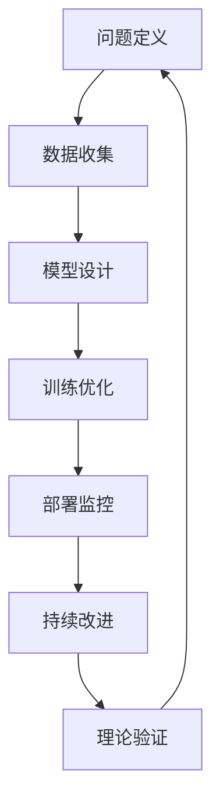

# 6.10 系统化AI理论与工程实践 / Systematic AI Theory and Engineering Practice

[返回6.人工智能原理与算法](./6.人工智能原理与算法/README.md) |  [返回Refactor总览](./6.人工智能原理与算法/../README.md)

---

## 目录 / Table of Contents

- [6.10 系统化AI理论与工程实践](#610-系统化ai理论与工程实践--systematic-ai-theory-and-engineering-practice)
- [目录 / Table of Contents](#目录--table-of-contents)
- [1. 概述 / Overview](#1-概述--overview)
- [2. AI理论基础 / AI Theoretical Foundation](#2-ai理论基础--ai-theoretical-foundation)
- [3. 工程实践体系 / Engineering Practice System](#3-工程实践体系--engineering-practice-system)
- [4. 形式化AI分析 / Formal AI Analysis](#4-形式化ai分析--formal-ai-analysis)
- [5. 相关性引用 / Related References](#5-相关性引用--related-references)
- [6. 参考文献 / Bibliography](#6-参考文献--bibliography)

---

## 1. 概述 / Overview

系统化AI理论与工程实践是前端技术栈中确保AI系统设计科学性、实现可靠性和应用有效性的核心方法论。通过科学化的AI理论、工程化的AI实践和系统化的AI评估，建立全面的AI系统保证机制。

**Systematic AI Theory and Engineering Practice is the core methodology for ensuring scientific AI system design, reliable implementation, and effective application in frontend technology stack. Through scientific AI theory, engineering AI practices, and systematic AI evaluation, it establishes a comprehensive AI system assurance mechanism.**

## 1.1 核心目标 / Core Objectives

- **AI理论 / AI Theory**: 建立科学的AI理论基础
- **工程实践 / Engineering Practice**: 构建系统化的AI工程实践体系
- **评估体系 / Evaluation System**: 建立全面的AI评估体系
- **持续演进 / Continuous Evolution**: 实现AI系统的持续演进和改进

## 1.2 AI系统开发流程 / AI System Development Process



---

## 2. AI理论基础 / AI Theoretical Foundation

## 2.1 多维度AI模型 / Multi-dimensional AI Model

### 2.1.1 机器学习理论 / Machine Learning Theory

```typescript
interface MachineLearningTheory {
  supervised: SupervisedLearning;
  unsupervised: UnsupervisedLearning;
  reinforcement: ReinforcementLearning;
  deep: DeepLearning;
}

interface SupervisedLearning {
  classification: ClassificationAlgorithm[];
  regression: RegressionAlgorithm[];
  evaluation: EvaluationMetrics;
  optimization: OptimizationStrategy;
}

class MachineLearningTheorist {
  defineMLTheory(domain: Domain): MachineLearningTheory {
    const supervised = this.defineSupervisedLearning(domain);
    const unsupervised = this.defineUnsupervisedLearning(domain);
    const reinforcement = this.defineReinforcementLearning(domain);
    const deep = this.defineDeepLearning(domain);
    
    return {
      supervised,
      unsupervised,
      reinforcement,
      deep
    };
  }
  
  private defineSupervisedLearning(domain: Domain): SupervisedLearning {
    return {
      classification: this.defineClassificationAlgorithms(domain),
      regression: this.defineRegressionAlgorithms(domain),
      evaluation: this.defineEvaluationMetrics(domain),
      optimization: this.defineOptimizationStrategy(domain)
    };
  }
}
```

### 2.1.2 深度学习理论 / Deep Learning Theory

```typescript
interface DeepLearningTheory {
  architectures: NeuralArchitecture[];
  optimization: OptimizationAlgorithm[];
  regularization: RegularizationTechnique[];
  interpretability: InterpretabilityMethod[];
}

interface NeuralArchitecture {
  type: 'cnn' | 'rnn' | 'transformer' | 'gan' | 'autoencoder';
  layers: Layer[];
  connections: Connection[];
  parameters: Parameter[];
}

class DeepLearningTheorist {
  defineDLTheory(domain: Domain): DeepLearningTheory {
    const architectures = this.defineArchitectures(domain);
    const optimization = this.defineOptimizationAlgorithms(domain);
    const regularization = this.defineRegularizationTechniques(domain);
    const interpretability = this.defineInterpretabilityMethods(domain);
    
    return {
      architectures,
      optimization,
      regularization,
      interpretability
    };
  }
  
  private defineArchitectures(domain: Domain): NeuralArchitecture[] {
    return [
      this.defineCNN(domain),
      this.defineRNN(domain),
      this.defineTransformer(domain),
      this.defineGAN(domain),
      this.defineAutoencoder(domain)
    ];
  }
}
```

### 2.1.3 强化学习理论 / Reinforcement Learning Theory

```typescript
interface ReinforcementLearningTheory {
  environments: Environment[];
  agents: Agent[];
  policies: Policy[];
  algorithms: RLAlgorithm[];
}

interface Environment {
  state: StateSpace;
  action: ActionSpace;
  reward: RewardFunction;
  transition: TransitionFunction;
}

class RLTheorist {
  defineRLTheory(domain: Domain): ReinforcementLearningTheory {
    const environments = this.defineEnvironments(domain);
    const agents = this.defineAgents(domain);
    const policies = this.definePolicies(domain);
    const algorithms = this.defineRLAlgorithms(domain);
    
    return {
      environments,
      agents,
      policies,
      algorithms
    };
  }
}
```

## 2.2 AI理论设计原则 / AI Theory Design Principles

### 2.2.1 理论设计哲学 / Theory Design Philosophy

```typescript
interface TheoryDesignPhilosophy {
  principles: DesignPrinciple[];
  assumptions: Assumption[];
  limitations: Limitation[];
  extensions: Extension[];
}

interface DesignPrinciple {
  name: string;
  description: string;
  importance: number;
  implementation: ImplementationStrategy;
}

class AITheoryDesigner {
  defineDesignPhilosophy(domain: Domain): TheoryDesignPhilosophy {
    const principles = this.definePrinciples(domain);
    const assumptions = this.defineAssumptions(domain);
    const limitations = this.defineLimitations(domain);
    const extensions = this.defineExtensions(domain);
    
    return {
      principles,
      assumptions,
      limitations,
      extensions
    };
  }
  
  private definePrinciples(domain: Domain): DesignPrinciple[] {
    return [
      this.defineGeneralizationPrinciple(domain),
      this.defineRobustnessPrinciple(domain),
      this.defineInterpretabilityPrinciple(domain),
      this.defineEfficiencyPrinciple(domain),
      this.defineFairnessPrinciple(domain)
    ];
  }
}
```

### 2.2.2 理论比较 / Theory Comparison

```typescript
interface TheoryComparison {
  theories: Theory[];
  criteria: ComparisonCriteria[];
  metrics: ComparisonMetric[];
  analysis: ComparisonAnalysis;
}

interface ComparisonCriteria {
  name: string;
  weight: number;
  measurement: MeasurementMethod;
}

class TheoryComparer {
  compareTheories(theories: Theory[]): TheoryComparison {
    const criteria = this.defineCriteria();
    const metrics = this.measureMetrics(theories, criteria);
    const analysis = this.analyzeComparison(theories, metrics);
    
    return {
      theories,
      criteria,
      metrics,
      analysis
    };
  }
  
  private defineCriteria(): ComparisonCriteria[] {
    return [
      { name: 'expressiveness', weight: 0.25, measurement: this.measureExpressiveness },
      { name: 'efficiency', weight: 0.2, measurement: this.measureEfficiency },
      { name: 'interpretability', weight: 0.2, measurement: this.measureInterpretability },
      { name: 'robustness', weight: 0.2, measurement: this.measureRobustness },
      { name: 'fairness', weight: 0.15, measurement: this.measureFairness }
    ];
  }
}
```

---

## 3. 工程实践体系 / Engineering Practice System

## 3.1 AI系统工程 / AI System Engineering

### 3.1.1 系统架构 / System Architecture

```typescript
interface AISystemArchitecture {
  components: Component[];
  interfaces: Interface[];
  dataFlow: DataFlow[];
  deployment: DeploymentStrategy;
}

interface Component {
  name: string;
  type: 'data' | 'model' | 'service' | 'interface';
  responsibility: string;
  dependencies: string[];
}

class AISystemEngineer {
  buildAISystem(requirements: Requirements): AISystemArchitecture {
    const components = this.defineComponents(requirements);
    const interfaces = this.defineInterfaces(components);
    const dataFlow = this.defineDataFlow(components);
    const deployment = this.defineDeploymentStrategy(requirements);
    
    return {
      components,
      interfaces,
      dataFlow,
      deployment
    };
  }
  
  private defineComponents(requirements: Requirements): Component[] {
    return [
      this.defineDataComponent(requirements),
      this.defineModelComponent(requirements),
      this.defineServiceComponent(requirements),
      this.defineInterfaceComponent(requirements)
    ];
  }
}
```

### 3.1.2 模型工程 / Model Engineering

```typescript
interface ModelEngineering {
  development: ModelDevelopment;
  training: ModelTraining;
  evaluation: ModelEvaluation;
  deployment: ModelDeployment;
}

interface ModelDevelopment {
  design: ModelDesign;
  implementation: ModelImplementation;
  testing: ModelTesting;
  validation: ModelValidation;
}

class ModelEngineer {
  engineerModel(requirements: Requirements): ModelEngineering {
    const development = this.developModel(requirements);
    const training = this.trainModel(development);
    const evaluation = this.evaluateModel(training);
    const deployment = this.deployModel(evaluation);
    
    return {
      development,
      training,
      evaluation,
      deployment
    };
  }
  
  private developModel(requirements: Requirements): ModelDevelopment {
    return {
      design: this.designModel(requirements),
      implementation: this.implementModel(requirements),
      testing: this.testModel(requirements),
      validation: this.validateModel(requirements)
    };
  }
}
```

## 3.2 数据工程 / Data Engineering

### 3.2.1 数据处理 / Data Processing

```typescript
interface DataProcessing {
  collection: DataCollection;
  preprocessing: DataPreprocessing;
  augmentation: DataAugmentation;
  validation: DataValidation;
}

interface DataCollection {
  sources: DataSource[];
  methods: CollectionMethod[];
  quality: QualityMetrics;
  privacy: PrivacyProtection;
}

class DataEngineer {
  processData(requirements: Requirements): DataProcessing {
    const collection = this.collectData(requirements);
    const preprocessing = this.preprocessData(collection);
    const augmentation = this.augmentData(preprocessing);
    const validation = this.validateData(augmentation);
    
    return {
      collection,
      preprocessing,
      augmentation,
      validation
    };
  }
}
```

### 3.2.2 特征工程 / Feature Engineering

```typescript
interface FeatureEngineering {
  extraction: FeatureExtraction;
  selection: FeatureSelection;
  transformation: FeatureTransformation;
  validation: FeatureValidation;
}

class FeatureEngineer {
  engineerFeatures(data: Data): FeatureEngineering {
    const extraction = this.extractFeatures(data);
    const selection = this.selectFeatures(extraction);
    const transformation = this.transformFeatures(selection);
    const validation = this.validateFeatures(transformation);
    
    return {
      extraction,
      selection,
      transformation,
      validation
    };
  }
}
```

---

## 4. 形式化AI分析 / Formal AI Analysis

## 4.1 AI理论分析 / AI Theory Analysis

### 4.1.1 理论正确性 / Theoretical Correctness

```typescript
interface TheoreticalCorrectness {
  proofs: MathematicalProof[];
  theorems: Theorem[];
  lemmas: Lemma[];
  corollaries: Corollary[];
}

interface MathematicalProof {
  statement: string;
  proof: ProofStep[];
  assumptions: Assumption[];
  conclusions: Conclusion[];
}

class AITheoryAnalyst {
  analyzeTheoreticalCorrectness(theory: Theory): TheoreticalCorrectness {
    const proofs = this.proveCorrectness(theory);
    const theorems = this.deriveTheorems(theory);
    const lemmas = this.deriveLemmas(theory);
    const corollaries = this.deriveCorollaries(theory);
    
    return {
      proofs,
      theorems,
      lemmas,
      corollaries
    };
  }
}
```

### 4.1.2 理论完备性 / Theoretical Completeness

```typescript
interface TheoreticalCompleteness {
  coverage: CoverageAnalysis;
  gaps: GapAnalysis;
  extensions: ExtensionAnalysis;
  limitations: LimitationAnalysis;
}

class CompletenessAnalyst {
  analyzeCompleteness(theory: Theory): TheoreticalCompleteness {
    const coverage = this.analyzeCoverage(theory);
    const gaps = this.identifyGaps(theory);
    const extensions = this.analyzeExtensions(theory);
    const limitations = this.analyzeLimitations(theory);
    
    return {
      coverage,
      gaps,
      extensions,
      limitations
    };
  }
}
```

## 4.2 AI系统验证 / AI System Verification

### 4.2.1 系统正确性验证 / System Correctness Verification

```typescript
interface SystemCorrectnessVerification {
  functional: FunctionalCorrectness;
  performance: PerformanceCorrectness;
  safety: SafetyCorrectness;
  security: SecurityCorrectness;
}

class AISystemVerifier {
  verifySystem(system: AISystem): SystemCorrectnessVerification {
    const functional = this.verifyFunctionalCorrectness(system);
    const performance = this.verifyPerformanceCorrectness(system);
    const safety = this.verifySafetyCorrectness(system);
    const security = this.verifySecurityCorrectness(system);
    
    return {
      functional,
      performance,
      safety,
      security
    };
  }
}
```

### 4.2.2 模型验证 / Model Verification

```typescript
interface ModelVerification {
  accuracy: AccuracyVerification;
  robustness: RobustnessVerification;
  fairness: FairnessVerification;
  interpretability: InterpretabilityVerification;
}

class ModelVerifier {
  verifyModel(model: Model): ModelVerification {
    const accuracy = this.verifyAccuracy(model);
    const robustness = this.verifyRobustness(model);
    const fairness = this.verifyFairness(model);
    const interpretability = this.verifyInterpretability(model);
    
    return {
      accuracy,
      robustness,
      fairness,
      interpretability
    };
  }
}
```

---

## 5. 相关性引用 / Related References

- [6.1 AI基础原理](./6.人工智能原理与算法/6.1 AI基础原理.md)
- [6.2 经典AI算法与模型](./6.人工智能原理与算法/6.2 经典AI算法与模型.md)
- [6.3 现代深度学习与大模型](./6.人工智能原理与算法/6.3 现代深度学习与大模型.md)
- [6.4 AI工程实践与伦理](./6.人工智能原理与算法/6.4 AI工程实践与伦理.md)
- [6.9 系统化AI应用与工程实践](./6.人工智能原理与算法/6.9 系统化AI应用与工程实践.md)
- [2.8 系统化工程论证与批判性分析](./2.技术栈与框架/2.8 系统化工程论证与批判性分析.md)
- [3.7 系统化编程语言理论与工程实践](./3.编程语言范式/3.7 系统化编程语言理论与工程实践.md)
- [4.5 系统化架构设计与工程实践](./4.设计模式与架构/4.5 系统化架构设计与工程实践.md)
- [5.5 系统化质量评估与验证](./5.技术规范与标准/5.5 系统化质量评估与验证.md)

---

## 6. 参考文献 / Bibliography

1. **Russell, S., & Norvig, P. (2020).** *Artificial Intelligence: A Modern Approach*. Pearson.
2. **Mitchell, T. M. (1997).** *Machine Learning*. McGraw-Hill.
3. **Goodfellow, I., Bengio, Y., & Courville, A. (2016).** *Deep Learning*. MIT Press.
4. **Sutton, R. S., & Barto, A. G. (2018).** *Reinforcement Learning: An Introduction*. MIT Press.
5. **Bishop, C. M. (2006).** *Pattern Recognition and Machine Learning*. Springer.
6. **Murphy, K. P. (2012).** *Machine Learning: A Probabilistic Perspective*. MIT Press.
7. **Hastie, T., Tibshirani, R., & Friedman, J. (2009).** *The Elements of Statistical Learning*. Springer.
8. **Shalev-Shwartz, S., & Ben-David, S. (2014).** *Understanding Machine Learning: From Theory to Algorithms*. Cambridge University Press.

---

> **补充说明 / Additional Notes:**
>
> 系统化AI理论与工程实践是确保AI系统设计科学性、实现可靠性和应用有效性的关键环节。通过科学化的AI理论、工程化的AI实践和系统化的AI评估，建立全面的AI系统保证机制，为AI发展提供可靠的理论基础。
>
> **Systematic AI Theory and Engineering Practice is a key component for ensuring scientific AI system design, reliable implementation, and effective application. Through scientific AI theory, engineering AI practices, and systematic AI evaluation, it establishes a comprehensive AI system assurance mechanism, providing a reliable theoretical foundation for AI development.**
