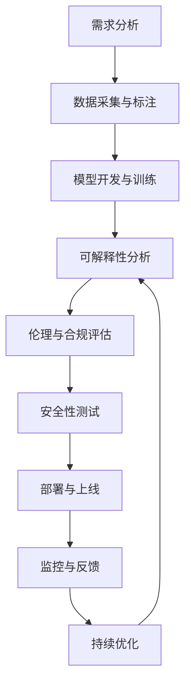

# 6.4 AI工程实践与伦理 / AI Engineering Practice and Ethics

[返回6.人工智能原理与算法](./6.人工智能原理与算法/README.md) |  [返回Refactor总览](./6.人工智能原理与算法/../README.md)

---

## 2024前沿趋势 / 2024 Frontier Trends

- **AI安全与治理 / AI Safety and Governance**: AI红队、模型攻击防护、AI治理框架（如ISO/IEC 42001、NIST AI RMF）
- **可解释性与透明性 / Explainability and Transparency**: XAI、LIME、SHAP、可解释性度量
- **AIGC工程实践 / AIGC Engineering Practice**: 大模型微调、推理优化、AIGC内容安全
- **伦理合规 / Ethical Compliance**: AI伦理准则、数据隐私保护、算法公平性、责任归属
- **自动化部署与监控 / Automated Deployment and Monitoring**: MLOps、CI/CD、模型监控、漂移检测
- **跨学科协作 / Interdisciplinary Collaboration**: 法律、社会、哲学与工程团队协同

---

## 目录 / Table of Contents

- [6.4 AI工程实践与伦理](#64-ai工程实践与伦理--ai-engineering-practice-and-ethics)
- [2024前沿趋势 / 2024 Frontier Trends](#2024前沿趋势--2024-frontier-trends)
- [目录 / Table of Contents](#目录--table-of-contents)
- [1. 概述 / Overview](#1-概述--overview)
- [2. AI工程方法论 / AI Engineering Methodology](#2-ai工程方法论--ai-engineering-methodology)
- [3. 伦理框架与原则 / Ethical Framework and Principles](#3-伦理框架与原则--ethical-framework-and-principles)
- [4. 可解释性与透明性 / Explainability and Transparency](#4-可解释性与透明性--explainability-and-transparency)
- [5. 公平性与偏见检测 / Fairness and Bias Detection](#5-公平性与偏见检测--fairness-and-bias-detection)
- [6. 安全性与鲁棒性 / Security and Robustness](#6-安全性与鲁棒性--security-and-robustness)
- [7. 隐私保护与数据治理 / Privacy Protection and Data Governance](#7-隐私保护与数据治理--privacy-protection-and-data-governance)
- [8. 工程实践案例 / Engineering Practice Cases](#8-工程实践案例--engineering-practice-cases)
- [9. 相关性引用 / Related References](#9-相关性引用--related-references)
- [10. 参考文献 / Bibliography](#10-参考文献--bibliography)

---

## 1. 概述 / Overview

AI工程实践与伦理关注人工智能系统的设计、开发、部署和维护过程中的技术实现与伦理考量。通过系统性的工程方法、伦理框架和批判性思维，确保AI系统的可靠性、公平性、透明性和安全性。

**AI Engineering Practice and Ethics focuses on the technical implementation and ethical considerations in the design, development, deployment, and maintenance of artificial intelligence systems. Through systematic engineering methods, ethical frameworks, and critical thinking, it ensures the reliability, fairness, transparency, and security of AI systems.**

## 1.1 核心挑战 / Core Challenges

- **技术挑战 / Technical Challenges**: 模型复杂性、数据质量、系统集成、性能优化
- **伦理挑战 / Ethical Challenges**: 偏见检测、公平性保证、可解释性、责任归属
- **社会挑战 / Social Challenges**: 就业影响、隐私保护、社会公平、人类尊严
- **治理挑战 / Governance Challenges**: 监管合规、标准制定、国际合作、风险管控

## 1.2 AI工程伦理流程 / AI Engineering Ethics Process



---

## 2. AI工程方法论 / AI Engineering Methodology

## 2.1 MLOps工程实践 / MLOps Engineering Practice

### 2.1.1 MLOps生命周期 / MLOps Lifecycle

```typescript
interface MLOpsLifecycle {
  development: {
    dataEngineering: DataPipeline;    // 数据工程 / Data Engineering
    modelDevelopment: ModelTraining;   // 模型开发 / Model Development
    experimentation: ExperimentTracking; // 实验跟踪 / Experiment Tracking
  };
  deployment: {
    modelPackaging: ModelPackaging;   // 模型打包 / Model Packaging
    deploymentPipeline: DeploymentPipeline; // 部署流水线 / Deployment Pipeline
    monitoring: ModelMonitoring;      // 模型监控 / Model Monitoring
  };
  operations: {
    modelServing: ModelServing;      // 模型服务 / Model Serving
    performanceMonitoring: PerformanceMonitoring; // 性能监控 / Performance Monitoring
    modelRetraining: ModelRetraining; // 模型重训练 / Model Retraining
  };
}
```

### 2.1.2 模型版本控制 / Model Version Control

```typescript
interface ModelVersion {
  version: string;
  modelArtifact: ModelArtifact;
  metadata: {
    trainingData: DataVersion;
    hyperparameters: Hyperparameters;
    performance: PerformanceMetrics;
    ethicalMetrics: EthicalMetrics;
  };
  lineage: {
    parentVersions: string[];
    changes: ChangeLog[];
  };
}

class ModelVersionControl {
  createVersion(model: Model, metadata: ModelMetadata): ModelVersion {
    return {
      version: this.generateVersion(),
      modelArtifact: this.packageModel(model),
      metadata: {
        trainingData: this.getDataVersion(model.trainingData),
        hyperparameters: model.hyperparameters,
        performance: this.evaluatePerformance(model),
        ethicalMetrics: this.evaluateEthics(model)
      },
      lineage: this.trackLineage(model)
    };
  }
}
```

## 2.2 实验管理与可重现性 / Experiment Management and Reproducibility

### 2.2.1 实验跟踪系统 / Experiment Tracking System

```typescript
interface Experiment {
  id: string;
  name: string;
  description: string;
  parameters: ExperimentParameters;
  metrics: ExperimentMetrics;
  artifacts: ExperimentArtifacts;
  status: 'running' | 'completed' | 'failed';
  timestamp: Date;
}

interface ExperimentParameters {
  dataVersion: string;
  modelType: string;
  hyperparameters: Record<string, any>;
  environment: EnvironmentConfig;
}

class ExperimentTracker {
  async logExperiment(experiment: Experiment): Promise<void> {
    await this.storeExperiment(experiment);
    await this.logMetrics(experiment.metrics);
    await this.storeArtifacts(experiment.artifacts);
  }
  
  async reproduceExperiment(experimentId: string): Promise<Experiment> {
    const original = await this.getExperiment(experimentId);
    return this.runExperiment(original.parameters);
  }
}
```

---

## 3. 伦理框架与原则 / Ethical Framework and Principles

## 3.1 AI伦理原则 / AI Ethical Principles

### 3.1.1 核心伦理原则 / Core Ethical Principles

```typescript
interface EthicalPrinciples {
  beneficence: {
    description: string;      // 有益性 / Beneficence
    implementation: string[]; // 实现方法 / Implementation Methods
  };
  nonMaleficence: {
    description: string;      // 无害性 / Non-maleficence
    implementation: string[]; // 实现方法 / Implementation Methods
  };
  autonomy: {
    description: string;      // 自主性 / Autonomy
    implementation: string[]; // 实现方法 / Implementation Methods
  };
  justice: {
    description: string;      // 公正性 / Justice
    implementation: string[]; // 实现方法 / Implementation Methods
  };
  transparency: {
    description: string;      // 透明性 / Transparency
    implementation: string[]; // 实现方法 / Implementation Methods
  };
  accountability: {
    description: string;      // 问责性 / Accountability
    implementation: string[]; // 实现方法 / Implementation Methods
  };
}
```

### 3.1.2 伦理风险评估 / Ethical Risk Assessment

```typescript
interface EthicalRiskAssessment {
  riskCategories: {
    privacy: RiskLevel;       // 隐私风险 / Privacy Risk
    fairness: RiskLevel;      // 公平性风险 / Fairness Risk
    safety: RiskLevel;        // 安全风险 / Safety Risk
    transparency: RiskLevel;  // 透明性风险 / Transparency Risk
  };
  mitigationStrategies: MitigationStrategy[];
  monitoringPlan: MonitoringPlan;
}

enum RiskLevel {
  LOW = 'low',
  MEDIUM = 'medium',
  HIGH = 'high',
  CRITICAL = 'critical'
}

class EthicalRiskAssessor {
  assessRisk(aiSystem: AISystem): EthicalRiskAssessment {
    return {
      riskCategories: {
        privacy: this.assessPrivacyRisk(aiSystem),
        fairness: this.assessFairnessRisk(aiSystem),
        safety: this.assessSafetyRisk(aiSystem),
        transparency: this.assessTransparencyRisk(aiSystem)
      },
      mitigationStrategies: this.generateMitigationStrategies(aiSystem),
      monitoringPlan: this.createMonitoringPlan(aiSystem)
    };
  }
}
```

## 3.2 责任归属框架 / Accountability Framework

### 3.2.1 责任分配模型 / Responsibility Allocation Model

```typescript
interface ResponsibilityAllocation {
  stakeholders: {
    developers: ResponsibilityLevel;    // 开发者责任 / Developer Responsibility
    operators: ResponsibilityLevel;     // 运营者责任 / Operator Responsibility
    users: ResponsibilityLevel;         // 用户责任 / User Responsibility
    regulators: ResponsibilityLevel;    // 监管者责任 / Regulator Responsibility
  };
  mechanisms: {
    technical: string[];               // 技术机制 / Technical Mechanisms
    organizational: string[];          // 组织机制 / Organizational Mechanisms
    legal: string[];                  // 法律机制 / Legal Mechanisms
  };
}

enum ResponsibilityLevel {
  PRIMARY = 'primary',
  SECONDARY = 'secondary',
  SHARED = 'shared',
  NONE = 'none'
}
```

---

## 4. 可解释性与透明性 / Explainability and Transparency

## 4.1 可解释AI技术 / Explainable AI Techniques

### 4.1.1 模型可解释性方法 / Model Explainability Methods

```typescript
interface ExplainabilityMethod {
  type: 'postHoc' | 'intrinsic' | 'modelAgnostic';
  technique: 'LIME' | 'SHAP' | 'LRP' | 'GradCAM' | 'IntegratedGradients';
  implementation: string;
  applicability: string[];
  limitations: string[];
}

class ExplainabilityAnalyzer {
  async explainPrediction(model: Model, input: Input, method: ExplainabilityMethod): Promise<Explanation> {
    switch (method.technique) {
      case 'LIME':
        return this.applyLIME(model, input);
      case 'SHAP':
        return this.applySHAP(model, input);
      case 'GradCAM':
        return this.applyGradCAM(model, input);
      default:
        throw new Error(`Unsupported explainability method: ${method.technique}`);
    }
  }
  
  private async applyLIME(model: Model, input: Input): Promise<Explanation> {
    // LIME实现 / LIME Implementation
    const explainer = new LIMExplainer(model);
    return await explainer.explain(input);
  }
}
```

### 4.1.2 可解释性度量 / Explainability Metrics

```typescript
interface ExplainabilityMetrics {
  fidelity: number;           // 保真度 / Fidelity
  stability: number;          // 稳定性 / Stability
  comprehensibility: number;  // 可理解性 / Comprehensibility
  completeness: number;       // 完整性 / Completeness
}

class ExplainabilityEvaluator {
  evaluateExplanation(explanation: Explanation, groundTruth: GroundTruth): ExplainabilityMetrics {
    return {
      fidelity: this.calculateFidelity(explanation, groundTruth),
      stability: this.calculateStability(explanation),
      comprehensibility: this.calculateComprehensibility(explanation),
      completeness: this.calculateCompleteness(explanation)
    };
  }
}
```

## 4.2 透明性设计 / Transparency Design

### 4.2.1 透明性框架 / Transparency Framework

```typescript
interface TransparencyFramework {
  dataTransparency: {
    dataSources: string[];        // 数据来源 / Data Sources
    dataQuality: DataQualityMetrics; // 数据质量 / Data Quality
    dataProcessing: string[];     // 数据处理 / Data Processing
  };
  modelTransparency: {
    architecture: string;         // 模型架构 / Model Architecture
    trainingProcess: string[];    // 训练过程 / Training Process
    performanceMetrics: PerformanceMetrics; // 性能指标 / Performance Metrics
  };
  decisionTransparency: {
    decisionFactors: string[];    // 决策因素 / Decision Factors
    confidenceLevels: number[];   // 置信水平 / Confidence Levels
    alternatives: string[];       // 替代方案 / Alternatives
  };
}
```

---

## 5. 公平性与偏见检测 / Fairness and Bias Detection

## 5.1 算法公平性 / Algorithmic Fairness

### 5.1.1 公平性度量 / Fairness Metrics

```typescript
interface FairnessMetrics {
  demographicParity: number;    // 人口统计学公平性 / Demographic Parity
  equalizedOdds: number;        // 均衡赔率 / Equalized Odds
  equalOpportunity: number;     // 平等机会 / Equal Opportunity
  individualFairness: number;   // 个体公平性 / Individual Fairness
  counterfactualFairness: number; // 反事实公平性 / Counterfactual Fairness
}

class FairnessAnalyzer {
  calculateFairnessMetrics(predictions: Prediction[], 
                          protectedAttributes: string[]): FairnessMetrics {
    return {
      demographicParity: this.calculateDemographicParity(predictions, protectedAttributes),
      equalizedOdds: this.calculateEqualizedOdds(predictions, protectedAttributes),
      equalOpportunity: this.calculateEqualOpportunity(predictions, protectedAttributes),
      individualFairness: this.calculateIndividualFairness(predictions, protectedAttributes),
      counterfactualFairness: this.calculateCounterfactualFairness(predictions, protectedAttributes)
    };
  }
  
  private calculateDemographicParity(predictions: Prediction[], 
                                   protectedAttributes: string[]): number {
    // 人口统计学公平性计算 / Demographic Parity Calculation
    const groups = this.groupByProtectedAttributes(predictions, protectedAttributes);
    const positiveRates = groups.map(group => 
      group.filter(p => p.prediction === 1).length / group.length
    );
    return Math.max(...positiveRates) - Math.min(...positiveRates);
  }
}
```

### 5.1.2 偏见检测算法 / Bias Detection Algorithm

```typescript
interface BiasDetectionResult {
  biasType: 'statistical' | 'representation' | 'evaluation' | 'historical';
  severity: 'low' | 'medium' | 'high' | 'critical';
  affectedGroups: string[];
  evidence: BiasEvidence[];
  mitigationStrategies: string[];
}

interface BiasEvidence {
  metric: string;
  value: number;
  threshold: number;
  description: string;
}

class BiasDetector {
  detectBias(data: Dataset, model: Model): BiasDetectionResult[] {
    return [
      this.detectStatisticalBias(data, model),
      this.detectRepresentationBias(data),
      this.detectEvaluationBias(data, model),
      this.detectHistoricalBias(data)
    ];
  }
  
  private detectStatisticalBias(data: Dataset, model: Model): BiasDetectionResult {
    // 统计偏见检测 / Statistical Bias Detection
    const predictions = model.predict(data.features);
    const fairnessMetrics = this.calculateFairnessMetrics(predictions, data.protectedAttributes);
    
    return {
      biasType: 'statistical',
      severity: this.assessBiasSeverity(fairnessMetrics),
      affectedGroups: this.identifyAffectedGroups(fairnessMetrics),
      evidence: this.generateBiasEvidence(fairnessMetrics),
      mitigationStrategies: this.suggestMitigationStrategies(fairnessMetrics)
    };
  }
}
```

## 5.2 公平性优化 / Fairness Optimization

### 5.2.1 公平性约束优化 / Fairness-Constrained Optimization

```typescript
interface FairnessConstraint {
  type: 'demographic_parity' | 'equalized_odds' | 'equal_opportunity';
  threshold: number;
  weight: number;
}

class FairnessOptimizer {
  optimizeWithFairnessConstraints(model: Model, 
                                data: Dataset, 
                                constraints: FairnessConstraint[]): Model {
    const objective = this.createFairnessObjective(model, data, constraints);
    const optimizer = new ConstrainedOptimizer(objective);
    return optimizer.optimize();
  }
  
  private createFairnessObjective(model: Model, 
                                 data: Dataset, 
                                 constraints: FairnessConstraint[]) {
    return {
      primaryObjective: this.modelPerformanceObjective(model),
      fairnessConstraints: constraints.map(c => this.createConstraint(c, model, data)),
      regularization: this.fairnessRegularization(model)
    };
  }
}
```

---

## 6. 安全性与鲁棒性 / Security and Robustness

## 6.1 对抗性攻击防护 / Adversarial Attack Defense

### 6.1.1 对抗性攻击类型 / Adversarial Attack Types

```typescript
interface AdversarialAttack {
  type: 'evasion' | 'poisoning' | 'extraction' | 'inversion';
  method: 'FGSM' | 'PGD' | 'C&W' | 'DeepFool';
  target: 'whiteBox' | 'blackBox' | 'grayBox';
  objective: 'misclassification' | 'targeted' | 'confidenceReduction';
}

class AdversarialDefender {
  defendAgainstAttack(model: Model, attack: AdversarialAttack): DefensiveModel {
    switch (attack.type) {
      case 'evasion':
        return this.defendAgainstEvasion(model, attack);
      case 'poisoning':
        return this.defendAgainstPoisoning(model, attack);
      case 'extraction':
        return this.defendAgainstExtraction(model, attack);
      default:
        throw new Error(`Unsupported attack type: ${attack.type}`);
    }
  }
  
  private defendAgainstEvasion(model: Model, attack: AdversarialAttack): DefensiveModel {
    // 对抗训练 / Adversarial Training
    const adversarialExamples = this.generateAdversarialExamples(model, attack);
    return this.adversarialTraining(model, adversarialExamples);
  }
}
```

### 6.1.2 鲁棒性评估 / Robustness Evaluation

```typescript
interface RobustnessMetrics {
  accuracyUnderAttack: number;    // 攻击下准确率 / Accuracy Under Attack
  perturbationMagnitude: number;  // 扰动幅度 / Perturbation Magnitude
  attackSuccessRate: number;      // 攻击成功率 / Attack Success Rate
  certifiedRobustness: number;    // 认证鲁棒性 / Certified Robustness
}

class RobustnessEvaluator {
  evaluateRobustness(model: Model, 
                    attacks: AdversarialAttack[]): RobustnessMetrics {
    const results = attacks.map(attack => this.evaluateAttack(model, attack));
    
    return {
      accuracyUnderAttack: this.calculateAverageAccuracy(results),
      perturbationMagnitude: this.calculateAveragePerturbation(results),
      attackSuccessRate: this.calculateAttackSuccessRate(results),
      certifiedRobustness: this.calculateCertifiedRobustness(model)
    };
  }
}
```

## 6.2 模型安全 / Model Security

### 6.2.1 模型窃取防护 / Model Extraction Protection

```typescript
interface ModelProtection {
  watermarking: ModelWatermarking;     // 模型水印 / Model Watermarking
  obfuscation: ModelObfuscation;       // 模型混淆 / Model Obfuscation
  accessControl: AccessControl;         // 访问控制 / Access Control
  monitoring: ExtractionMonitoring;     // 提取监控 / Extraction Monitoring
}

class ModelProtector {
  protectModel(model: Model): ProtectedModel {
    return {
      ...model,
      watermark: this.addWatermark(model),
      obfuscatedWeights: this.obfuscateWeights(model),
      accessControl: this.implementAccessControl(model),
      monitoring: this.setupExtractionMonitoring(model)
    };
  }
}
```

---

## 7. 隐私保护与数据治理 / Privacy Protection and Data Governance

## 7.1 差分隐私 / Differential Privacy

### 7.1.1 差分隐私实现 / Differential Privacy Implementation

```typescript
interface DifferentialPrivacy {
  epsilon: number;              // 隐私预算 / Privacy Budget
  delta: number;                // 失败概率 / Failure Probability
  mechanism: 'Laplace' | 'Gaussian' | 'Exponential';
}

class DifferentialPrivacyEngine {
  addNoise(data: number[], epsilon: number, mechanism: string): number[] {
    switch (mechanism) {
      case 'Laplace':
        return this.addLaplaceNoise(data, epsilon);
      case 'Gaussian':
        return this.addGaussianNoise(data, epsilon);
      case 'Exponential':
        return this.addExponentialNoise(data, epsilon);
      default:
        throw new Error(`Unsupported mechanism: ${mechanism}`);
    }
  }
  
  private addLaplaceNoise(data: number[], epsilon: number): number[] {
    const sensitivity = this.calculateSensitivity(data);
    const scale = sensitivity / epsilon;
    
    return data.map(value => 
      value + this.sampleLaplace(0, scale)
    );
  }
}
```

### 7.1.2 隐私预算管理 / Privacy Budget Management

```typescript
interface PrivacyBudget {
  totalBudget: number;
  usedBudget: number;
  remainingBudget: number;
  queries: PrivacyQuery[];
}

interface PrivacyQuery {
  id: string;
  epsilon: number;
  timestamp: Date;
  purpose: string;
}

class PrivacyBudgetManager {
  allocateBudget(query: PrivacyQuery): boolean {
    if (this.remainingBudget >= query.epsilon) {
      this.usedBudget += query.epsilon;
      this.queries.push(query);
      return true;
    }
    return false;
  }
  
  getRemainingBudget(): number {
    return this.totalBudget - this.usedBudget;
  }
}
```

## 7.2 联邦学习 / Federated Learning

### 7.2.1 联邦学习框架 / Federated Learning Framework

```typescript
interface FederatedLearning {
  participants: Participant[];
  aggregationMethod: 'FedAvg' | 'FedProx' | 'FedNova';
  communicationRounds: number;
  privacyGuarantees: PrivacyGuarantees;
}

interface Participant {
  id: string;
  dataSize: number;
  model: Model;
  contribution: number;
}

class FederatedLearningCoordinator {
  async coordinateTraining(participants: Participant[], 
                          aggregationMethod: string): Promise<Model> {
    let globalModel = this.initializeGlobalModel();
    
    for (let round = 0; round < this.communicationRounds; round++) {
      // 本地训练 / Local Training
      const localModels = await Promise.all(
        participants.map(p => this.trainLocally(p, globalModel))
      );
      
      // 模型聚合 / Model Aggregation
      globalModel = this.aggregateModels(localModels, aggregationMethod);
    }
    
    return globalModel;
  }
  
  private aggregateModels(models: Model[], method: string): Model {
    switch (method) {
      case 'FedAvg':
        return this.federatedAveraging(models);
      case 'FedProx':
        return this.federatedProximal(models);
      case 'FedNova':
        return this.federatedNova(models);
      default:
        throw new Error(`Unsupported aggregation method: ${method}`);
    }
  }
}
```

---

## 8. 工程实践案例 / Engineering Practice Cases

## 8.1 推荐系统伦理实践 / Recommendation System Ethics Practice

### 8.1.1 推荐系统公平性 / Recommendation System Fairness

```typescript
interface RecommendationSystem {
  model: RecommendationModel;
  fairnessConstraints: FairnessConstraint[];
  diversityMetrics: DiversityMetrics;
  transparencyMeasures: TransparencyMeasures;
}

class EthicalRecommendationSystem {
  generateRecommendations(user: User, 
                         items: Item[], 
                         constraints: FairnessConstraint[]): Recommendation[] {
    // 基础推荐 / Base Recommendations
    const baseRecommendations = this.model.predict(user, items);
    
    // 应用公平性约束 / Apply Fairness Constraints
    const fairRecommendations = this.applyFairnessConstraints(
      baseRecommendations, 
      constraints
    );
    
    // 增加多样性 / Increase Diversity
    const diverseRecommendations = this.increaseDiversity(fairRecommendations);
    
    // 提供解释 / Provide Explanations
    return this.addExplanations(diverseRecommendations);
  }
  
  private applyFairnessConstraints(recommendations: Recommendation[], 
                                 constraints: FairnessConstraint[]): Recommendation[] {
    return constraints.reduce((filtered, constraint) => {
      return this.filterByConstraint(filtered, constraint);
    }, recommendations);
  }
}
```

## 8.2 自动驾驶伦理决策 / Autonomous Vehicle Ethical Decision Making

### 8.2.1 伦理决策框架 / Ethical Decision Framework

```typescript
interface EthicalDecision {
  scenario: DrivingScenario;
  options: DrivingOption[];
  ethicalPrinciples: EthicalPrinciple[];
  decision: DrivingOption;
  justification: string;
}

interface DrivingScenario {
  actors: Actor[];
  constraints: Constraint[];
  timeHorizon: number;
  uncertainty: number;
}

class EthicalDecisionMaker {
  makeEthicalDecision(scenario: DrivingScenario): EthicalDecision {
    const options = this.generateOptions(scenario);
    const ethicalScores = options.map(option => 
      this.evaluateEthicalScore(option, scenario)
    );
    
    const bestOption = this.selectBestOption(options, ethicalScores);
    
    return {
      scenario,
      options,
      ethicalPrinciples: this.getRelevantPrinciples(scenario),
      decision: bestOption,
      justification: this.generateJustification(bestOption, ethicalScores)
    };
  }
  
  private evaluateEthicalScore(option: DrivingOption, 
                              scenario: DrivingScenario): number {
    const principles = this.getRelevantPrinciples(scenario);
    return principles.reduce((score, principle) => {
      return score + this.evaluatePrinciple(option, principle, scenario);
    }, 0);
  }
}
```

---

## 9. 相关性引用 / Related References

- [6.1 AI基础原理](./6.人工智能原理与算法/6.1 AI基础原理.md)
- [6.2 经典AI算法与模型](./6.人工智能原理与算法/6.2 经典AI算法与模型.md)
- [6.3 现代深度学习与大模型](./6.人工智能原理与算法/6.3 现代深度学习与大模型.md)
- [6.5 AI与哲学](./6.人工智能原理与算法/6.5 AI与哲学.md)
- [6.6 AI与认知科学](./6.人工智能原理与算法/6.6 AI与认知科学.md)
- [6.7 AI与艺术与创造力](./6.人工智能原理与算法/6.7 AI与艺术与创造力.md)
- [6.8 AI与社会治理](./6.人工智能原理与算法/6.8 AI与社会治理.md)
- [4.4 哲学与认知批判性分析](./6.人工智能原理与算法/../4.设计模式与架构/4.4 哲学与认知批判性分析.md)
- [5.2 可访问性与国际化](./6.人工智能原理与算法/../5.技术规范与标准/5.2 可访问性与国际化.md)
- [5.3 性能优化与工程实践](./6.人工智能原理与算法/../5.技术规范与标准/5.3 性能优化与工程实践.md)

---

## 10. 参考文献 / Bibliography

1. **Floridi, L., et al. (2018).** AI4People—An Ethical Framework for a Good AI Society: Opportunities, Risks, Principles, and Recommendations. *Minds and Machines*, 28(4), 689-707.
2. **Barocas, S., & Selbst, A. D. (2016).** Big data's disparate impact. *California Law Review*, 104(3), 671-732.
3. **Dwork, C., & Roth, A. (2014).** The algorithmic foundations of differential privacy. *Foundations and Trends in Theoretical Computer Science*, 9(3-4), 211-407.
4. **Ribeiro, M. T., Singh, S., & Guestrin, C. (2016).** "Why should I trust you?" Explaining the predictions of any classifier. *Proceedings of the 22nd ACM SIGKDD International Conference on Knowledge Discovery and Data Mining*, 1135-1144.
5. **Lundberg, S. M., & Lee, S. I. (2017).** A unified approach to interpreting model predictions. *Advances in Neural Information Processing Systems*, 30.
6. **Goodfellow, I. J., Shlens, J., & Szegedy, C. (2014).** Explaining and harnessing adversarial examples. *arXiv preprint arXiv:1412.6572*.
7. **McMahan, B., et al. (2017).** Communication-efficient learning of deep networks from decentralized data. *Artificial Intelligence and Statistics*, 1273-1282.
8. **ISO/IEC 42001:2023.** Information technology — Artificial intelligence — Management system.
9. **NIST AI Risk Management Framework.** National Institute of Standards and Technology.
10. **EU AI Act.** European Union Artificial Intelligence Act.

---

> **补充说明 / Additional Notes:**
>
> AI工程实践与伦理是确保人工智能系统可靠、公平、透明和安全的关键领域。通过系统性的工程方法、伦理框架和批判性思维，我们可以构建既技术先进又符合伦理要求的AI系统。在AI快速发展的今天，工程实践与伦理的平衡变得尤为重要。
>
> **AI Engineering Practice and Ethics is a key area for ensuring reliable, fair, transparent, and secure artificial intelligence systems. Through systematic engineering methods, ethical frameworks, and critical thinking, we can build AI systems that are both technologically advanced and ethically sound. In today's rapidly developing AI landscape, the balance between engineering practice and ethics has become particularly important.**
