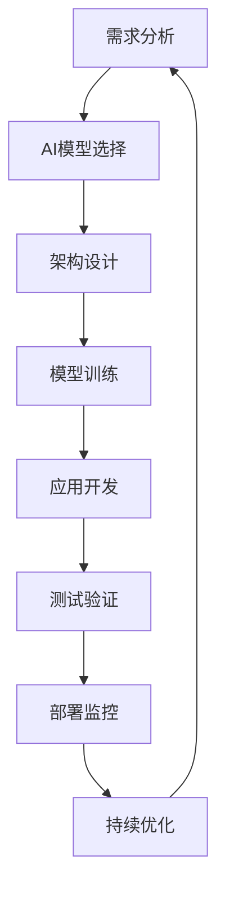

# 6.9 系统化AI应用与工程实践 / Systematic AI Applications and Engineering Practice

[返回6.人工智能原理与算法](./6.人工智能原理与算法/README.md) |  [返回Refactor总览](./6.人工智能原理与算法/../README.md)

---

## 目录 / Table of Contents

- [6.9 系统化AI应用与工程实践](#69-系统化ai应用与工程实践--systematic-ai-applications-and-engineering-practice)
- [目录 / Table of Contents](#目录--table-of-contents)
- [1. 概述 / Overview](#1-概述--overview)
- [2. AI应用架构 / AI Application Architecture](#2-ai应用架构--ai-application-architecture)
- [3. 工程实践体系 / Engineering Practice System](#3-工程实践体系--engineering-practice-system)
- [4. 形式化AI分析 / Formal AI Analysis](#4-形式化ai分析--formal-ai-analysis)
- [5. 相关性引用 / Related References](#5-相关性引用--related-references)
- [6. 参考文献 / Bibliography](#6-参考文献--bibliography)

---

## 1. 概述 / Overview

系统化AI应用与工程实践是前端技术栈中集成人工智能技术、实现智能化功能的核心方法论。通过科学化的AI架构设计、工程化的AI应用开发和系统化的AI监控体系，建立全面的AI应用保证机制。

**Systematic AI Applications and Engineering Practice is the core methodology for integrating artificial intelligence technologies and implementing intelligent functions in frontend technology stack. Through scientific AI architecture design, engineering AI application development, and systematic AI monitoring systems, it establishes a comprehensive AI application assurance mechanism.**

## 1.1 核心目标 / Core Objectives

- **AI应用架构 / AI Application Architecture**: 建立科学的AI应用架构设计
- **工程实践 / Engineering Practice**: 构建系统化的AI工程实践体系
- **监控体系 / Monitoring System**: 建立全面的AI监控体系
- **持续优化 / Continuous Optimization**: 实现AI应用的持续优化和改进

## 1.2 AI应用开发流程 / AI Application Development Process



---

## 2. AI应用架构 / AI Application Architecture

## 2.1 前端AI架构 / Frontend AI Architecture

### 2.1.1 客户端AI / Client-side AI

```typescript
interface ClientSideAI {
  models: AIModel[];
  inference: InferenceEngine;
  optimization: ModelOptimization;
  monitoring: AIMonitoring;
}

interface AIModel {
  type: 'tensorflow' | 'onnx' | 'webgl' | 'wasm';
  model: ModelData;
  performance: ModelPerformance;
  accuracy: ModelAccuracy;
}

class ClientSideAIManager {
  async initializeAI(config: AIConfig): Promise<ClientSideAI> {
    const models = await this.loadModels(config.models);
    const inference = this.setupInferenceEngine(models);
    const optimization = this.optimizeModels(models);
    const monitoring = this.setupMonitoring(models);
    
    return {
      models,
      inference,
      optimization,
      monitoring
    };
  }
  
  private async loadModels(modelConfigs: ModelConfig[]): Promise<AIModel[]> {
    return Promise.all(
      modelConfigs.map(async config => {
        const model = await this.loadModel(config);
        const performance = await this.measurePerformance(model);
        const accuracy = await this.validateAccuracy(model);
        
        return {
          type: config.type,
          model,
          performance,
          accuracy
        };
      })
    );
  }
}
```

### 2.1.2 服务端AI / Server-side AI

```typescript
interface ServerSideAI {
  api: AIAPI;
  models: ServerModel[];
  caching: AICaching;
  scaling: AIScaling;
}

interface AIAPI {
  endpoints: APIEndpoint[];
  authentication: APIAuth;
  rateLimiting: RateLimit;
  monitoring: APIMonitoring;
}

class ServerSideAIManager {
  async setupServerAI(config: ServerAIConfig): Promise<ServerSideAI> {
    const api = this.setupAPI(config.api);
    const models = await this.loadServerModels(config.models);
    const caching = this.setupCaching(config.caching);
    const scaling = this.setupScaling(config.scaling);
    
    return {
      api,
      models,
      caching,
      scaling
    };
  }
}
```

## 2.2 AI应用模式 / AI Application Patterns

### 2.2.1 智能推荐 / Intelligent Recommendation

```typescript
interface RecommendationSystem {
  algorithm: RecommendationAlgorithm;
  data: RecommendationData;
  personalization: PersonalizationEngine;
  evaluation: RecommendationEvaluation;
}

interface RecommendationAlgorithm {
  type: 'collaborative' | 'content' | 'hybrid' | 'deep';
  parameters: AlgorithmParameters;
  performance: AlgorithmPerformance;
}

class RecommendationEngine {
  async generateRecommendations(
    user: User,
    context: Context
  ): Promise<Recommendation[]> {
    const algorithm = this.selectOptimalAlgorithm(user, context);
    const data = await this.prepareData(user, context);
    const recommendations = await this.runAlgorithm(algorithm, data);
    
    return this.evaluateAndRank(recommendations, user);
  }
  
  private selectOptimalAlgorithm(user: User, context: Context): RecommendationAlgorithm {
    const algorithms = [
      this.createCollaborativeFiltering(),
      this.createContentBasedFiltering(),
      this.createHybridFiltering(),
      this.createDeepLearningFiltering()
    ];
    
    return algorithms.reduce((best, current) => 
      current.performance.score > best.performance.score ? current : best
    );
  }
}
```

### 2.2.2 智能搜索 / Intelligent Search

```typescript
interface SearchEngine {
  indexing: SearchIndexing;
  query: QueryProcessing;
  ranking: SearchRanking;
  suggestions: SearchSuggestions;
}

interface SearchIndexing {
  documents: Document[];
  index: SearchIndex;
  optimization: IndexOptimization;
}

class IntelligentSearchEngine {
  async search(query: SearchQuery): Promise<SearchResults> {
    const processedQuery = this.processQuery(query);
    const candidates = await this.findCandidates(processedQuery);
    const rankedResults = await this.rankResults(candidates, processedQuery);
    const suggestions = this.generateSuggestions(processedQuery);
    
    return {
      results: rankedResults,
      suggestions,
      metadata: this.generateMetadata(processedQuery, rankedResults)
    };
  }
  
  private async rankResults(
    candidates: SearchCandidate[],
    query: ProcessedQuery
  ): Promise<RankedResult[]> {
    const rankingModels = [
      this.createBM25Ranking(),
      this.createNeuralRanking(),
      this.createHybridRanking()
    ];
    
    const scores = await Promise.all(
      rankingModels.map(model => model.rank(candidates, query))
    );
    
    return this.ensembleRanking(scores, candidates);
  }
}
```

---

## 3. 工程实践体系 / Engineering Practice System

## 3.1 AI模型管理 / AI Model Management

### 3.1.1 模型版本控制 / Model Version Control

```typescript
interface ModelVersionControl {
  versions: ModelVersion[];
  registry: ModelRegistry;
  deployment: ModelDeployment;
  rollback: ModelRollback;
}

interface ModelVersion {
  id: string;
  version: string;
  model: ModelData;
  metadata: ModelMetadata;
  performance: ModelPerformance;
}

class ModelVersionManager {
  async registerModel(model: ModelData): Promise<ModelVersion> {
    const version = this.generateVersion();
    const metadata = await this.extractMetadata(model);
    const performance = await this.evaluatePerformance(model);
    
    const modelVersion: ModelVersion = {
      id: this.generateId(),
      version,
      model,
      metadata,
      performance
    };
    
    await this.storeModel(modelVersion);
    return modelVersion;
  }
  
  async deployModel(version: ModelVersion): Promise<DeploymentResult> {
    const deployment = await this.createDeployment(version);
    const healthCheck = await this.healthCheck(deployment);
    
    if (healthCheck.status === 'healthy') {
      await this.updateProductionModel(version);
      return { success: true, deployment };
    } else {
      await this.rollbackDeployment(deployment);
      return { success: false, error: healthCheck.error };
    }
  }
}
```

### 3.1.2 模型监控 / Model Monitoring

```typescript
interface ModelMonitoring {
  performance: PerformanceMonitoring;
  drift: DriftDetection;
  bias: BiasDetection;
  explainability: ExplainabilityAnalysis;
}

interface PerformanceMonitoring {
  metrics: PerformanceMetrics[];
  alerts: PerformanceAlert[];
  dashboard: PerformanceDashboard;
}

class ModelMonitor {
  async monitorModel(model: AIModel): Promise<ModelMonitoring> {
    const performance = await this.monitorPerformance(model);
    const drift = await this.detectDrift(model);
    const bias = await this.detectBias(model);
    const explainability = await this.analyzeExplainability(model);
    
    return {
      performance,
      drift,
      bias,
      explainability
    };
  }
  
  private async detectDrift(model: AIModel): Promise<DriftDetection> {
    const currentData = await this.getCurrentData();
    const historicalData = await this.getHistoricalData();
    
    return {
      dataDrift: this.calculateDataDrift(currentData, historicalData),
      conceptDrift: this.calculateConceptDrift(model, currentData),
      alerts: this.generateDriftAlerts(currentData, historicalData)
    };
  }
}
```

## 3.2 AI应用部署 / AI Application Deployment

### 3.2.1 容器化部署 / Containerized Deployment

```typescript
interface ContainerizedAI {
  containers: AIContainer[];
  orchestration: ContainerOrchestration;
  scaling: ContainerScaling;
  monitoring: ContainerMonitoring;
}

interface AIContainer {
  image: string;
  resources: ContainerResources;
  environment: ContainerEnvironment;
  health: HealthCheck;
}

class ContainerizedAIDeployer {
  async deployAI(aiConfig: AIConfig): Promise<ContainerizedAI> {
    const containers = await this.createContainers(aiConfig);
    const orchestration = this.setupOrchestration(containers);
    const scaling = this.setupScaling(containers);
    const monitoring = this.setupMonitoring(containers);
    
    return {
      containers,
      orchestration,
      scaling,
      monitoring
    };
  }
  
  private async createContainers(aiConfig: AIConfig): Promise<AIContainer[]> {
    return Promise.all(
      aiConfig.services.map(async service => {
        const image = await this.buildImage(service);
        const resources = this.allocateResources(service);
        const environment = this.setupEnvironment(service);
        const health = this.setupHealthCheck(service);
        
        return {
          image,
          resources,
          environment,
          health
        };
      })
    );
  }
}
```

### 3.2.2 无服务器部署 / Serverless Deployment

```typescript
interface ServerlessAI {
  functions: AIFunction[];
  triggers: FunctionTrigger[];
  scaling: ServerlessScaling;
  monitoring: ServerlessMonitoring;
}

interface AIFunction {
  name: string;
  handler: FunctionHandler;
  runtime: Runtime;
  memory: number;
  timeout: number;
}

class ServerlessAIDeployer {
  async deployServerlessAI(aiConfig: AIConfig): Promise<ServerlessAI> {
    const functions = await this.createFunctions(aiConfig);
    const triggers = this.setupTriggers(functions);
    const scaling = this.setupScaling(functions);
    const monitoring = this.setupMonitoring(functions);
    
    return {
      functions,
      triggers,
      scaling,
      monitoring
    };
  }
}
```

---

## 4. 形式化AI分析 / Formal AI Analysis

## 4.1 AI性能分析 / AI Performance Analysis

### 4.1.1 模型性能评估 / Model Performance Evaluation

```typescript
interface ModelPerformanceEvaluation {
  metrics: PerformanceMetrics;
  comparison: ModelComparison;
  optimization: PerformanceOptimization;
  recommendations: PerformanceRecommendation[];
}

interface PerformanceMetrics {
  accuracy: number;
  precision: number;
  recall: number;
  f1Score: number;
  latency: number;
  throughput: number;
}

class ModelPerformanceEvaluator {
  async evaluateModel(model: AIModel, testData: TestData): Promise<ModelPerformanceEvaluation> {
    const metrics = await this.calculateMetrics(model, testData);
    const comparison = await this.compareWithBaseline(model, metrics);
    const optimization = this.identifyOptimizations(model, metrics);
    const recommendations = this.generateRecommendations(model, metrics);
    
    return {
      metrics,
      comparison,
      optimization,
      recommendations
    };
  }
  
  private async calculateMetrics(model: AIModel, testData: TestData): Promise<PerformanceMetrics> {
    const predictions = await model.predict(testData.features);
    const accuracy = this.calculateAccuracy(predictions, testData.labels);
    const precision = this.calculatePrecision(predictions, testData.labels);
    const recall = this.calculateRecall(predictions, testData.labels);
    const f1Score = this.calculateF1Score(precision, recall);
    const latency = await this.measureLatency(model, testData);
    const throughput = await this.measureThroughput(model, testData);
    
    return {
      accuracy,
      precision,
      recall,
      f1Score,
      latency,
      throughput
    };
  }
}
```

### 4.1.2 AI系统性能分析 / AI System Performance Analysis

```typescript
interface AISystemPerformance {
  system: SystemPerformance;
  models: ModelPerformance[];
  infrastructure: InfrastructurePerformance;
  userExperience: UserExperienceMetrics;
}

class AISystemPerformanceAnalyzer {
  async analyzeSystem(aiSystem: AISystem): Promise<AISystemPerformance> {
    const system = await this.analyzeSystemPerformance(aiSystem);
    const models = await this.analyzeModelPerformance(aiSystem.models);
    const infrastructure = await this.analyzeInfrastructurePerformance(aiSystem.infrastructure);
    const userExperience = await this.analyzeUserExperience(aiSystem);
    
    return {
      system,
      models,
      infrastructure,
      userExperience
    };
  }
}
```

## 4.2 AI质量分析 / AI Quality Analysis

### 4.2.1 模型质量评估 / Model Quality Assessment

```typescript
interface ModelQualityAssessment {
  reliability: ReliabilityMetrics;
  robustness: RobustnessMetrics;
  fairness: FairnessMetrics;
  explainability: ExplainabilityMetrics;
}

interface FairnessMetrics {
  demographicParity: number;
  equalizedOdds: number;
  individualFairness: number;
  biasDetection: BiasDetectionResult;
}

class ModelQualityAssessor {
  async assessQuality(model: AIModel): Promise<ModelQualityAssessment> {
    const reliability = await this.assessReliability(model);
    const robustness = await this.assessRobustness(model);
    const fairness = await this.assessFairness(model);
    const explainability = await this.assessExplainability(model);
    
    return {
      reliability,
      robustness,
      fairness,
      explainability
    };
  }
  
  private async assessFairness(model: AIModel): Promise<FairnessMetrics> {
    const demographicParity = await this.calculateDemographicParity(model);
    const equalizedOdds = await this.calculateEqualizedOdds(model);
    const individualFairness = await this.calculateIndividualFairness(model);
    const biasDetection = await this.detectBias(model);
    
    return {
      demographicParity,
      equalizedOdds,
      individualFairness,
      biasDetection
    };
  }
}
```

### 4.2.2 AI系统质量监控 / AI System Quality Monitoring

```typescript
interface AISystemQualityMonitor {
  monitoring: QualityMonitoring;
  alerts: QualityAlert[];
  reports: QualityReport[];
  improvements: QualityImprovement[];
}

class AISystemQualityMonitor {
  async monitorQuality(aiSystem: AISystem): Promise<AISystemQualityMonitor> {
    const monitoring = await this.setupQualityMonitoring(aiSystem);
    const alerts = await this.checkQualityAlerts(aiSystem);
    const reports = await this.generateQualityReports(aiSystem);
    const improvements = await this.suggestQualityImprovements(aiSystem);
    
    return {
      monitoring,
      alerts,
      reports,
      improvements
    };
  }
}
```

---

## 5. 相关性引用 / Related References

- [6.1 AI基础原理](./6.人工智能原理与算法/6.1 AI基础原理.md)
- [6.2 经典AI算法与模型](./6.人工智能原理与算法/6.2 经典AI算法与模型.md)
- [6.3 现代深度学习与大模型](./6.人工智能原理与算法/6.3 现代深度学习与大模型.md)
- [6.4 AI工程实践与伦理](./6.人工智能原理与算法/6.4 AI工程实践与伦理.md)
- [2.8 系统化工程论证与批判性分析](./2.技术栈与框架/2.8 系统化工程论证与批判性分析.md)
- [2.9 系统化性能优化与工程实践](./2.技术栈与框架/2.9 系统化性能优化与工程实践.md)
- [5.5 系统化质量评估与验证](./5.技术规范与标准/5.5 系统化质量评估与验证.md)
- [4.4 哲学与认知批判性分析](./4.设计模式与架构/4.4 哲学与认知批判性分析.md)

---

## 6. 参考文献 / Bibliography

1. **Andrew Ng (2018).** *Machine Learning Yearning*. DeepLearning.AI.
2. **Martin Fowler (2018).** *Refactoring: Improving the Design of Existing Code*. Addison-Wesley.
3. **Chip Huyen (2022).** *Designing Machine Learning Systems*. O'Reilly Media.
4. **Andriy Burkov (2019).** *The Hundred-Page Machine Learning Book*. Andriy Burkov.
5. **Aurélien Géron (2019).** *Hands-On Machine Learning with Scikit-Learn, Keras, and TensorFlow*. O'Reilly Media.
6. **Ian Goodfellow (2016).** *Deep Learning*. MIT Press.
7. **Stuart Russell (2016).** *Artificial Intelligence: A Modern Approach*. Pearson.
8. **Pedro Domingos (2015).** *The Master Algorithm*. Basic Books.

---

> **补充说明 / Additional Notes:**
>
> 系统化AI应用与工程实践是前端技术栈中集成人工智能技术的关键环节。通过科学化的AI架构设计、工程化的AI应用开发和系统化的AI监控体系，建立全面的AI应用保证机制，为用户提供智能化的体验。
>
> **Systematic AI Applications and Engineering Practice is a key component for integrating artificial intelligence technologies in frontend technology stack. Through scientific AI architecture design, engineering AI application development, and systematic AI monitoring systems, it establishes a comprehensive AI application assurance mechanism, providing users with intelligent experience.**
