# Refactor 目录总览

目录

- [Refactor 目录总览](#refactor-目录总览)
  - [知识图谱](#知识图谱)
  - [2024前沿趋势](#2024前沿趋势)
  - [目录结构](#目录结构)
  - [主题关系图](#主题关系图)
  - [学习路径建议](#学习路径建议)

> 本文档为 UI/UE/UX 相关内容的递归归纳与规范化索引，所有内容均严格编号、树形结构、支持本地跳转，并持续补充2024年最新前端、AI、工程、设计等主流与前沿技术。

## 知识图谱

```mermaid
graph TD
    A[Refactor知识体系] --> B[终端类型]
    A --> C[技术栈与框架]
    A --> D[编程语言范式]
    A --> E[设计模式与架构]
    A --> F[技术规范与标准]
    A --> G[人工智能原理与算法]

    B --> B1[Web端]
    B --> B2[移动端]
    B --> B3[桌面端]
    B --> B4[游戏端]

    C --> C1[前端主流框架]
    C --> C2[跨端框架]
    C --> C3[Rust前端全栈]
    C --> C4[Web核心技术]
    C --> C5[现代前端工程化]
    C --> C6[系统化工程论证与批判性分析]
    C --> C7[系统化性能优化与工程实践]
    C --> C8[系统化前端工程化与DevOps实践]

    D --> D1[Rust]
    D --> D2[Haskell]
    D --> D3[TypeScript]
    D --> D4[Dart-Flutter]
    D --> D5[函数式编程与类型系统]
    D --> D6[系统化编程语言理论与工程实践]
    D --> D7[系统化编程语言工程实践与工具链]

    E --> E1[GoF设计模式]
    E --> E2[架构模式（含UI通用架构模型：MVC、MVVM、MVP、Flux、Redux等）]
    E --> E3[组件化]
    E --> E4[认知分析]
    E --> E5[系统化架构设计与工程实践]
    E --> E6[系统化设计模式与工程实践]
    E --> E7[系统化架构演进与工程实践]

    F --> F1[设计规范]
    F --> F2[可访问性]
    F --> F3[性能优化]
    F --> F4[形式化证明]
    F --> F5[系统化质量评估与验证]
    F --> F6[系统化安全与隐私保护]
    F --> F7[系统化前端测试与质量保证]
    F --> F8[系统化技术标准与工程实践]

    G --> G1[AI基础]
    G --> G2[深度学习]
    G --> G3[AI应用]
    G --> G4[AI伦理]
    G --> G5[系统化AI应用与工程实践]
    G --> G6[系统化AI理论与工程实践]
    G --> G7[系统化AI测试与质量保证]
    G --> G8[系统化AI工程实践与工具链]
```

## 2024前沿趋势

- **前端框架革新**：React Server Components、Solid.js、Qwik、Islands Architecture
- **全栈开发趋势**：Rust全栈、Edge Computing、Serverless、WebAssembly
- **AI驱动开发**：AI代码生成、智能测试、自动化部署、性能优化
- **工程化升级**：Vite、Turbopack、pnpm、Monorepo、微前端
- **设计系统进化**：Atomic Design、Design Tokens、主题引擎、动态样式
- **性能与体验**：Core Web Vitals、PWA、Web Components、WebGPU
- **跨端与融合**：Flutter、React Native、Tauri、Electron、小程序
- **安全与隐私**：CSP、SameSite Cookie、HTTPS、Web3安全
- **系统化工程论证**：形式化论证、批判性分析、工程实践验证、技术决策科学化
- **质量保证体系**：自动化测试、形式化验证、质量监控、持续改进
- **函数式编程范式**：纯函数、不可变性、高阶函数、类型安全、代数数据类型
- **性能优化体系**：多维度性能模型、自动化性能优化、实时性能监控、持续性能改进
- **AI应用工程化**：AI应用架构、模型管理、部署优化、AI质量监控
- **架构设计工程化**：分层架构、微服务架构、事件驱动架构、架构评估体系
- **安全与隐私保护**：多维度安全模型、隐私保护机制、合规性验证、持续安全监控
- **编程语言理论工程化**：语法理论、语义理论、类型理论、编译器工程、运行时系统
- **AI理论工程化**：机器学习理论、深度学习理论、强化学习理论、AI系统工程、数据工程
- **前端工程化与DevOps**：构建工程、测试工程、部署工程、CI/CD工程、基础设施工程
- **设计模式工程化**：创建型模式、结构型模式、行为型模式、SOLID原则、DRY原则
- **前端测试与质量保证**：单元测试、集成测试、端到端测试、测试自动化、质量监控
- **AI测试与质量保证**：模型测试、数据测试、系统测试、AI测试自动化、AI质量监控
- **编程语言工程实践与工具链**：语言设计工程、编译器工程、运行时工程、工具链管理
- **AI工程实践与工具链**：模型工程、数据工程、训练工程、部署工具链、监控工具链
- **架构演进与工程实践**：架构评估、演进规划、演进实施、演进验证、演进监控
- **技术标准与工程实践**：标准制定、标准实施、标准验证、标准管理、合规性验证
- **UI通用架构模型持续演进**：MVC、MVVM、MVP、Flux、Redux等架构模式为React、Vue、Angular等主流框架提供了理论与实践基础，推动了组件化、单向数据流、响应式等现代前端范式的发展。相关详细论述见[4.3 组件化与架构模式](./4.设计模式与架构/4.3 组件化与架构模式.md)。

## 目录结构

1. [终端类型](./1.终端类型/README.md)

   - [1.1 Web端.md](./1.终端类型/1.1 Web端.md)
   - [1.2 移动端.md](./1.终端类型/1.2 移动端.md)
   - [1.3 桌面端.md](./1.终端类型/1.3 桌面端.md)
   - [1.4 游戏端.md](./1.终端类型/1.4 游戏端.md)

2. [技术栈与框架](./2.技术栈与框架/README.md)

   - [2.1 前端主流框架.md](./2.技术栈与框架/2.1 前端主流框架.md)
   - [2.2 跨端框架.md](./2.技术栈与框架/2.2 跨端框架.md)
   - [2.3 Rust前端全栈.md](./2.技术栈与框架/2.3 Rust前端全栈.md)
   - [2.4 Haskell-Scala前端.md](./2.技术栈与框架/2.4 Haskell-Scala前端.md)
   - [2.5 WebAssembly.md](./2.技术栈与框架/2.5 WebAssembly.md)
   - [2.6 Web核心技术.md](./2.技术栈与框架/2.6 Web核心技术.md)
   - [2.7 现代前端工程化.md](./2.技术栈与框架/2.7 现代前端工程化.md)
   - [2.8 系统化工程论证与批判性分析.md](./2.技术栈与框架/2.8 系统化工程论证与批判性分析.md)
   - [2.9 系统化性能优化与工程实践.md](./2.技术栈与框架/2.9 系统化性能优化与工程实践.md)
   - [2.10 系统化前端工程化与DevOps实践.md](./2.技术栈与框架/2.10 系统化前端工程化与DevOps实践.md)

3. [编程语言范式](./3.编程语言范式/README.md)

   - [3.1 Rust.md](./3.编程语言范式/3.1 Rust.md)
   - [3.2 Haskell.md](./3.编程语言范式/3.2 Haskell.md)
   - [3.3 Scala.md](./3.编程语言范式/3.3 Scala.md)
   - [3.4 TypeScript-JavaScript.md](./3.编程语言范式/3.4 TypeScript-JavaScript.md)
   - [3.5 Dart-Flutter.md](./3.编程语言范式/3.5 Dart-Flutter.md)
   - [3.6 函数式编程与类型系统.md](./3.编程语言范式/3.6 函数式编程与类型系统.md)
   - [3.7 系统化编程语言理论与工程实践.md](./3.编程语言范式/3.7 系统化编程语言理论与工程实践.md)
   - [3.8 系统化编程语言工程实践与工具链.md](./3.编程语言范式/3.8 系统化编程语言工程实践与工具链.md)

4. [设计模式与架构](./4.设计模式与架构/README.md)

   - [4.1 GoF设计模式.md](./4.设计模式与架构/4.1 GoF设计模式.md)
   - [4.2 结构型-行为型-创建型模式.md](./4.设计模式与架构/4.2 结构型-行为型-创建型模式.md)
   - [4.3 组件化与架构模式（含UI通用架构模型：MVC、MVVM、MVP、Flux、Redux等）](./4.设计模式与架构/4.3 组件化与架构模式.md)
   - [4.4 哲学与认知批判性分析.md](./4.设计模式与架构/4.4 哲学与认知批判性分析.md)
   - [4.5 系统化架构设计与工程实践.md](./4.设计模式与架构/4.5 系统化架构设计与工程实践.md)
   - [4.6 系统化设计模式与工程实践.md](./4.设计模式与架构/4.6 系统化设计模式与工程实践.md)
   - [4.7 系统化架构演进与工程实践.md](./4.设计模式与架构/4.7 系统化架构演进与工程实践.md)

5. [技术规范与标准](./5.技术规范与标准/README.md)

   - [5.1 UI-UE-UX设计规范.md](./5.技术规范与标准/5.1 UI-UE-UX设计规范.md)
   - [5.2 可访问性与国际化.md](./5.技术规范与标准/5.2 可访问性与国际化.md)
   - [5.3 性能优化与工程实践.md](./5.技术规范与标准/5.3 性能优化与工程实践.md)
   - [5.4 代码示例与形式化证明.md](./5.技术规范与标准/5.4 代码示例与形式化证明.md)
   - [5.5 系统化质量评估与验证.md](./5.技术规范与标准/5.5 系统化质量评估与验证.md)
   - [5.6 系统化安全与隐私保护.md](./5.技术规范与标准/5.6 系统化安全与隐私保护.md)
   - [5.7 系统化前端测试与质量保证.md](./5.技术规范与标准/5.7 系统化前端测试与质量保证.md)
   - [5.8 系统化技术标准与工程实践.md](./5.技术规范与标准/5.8 系统化技术标准与工程实践.md)

6. [人工智能原理与算法](./6.人工智能原理与算法/README.md)

   - [6.1 AI基础原理.md](./6.人工智能原理与算法/6.1 AI基础原理.md)
   - [6.2 经典AI算法与模型.md](./6.人工智能原理与算法/6.2 经典AI算法与模型.md)
   - [6.3 现代深度学习与大模型.md](./6.人工智能原理与算法/6.3 现代深度学习与大模型.md)
   - [6.4 AI工程实践与伦理.md](./6.人工智能原理与算法/6.4 AI工程实践与伦理.md)
   - [6.5 AI与哲学.md](./6.人工智能原理与算法/6.5 AI与哲学.md)
   - [6.6 AI与认知科学.md](./6.人工智能原理与算法/6.6 AI与认知科学.md)
   - [6.7 AI与艺术与创造力.md](./6.人工智能原理与算法/6.7 AI与艺术与创造力.md)
   - [6.8 AI与社会治理.md](./6.人工智能原理与算法/6.8 AI与社会治理.md)
   - [6.9 系统化AI应用与工程实践.md](./6.人工智能原理与算法/6.9 系统化AI应用与工程实践.md)
   - [6.10 系统化AI理论与工程实践.md](./6.人工智能原理与算法/6.10 系统化AI理论与工程实践.md)
   - [6.11 系统化AI测试与质量保证.md](./6.人工智能原理与算法/6.11 系统化AI测试与质量保证.md)
   - [6.12 系统化AI工程实践与工具链.md](./6.人工智能原理与算法/6.12 系统化AI工程实践与工具链.md)

## 主题关系图

```mermaid
flowchart TD
    A[Web前端] --> B[终端适配]
    A --> C[框架技术]
    A --> D[工程化]
    A --> E[性能优化]
    A --> F[AI集成]
    A --> G[系统化论证]
    A --> H[质量保证]
    A --> I[性能优化体系]
    A --> J[AI应用工程化]
    A --> K[架构设计工程化]
    A --> L[安全与隐私保护]
    A --> M[编程语言理论工程化]
    A --> N[AI理论工程化]
    A --> O[前端工程化与DevOps]
    A --> P[设计模式工程化]
    A --> Q[前端测试与质量保证]
    A --> R[AI测试与质量保证]
    A --> S[编程语言工程实践与工具链]
    A --> T[AI工程实践与工具链]
    A --> U[架构演进与工程实践]
    A --> V[技术标准与工程实践]

    B --> B1[响应式设计]
    B --> B2[跨端开发]

    C --> C1[React生态]
    C --> C2[Vue生态]
    C --> C3[新兴框架]

    D --> D1[构建工具]
    D --> D2[包管理]
    D --> D3[CI/CD]

    E --> E1[加载优化]
    E --> E2[运行时优化]
    E --> E3[体验优化]

    F --> F1[AI辅助开发]
    F --> F2[智能化工具]
    F --> F3[AI应用集成]

    G --> G1[形式化论证]
    G --> G2[批判性分析]
    G --> G3[工程实践验证]

    H --> H1[自动化测试]
    H --> H2[形式化验证]
    H --> H3[质量监控]

    I --> I1[多维度性能模型]
    I --> I2[自动化性能优化]
    I --> I3[实时性能监控]

    J --> J1[AI应用架构]
    J --> J2[模型管理]
    J --> J3[AI质量监控]

    K --> K1[分层架构]
    K --> K2[微服务架构]
    K --> K3[架构评估]

    L --> L1[安全防护]
    L --> L2[隐私保护]
    L --> L3[合规验证]

    M --> M1[语法理论]
    M --> M2[语义理论]
    M --> M3[类型理论]

    N --> N1[机器学习理论]
    N --> N2[深度学习理论]
    N --> N3[强化学习理论]

    O --> O1[构建工程]
    O --> O2[测试工程]
    O --> O3[部署工程]

    P --> P1[创建型模式]
    P --> P2[结构型模式]
    P --> P3[行为型模式]

    Q --> Q1[单元测试]
    Q --> Q2[集成测试]
    Q --> Q3[端到端测试]

    R --> R1[模型测试]
    R --> R2[数据测试]
    R --> R3[系统测试]

    S --> S1[语言设计工程]
    S --> S2[编译器工程]
    S --> S3[运行时工程]

    T --> T1[模型工程]
    T --> T2[数据工程]
    T --> T3[训练工程]

    U --> U1[架构评估]
    U --> U2[演进规划]
    U --> U3[演进实施]

    V --> V1[标准制定]
    V --> V2[标准实施]
    V --> V3[标准验证]
```

## 学习路径建议

入门路径

1. [Web核心技术](./2.技术栈与框架/2.6 Web核心技术.md)
2. [TypeScript-JavaScript](./3.编程语言范式/3.4 TypeScript-JavaScript.md)
3. [前端主流框架](./2.技术栈与框架/2.1 前端主流框架.md)
4. [现代前端工程化](./2.技术栈与框架/2.7 现代前端工程化.md)

进阶路径

1. [性能优化与工程实践](./5.技术规范与标准/5.3 性能优化与工程实践.md)
2. [组件化与架构模式](./4.设计模式与架构/4.3 组件化与架构模式.md)
3. [GoF设计模式](./4.设计模式与架构/4.1 GoF设计模式.md)
4. [可访问性与国际化](./5.技术规范与标准/5.2 可访问性与国际化.md)

专家路径

1. [Rust前端全栈](./2.技术栈与框架/2.3 Rust前端全栈.md)
2. [WebAssembly](./2.技术栈与框架/2.5 WebAssembly.md)
3. [AI工程实践与伦理](./6.人工智能原理与算法/6.4 AI工程实践与伦理.md)
4. [哲学与认知批判性分析](./4.设计模式与架构/4.4 哲学与认知批判性分析.md)
5. [系统化工程论证与批判性分析](./2.技术栈与框架/2.8 系统化工程论证与批判性分析.md)
6. [函数式编程与类型系统](./3.编程语言范式/3.6 函数式编程与类型系统.md)
7. [系统化质量评估与验证](./5.技术规范与标准/5.5 系统化质量评估与验证.md)
8. [系统化性能优化与工程实践](./2.技术栈与框架/2.9 系统化性能优化与工程实践.md)
9. [系统化AI应用与工程实践](./6.人工智能原理与算法/6.9 系统化AI应用与工程实践.md)
10. [系统化架构设计与工程实践](./4.设计模式与架构/4.5 系统化架构设计与工程实践.md)
11. [系统化安全与隐私保护](./5.技术规范与标准/5.6 系统化安全与隐私保护.md)
12. [系统化编程语言理论与工程实践](./3.编程语言范式/3.7 系统化编程语言理论与工程实践.md)
13. [系统化AI理论与工程实践](./6.人工智能原理与算法/6.10 系统化AI理论与工程实践.md)
14. [系统化前端工程化与DevOps实践](./2.技术栈与框架/2.10 系统化前端工程化与DevOps实践.md)
15. [系统化设计模式与工程实践](./4.设计模式与架构/4.6 系统化设计模式与工程实践.md)
16. [系统化前端测试与质量保证](./5.技术规范与标准/5.7 系统化前端测试与质量保证.md)
17. [系统化AI测试与质量保证](./6.人工智能原理与算法/6.11 系统化AI测试与质量保证.md)
18. [系统化编程语言工程实践与工具链](./3.编程语言范式/3.8 系统化编程语言工程实践与工具链.md)
19. [系统化AI工程实践与工具链](./6.人工智能原理与算法/6.12 系统化AI工程实践与工具链.md)
20. [系统化架构演进与工程实践](./4.设计模式与架构/4.7 系统化架构演进与工程实践.md)
21. [系统化技术标准与工程实践](./5.技术规范与标准/5.8 系统化技术标准与工程实践.md)

主题交叉引用

前端工程化相关

- [现代前端工程化](./2.技术栈与框架/2.7 现代前端工程化.md)
- [性能优化与工程实践](./5.技术规范与标准/5.3 性能优化与工程实践.md)
- [TypeScript-JavaScript](./3.编程语言范式/3.4 TypeScript-JavaScript.md)
- [组件化与架构模式](./4.设计模式与架构/4.3 组件化与架构模式.md)
- [系统化工程论证与批判性分析](./2.技术栈与框架/2.8 系统化工程论证与批判性分析.md)
- [系统化质量评估与验证](./5.技术规范与标准/5.5 系统化质量评估与验证.md)
- [系统化性能优化与工程实践](./2.技术栈与框架/2.9 系统化性能优化与工程实践.md)
- [系统化架构设计与工程实践](./4.设计模式与架构/4.5 系统化架构设计与工程实践.md)
- [系统化编程语言理论与工程实践](./3.编程语言范式/3.7 系统化编程语言理论与工程实践.md)
- [系统化前端工程化与DevOps实践](./2.技术栈与框架/2.10 系统化前端工程化与DevOps实践.md)
- [系统化前端测试与质量保证](./5.技术规范与标准/5.7 系统化前端测试与质量保证.md)
- [系统化编程语言工程实践与工具链](./3.编程语言范式/3.8 系统化编程语言工程实践与工具链.md)
- [系统化架构演进与工程实践](./4.设计模式与架构/4.7 系统化架构演进与工程实践.md)
- [系统化技术标准与工程实践](./5.技术规范与标准/5.8 系统化技术标准与工程实践.md)

AI应用相关

- [AI工程实践与伦理](./6.人工智能原理与算法/6.4 AI工程实践与伦理.md)
- [现代深度学习与大模型](./6.人工智能原理与算法/6.3 现代深度学习与大模型.md)
- [AI与艺术与创造力](./6.人工智能原理与算法/6.7 AI与艺术与创造力.md)
- [AI与认知科学](./6.人工智能原理与算法/6.6 AI与认知科学.md)
- [系统化AI应用与工程实践](./6.人工智能原理与算法/6.9 系统化AI应用与工程实践.md)
- [系统化AI理论与工程实践](./6.人工智能原理与算法/6.10 系统化AI理论与工程实践.md)
- [系统化AI测试与质量保证](./6.人工智能原理与算法/6.11 系统化AI测试与质量保证.md)
- [系统化AI工程实践与工具链](./6.人工智能原理与算法/6.12 系统化AI工程实践与工具链.md)

跨端开发相关

- [跨端框架](./2.技术栈与框架/2.2 跨端框架.md)
- [Dart-Flutter](./3.编程语言范式/3.5 Dart-Flutter.md)
- [Web端](./1.终端类型/1.1 Web端.md)
- [移动端](./1.终端类型/1.2 移动端.md)

函数式编程相关

- [Haskell](./3.编程语言范式/3.2 Haskell.md)
- [Scala](./3.编程语言范式/3.3 Scala.md)
- [Rust](./3.编程语言范式/3.1 Rust.md)
- [TypeScript-JavaScript](./3.编程语言范式/3.4 TypeScript-JavaScript.md)
- [函数式编程与类型系统](./3.编程语言范式/3.6 函数式编程与类型系统.md)
- [系统化编程语言理论与工程实践](./3.编程语言范式/3.7 系统化编程语言理论与工程实践.md)
- [系统化编程语言工程实践与工具链](./3.编程语言范式/3.8 系统化编程语言工程实践与工具链.md)

批判性分析与论证相关

- [哲学与认知批判性分析](./4.设计模式与架构/4.4 哲学与认知批判性分析.md)
- [系统化工程论证与批判性分析](./2.技术栈与框架/2.8 系统化工程论证与批判性分析.md)
- [AI工程实践与伦理](./6.人工智能原理与算法/6.4 AI工程实践与伦理.md)
- [GoF设计模式](./4.设计模式与架构/4.1 GoF设计模式.md)

质量保证相关

- [系统化质量评估与验证](./5.技术规范与标准/5.5 系统化质量评估与验证.md)
- [性能优化与工程实践](./5.技术规范与标准/5.3 性能优化与工程实践.md)
- [代码示例与形式化证明](./5.技术规范与标准/5.4 代码示例与形式化证明.md)
- [现代前端工程化](./2.技术栈与框架/2.7 现代前端工程化.md)
- [系统化前端测试与质量保证](./5.技术规范与标准/5.7 系统化前端测试与质量保证.md)
- [系统化AI测试与质量保证](./6.人工智能原理与算法/6.11 系统化AI测试与质量保证.md)

性能优化相关

- [系统化性能优化与工程实践](./2.技术栈与框架/2.9 系统化性能优化与工程实践.md)
- [性能优化与工程实践](./5.技术规范与标准/5.3 性能优化与工程实践.md)
- [现代前端工程化](./2.技术栈与框架/2.7 现代前端工程化.md)
- [Web核心技术](./2.技术栈与框架/2.6 Web核心技术.md)

AI工程化相关

- [系统化AI应用与工程实践](./6.人工智能原理与算法/6.9 系统化AI应用与工程实践.md)
- [AI工程实践与伦理](./6.人工智能原理与算法/6.4 AI工程实践与伦理.md)
- [现代深度学习与大模型](./6.人工智能原理与算法/6.3 现代深度学习与大模型.md)
- [系统化工程论证与批判性分析](./2.技术栈与框架/2.8 系统化工程论证与批判性分析.md)
- [系统化AI理论与工程实践](./6.人工智能原理与算法/6.10 系统化AI理论与工程实践.md)
- [系统化AI测试与质量保证](./6.人工智能原理与算法/6.11 系统化AI测试与质量保证.md)
- [系统化AI工程实践与工具链](./6.人工智能原理与算法/6.12 系统化AI工程实践与工具链.md)

架构设计相关

- [系统化架构设计与工程实践](./4.设计模式与架构/4.5 系统化架构设计与工程实践.md)
- [组件化与架构模式](./4.设计模式与架构/4.3 组件化与架构模式.md)
- [GoF设计模式](./4.设计模式与架构/4.1 GoF设计模式.md)
- [系统化工程论证与批判性分析](./2.技术栈与框架/2.8 系统化工程论证与批判性分析.md)
- [系统化架构演进与工程实践](./4.设计模式与架构/4.7 系统化架构演进与工程实践.md)

安全与隐私相关

- [系统化安全与隐私保护](./5.技术规范与标准/5.6 系统化安全与隐私保护.md)
- [AI工程实践与伦理](./6.人工智能原理与算法/6.4 AI工程实践与伦理.md)
- [系统化质量评估与验证](./5.技术规范与标准/5.5 系统化质量评估与验证.md)
- [系统化架构设计与工程实践](./4.设计模式与架构/4.5 系统化架构设计与工程实践.md)

编程语言理论相关

- [系统化编程语言理论与工程实践](./3.编程语言范式/3.7 系统化编程语言理论与工程实践.md)
- [函数式编程与类型系统](./3.编程语言范式/3.6 函数式编程与类型系统.md)
- [TypeScript-JavaScript](./3.编程语言范式/3.4 TypeScript-JavaScript.md)
- [Rust](./3.编程语言范式/3.1 Rust.md)
- [Haskell](./3.编程语言范式/3.2 Haskell.md)
- [系统化编程语言工程实践与工具链](./3.编程语言范式/3.8 系统化编程语言工程实践与工具链.md)

AI理论相关

- [系统化AI理论与工程实践](./6.人工智能原理与算法/6.10 系统化AI理论与工程实践.md)
- [AI基础原理](./6.人工智能原理与算法/6.1 AI基础原理.md)
- [经典AI算法与模型](./6.人工智能原理与算法/6.2 经典AI算法与模型.md)
- [现代深度学习与大模型](./6.人工智能原理与算法/6.3 现代深度学习与大模型.md)
- [系统化AI应用与工程实践](./6.人工智能原理与算法/6.9 系统化AI应用与工程实践.md)
- [系统化AI测试与质量保证](./6.人工智能原理与算法/6.11 系统化AI测试与质量保证.md)
- [系统化AI工程实践与工具链](./6.人工智能原理与算法/6.12 系统化AI工程实践与工具链.md)

DevOps相关

- [系统化前端工程化与DevOps实践](./2.技术栈与框架/2.10 系统化前端工程化与DevOps实践.md)
- [现代前端工程化](./2.技术栈与框架/2.7 现代前端工程化.md)
- [系统化性能优化与工程实践](./2.技术栈与框架/2.9 系统化性能优化与工程实践.md)
- [系统化质量评估与验证](./5.技术规范与标准/5.5 系统化质量评估与验证.md)

设计模式相关

- [系统化设计模式与工程实践](./4.设计模式与架构/4.6 系统化设计模式与工程实践.md)
- [GoF设计模式](./4.设计模式与架构/4.1 GoF设计模式.md)
- [结构型-行为型-创建型模式](./4.设计模式与架构/4.2 结构型-行为型-创建型模式.md)
- [组件化与架构模式](./4.设计模式与架构/4.3 组件化与架构模式.md)

测试相关

- [系统化前端测试与质量保证](./5.技术规范与标准/5.7 系统化前端测试与质量保证.md)
- [系统化AI测试与质量保证](./6.人工智能原理与算法/6.11 系统化AI测试与质量保证.md)
- [系统化质量评估与验证](./5.技术规范与标准/5.5 系统化质量评估与验证.md)
- [系统化前端工程化与DevOps实践](./2.技术栈与框架/2.10 系统化前端工程化与DevOps实践.md)

工具链相关

- [系统化编程语言工程实践与工具链](./3.编程语言范式/3.8 系统化编程语言工程实践与工具链.md)
- [系统化AI工程实践与工具链](./6.人工智能原理与算法/6.12 系统化AI工程实践与工具链.md)
- [现代前端工程化](./2.技术栈与框架/2.7 现代前端工程化.md)
- [系统化前端工程化与DevOps实践](./2.技术栈与框架/2.10 系统化前端工程化与DevOps实践.md)

架构演进相关

- [系统化架构演进与工程实践](./4.设计模式与架构/4.7 系统化架构演进与工程实践.md)
- [系统化架构设计与工程实践](./4.设计模式与架构/4.5 系统化架构设计与工程实践.md)
- [组件化与架构模式](./4.设计模式与架构/4.3 组件化与架构模式.md)
- [系统化工程论证与批判性分析](./2.技术栈与框架/2.8 系统化工程论证与批判性分析.md)

技术标准相关

- [系统化技术标准与工程实践](./5.技术规范与标准/5.8 系统化技术标准与工程实践.md)
- [系统化质量评估与验证](./5.技术规范与标准/5.5 系统化质量评估与验证.md)
- [系统化安全与隐私保护](./5.技术规范与标准/5.6 系统化安全与隐私保护.md)
- [系统化前端测试与质量保证](./5.技术规范与标准/5.7 系统化前端测试与质量保证.md)

技术生态系统

```mermaid
graph TD
    A[前端生态系统] --> B[开发框架]
    A --> C[工具链]
    A --> D[运行时]
    A --> E[部署环境]
    A --> F[论证体系]
    A --> G[质量保证]
    A --> H[性能优化]
    A --> I[AI应用]
    A --> J[架构设计]
    A --> K[安全与隐私]
    A --> L[编程语言理论]
    A --> M[AI理论]
    A --> N[DevOps]
    A --> O[设计模式]
    A --> P[测试体系]
    A --> Q[工程实践与工具链]
    A --> R[架构演进]
    A --> S[技术标准]

    B --> B1[React]
    B --> B2[Vue]
    B --> B3[Angular]
    B --> B4[Svelte]

    C --> C1[构建工具]
    C --> C2[包管理器]
    C --> C3[测试工具]
    C --> C4[CI/CD]

    D --> D1[浏览器]
    D --> D2[Node.js]
    D --> D3[Deno]
    D --> D4[Bun]

    E --> E1[CDN]
    E --> E2[Edge]
    E --> E3[Serverless]
    E --> E4[容器化]

    F --> F1[形式化论证]
    F --> F2[批判性分析]
    F --> F3[工程实践验证]
    F --> F4[技术决策科学化]

    G --> G1[自动化测试]
    G --> G2[形式化验证]
    G --> G3[质量监控]
    G --> G4[持续改进]

    H --> H1[多维度性能模型]
    H --> H2[自动化性能优化]
    H --> H3[实时性能监控]
    H --> H4[持续性能改进]

    I --> I1[AI应用架构]
    I --> I2[模型管理]
    I --> I3[AI质量监控]
    I --> I4[AI部署优化]

    J --> J1[分层架构]
    J --> J2[微服务架构]
    J --> J3[架构评估]
    J --> J4[架构演进]

    K --> K1[安全防护]
    K --> K2[隐私保护]
    K --> K3[合规验证]
    K --> K4[安全监控]

    L --> L1[语法理论]
    L --> L2[语义理论]
    L --> L3[类型理论]
    L --> L4[编译器工程]

    M --> M1[机器学习理论]
    M --> M2[深度学习理论]
    M --> M3[强化学习理论]
    M --> M4[AI系统工程]

    N --> N1[构建工程]
    N --> N2[测试工程]
    N --> N3[部署工程]
    N --> N4[基础设施工程]

    O --> O1[创建型模式]
    O --> O2[结构型模式]
    O --> O3[行为型模式]
    O --> O4[设计原则]

    P --> P1[单元测试]
    P --> P2[集成测试]
    P --> P3[端到端测试]
    P --> P4[AI测试]

    Q --> Q1[编程语言工程实践]
    Q --> Q2[AI工程实践]
    Q --> Q3[工具链管理]
    Q --> Q4[工程验证]

    R --> R1[架构评估]
    R --> R2[演进规划]
    R --> R3[演进实施]
    R --> R4[演进验证]

    S --> S1[标准制定]
    S --> S2[标准实施]
    S --> S3[标准验证]
    S --> S4[标准管理]
```

---

相关主题推荐阅读

- [2.1 前端主流框架](./2.技术栈与框架/2.1 前端主流框架.md)
- [2.2 跨端框架](./2.技术栈与框架/2.2 跨端框架.md)
- [2.6 Web核心技术](./2.技术栈与框架/2.6 Web核心技术.md)
- [2.8 系统化工程论证与批判性分析](./2.技术栈与框架/2.8 系统化工程论证与批判性分析.md)
- [2.9 系统化性能优化与工程实践](./2.技术栈与框架/2.9 系统化性能优化与工程实践.md)
- [2.10 系统化前端工程化与DevOps实践](./2.技术栈与框架/2.10 系统化前端工程化与DevOps实践.md)
- [3.6 函数式编程与类型系统](./3.编程语言范式/3.6 函数式编程与类型系统.md)
- [3.7 系统化编程语言理论与工程实践](./3.编程语言范式/3.7 系统化编程语言理论与工程实践.md)
- [3.8 系统化编程语言工程实践与工具链](./3.编程语言范式/3.8 系统化编程语言工程实践与工具链.md)
- [4.4 哲学与认知批判性分析](./4.设计模式与架构/4.4 哲学与认知批判性分析.md)
- [4.5 系统化架构设计与工程实践](./4.设计模式与架构/4.5 系统化架构设计与工程实践.md)
- [4.6 系统化设计模式与工程实践](./4.设计模式与架构/4.6 系统化设计模式与工程实践.md)
- [4.7 系统化架构演进与工程实践](./4.设计模式与架构/4.7 系统化架构演进与工程实践.md)
- [5.1 UI-UE-UX设计规范](./5.技术规范与标准/5.1 UI-UE-UX设计规范.md)
- [5.5 系统化质量评估与验证](./5.技术规范与标准/5.5 系统化质量评估与验证.md)
- [5.6 系统化安全与隐私保护](./5.技术规范与标准/5.6 系统化安全与隐私保护.md)
- [5.7 系统化前端测试与质量保证](./5.技术规范与标准/5.7 系统化前端测试与质量保证.md)
- [5.8 系统化技术标准与工程实践](./5.技术规范与标准/5.8 系统化技术标准与工程实践.md)
- [5.9 系统化前端安全与隐私保护](./5.技术规范与标准/5.9 系统化前端安全与隐私保护.md)
- [5.10 系统化前端性能优化与工程实践](./5.技术规范与标准/5.10 系统化前端性能优化与工程实践.md)
- [6.3 现代深度学习与大模型](./6.人工智能原理与算法/6.3 现代深度学习与大模型.md)
- [6.4 AI工程实践与伦理](./6.人工智能原理与算法/6.4 AI工程实践与伦理.md)
- [6.9 系统化AI应用与工程实践](./6.人工智能原理与算法/6.9 系统化AI应用与工程实践.md)
- [6.10 系统化AI理论与工程实践](./6.人工智能原理与算法/6.10 系统化AI理论与工程实践.md)
- [6.11 系统化AI测试与质量保证](./6.人工智能原理与算法/6.11 系统化AI测试与质量保证.md)
- [6.12 系统化AI工程实践与工具链](./6.人工智能原理与算法/6.12 系统化AI工程实践与工具链.md)

> 本文档持续递归优化，欢迎补充最新技术与学术内容。通过系统化的知识体系和交叉引用，帮助开发者更好地理解和应用前端技术栈。系统化工程论证与批判性分析为技术决策提供了科学的方法论支撑。质量保证体系确保技术发展的可靠性和可持续性。性能优化体系提供全面的性能保证机制。AI应用工程化推动智能化技术的前端应用。架构设计工程化为系统发展提供可靠的基础。安全与隐私保护确保应用的安全性和用户隐私。编程语言理论工程化为语言发展提供可靠的理论基础。AI理论工程化为AI发展提供可靠的理论基础。前端工程化与DevOps为开发流程提供可靠的工程基础。设计模式工程化为代码设计提供可靠的设计基础。前端测试与质量保证为代码质量提供可靠的测试基础。AI测试与质量保证为AI质量提供可靠的测试基础。编程语言工程实践与工具链为编程语言发展提供可靠的工程基础。AI工程实践与工具链为AI发展提供可靠的工程基础。架构演进与工程实践为架构发展提供可靠的演进基础。技术标准与工程实践为技术发展提供可靠的标准基础。前端安全与隐私保护为前端应用提供可靠的安全基础。前端性能优化与工程实践为前端应用提供可靠的性能基础。

## 持续推进成果总结

- [持续推进成果总结-第八期](./持续推进成果总结-第八期.md) - 系统化架构演进与工程实践、系统化技术标准与工程实践
- [持续推进成果总结-第九期](./持续推进成果总结-第九期.md) - 系统化AI测试与质量保证、系统化AI工程实践与工具链
- [持续推进成果总结-第十期](./持续推进成果总结-第十期.md) - 系统化前端安全与隐私保护、系统化前端性能优化与工程实践
