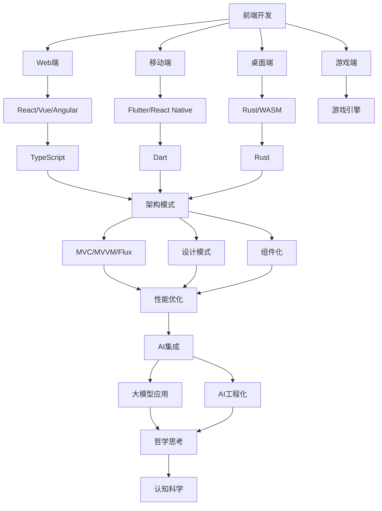

# 导航索引

## 目录

- [导航索引](#导航索引)
  - [目录](#目录)
- [快速导航](#快速导航)
- [🎯 按学习目标导航](#-按学习目标导航)
- [前端开发入门](#前端开发入门)
- [移动端开发](#移动端开发)
- [全栈开发](#全栈开发)
- [函数式编程](#函数式编程)
- [AI应用开发](#ai应用开发)
- [🏗️ 按技术领域导航](#️-按技术领域导航)
- [前端技术栈](#前端技术栈)
- [编程语言](#编程语言)
- [架构设计](#架构设计)
- [规范标准](#规范标准)
- [人工智能](#人工智能)
- [🎨 按应用场景导航](#-按应用场景导航)
- [Web应用开发](#web应用开发)
- [移动应用开发](#移动应用开发)
- [桌面应用开发](#桌面应用开发)
- [游戏开发](#游戏开发)
- [AI应用集成](#ai应用集成)
- [知识关联图谱](#知识关联图谱)
- [学习路径规划](#学习路径规划)
- [🚀 快速入门路径（2-3个月）](#-快速入门路径2-3个月)
- [🎯 专业发展路径（6-12个月）](#-专业发展路径6-12个月)
- [🌟 创新探索路径（持续学习）](#-创新探索路径持续学习)
- [技术选型指南](#技术选型指南)
- [企业级应用](#企业级应用)
- [移动应用](#移动应用)
- [高性能应用](#高性能应用)
- [AI驱动应用](#ai驱动应用)
- [常见问题快速定位](#常见问题快速定位)
- [技术问题](#技术问题)
- [设计问题](#设计问题)
- [工程问题](#工程问题)
- [AI相关问题](#ai相关问题)

---

> 本文档提供完整的知识体系导航，帮助快速定位和学习相关内容。

## 快速导航

## 🎯 按学习目标导航

## 前端开发入门

- **[1.1 Web端](./1.终端类型/1.1 Web端.md)** - Web开发基础
- **[2.1 前端主流框架](./2.技术栈与框架/2.1 前端主流框架.md)** - React、Vue、Angular
- **[2.6 Web核心技术](./2.技术栈与框架/2.6 Web核心技术.md)** - HTML、CSS、JavaScript
- **[3.4 TypeScript-JavaScript](./3.编程语言范式/3.4 TypeScript-JavaScript.md)** - JS/TS语言特性

## 移动端开发

- **[1.2 移动端](./1.终端类型/1.2 移动端.md)** - 移动端开发基础
- **[2.2 跨端框架](./2.技术栈与框架/2.2 跨端框架.md)** - Flutter、React Native
- **[3.5 Dart-Flutter](./3.编程语言范式/3.5 Dart-Flutter.md)** - Flutter开发
- **[5.3 性能优化与工程实践](./5.技术规范与标准/5.3 性能优化与工程实践.md)** - 移动端优化

# 全栈开发

- **[2.3 Rust前端全栈](./2.技术栈与框架/2.3 Rust前端全栈.md)** - Rust全栈开发
- **[2.4 Haskell-Scala前端](./2.技术栈与框架/2.4 Haskell-Scala前端.md)** - 函数式全栈
- **[2.5 WebAssembly](./2.技术栈与框架/2.5 WebAssembly.md)** - WASM技术
- **[2.7 现代前端工程化](./2.技术栈与框架/2.7 现代前端工程化.md)** - 工程化实践

## 函数式编程

- **[3.2 Haskell](./3.编程语言范式/3.2 Haskell.md)** - Haskell语言
- **[3.3 Scala](./3.编程语言范式/3.3 Scala.md)** - Scala语言
- **[2.4 Haskell-Scala前端](./2.技术栈与框架/2.4 Haskell-Scala前端.md)** - 函数式前端
- **[4.3 组件化与架构模式](./4.设计模式与架构/4.3 组件化与架构模式.md)** - 函数式架构

# AI应用开发

- **[6.1 AI基础原理](./6.人工智能原理与算法/6.1 AI基础原理.md)** - AI基础
- **[6.3 现代深度学习与大模型](./6.人工智能原理与算法/6.3 现代深度学习与大模型.md)** - 大模型应用
- **[6.4 AI工程实践与伦理](./6.人工智能原理与算法/6.4 AI工程实践与伦理.md)** - AI工程实践
- **[6.7 AI与艺术与创造力](./6.人工智能原理与算法/6.7 AI与艺术与创造力.md)** - AI创意应用
- **[6.11 系统化AI测试与质量保证](./6.人工智能原理与算法/6.11 系统化AI测试与质量保证.md)** - AI测试与质量保证
- **[6.12 系统化AI工程实践与工具链](./6.人工智能原理与算法/6.12 系统化AI工程实践与工具链.md)** - AI工程实践与工具链

# 🏗️ 按技术领域导航

# 前端技术栈

- **[2.1 前端主流框架](./2.技术栈与框架/2.1 前端主流框架.md)** - 主流框架对比
- **[2.2 跨端框架](./2.技术栈与框架/2.2 跨端框架.md)** - 跨端解决方案
- **[2.6 Web核心技术](./2.技术栈与框架/2.6 Web核心技术.md)** - Web基础技术
- **[2.7 现代前端工程化](./2.技术栈与框架/2.7 现代前端工程化.md)** - 工程化工具

# 编程语言

- **[3.1 Rust](./3.编程语言范式/3.1 Rust.md)** - Rust语言特性
- **[3.2 Haskell](./3.编程语言范式/3.2 Haskell.md)** - Haskell函数式编程
- **[3.3 Scala](./3.编程语言范式/3.3 Scala.md)** - Scala混合范式
- **[3.4 TypeScript-JavaScript](./3.编程语言范式/3.4 TypeScript-JavaScript.md)** - JS/TS生态
- **[3.5 Dart-Flutter](./3.编程语言范式/3.5 Dart-Flutter.md)** - Dart移动开发

# 架构设计

- **[4.1 GoF设计模式](./4.设计模式与架构/4.1 GoF设计模式.md)** - 经典设计模式
- **[4.2 结构型-行为型-创建型模式](./4.设计模式与架构/4.2 结构型-行为型-创建型模式.md)** - 模式分类
- **[4.3 组件化与架构模式](./4.设计模式与架构/4.3 组件化与架构模式.md)** - 架构模式
- **[4.4 哲学与认知批判性分析](./4.设计模式与架构/4.4 哲学与认知批判性分析.md)** - 哲学思考

# 规范标准

- **[5.1 UI-UE-UX设计规范](./5.技术规范与标准/5.1 UI-UE-UX设计规范.md)** - 设计规范
- **[5.2 可访问性与国际化](./5.技术规范与标准/5.2 可访问性与国际化.md)** - 可访问性
- **[5.3 性能优化与工程实践](./5.技术规范与标准/5.3 性能优化与工程实践.md)** - 性能优化
- **[5.4 代码示例与形式化证明](./5.技术规范与标准/5.4 代码示例与形式化证明.md)** - 代码质量
- **[5.9 系统化前端安全与隐私保护](./5.技术规范与标准/5.9 系统化前端安全与隐私保护.md)** - 前端安全与隐私保护
- **[5.10 系统化前端性能优化与工程实践](./5.技术规范与标准/5.10 系统化前端性能优化与工程实践.md)** - 前端性能优化与工程实践

# 人工智能

- **[6.1 AI基础原理](./6.人工智能原理与算法/6.1 AI基础原理.md)** - AI基础理论
- **[6.2 经典AI算法与模型](./6.人工智能原理与算法/6.2 经典AI算法与模型.md)** - 经典算法
- **[6.3 现代深度学习与大模型](./6.人工智能原理与算法/6.3 现代深度学习与大模型.md)** - 深度学习
- **[6.4 AI工程实践与伦理](./6.人工智能原理与算法/6.4 AI工程实践与伦理.md)** - AI工程化
- **[6.5 AI与哲学](./6.人工智能原理与算法/6.5 AI与哲学.md)** - AI哲学思考
- **[6.6 AI与认知科学](./6.人工智能原理与算法/6.6 AI与认知科学.md)** - 认知科学
- **[6.7 AI与艺术与创造力](./6.人工智能原理与算法/6.7 AI与艺术与创造力.md)** - AI艺术
- **[6.8 AI与社会治理](./6.人工智能原理与算法/6.8 AI与社会治理.md)** - AI社会影响
- **[6.11 系统化AI测试与质量保证](./6.人工智能原理与算法/6.11 系统化AI测试与质量保证.md)** - AI测试与质量保证
- **[6.12 系统化AI工程实践与工具链](./6.人工智能原理与算法/6.12 系统化AI工程实践与工具链.md)** - AI工程实践与工具链

# 🎨 按应用场景导航

# Web应用开发

- **[1.1 Web端](./1.终端类型/1.1 Web端.md)** - Web端特性
- **[2.1 前端主流框架](./2.技术栈与框架/2.1 前端主流框架.md)** - 框架选择
- **[2.6 Web核心技术](./2.技术栈与框架/2.6 Web核心技术.md)** - 核心技术
- **[5.1 UI-UE-UX设计规范](./5.技术规范与标准/5.1 UI-UE-UX设计规范.md)** - 设计规范

# 移动应用开发

- **[1.2 移动端](./1.终端类型/1.2 移动端.md)** - 移动端特性
- **[2.2 跨端框架](./2.技术栈与框架/2.2 跨端框架.md)** - 跨端解决方案
- **[3.5 Dart-Flutter](./3.编程语言范式/3.5 Dart-Flutter.md)** - Flutter开发
- **[5.3 性能优化与工程实践](./5.技术规范与标准/5.3 性能优化与工程实践.md)** - 性能优化

# 桌面应用开发

- **[1.3 桌面端](./1.终端类型/1.3 桌面端.md)** - 桌面端特性
- **[2.3 Rust前端全栈](./2.技术栈与框架/2.3 Rust前端全栈.md)** - Rust桌面应用
- **[2.5 WebAssembly](./2.技术栈与框架/2.5 WebAssembly.md)** - WASM桌面应用
- **[4.3 组件化与架构模式](./4.设计模式与架构/4.3 组件化与架构模式.md)** - 桌面架构

# 游戏开发

- **[1.4 游戏端](./1.终端类型/1.4 游戏端.md)** - 游戏端特性
- **[2.5 WebAssembly](./2.技术栈与框架/2.5 WebAssembly.md)** - 游戏性能优化
- **[5.3 性能优化与工程实践](./5.技术规范与标准/5.3 性能优化与工程实践.md)** - 游戏性能
- **[6.7 AI与艺术与创造力](./6.人工智能原理与算法/6.7 AI与艺术与创造力.md)** - AI游戏

# AI应用集成

- **[6.1 AI基础原理](./6.人工智能原理与算法/6.1 AI基础原理.md)** - AI基础
- **[6.3 现代深度学习与大模型](./6.人工智能原理与算法/6.3 现代深度学习与大模型.md)** - 大模型应用
- **[6.4 AI工程实践与伦理](./6.人工智能原理与算法/6.4 AI工程实践与伦理.md)** - AI工程化
- **[2.7 现代前端工程化](./2.技术栈与框架/2.7 现代前端工程化.md)** - AI工具集成

# 知识关联图谱

# 学习路径规划

# 🚀 快速入门路径（2-3个月）

1. **基础阶段（1个月）**
- [1.1 Web端](./1.终端类型/1.1 Web端.md) - Web基础
- [2.6 Web核心技术](./2.技术栈与框架/2.6 Web核心技术.md) - HTML/CSS/JS
- [3.4 TypeScript-JavaScript](./3.编程语言范式/3.4 TypeScript-JavaScript.md) - TS基础

2. **框架阶段（1个月）**
- [2.1 前端主流框架](./2.技术栈与框架/2.1 前端主流框架.md) - 选择一个主流框架
- [4.3 组件化与架构模式](./4.设计模式与架构/4.3 组件化与架构模式.md) - 架构基础

3. **实践阶段（1个月）**
- [5.3 性能优化与工程实践](./5.技术规范与标准/5.3 性能优化与工程实践.md) - 工程化
- [2.7 现代前端工程化](./2.技术栈与框架/2.7 现代前端工程化.md) - 工具链

# 🎯 专业发展路径（6-12个月）

1. **深度技术（3个月）**
- [2.3 Rust前端全栈](./2.技术栈与框架/2.3 Rust前端全栈.md) - 系统级开发
- [2.4 Haskell-Scala前端](./2.技术栈与框架/2.4 Haskell-Scala前端.md) - 函数式编程
- [4.1 GoF设计模式](./4.设计模式与架构/4.1 GoF设计模式.md) - 设计模式

2. **跨端开发（3个月）**
- [2.2 跨端框架](./2.技术栈与框架/2.2 跨端框架.md) - 跨端解决方案
- [1.2 移动端](./1.终端类型/1.2 移动端.md) - 移动端开发
- [1.3 桌面端](./1.终端类型/1.3 桌面端.md) - 桌面端开发

3. **AI集成（6个月）**
- [6.1 AI基础原理](./6.人工智能原理与算法/6.1 AI基础原理.md) - AI基础
- [6.3 现代深度学习与大模型](./6.人工智能原理与算法/6.3 现代深度学习与大模型.md) - 大模型
- [6.4 AI工程实践与伦理](./6.人工智能原理与算法/6.4 AI工程实践与伦理.md) - AI工程化

# 🌟 创新探索路径（持续学习）

1. **哲学思考**
- [4.4 哲学与认知批判性分析](./4.设计模式与架构/4.4 哲学与认知批判性分析.md)
- [6.5 AI与哲学](./6.人工智能原理与算法/6.5 AI与哲学.md)

2. **认知科学**
- [6.6 AI与认知科学](./6.人工智能原理与算法/6.6 AI与认知科学.md)
- [5.2 可访问性与国际化](./5.技术规范与标准/5.2 可访问性与国际化.md)

3. **艺术与创造力**
- [6.7 AI与艺术与创造力](./6.人工智能原理与算法/6.7 AI与艺术与创造力.md)
- [1.4 游戏端](./1.终端类型/1.4 游戏端.md)

# 技术选型指南

# 企业级应用

- **推荐技术栈**：React + TypeScript + Redux
- **架构模式**：Clean Architecture + CQRS
- **相关文档**：
- [2.1 前端主流框架](./2.技术栈与框架/2.1 前端主流框架.md)
- [4.3 组件化与架构模式](./4.设计模式与架构/4.3 组件化与架构模式.md)
- [5.3 性能优化与工程实践](./5.技术规范与标准/5.3 性能优化与工程实践.md)

# 移动应用

- **推荐技术栈**：Flutter + Dart
- **架构模式**：BLoC + Clean Architecture
- **相关文档**：
- [2.2 跨端框架](./2.技术栈与框架/2.2 跨端框架.md)
- [3.5 Dart-Flutter](./3.编程语言范式/3.5 Dart-Flutter.md)
- [1.2 移动端](./1.终端类型/1.2 移动端.md)

# 高性能应用

- **推荐技术栈**：Rust + WebAssembly
- **架构模式**：系统级架构 + 零拷贝
- **相关文档**：
- [2.3 Rust前端全栈](./2.技术栈与框架/2.3 Rust前端全栈.md)
- [2.5 WebAssembly](./2.技术栈与框架/2.5 WebAssembly.md)
- [3.1 Rust](./3.编程语言范式/3.1 Rust.md)

# AI驱动应用

- **推荐技术栈**：React + TensorFlow.js + Python后端
- **架构模式**：AI-First Architecture
- **相关文档**：
- [6.1 AI基础原理](./6.人工智能原理与算法/6.1 AI基础原理.md)
- [6.3 现代深度学习与大模型](./6.人工智能原理与算法/6.3 现代深度学习与大模型.md)
- [6.4 AI工程实践与伦理](./6.人工智能原理与算法/6.4 AI工程实践与伦理.md)

# 常见问题快速定位

# 技术问题

- **性能问题** → [5.3 性能优化与工程实践](./5.技术规范与标准/5.3 性能优化与工程实践.md)
- **架构问题** → [4.3 组件化与架构模式](./4.设计模式与架构/4.3 组件化与架构模式.md)
- **语言问题** → [3.编程语言范式](./3.编程语言范式/README.md)
- **框架问题** → [2.技术栈与框架](./2.技术栈与框架/README.md)

# 设计问题

- **UI设计** → [5.1 UI-UE-UX设计规范](./5.技术规范与标准/5.1 UI-UE-UX设计规范.md)
- **可访问性** → [5.2 可访问性与国际化](./5.技术规范与标准/5.2 可访问性与国际化.md)
- **设计模式** → [4.1 GoF设计模式](./4.设计模式与架构/4.1 GoF设计模式.md)

# 工程问题

- **工程化** → [2.7 现代前端工程化](./2.技术栈与框架/2.7 现代前端工程化.md)
- **代码质量** → [5.4 代码示例与形式化证明](./5.技术规范与标准/5.4 代码示例与形式化证明.md)
- **测试** → [5.3 性能优化与工程实践](./5.技术规范与标准/5.3 性能优化与工程实践.md)

# AI相关问题

- **AI基础** → [6.1 AI基础原理](./6.人工智能原理与算法/6.1 AI基础原理.md)
- **大模型** → [6.3 现代深度学习与大模型](./6.人工智能原理与算法/6.3 现代深度学习与大模型.md)
- **AI工程** → [6.4 AI工程实践与伦理](./6.人工智能原理与算法/6.4 AI工程实践与伦理.md)
- **AI伦理** → [6.5 AI与哲学](./6.人工智能原理与算法/6.5 AI与哲学.md)

---

> 本导航索引持续更新，欢迎反馈和建议。
