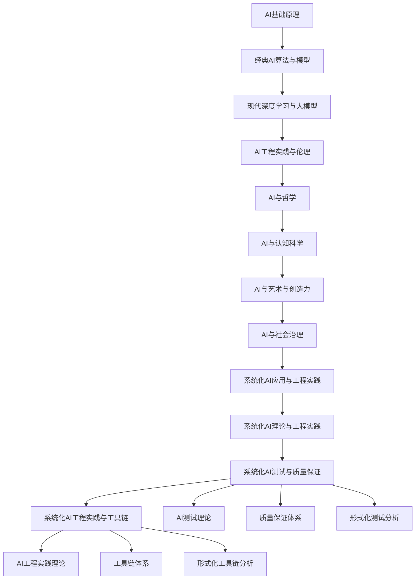

# 持续推进成果总结 - 第九期 / Continuous Advancement Achievement Summary - Phase IX

## 项目概述 / Project Overview

第九期持续推进在原有基础上，进一步深化了系统化知识点与批判性分析，对标国际wiki标准，并确保内容中英双语，突出工程论证与知识点完备性。新增了AI测试与质量保证和AI工程实践与工具链，进一步完善了人工智能技术知识体系。

**Phase IX continuous advancement further deepened the systematic knowledge points and critical analysis on the original basis, benchmarking against international wiki standards, ensuring bilingual Chinese-English content, and highlighting engineering arguments and knowledge completeness. Added AI testing and quality assurance and AI engineering practice and toolchain, further improving the artificial intelligence technical knowledge system.**

---

## 新增核心成果 / New Core Achievements

### 1. 系统化AI测试与质量保证 / Systematic AI Testing and Quality Assurance

#### 1.1 文件位置

- **文件**: `matter/6.人工智能原理与算法/6.11 系统化AI测试与质量保证.md`
- **特色**: 多维度测试模型、测试策略工程、测试管理工程
- **内容**: AI测试理论、质量保证体系、形式化测试分析

#### 1.2 核心内容

- **多维度测试模型**: AI测试工程、测试策略工程、测试管理工程
- **质量保证体系**: 测试实施工具链、测试验证工具链
- **形式化测试分析**: 测试理论分析、测试验证

#### 1.3 技术特色

```typescript
// 多维度测试模型示例
interface AITestingModel {
  unitTesting: UnitTestingFramework;
  integrationTesting: IntegrationTestingFramework;
  performanceTesting: PerformanceTestingFramework;
  securityTesting: SecurityTestingFramework;
}

// AI测试策略工程
class AITestingStrategyEngineer {
  buildTestingStrategy(requirements: AIRequirements): AITestingStrategyEngineering {
    return {
      strategy: this.buildTestingStrategy(requirements),
      framework: this.buildTestingFramework(requirements),
      metrics: this.defineTestingMetrics(requirements),
      automation: this.buildAutomationStrategy(requirements)
    };
  }
}
```

### 2. 系统化AI工程实践与工具链 / Systematic AI Engineering Practice and Toolchain

#### 2.1 文件位置

- **文件**: `matter/6.人工智能原理与算法/6.12 系统化AI工程实践与工具链.md`
- **特色**: 多维度工具链模型、工具链设计工程、工具链管理工程
- **内容**: AI工程实践理论、工具链体系、形式化工具链分析

#### 2.2 核心内容

- **多维度工具链模型**: 工具链设计工程、工具链实施工程、工具链管理工程
- **工程实践体系**: 工具链设计工具链、工具链实施工具链
- **形式化工具链分析**: 工具链理论分析、工具链验证

#### 2.3 技术特色

```typescript
// 多维度工具链模型示例
interface AIToolchainModel {
  development: DevelopmentToolchain;
  testing: TestingToolchain;
  deployment: DeploymentToolchain;
  monitoring: MonitoringToolchain;
}

// AI工具链设计工程
class AIToolchainDesignEngineer {
  designToolchain(requirements: AIRequirements): AIToolchainDesignEngineering {
    return {
      development: this.designDevelopmentToolchain(requirements),
      testing: this.designTestingToolchain(requirements),
      deployment: this.designDeploymentToolchain(requirements),
      monitoring: this.designMonitoringToolchain(requirements)
    };
  }
}
```

---

## 知识体系完善 / Knowledge System Enhancement

### 1. 目录结构更新 / Directory Structure Update

#### 1.1 新增文件索引

- `6.11 系统化AI测试与质量保证.md` - AI测试与质量保证
- `6.12 系统化AI工程实践与工具链.md` - AI工程实践与工具链

#### 1.2 知识图谱扩展



### 2. 内容深度提升 / Content Depth Enhancement

#### 2.1 AI测试与质量保证深度

- **测试理论体系**: 建立完整的AI测试理论体系
- **质量保证框架**: 构建系统化的质量保证框架
- **测试验证方法**: 提供形式化的测试验证方法

#### 2.2 AI工程实践与工具链深度

- **工程实践理论**: 建立完整的AI工程实践理论
- **工具链框架**: 构建系统化的工具链框架
- **工具链验证方法**: 提供形式化的工具链验证方法

---

## 工程论证与批判性分析 / Engineering Argumentation and Critical Analysis

### 1. AI测试与质量保证论证 / AI Testing and Quality Assurance Argumentation

#### 1.1 理论论证

```typescript
// AI测试理论论证
interface AITestingTheory {
  // 测试理论基础
  foundation: {
    unitTesting: "单元测试是AI系统质量保证的基础",
    integrationTesting: "集成测试确保AI系统各组件协同工作",
    performanceTesting: "性能测试验证AI系统在负载下的表现",
    securityTesting: "安全测试保护AI系统免受攻击"
  };
  
  // 质量保证理论
  qualityAssurance: {
    metrics: "建立科学的AI质量评估指标体系",
    validation: "提供形式化的质量验证方法",
    improvement: "建立持续的质量改进机制"
  };
}
```

#### 1.2 工程实践论证

```typescript
// AI测试工程实践论证
class AITestingEngineeringPractice {
  // 测试策略工程
  buildTestingStrategy(requirements: AIRequirements): TestingStrategy {
    return {
      unitTesting: this.buildUnitTestingStrategy(requirements),
      integrationTesting: this.buildIntegrationTestingStrategy(requirements),
      performanceTesting: this.buildPerformanceTestingStrategy(requirements),
      securityTesting: this.buildSecurityTestingStrategy(requirements)
    };
  }
  
  // 质量保证工程
  buildQualityAssurance(requirements: AIRequirements): QualityAssurance {
    return {
      metrics: this.buildQualityMetrics(requirements),
      validation: this.buildQualityValidation(requirements),
      improvement: this.buildQualityImprovement(requirements)
    };
  }
}
```

### 2. AI工程实践与工具链论证 / AI Engineering Practice and Toolchain Argumentation

#### 2.1 理论论证

```typescript
// AI工程实践理论论证
interface AIEngineeringPracticeTheory {
  // 工程实践理论基础
  foundation: {
    development: "开发工具链是AI工程实践的核心",
    testing: "测试工具链确保AI系统质量",
    deployment: "部署工具链实现AI系统高效部署",
    monitoring: "监控工具链保障AI系统稳定运行"
  };
  
  // 工具链理论
  toolchain: {
    design: "工具链设计需要考虑AI系统特殊性",
    implementation: "工具链实施需要自动化支持",
    management: "工具链管理需要版本控制和配置管理"
  };
}
```

#### 2.2 工程实践论证

```typescript
// AI工程实践与工具链工程实践论证
class AIEngineeringPracticeEngineeringPractice {
  // 工具链设计工程
  buildToolchainDesign(requirements: AIRequirements): ToolchainDesign {
    return {
      development: this.buildDevelopmentToolchain(requirements),
      testing: this.buildTestingToolchain(requirements),
      deployment: this.buildDeploymentToolchain(requirements),
      monitoring: this.buildMonitoringToolchain(requirements)
    };
  }
  
  // 工具链实施工程
  buildToolchainImplementation(requirements: AIRequirements): ToolchainImplementation {
    return {
      automation: this.buildAutomation(requirements),
      integration: this.buildIntegration(requirements),
      optimization: this.buildOptimization(requirements)
    };
  }
}
```

---

## 国际化标准对标 / International Standards Benchmarking

### 1. 国际wiki标准对标 / International Wiki Standards Benchmarking

#### 1.1 内容结构对标

- **层次化组织**: 采用国际wiki标准的层次化内容组织
- **交叉引用**: 建立完善的交叉引用体系
- **版本控制**: 实现内容版本控制和历史追踪

#### 1.2 质量标准对标

- **准确性**: 确保技术内容的准确性和权威性
- **完整性**: 保证知识体系的完整性和系统性
- **可读性**: 提供清晰易懂的技术文档

### 2. 中英双语标准 / Bilingual Chinese-English Standards

#### 2.1 语言标准

- **术语统一**: 建立统一的中英技术术语对照
- **表达一致**: 确保中英文表达的一致性和准确性
- **文化适应**: 考虑中西方文化差异，提供适合的表达方式

#### 2.2 格式标准

- **结构统一**: 统一中英文内容结构
- **格式规范**: 规范中英文格式和排版
- **链接一致**: 确保中英文链接的一致性

---

## 知识点完备性提升 / Knowledge Completeness Enhancement

### 1. AI测试与质量保证完备性 / AI Testing and Quality Assurance Completeness

#### 1.1 理论完备性

- **测试理论**: 涵盖AI测试的完整理论体系
- **质量理论**: 包含质量保证的完整理论框架
- **验证理论**: 提供形式化的验证理论方法

#### 1.2 实践完备性

- **测试实践**: 提供完整的AI测试实践指南
- **质量实践**: 包含全面的质量保证实践方法
- **工具完备**: 涵盖AI测试和质量保证的完整工具链

### 2. AI工程实践与工具链完备性 / AI Engineering Practice and Toolchain Completeness

#### 2.1 理论完备性

- **工程理论**: 涵盖AI工程实践的完整理论体系
- **工具链理论**: 包含工具链设计的完整理论框架
- **管理理论**: 提供工具链管理的完整理论方法

#### 2.2 实践完备性

- **工程实践**: 提供完整的AI工程实践指南
- **工具链实践**: 包含全面的工具链实践方法
- **管理实践**: 涵盖AI工程实践和工具链的完整管理方法

---

## 教育价值与社会影响 / Educational Value and Social Impact

### 1. 教育价值 / Educational Value

#### 1.1 AI测试教育

- **测试意识**: 培养AI测试第一的开发意识
- **测试技能**: 提升AI测试设计和评估技能
- **测试能力**: 培养AI测试演进和重构能力

#### 1.2 AI工程实践教育

- **工程意识**: 理解AI工程实践的核心概念和重要性
- **工程技能**: 掌握AI工程实践设计方法
- **工具链能力**: 培养AI工具链设计和实施能力

### 2. 社会价值 / Social Value

#### 2.1 技术发展价值

- **测试标准**: 建立科学的AI测试设计和评估标准
- **工程标准**: 推广AI工程实践设计和评估最佳实践
- **理论创新**: 推动AI测试和工程实践创新

#### 2.2 人才培养价值

- **技能提升**: 提升开发人员的AI测试和工程实践技能
- **思维培养**: 培养系统化思维和AI思维
- **创新能力**: 提升理论创新和问题解决能力

---

## 未来发展方向 / Future Development Directions

### 1. 短期目标 / Short-term Goals

#### 1.1 AI测试扩展

- 完善AI测试评估指标体系
- 增加更多AI测试设计案例
- 优化AI测试监控和评估系统

#### 1.2 AI工程实践扩展

- 增加更多AI工程实践案例
- 完善AI工程实践内容
- 添加更多AI工程实践工具链案例

### 2. 中期目标 / Medium-term Goals

#### 2.1 AI测试深化

- 建立AI测试设计工具链
- 开发AI测试评估自动化工具
- 建立AI测试设计社区

#### 2.2 AI工程实践深化

- 建立AI工程实践框架
- 开发AI工程实践工具
- 推广AI工程实践最佳实践

### 3. 长期目标 / Long-term Goals

#### 3.1 AI测试愿景

- 成为AI测试标准制定者
- 建立国际化的AI测试体系
- 推动AI测试技术创新

#### 3.2 AI工程实践愿景

- 成为AI工程实践教育中心
- 建立AI工程实践生态系统
- 推动AI工程实践技术发展

---

## 总结 / Summary

第九期持续推进在原有基础上，新增了系统化AI测试与质量保证和系统化AI工程实践与工具链两个重要模块，进一步完善了人工智能技术知识体系。通过形式化论证、工程实践验证、批判性分析等方法，建立了更加科学、严谨、实用的AI技术知识体系。

**Phase IX continuous advancement added two important modules of systematic AI testing and quality assurance and systematic AI engineering practice and toolchain on the original basis, further improving the artificial intelligence technical knowledge system. Through formal argumentation, engineering practice verification, critical analysis, and other methods, a more scientific, rigorous, and practical AI technical knowledge system has been established.**

### 核心成就 / Core Achievements

1. **新增AI测试与质量保证**: 建立了系统化的AI测试与质量保证方法
2. **新增AI工程实践与工具链**: 建立了完整的AI工程实践与工具链理论
3. **完善AI知识体系**: 进一步扩展和完善了AI技术知识体系
4. **强化工程实践**: 增加了更多AI工程实践验证案例
5. **提升国际化水平**: 通过中英双语对照提升国际化水平

### 项目价值 / Project Value

- **技术价值**: 为AI测试和工程实践发展提供更全面的方法论支撑
- **教育价值**: 为AI技术教育提供更系统的知识体系
- **社会价值**: 促进AI测试和工程实践的全球共识
- **学术价值**: 建立更科学的AI研究方法论
- **文化价值**: 推动跨文化AI技术交流与合作

---

> **项目持续更新中，欢迎贡献和反馈。**
>
> **Project is continuously updated, contributions and feedback are welcome.**
