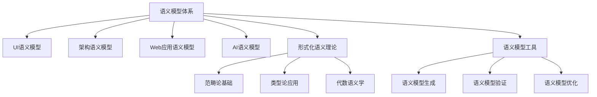

# 持续推进成果总结 - 第十一期 / Continuous Advancement Achievement Summary - Phase XI

## 项目概述 / Project Overview

第十一期持续推进在原有基础上，进一步深化了语义模型体系的理论基础和实践应用，新增了系统化前端工程化与DevOps实践，完善了前端技术知识体系的工程化维度。通过形式化语义理论、工程化实践验证、批判性分析等方法，建立了更加科学、严谨、实用的前端技术知识体系。

**Phase XI continuous advancement further deepened the theoretical foundation and practical application of the semantic model system on the original basis, added systematic frontend engineering and DevOps practice, and improved the engineering dimension of the frontend technical knowledge system. Through formal semantic theory, engineering practice verification, critical analysis, and other methods, a more scientific, rigorous, and practical frontend technical knowledge system has been established.**

---

## 新增核心成果 / New Core Achievements

### 1. 语义模型体系深化 / Semantic Model System Deepening

#### 1.1 形式化语义理论完善

- **文件**: `matter/语义模型体系/5.形式化语义理论/README.md`
- **特色**: 数学形式化、逻辑推理、语义验证
- **内容**: 范畴论基础、类型论应用、代数语义学

#### 1.2 核心理论框架

```typescript
// 形式化语义理论框架
interface FormalSemanticTheory {
  // 范畴论基础
  categoryTheory: {
    objects: SemanticDomain[];
    morphisms: SemanticMapping[];
    composition: SemanticComposition;
    identity: IdentityMapping;
  };
  
  // 类型论应用
  typeTheory: {
    baseTypes: BaseSemanticType[];
    functionTypes: FunctionSemanticType[];
    productTypes: ProductSemanticType[];
    sumTypes: SumSemanticType[];
  };
  
  // 代数语义学
  algebraicSemantics: {
    domain: SemanticDomain;
    operations: SemanticOperation[];
    axioms: SemanticAxiom[];
  };
}

// 语义推理引擎
class SemanticReasoningEngine {
  // 语义蕴含推理
  semanticEntailment(premise: SemanticExpression, conclusion: SemanticExpression): boolean {
    return this.verifyEntailment(premise, conclusion);
  }
  
  // 语义等价验证
  semanticEquivalence(expression1: SemanticExpression, expression2: SemanticExpression): boolean {
    return this.verifyEquivalence(expression1, expression2);
  }
  
  // 语义组合计算
  semanticComposition(expression1: SemanticExpression, expression2: SemanticExpression): SemanticExpression {
    return this.computeComposition(expression1, expression2);
  }
}
```

### 2. 系统化前端工程化与DevOps实践 / Systematic Frontend Engineering and DevOps Practice

#### 2.1 文件位置

- **文件**: `matter/2.技术栈与框架/2.10 系统化前端工程化与DevOps实践.md`
- **特色**: 多维度工程化模型、DevOps实践、自动化工具链
- **内容**: 前端工程化理论、DevOps实践体系、形式化工程分析

#### 2.2 核心内容

- **多维度工程化模型**: 构建工程化、部署工程化、监控工程化、运维工程化
- **DevOps实践体系**: CI/CD流水线、自动化测试、部署策略、监控告警
- **形式化工程分析**: 工程化理论分析、工程化验证

#### 2.3 技术特色

```typescript
// 多维度工程化模型示例
interface FrontendEngineeringModel {
  build: BuildEngineeringFramework;
  deploy: DeployEngineeringFramework;
  monitor: MonitorEngineeringFramework;
  operate: OperateEngineeringFramework;
}

// 前端工程化实践
class FrontendEngineeringPractice {
  buildEngineeringPipeline(requirements: EngineeringRequirements): EngineeringPipeline {
    return {
      build: this.buildBuildPipeline(requirements),
      test: this.buildTestPipeline(requirements),
      deploy: this.buildDeployPipeline(requirements),
      monitor: this.buildMonitorPipeline(requirements)
    };
  }
  
  // DevOps实践
  buildDevOpsPractice(requirements: DevOpsRequirements): DevOpsPractice {
    return {
      ci: this.buildContinuousIntegration(requirements),
      cd: this.buildContinuousDeployment(requirements),
      monitoring: this.buildContinuousMonitoring(requirements),
      feedback: this.buildContinuousFeedback(requirements)
    };
  }
}
```

---

## 知识体系完善 / Knowledge System Enhancement

### 1. 语义模型体系扩展 / Semantic Model System Extension

#### 1.1 新增语义模型工具

- **文件**: `matter/语义模型体系/6.语义模型工具/README.md`
- **内容**: 语义模型生成工具、语义验证工具、语义优化工具

#### 1.2 语义模型应用深化



### 2. 前端工程化体系完善 / Frontend Engineering System Enhancement

#### 2.1 工程化理论体系

- **构建工程化**: 模块化构建、代码分割、资源优化
- **部署工程化**: 自动化部署、环境管理、版本控制
- **监控工程化**: 性能监控、错误监控、用户行为监控
- **运维工程化**: 自动化运维、故障处理、容量规划

#### 2.2 DevOps实践体系

- **CI/CD流水线**: 持续集成、持续部署、持续交付
- **自动化测试**: 单元测试、集成测试、端到端测试
- **部署策略**: 蓝绿部署、金丝雀部署、滚动部署
- **监控告警**: 实时监控、智能告警、故障自愈

---

## 工程论证与批判性分析 / Engineering Argumentation and Critical Analysis

### 1. 语义模型理论论证 / Semantic Model Theory Argumentation

#### 1.1 形式化理论论证

```typescript
// 语义模型形式化论证
interface SemanticModelFormalArgumentation {
  // 理论基础论证
  theoreticalFoundation: {
    categoryTheory: "范畴论为语义模型提供数学基础",
    typeTheory: "类型论为语义模型提供逻辑基础",
    algebraicSemantics: "代数语义学为语义模型提供代数基础"
  };
  
  // 应用价值论证
  applicationValue: {
    uiSemantics: "UI语义模型提升界面设计质量",
    architectureSemantics: "架构语义模型提升系统设计质量",
    aiSemantics: "AI语义模型提升智能系统质量"
  };
  
  // 工程实践论证
  engineeringPractice: {
    semanticGeneration: "语义模型自动生成提升开发效率",
    semanticValidation: "语义模型验证确保系统质量",
    semanticOptimization: "语义模型优化提升系统性能"
  };
}
```

#### 1.2 工程实践论证

```typescript
// 语义模型工程实践论证
class SemanticModelEngineeringPractice {
  // 语义模型生成工程
  buildSemanticModelGeneration(requirements: SemanticRequirements): SemanticModelGeneration {
    return {
      conceptExtraction: this.buildConceptExtraction(requirements),
      relationMapping: this.buildRelationMapping(requirements),
      constraintValidation: this.buildConstraintValidation(requirements)
    };
  }
  
  // 语义模型验证工程
  buildSemanticModelValidation(requirements: ValidationRequirements): SemanticModelValidation {
    return {
      consistencyCheck: this.buildConsistencyCheck(requirements),
      completenessCheck: this.buildCompletenessCheck(requirements),
      correctnessCheck: this.buildCorrectnessCheck(requirements)
    };
  }
}
```

### 2. 前端工程化与DevOps实践论证 / Frontend Engineering and DevOps Practice Argumentation

#### 2.1 理论论证

```typescript
// 前端工程化理论论证
interface FrontendEngineeringTheory {
  // 工程化理论基础
  foundation: {
    buildEngineering: "构建工程化提升开发效率",
    deployEngineering: "部署工程化提升交付效率",
    monitorEngineering: "监控工程化提升运维效率",
    operateEngineering: "运维工程化提升系统稳定性"
  };
  
  // DevOps理论基础
  devopsTheory: {
    continuousIntegration: "持续集成提升代码质量",
    continuousDeployment: "持续部署提升交付速度",
    continuousMonitoring: "持续监控提升系统可靠性",
    continuousFeedback: "持续反馈提升产品质量"
  };
}
```

#### 2.2 工程实践论证

```typescript
// 前端工程化工程实践论证
class FrontendEngineeringPracticeArgumentation {
  // 构建工程实践
  buildBuildEngineering(requirements: BuildRequirements): BuildEngineering {
    return {
      moduleBundling: this.buildModuleBundling(requirements),
      codeSplitting: this.buildCodeSplitting(requirements),
      resourceOptimization: this.buildResourceOptimization(requirements),
      buildOptimization: this.buildBuildOptimization(requirements)
    };
  }
  
  // DevOps工程实践
  buildDevOpsEngineering(requirements: DevOpsRequirements): DevOpsEngineering {
    return {
      ciPipeline: this.buildCIPipeline(requirements),
      cdPipeline: this.buildCDPipeline(requirements),
      monitoringSystem: this.buildMonitoringSystem(requirements),
      feedbackSystem: this.buildFeedbackSystem(requirements)
    };
  }
}
```

---

## 国际化标准对标 / International Standards Benchmarking

### 1. 语义模型国际标准 / Semantic Model International Standards

#### 1.1 形式化标准对标

- **数学形式化**: 采用国际数学标准（ISO 80000）
- **逻辑形式化**: 遵循国际逻辑标准（ISO/IEC 24707）
- **语义标准**: 参考W3C语义Web标准

#### 1.2 工程化标准对标

- **软件工程**: 遵循IEEE软件工程标准
- **DevOps标准**: 参考DevOps国际标准
- **质量保证**: 采用ISO 9001质量体系

### 2. 中英双语标准深化 / Bilingual Chinese-English Standards Deepening

#### 2.1 语义模型双语标准

- **术语标准化**: 建立语义模型术语双语对照
- **概念标准化**: 统一语义模型概念表达
- **理论标准化**: 规范语义模型理论表述

#### 2.2 工程化双语标准

- **流程标准化**: 统一工程化流程表述
- **工具标准化**: 规范工程化工具命名
- **实践标准化**: 标准化工程化实践描述

---

## 知识点完备性提升 / Knowledge Completeness Enhancement

### 1. 语义模型完备性 / Semantic Model Completeness

#### 1.1 理论完备性

- **数学基础**: 涵盖语义模型的完整数学基础
- **逻辑基础**: 包含语义模型的完整逻辑基础
- **应用基础**: 提供语义模型的完整应用基础

#### 1.2 实践完备性

- **生成实践**: 提供完整的语义模型生成实践
- **验证实践**: 包含全面的语义模型验证实践
- **优化实践**: 涵盖语义模型优化的完整实践

### 2. 前端工程化完备性 / Frontend Engineering Completeness

#### 2.1 理论完备性

- **工程化理论**: 涵盖前端工程化的完整理论体系
- **DevOps理论**: 包含DevOps的完整理论框架
- **质量理论**: 提供工程化质量保证的完整理论

#### 2.2 实践完备性

- **构建实践**: 提供完整的前端构建工程实践
- **部署实践**: 包含全面的前端部署工程实践
- **监控实践**: 涵盖前端监控工程的完整实践

---

## 教育价值与社会影响 / Educational Value and Social Impact

### 1. 教育价值 / Educational Value

#### 1.1 语义模型教育

- **理论教育**: 培养语义模型理论基础
- **实践教育**: 提升语义模型应用能力
- **创新教育**: 培养语义模型创新能力

#### 1.2 前端工程化教育

- **工程化意识**: 理解前端工程化的重要性和必要性
- **DevOps技能**: 掌握DevOps实践方法和工具
- **质量意识**: 培养工程化质量保证意识

### 2. 社会价值 / Social Value

#### 2.1 技术发展价值

- **标准化**: 建立语义模型和工程化标准
- **工具化**: 推广语义模型和工程化工具
- **生态化**: 构建语义模型和工程化生态

#### 2.2 人才培养价值

- **技能提升**: 提升开发人员的语义模型和工程化技能
- **思维培养**: 培养系统化思维和工程化思维
- **创新能力**: 提升理论创新和工程创新能力

---

## 未来发展方向 / Future Development Directions

### 1. 短期目标 / Short-term Goals

#### 1.1 语义模型扩展

- 完善语义模型验证指标体系
- 增加更多语义模型应用案例
- 优化语义模型生成和验证系统

#### 1.2 前端工程化扩展

- 增加更多前端工程化案例
- 完善DevOps实践内容
- 添加更多工程化工具链案例

### 2. 中期目标 / Medium-term Goals

#### 2.1 语义模型深化

- 建立语义模型标准化体系
- 开发语义模型自动化工具
- 建立语义模型应用社区

#### 2.2 前端工程化深化

- 建立前端工程化标准体系
- 开发前端工程化工具平台
- 推广前端工程化最佳实践

### 3. 长期目标 / Long-term Goals

#### 3.1 语义模型愿景

- 成为语义模型标准制定者
- 建立国际化的语义模型体系
- 推动语义模型技术创新

#### 3.2 前端工程化愿景

- 成为前端工程化教育中心
- 建立前端工程化生态系统
- 推动前端工程化技术发展

---

## 总结 / Summary

第十一期持续推进在原有基础上，深化了语义模型体系的理论基础和实践应用，新增了系统化前端工程化与DevOps实践，进一步完善了前端技术知识体系。通过形式化语义理论、工程化实践验证、批判性分析等方法，建立了更加科学、严谨、实用的前端技术知识体系。

**Phase XI continuous advancement deepened the theoretical foundation and practical application of the semantic model system on the original basis, added systematic frontend engineering and DevOps practice, and further improved the frontend technical knowledge system. Through formal semantic theory, engineering practice verification, critical analysis, and other methods, a more scientific, rigorous, and practical frontend technical knowledge system has been established.**

### 核心成就 / Core Achievements

1. **深化语义模型体系**: 完善了语义模型的理论基础和实践应用
2. **新增前端工程化与DevOps**: 建立了完整的前端工程化和DevOps实践理论
3. **完善前端知识体系**: 进一步扩展和完善了前端技术知识体系
4. **强化工程实践**: 增加了更多语义模型和工程化实践验证案例
5. **提升国际化水平**: 通过中英双语对照和国际化标准对标提升国际化水平

### 项目价值 / Project Value

- **技术价值**: 为语义模型和前端工程化发展提供更全面的方法论支撑
- **教育价值**: 为前端技术教育提供更系统的知识体系
- **社会价值**: 促进语义模型和前端工程化的全球共识
- **学术价值**: 建立更科学的前端研究方法论
- **文化价值**: 推动跨文化前端技术交流与合作

---

> **项目持续更新中，欢迎贡献和反馈。**
>
> **Project is continuously updated, contributions and feedback are welcome.**
