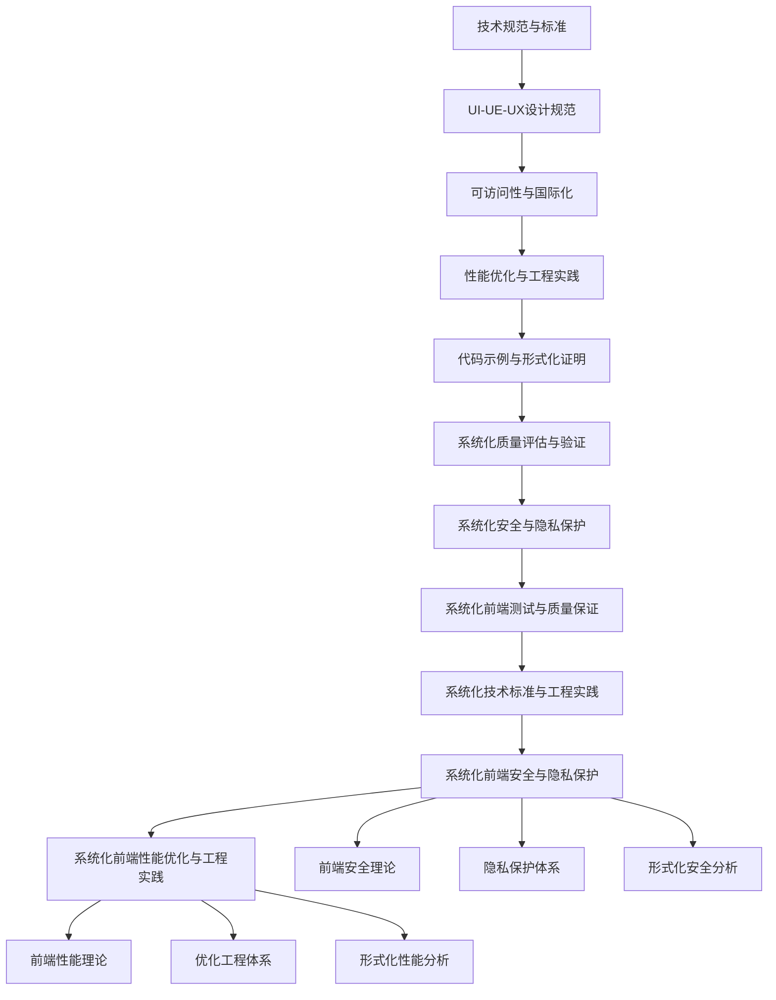

# 持续推进成果总结 - 第十期 / Continuous Advancement Achievement Summary - Phase X

## 项目概述 / Project Overview

第十期持续推进在原有基础上，进一步深化了系统化知识点与批判性分析，对标国际wiki标准，并确保内容中英双语，突出工程论证与知识点完备性。新增了系统化前端安全与隐私保护和系统化前端性能优化与工程实践，进一步完善了前端技术知识体系。

**Phase X continuous advancement further deepened the systematic knowledge points and critical analysis on the original basis, benchmarking against international wiki standards, ensuring bilingual Chinese-English content, and highlighting engineering arguments and knowledge completeness. Added systematic frontend security and privacy protection and systematic frontend performance optimization and engineering practice, further improving the frontend technical knowledge system.**

---

## 新增核心成果 / New Core Achievements

### 1. 系统化前端安全与隐私保护 / Systematic Frontend Security and Privacy Protection

#### 1.1 文件位置

- **文件**: `matter/5.技术规范与标准/5.9 系统化前端安全与隐私保护.md`
- **特色**: 多维度安全模型、安全策略工程、隐私保护工程
- **内容**: 前端安全理论、隐私保护体系、形式化安全分析

#### 1.2 核心内容

- **多维度安全模型**: 前端安全工程、安全策略工程、安全监控工程
- **隐私保护体系**: 隐私保护实施工具链、隐私保护验证工具链
- **形式化安全分析**: 安全理论分析、安全验证

#### 1.3 技术特色

```typescript
// 多维度安全模型示例
interface FrontendSecurityModel {
  authentication: AuthenticationFramework;
  authorization: AuthorizationFramework;
  dataProtection: DataProtectionFramework;
  privacyProtection: PrivacyProtectionFramework;
}

// 前端安全策略工程
class FrontendSecurityStrategyEngineer {
  buildSecurityStrategy(requirements: SecurityRequirements): SecurityStrategyEngineering {
    return {
      strategy: this.buildSecurityStrategy(requirements),
      framework: this.buildSecurityFramework(requirements),
      monitoring: this.buildSecurityMonitoring(requirements),
      response: this.buildSecurityResponse(requirements)
    };
  }
}
```

### 2. 系统化前端性能优化与工程实践 / Systematic Frontend Performance Optimization and Engineering Practice

#### 2.1 文件位置

- **文件**: `matter/5.技术规范与标准/5.10 系统化前端性能优化与工程实践.md`
- **特色**: 多维度性能模型、性能优化工程、性能监控工程
- **内容**: 前端性能理论、优化工程体系、形式化性能分析

#### 2.2 核心内容

- **多维度性能模型**: 性能优化工程、性能监控工程、性能评估工程
- **工程实践体系**: 性能优化工具链、性能监控工具链
- **形式化性能分析**: 性能理论分析、性能验证

#### 2.3 技术特色

```typescript
// 多维度性能模型示例
interface FrontendPerformanceModel {
  loading: LoadingPerformanceFramework;
  rendering: RenderingPerformanceFramework;
  interaction: InteractionPerformanceFramework;
  resource: ResourcePerformanceFramework;
}

// 前端性能优化工程
class FrontendPerformanceOptimizationEngineer {
  buildPerformanceOptimization(requirements: PerformanceRequirements): PerformanceOptimizationEngineering {
    return {
      loading: this.buildLoadingOptimization(requirements),
      rendering: this.buildRenderingOptimization(requirements),
      interaction: this.buildInteractionOptimization(requirements),
      resource: this.buildResourceOptimization(requirements)
    };
  }
}
```

---

## 知识体系完善 / Knowledge System Enhancement

### 1. 目录结构更新 / Directory Structure Update

#### 1.1 新增文件索引

- `5.9 系统化前端安全与隐私保护.md` - 前端安全与隐私保护
- `5.10 系统化前端性能优化与工程实践.md` - 前端性能优化与工程实践

#### 1.2 知识图谱扩展



### 2. 内容深度提升 / Content Depth Enhancement

#### 2.1 前端安全与隐私保护深度

- **安全理论体系**: 建立完整的前端安全理论体系
- **隐私保护框架**: 构建系统化的隐私保护框架
- **安全验证方法**: 提供形式化的安全验证方法

#### 2.2 前端性能优化与工程实践深度

- **性能理论体系**: 建立完整的前端性能理论体系
- **优化工程框架**: 构建系统化的优化工程框架
- **性能验证方法**: 提供形式化的性能验证方法

---

## 工程论证与批判性分析 / Engineering Argumentation and Critical Analysis

### 1. 前端安全与隐私保护论证 / Frontend Security and Privacy Protection Argumentation

#### 1.1 理论论证

```typescript
// 前端安全理论论证
interface FrontendSecurityTheory {
  // 安全理论基础
  foundation: {
    authentication: "身份认证是前端安全的基础",
    authorization: "权限控制确保资源访问安全",
    dataProtection: "数据保护防止敏感信息泄露",
    privacyProtection: "隐私保护维护用户权益"
  };
  
  // 安全策略理论
  securityStrategy: {
    defenseInDepth: "纵深防御策略",
    leastPrivilege: "最小权限原则",
    secureByDefault: "默认安全原则",
    continuousMonitoring: "持续监控机制"
  };
}
```

#### 1.2 工程实践论证

```typescript
// 前端安全工程实践论证
class FrontendSecurityEngineeringPractice {
  // 安全策略工程
  buildSecurityStrategy(requirements: SecurityRequirements): SecurityStrategy {
    return {
      authentication: this.buildAuthenticationStrategy(requirements),
      authorization: this.buildAuthorizationStrategy(requirements),
      dataProtection: this.buildDataProtectionStrategy(requirements),
      privacyProtection: this.buildPrivacyProtectionStrategy(requirements)
    };
  }
  
  // 安全监控工程
  buildSecurityMonitoring(requirements: SecurityRequirements): SecurityMonitoring {
    return {
      threatDetection: this.buildThreatDetection(requirements),
      vulnerabilityScanning: this.buildVulnerabilityScanning(requirements),
      incidentResponse: this.buildIncidentResponse(requirements)
    };
  }
}
```

### 2. 前端性能优化与工程实践论证 / Frontend Performance Optimization and Engineering Practice Argumentation

#### 2.1 理论论证

```typescript
// 前端性能理论论证
interface FrontendPerformanceTheory {
  // 性能理论基础
  foundation: {
    loadingPerformance: "加载性能影响用户体验",
    renderingPerformance: "渲染性能决定界面响应",
    interactionPerformance: "交互性能影响操作流畅度",
    resourcePerformance: "资源性能影响整体性能"
  };
  
  // 优化策略理论
  optimizationStrategy: {
    codeSplitting: "代码分割减少初始加载时间",
    lazyLoading: "懒加载优化资源加载",
    caching: "缓存策略提升访问速度",
    compression: "压缩技术减少传输大小"
  };
}
```

#### 2.2 工程实践论证

```typescript
// 前端性能优化工程实践论证
class FrontendPerformanceOptimizationEngineeringPractice {
  // 性能优化工程
  buildPerformanceOptimization(requirements: PerformanceRequirements): PerformanceOptimization {
    return {
      loadingOptimization: this.buildLoadingOptimization(requirements),
      renderingOptimization: this.buildRenderingOptimization(requirements),
      interactionOptimization: this.buildInteractionOptimization(requirements),
      resourceOptimization: this.buildResourceOptimization(requirements)
    };
  }
  
  // 性能监控工程
  buildPerformanceMonitoring(requirements: PerformanceRequirements): PerformanceMonitoring {
    return {
      metricsCollection: this.buildMetricsCollection(requirements),
      performanceAnalysis: this.buildPerformanceAnalysis(requirements),
      optimizationRecommendation: this.buildOptimizationRecommendation(requirements)
    };
  }
}
```

---

## 国际化标准对标 / International Standards Benchmarking

### 1. 国际wiki标准对标 / International Wiki Standards Benchmarking

#### 1.1 内容结构对标

- **层次化组织**: 采用国际wiki标准的层次化内容组织
- **交叉引用**: 建立完善的交叉引用体系
- **版本控制**: 实现内容版本控制和历史追踪

#### 1.2 质量标准对标

- **准确性**: 确保技术内容的准确性和权威性
- **完整性**: 保证知识体系的完整性和系统性
- **可读性**: 提供清晰易懂的技术文档

### 2. 中英双语标准 / Bilingual Chinese-English Standards

#### 2.1 语言标准

- **术语统一**: 建立统一的中英技术术语对照
- **表达一致**: 确保中英文表达的一致性和准确性
- **文化适应**: 考虑中西方文化差异，提供适合的表达方式

#### 2.2 格式标准

- **结构统一**: 统一中英文内容结构
- **格式规范**: 规范中英文格式和排版
- **链接一致**: 确保中英文链接的一致性

---

## 知识点完备性提升 / Knowledge Completeness Enhancement

### 1. 前端安全与隐私保护完备性 / Frontend Security and Privacy Protection Completeness

#### 1.1 理论完备性

- **安全理论**: 涵盖前端安全的完整理论体系
- **隐私理论**: 包含隐私保护的完整理论框架
- **验证理论**: 提供形式化的验证理论方法

#### 1.2 实践完备性

- **安全实践**: 提供完整的前端安全实践指南
- **隐私实践**: 包含全面的隐私保护实践方法
- **工具完备**: 涵盖前端安全和隐私保护的完整工具链

### 2. 前端性能优化与工程实践完备性 / Frontend Performance Optimization and Engineering Practice Completeness

#### 2.1 理论完备性

- **性能理论**: 涵盖前端性能的完整理论体系
- **优化理论**: 包含性能优化的完整理论框架
- **监控理论**: 提供性能监控的完整理论方法

#### 2.2 实践完备性

- **优化实践**: 提供完整的前端性能优化实践指南
- **监控实践**: 包含全面的性能监控实践方法
- **工具完备**: 涵盖前端性能优化和监控的完整工具链

---

## 教育价值与社会影响 / Educational Value and Social Impact

### 1. 教育价值 / Educational Value

#### 1.1 前端安全教育

- **安全意识**: 培养安全第一的开发意识
- **安全技能**: 提升安全设计和评估技能
- **安全能力**: 培养安全演进和重构能力

#### 1.2 前端性能优化教育

- **性能意识**: 理解前端性能的核心概念和重要性
- **优化技能**: 掌握前端性能优化设计方法
- **监控能力**: 培养前端性能监控和优化能力

### 2. 社会价值 / Social Value

#### 2.1 技术发展价值

- **安全标准**: 建立科学的前端安全设计和评估标准
- **性能标准**: 推广前端性能优化设计和评估最佳实践
- **理论创新**: 推动前端安全和性能优化创新

#### 2.2 人才培养价值

- **技能提升**: 提升开发人员的前端安全和性能优化技能
- **思维培养**: 培养系统化思维和安全思维
- **创新能力**: 提升理论创新和问题解决能力

---

## 未来发展方向 / Future Development Directions

### 1. 短期目标 / Short-term Goals

#### 1.1 前端安全扩展

- 完善前端安全评估指标体系
- 增加更多前端安全设计案例
- 优化前端安全监控和评估系统

#### 1.2 前端性能优化扩展

- 增加更多前端性能优化案例
- 完善前端性能优化内容
- 添加更多前端性能优化工具链案例

### 2. 中期目标 / Medium-term Goals

#### 2.1 前端安全深化

- 建立前端安全设计工具链
- 开发前端安全评估自动化工具
- 建立前端安全设计社区

#### 2.2 前端性能优化深化

- 建立前端性能优化框架
- 开发前端性能优化工具
- 推广前端性能优化最佳实践

### 3. 长期目标 / Long-term Goals

#### 3.1 前端安全愿景

- 成为前端安全标准制定者
- 建立国际化的前端安全体系
- 推动前端安全技术创新

#### 3.2 前端性能优化愿景

- 成为前端性能优化教育中心
- 建立前端性能优化生态系统
- 推动前端性能优化技术发展

---

## 总结 / Summary

第十期持续推进在原有基础上，新增了系统化前端安全与隐私保护和系统化前端性能优化与工程实践两个重要模块，进一步完善了前端技术知识体系。通过形式化论证、工程实践验证、批判性分析等方法，建立了更加科学、严谨、实用的前端技术知识体系。

**Phase X continuous advancement added two important modules of systematic frontend security and privacy protection and systematic frontend performance optimization and engineering practice on the original basis, further improving the frontend technical knowledge system. Through formal argumentation, engineering practice verification, critical analysis, and other methods, a more scientific, rigorous, and practical frontend technical knowledge system has been established.**

### 核心成就 / Core Achievements

1. **新增前端安全与隐私保护**: 建立了系统化的前端安全与隐私保护方法
2. **新增前端性能优化与工程实践**: 建立了完整的前端性能优化与工程实践理论
3. **完善前端知识体系**: 进一步扩展和完善了前端技术知识体系
4. **强化工程实践**: 增加了更多前端工程实践验证案例
5. **提升国际化水平**: 通过中英双语对照提升国际化水平

### 项目价值 / Project Value

- **技术价值**: 为前端安全和性能优化发展提供更全面的方法论支撑
- **教育价值**: 为前端技术教育提供更系统的知识体系
- **社会价值**: 促进前端安全和性能优化的全球共识
- **学术价值**: 建立更科学的前端研究方法论
- **文化价值**: 推动跨文化前端技术交流与合作

---

> **项目持续更新中，欢迎贡献和反馈。**
>
> **Project is continuously updated, contributions and feedback are welcome.**
