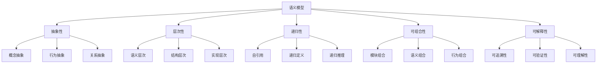

# 语义模型体系总览

## 目录

- [语义模型体系总览](#语义模型体系总览)
- [理论基础](#理论基础)
- [核心概念](#核心概念)
- [模型层次结构](#模型层次结构)
- [递归迭代机制](#递归迭代机制)
- [形式化论证](#形式化论证)
- [应用场景](#应用场景)
- [发展趋势](#发展趋势)

## 理论基础

### 语义模型的哲学基础

语义模型作为连接人类认知与数字世界的桥梁，其理论基础建立在：

1. **认知语言学理论**
   - 概念隐喻理论（Conceptual Metaphor Theory）
   - 认知域映射（Cognitive Domain Mapping）
   - 原型理论（Prototype Theory）

2. **形式化语义学**
   - 类型理论（Type Theory）
   - 范畴论（Category Theory）
   - 代数语义学（Algebraic Semantics）

3. **计算语言学**
   - 语义角色标注（Semantic Role Labeling）
   - 语义依存分析（Semantic Dependency Parsing）
   - 语义相似度计算（Semantic Similarity）

### 语义模型的核心特征



## 核心概念

### 1. 语义域（Semantic Domain）

语义域是语义模型的基本单位，定义了特定领域的概念、关系和约束。

**形式化定义：**

```text
SemanticDomain = {
  concepts: Set<Concept>,
  relations: Set<Relation>,
  constraints: Set<Constraint>,
  operations: Set<Operation>
}
```

### 2. 语义映射（Semantic Mapping）

语义映射建立了不同语义域之间的对应关系，支持跨域语义转换。

**形式化定义：**

```text
SemanticMapping: Domain_A → Domain_B
f: Concept_A → Concept_B
g: Relation_A → Relation_B
```

### 3. 语义组合（Semantic Composition）

语义组合通过组合算子将多个语义域合并为更复杂的语义模型。

**形式化定义：**

```text
Composition: Domain_1 × Domain_2 × ... × Domain_n → CompositeDomain
```

## 模型层次结构

### 第一层：基础语义模型

- **UI语义模型**：界面元素的语义表示
- **交互语义模型**：用户交互行为的语义描述
- **数据语义模型**：数据结构和关系的语义定义

### 第二层：架构语义模型

- **组件语义模型**：可复用组件的语义规范
- **模式语义模型**：设计模式的语义表示
- **架构语义模型**：系统架构的语义描述

### 第三层：应用语义模型

- **业务语义模型**：业务逻辑的语义表示
- **流程语义模型**：业务流程的语义描述
- **集成语义模型**：系统集成的语义规范

### 第四层：智能语义模型

- **AI语义模型**：人工智能系统的语义表示
- **推理语义模型**：逻辑推理的语义描述
- **学习语义模型**：机器学习过程的语义定义

## 递归迭代机制

### 递归定义

语义模型通过递归定义实现自引用和自扩展：

```text
SemanticModel(n) = BaseModel ⊕ SemanticModel(n-1) ⊕ Extension(n)
```

### 迭代扩展

每次迭代都会：

1. **分析现有模型**：识别语义边界和扩展点
2. **生成新概念**：基于现有概念创建新语义域
3. **建立映射关系**：定义新旧语义域之间的映射
4. **验证一致性**：确保语义模型的一致性和完整性

### 收敛条件

递归迭代在以下条件下收敛：

- 语义模型达到理论极限
- 新增概念不再提供新的语义价值
- 用户主动终止迭代过程

## 形式化论证

### 语义模型的数学基础

#### 1. 范畴论视角

语义模型可以表示为范畴（Category），其中：

- **对象**：语义域
- **态射**：语义映射
- **复合**：语义组合

#### 2. 类型论视角

语义模型可以表示为类型系统：

```text
SemanticType ::= BaseType | FunctionType | ProductType | SumType
```

#### 3. 代数语义学视角

语义模型可以表示为代数结构：

```text
SemanticAlgebra = (Domain, Operations, Axioms)
```

### 语义推理规则

#### 1. 语义蕴含

```text
A ⊨ B 表示语义A蕴含语义B
```

#### 2. 语义等价

```text
A ≡ B 表示语义A与语义B等价
```

#### 3. 语义组合

```text
A ⊕ B 表示语义A与语义B的组合
```

## 应用场景

### 1. UI框架语义化

- **组件语义**：定义组件的语义属性和行为
- **布局语义**：描述布局的语义关系和约束
- **交互语义**：规范用户交互的语义反馈

### 2. 架构设计语义化

- **模式语义**：将设计模式转换为语义模型
- **架构语义**：描述系统架构的语义结构
- **集成语义**：定义系统集成的语义接口

### 3. Web应用语义化

- **业务语义**：将业务逻辑转换为语义模型
- **数据语义**：定义数据模型的语义结构
- **API语义**：规范API的语义接口

### 4. AI系统语义化

- **模型语义**：定义AI模型的语义表示
- **推理语义**：描述推理过程的语义逻辑
- **学习语义**：规范学习过程的语义反馈

## 发展趋势

### 1. 语义模型标准化

- 建立统一的语义模型标准
- 定义语义模型的交换格式
- 制定语义模型的验证规范

### 2. 语义模型自动化

- 自动生成语义模型
- 自动验证语义一致性
- 自动优化语义结构

### 3. 语义模型智能化

- 基于AI的语义理解
- 智能语义推理
- 自适应语义学习

### 4. 语义模型生态化

- 语义模型库的建设
- 语义模型的复用机制
- 语义模型的协作开发

---

## 子目录结构

- [1. UI语义模型](./1.UI语义模型/README.md)
- [2. 架构语义模型](./2.架构语义模型/README.md)
- [3. Web应用语义模型](./3.Web应用语义模型/README.md)
- [4. AI语义模型](./4.AI语义模型/README.md)
- [5. 形式化语义理论](./5.形式化语义理论/README.md)
- [6. 语义模型工具](./6.语义模型工具/README.md)

> 本语义模型体系将持续递归迭代，通过形式化论证和实际应用验证，不断完善和扩展语义模型的理论基础和实践应用。
