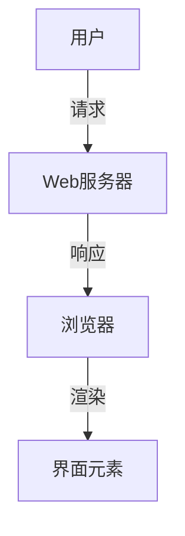

# 1.1 Web端

[返回1.终端类型](./README.md) | [返回Refactor总览](../README.md)

## 目录

- [1.1 Web端](#11-web端)
  - [目录](#目录)
  - [1. 概述](#1-概述)
  - [2. 理论基础与发展](#2-理论基础与发展)
  - [3. 行业标准与规范](#3-行业标准与规范)
  - [4. 方法论与设计流程](#4-方法论与设计流程)
  - [5. 工程实践与落地](#5-工程实践与落地)
  - [6. 国际化与可访问性](#6-国际化与可访问性)
  - [7. 案例分析](#7-案例分析)
  - [8. 形式化论证与多表征](#8-形式化论证与多表征)
  - [9. 相关性引用](#9-相关性引用)
  - [10. 参考文献](#10-参考文献)

---

## 1. 概述

Web端（Web Application）是指基于浏览器的应用程序，用户通过互联网访问，无需安装即可使用。
Web端以其跨平台、易于部署和维护的优势，成为现代信息系统和服务的核心形态。
Web端的发展推动了互联网技术、前端工程、用户体验（UX）和界面设计（UI）的持续创新。

## 2. 理论基础与发展

Web端设计理论源于人机交互（HCI）、信息架构、认知心理学、网络科学等多学科交叉领域。
早期以Tim Berners-Lee的超文本理论[1]、Jakob Nielsen的可用性启发式[2]为代表，强调信息可达性、导航清晰、反馈及时。
近年来，响应式设计、渐进式Web应用（PWA）、无障碍设计等新范式不断涌现。

**举例：**

- "响应式设计"理论推动了多终端自适应布局的普及。
- "F型浏览模式"指导了新闻门户、博客等内容型网站的排版。

## 3. 行业标准与规范

- **HTML5/CSS3/ECMAScript**：Web前端三大标准，定义了结构、样式与交互。
- **W3C标准**：DOM、ARIA、Web Components等。
- **WCAG 2.1**：Web内容无障碍国际标准。
- **Google Material Design**、**Ant Design**：主流Web设计系统。

**举例：**

- WCAG 2.1要求所有交互元素必须可通过键盘操作。
- Material Design的"Elevation"规范通过阴影层级表达界面层次。

## 4. 方法论与设计流程

- **需求分析**：用户画像、场景建模、任务流分析。
- **信息架构**：站点地图、导航设计、内容分组。
- **原型设计**：低保真线框、高保真交互原型（Figma、Axure）。
- **开发与测试**：敏捷开发、持续集成、自动化测试。
- **可用性测试**：A/B测试、热力图、用户访谈。

**举例：**

- 某电商平台通过A/B测试优化首页Banner，提升点击率20%。
- 使用树状结构梳理大型门户网站的信息架构。

## 5. 工程实践与落地

- **组件化开发**：React/Vue/Angular等框架推动了Web端的组件化、模块化。
- **工程化工具链**：Webpack、Vite、Babel、ESLint、Prettier。
- **性能优化**：懒加载、Tree Shaking、CDN加速、服务端渲染（SSR）。
- **安全实践**：HTTPS、CSP、XSS/CSRF防护。
- **多端适配**：响应式布局、媒体查询、断点管理。

**举例：**

- 某新闻网站采用SSR提升首屏加载速度，优化SEO。
- 使用Webpack实现代码分割和按需加载。

## 6. 国际化与可访问性

- **国际化（i18n）**：多语言切换、日期/货币/单位本地化、RTL布局。
- **可访问性（a11y）**：ARIA标签、语义化HTML、键盘导航、色彩对比。
- **包容性设计**：关注色盲、老年人、听障等特殊群体。

**举例：**

- Google Docs支持多语言界面和RTL文本编辑。
- 某政务网站通过WCAG 2.1认证，支持屏幕阅读器访问。

## 7. 案例分析

- **Gmail Web端**：通过Material Design和PWA技术，实现了高性能、可离线、跨平台的邮件体验。
- **知乎Web端**：采用响应式设计和组件化架构，适配多终端访问。
- **反例**：某早期视频网站因Flash依赖和无障碍缺失，逐步被淘汰。

## 8. 形式化论证与多表征

- **设计原则公式化**：如一致性原则可表达为∀x∈UI, Style(x)=Style(Ref(x))。
- **UML/流程图**：



- **代码示例**：

```jsx
// React 组件示例
function HelloWorld() {
  return <h1>Hello, Web!</h1>;
}
```

- **伪代码**：

```text
If 用户点击按钮:
    触发事件处理器
    更新界面状态
```

## 9. 相关性引用

- [2.1 前端主流框架](../2.技术栈与框架/2.1 前端主流框架.md)
- [5.1 UI-UE-UX设计规范](../5.技术规范与标准/5.1 UI-UE-UX设计规范.md)

## 10. 参考文献

[1] Berners-Lee, T. (1989). Information Management: A Proposal. CERN.
[2] Nielsen, J. (1994). Usability Engineering. Morgan Kaufmann.
[3] W3C. (2023). Web Content Accessibility Guidelines (WCAG) 2.1. <https://www.w3.org/WAI/standards-guidelines/wcag/>
[4] Google. (2023). Material Design Guidelines. <https://material.io/design/>
[5] Ant Design. (2023). Ant Design System. <https://ant.design/docs/spec/introduce>
[6] GOV.UK Service Manual. <https://www.gov.uk/service-manual>
