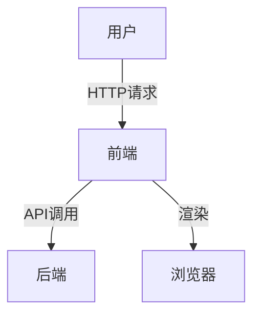

# 1.1 Web端

[返回1.终端类型](./README.md) | [返回Refactor总览](../README.md)

## 目录

- [1.1 Web端](#11-web端)
  - [目录](#目录)
  - [1. 概述](#1-概述)
  - [2. 主流技术与架构](#2-主流技术与架构)
  - [3. 形式化论证与多表征](#3-形式化论证与多表征)
  - [4. 相关性引用](#4-相关性引用)

---

## 1. 概述

Web端（Web Application）是指基于浏览器的应用程序，用户通过互联网访问，无需安装即可使用。Web端以其跨平台、易于部署和维护的优势，成为现代信息系统和服务的核心形态。Web端的发展推动了互联网技术、前端工程、用户体验（UX）和界面设计（UI）的持续创新。

## 2. 主流技术与架构

- HTML5、CSS3、JavaScript：Web前端三大基石，实现结构、样式与交互。
- 前端框架：React、Vue、Angular 等提升开发效率与可维护性。
- 构建工具与工程化：Webpack、Vite、Babel、ESLint 等。
- 响应式设计与适配：媒体查询、Flexbox、Grid 等。
- 服务端渲染（SSR）与静态站点生成（SSG）：Next.js、Nuxt.js。
- WebAssembly：提升性能，支持多语言编译到Web。
- 安全与性能优化：HTTPS、CSP、懒加载、Tree Shaking。

## 3. 形式化论证与多表征

- 数学模型：Web端可抽象为有向图G=(V,E)，V为页面/组件，E为路由/交互。
- 状态机：UI状态转移可用有限状态自动机（FSM）描述。
- UML类图/时序图：建模组件关系与数据流。
- 代码示例：

```jsx
// React 组件示例
function HelloWorld() {
  return <h1>Hello, Web!</h1>;
}
```

- 图示：



## 4. 相关性引用

- [2.1 前端主流框架](../2.技术栈与框架/2.1 前端主流框架.md)
- [5.1 UI-UE-UX设计规范](../5.技术规范与标准/5.1 UI-UE-UX设计规范.md)
