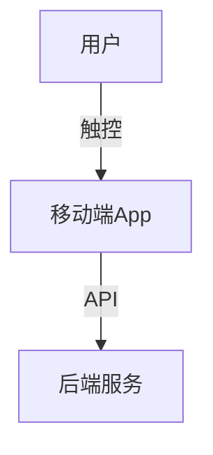

# 1.2 移动端

[返回1.终端类型](./README.md) | [返回Refactor总览](../README.md)

## 目录

- [1.2 移动端](#12-移动端)
  - [目录](#目录)
  - [1. 概述](#1-概述)
  - [2. 主流技术与架构](#2-主流技术与架构)
  - [3. 形式化论证与多表征](#3-形式化论证与多表征)
  - [4. 相关性引用](#4-相关性引用)

---

## 1. 概述

移动端（Mobile Application）指运行于智能手机、平板等移动设备上的应用。移动端强调触控交互、响应速度、离线能力和平台原生体验，是现代数字生活的核心入口。

## 2. 主流技术与架构

- 原生开发：Android（Kotlin/Java）、iOS（Swift/Objective-C）。
- 跨平台框架：Flutter、React Native、Kotlin Multiplatform、Xamarin。
- 混合开发：WebView、Cordova、Ionic。
- UI/UX设计：Material Design、Human Interface Guidelines。
- 性能优化：JIT/AOT编译、内存管理、异步渲染。
- 移动安全：沙箱机制、权限管理、加密存储。

## 3. 形式化论证与多表征

- 状态机建模：页面导航与生命周期管理。
- 响应式编程：数据流与UI同步（如Flutter的Stream、RxJava）。
- UML用例图/活动图：描述用户操作与系统反应。
- 代码示例：

```dart
// Flutter 组件示例
class HelloWorld extends StatelessWidget {
  @override
  Widget build(BuildContext context) {
    return Text('Hello, Mobile!');
  }
}
```

- 图示：



## 4. 相关性引用

- [2.2 跨端框架](../2.技术栈与框架/2.2 跨端框架.md)
- [5.1 UI-UE-UX设计规范](../5.技术规范与标准/5.1 UI-UE-UX设计规范.md)
