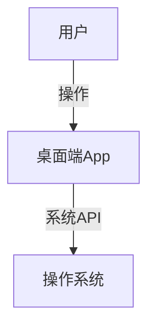

# 1.3 桌面端

[返回1.终端类型](./README.md) | [返回Refactor总览](../README.md)

## 目录

- [1.3 桌面端](#13-桌面端)
  - [目录](#目录)
  - [1. 概述](#1-概述)
  - [2. 主流技术与架构](#2-主流技术与架构)
  - [3. 形式化论证与多表征](#3-形式化论证与多表征)
  - [4. 相关性引用](#4-相关性引用)

---

## 1. 概述

桌面端（Desktop Application）是指运行于PC、Mac等桌面操作系统上的本地应用。桌面端强调高性能、丰富交互和系统级集成，适用于生产力工具、专业软件等场景。

## 2. 主流技术与架构

- 原生开发：Windows（.NET、C#、C++）、macOS（Swift、Objective-C）。
- 跨平台框架：Electron、Qt、JavaFX、Flutter Desktop。
- UI/UX设计：Material Design、Fluent Design、Aqua。
- 系统集成：文件系统、硬件访问、原生API调用。
- 性能优化：多线程、硬件加速、内存管理。
- 安全机制：沙箱、权限控制、数字签名。

## 3. 形式化论证与多表征

- 架构图：MVC、MVVM等模式建模。
- 状态机：窗口与组件状态管理。
- UML类图/组件图：描述模块关系。
- 代码示例：

```js
// Electron 主进程示例
const { app, BrowserWindow } = require('electron');
function createWindow() {
  const win = new BrowserWindow({ width: 800, height: 600 });
  win.loadFile('index.html');
}
app.whenReady().then(createWindow);
```

- 图示：



## 4. 相关性引用

- [2.2 跨端框架](../2.技术栈与框架/2.2 跨端框架.md)
- [5.1 UI-UE-UX设计规范](../5.技术规范与标准/5.1 UI-UE-UX设计规范.md)
