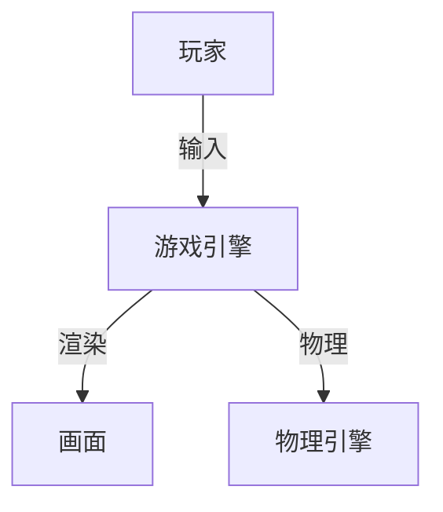

# 1.4 游戏端

[返回1.终端类型](./README.md) | [返回Refactor总览](../README.md)

## 目录

- [1.4 游戏端](#14-游戏端)
  - [目录](#目录)
  - [1. 概述](#1-概述)
  - [2. 主流技术与架构](#2-主流技术与架构)
  - [3. 形式化论证与多表征](#3-形式化论证与多表征)
  - [4. 相关性引用](#4-相关性引用)

---

## 1. 概述

游戏端（Game Application）是指运行于PC、主机、移动设备等平台的互动娱乐软件。游戏端强调实时渲染、复杂交互、沉浸体验和高性能计算，是多媒体与人机交互的集大成者。

## 2. 主流技术与架构

- 游戏引擎：Unity、Unreal Engine、Godot、Cocos。
- 渲染技术：OpenGL、DirectX、Vulkan、WebGL。
- 跨平台开发：多端适配、资源管理、输入系统。
- 物理与AI：物理引擎、行为树、路径规划。
- 网络与多人：同步机制、帧同步、状态同步。
- 性能优化：GPU加速、内存管理、资源压缩。

## 3. 形式化论证与多表征

- 状态机：角色/场景状态建模。
- UML时序图/用例图：描述游戏流程与交互。
- 数学建模：碰撞检测、物理仿真。
- 代码示例：

```csharp
// Unity C# 脚本示例
using UnityEngine;
public class HelloWorld : MonoBehaviour {
  void Start() {
    Debug.Log("Hello, Game!");
  }
}
```

- 图示：



## 4. 相关性引用

- [2.2 跨端框架](../2.技术栈与框架/2.2 跨端框架.md)
- [5.1 UI-UE-UX设计规范](../5.技术规范与标准/5.1 UI-UE-UX设计规范.md)
