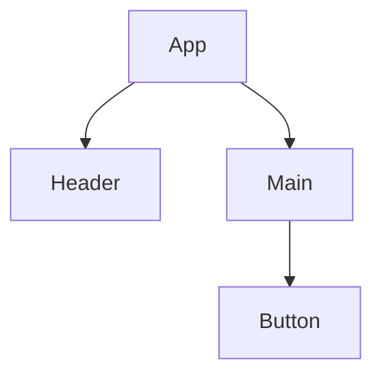

# 2.1 前端主流框架

[返回2.技术栈与框架](./README.md) | [返回Refactor总览](../README.md)

## 目录

- [2.1 前端主流框架](#21-前端主流框架)
  - [目录](#目录)
  - [1. 概述](#1-概述)
  - [2. 主流技术与架构](#2-主流技术与架构)
  - [3. 形式化论证与多表征](#3-形式化论证与多表征)
  - [4. 相关性引用](#4-相关性引用)

---

## 1. 概述

前端主流框架是指用于构建Web应用用户界面的开发框架，极大提升了开发效率、可维护性和用户体验。主流框架如React、Vue、Angular等，推动了组件化、响应式、单页应用（SPA）等现代前端范式的发展。

## 2. 主流技术与架构

- React：基于组件、虚拟DOM、单向数据流，生态丰富。
- Vue：轻量、易用、响应式数据绑定，适合中小型项目。
- Angular：全功能、依赖注入、双向绑定，适合大型工程。
- Svelte、Solid等新兴框架：编译时优化、极致性能。
- 状态管理：Redux、Vuex、MobX、Recoil。
- 路由与工程化：React Router、Vue Router、Webpack、Vite。

## 3. 形式化论证与多表征

- 组件树建模：以有向无环图（DAG）描述组件依赖。
- 状态流：以有限状态机（FSM）描述UI状态变化。
- UML类图/组件图：建模组件关系。
- 代码示例：

```jsx
// React 组件
function Button({ label }) {
  return <button>{label}</button>;
}
```

- 图示：



## 4. 相关性引用

- [1.1 Web端](../1.终端类型/1.1 Web端.md)
- [5.1 UI-UE-UX设计规范](../5.技术规范与标准/5.1 UI-UE-UX设计规范.md)
