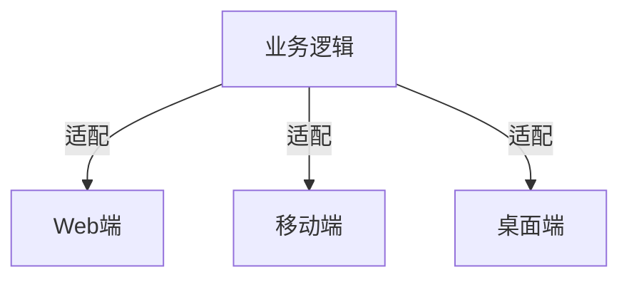

# 2.2 跨端框架

[返回2.技术栈与框架](./README.md) | [返回Refactor总览](../README.md)

## 目录

- [2.2 跨端框架](#22-跨端框架)
  - [目录](#目录)
  - [1. 概述](#1-概述)
  - [2. 主流技术与架构](#2-主流技术与架构)
  - [3. 形式化论证与多表征](#3-形式化论证与多表征)
  - [4. 相关性引用](#4-相关性引用)

---

## 1. 概述

跨端框架（Cross-platform Framework）旨在"一套代码多端运行"，提升开发效率、降低维护成本。典型代表有Flutter、React Native、Taro、UniApp等，支持Web、移动、桌面等多平台。

## 2. 主流技术与架构

- Flutter：Dart语言，Skia渲染，原生性能，支持Web/移动/桌面。
- React Native：JavaScript，桥接原生组件，生态丰富。
- Taro/UniApp：小程序、H5、App多端适配。
- Electron：Web技术构建桌面应用。
- 适配层与插件机制：多端API封装、原生扩展。

## 3. 形式化论证与多表征

- 平台抽象：以集合P={Web, iOS, Android, Desktop}建模。
- 适配映射：f: 组件 → 平台实现。
- UML组件图：描述跨端适配关系。
- 代码示例：

```dart
// Flutter 跨平台按钮
ElevatedButton(onPressed: () {}, child: Text('跨端'));
```

- 图示：



## 4. 相关性引用

- [1.2 移动端](../1.终端类型/1.2 移动端.md)
- [1.3 桌面端](../1.终端类型/1.3 桌面端.md)
- [1.4 游戏端](../1.终端类型/1.4 游戏端.md)
