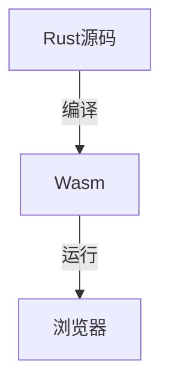

# 2.3 Rust前端全栈

[返回2.技术栈与框架](./README.md) | [返回Refactor总览](../README.md)

## 目录

- [2.3 Rust前端全栈](#23-rust前端全栈)
  - [目录](#目录)
  - [1. 概述](#1-概述)
  - [2. 主流技术与架构](#2-主流技术与架构)
  - [3. 形式化论证与多表征](#3-形式化论证与多表征)
  - [4. 相关性引用](#4-相关性引用)

---

## 1. 概述

Rust前端全栈是指以Rust语言为核心，覆盖前端、后端、WebAssembly等全栈开发场景。Rust以其内存安全、高性能和现代语法，逐渐成为WebAssembly和高性能Web应用的重要选择。

## 2. 主流技术与架构

- Yew：Rust实现的Web前端框架，组件化、虚拟DOM。
- Leptos、Sycamore：新兴Rust前端框架，支持响应式、SSR。
- WebAssembly（Wasm）：Rust可编译为Wasm，提升Web性能。
- Axum、Actix-web：Rust后端框架，支持RESTful API。
- 工程化工具：wasm-pack、cargo、trunk。

## 3. 形式化论证与多表征

- 类型系统：Rust的静态强类型保证编译期安全。
- 生命周期与所有权：内存安全的形式化基础。
- 组件树建模：以有向无环图（DAG）描述组件依赖。
- 代码示例：

```rust
// Yew 组件示例
use yew::prelude::*;
#[function_component(Hello)]
fn hello() -> Html {
    html! { <h1>{ "Hello, Rust!" }</h1> }
}
```

- 图示：



## 4. 相关性引用

- [2.5 WebAssembly](../2.技术栈与框架/2.5 WebAssembly.md)
- [3.1 Rust](../3.编程语言范式/3.1 Rust.md)
