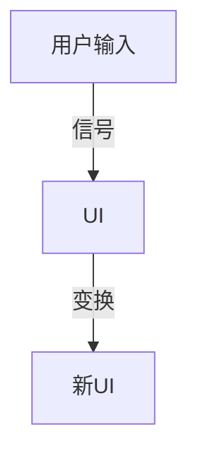

# 2.4 Haskell-Scala前端

[返回2.技术栈与框架](./README.md) | [返回Refactor总览](../README.md)

## 目录

- [2.4 Haskell-Scala前端](#24-haskell-scala前端)
  - [目录](#目录)
  - [1. 概述](#1-概述)
  - [2. 主流技术与架构](#2-主流技术与架构)
  - [3. 形式化论证与多表征](#3-形式化论证与多表征)
  - [4. 相关性引用](#4-相关性引用)

---

## 1. 概述

Haskell与Scala前端开发强调函数式编程范式，注重不可变性、类型安全和高抽象能力。它们推动了前端架构的纯函数、声明式UI和高阶抽象。

## 2. 主流技术与架构

- Haskell：reflex-dom、Miso等前端框架，支持FRP（函数式响应式编程）。
- Scala.js：将Scala编译为JavaScript，支持前端开发。
- PureScript、Elm：受Haskell影响的前端语言。
- 类型系统与不可变数据结构。
- 响应式与声明式UI建模。

## 3. 形式化论证与多表征

- Lambda演算：前端UI可抽象为函数组合与变换。
- FRP模型：以信号流图描述数据流与UI响应。
- 类型推导与代数数据类型（ADT）。
- 代码示例：

```haskell
-- Haskell Miso 组件示例
viewModel :: Model -> View action
viewModel model = div_ [] [ text $ ms (show model) ]
```

- 图示：



## 4. 相关性引用

- [3.2 Haskell](../3.编程语言范式/3.2 Haskell.md)
- [3.3 Scala](../3.编程语言范式/3.3 Scala.md)
