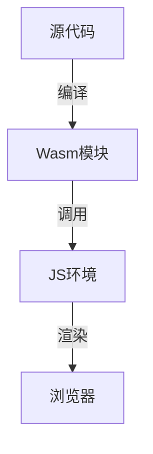

# 2.5 WebAssembly

[返回2.技术栈与框架](./README.md) | [返回Refactor总览](../README.md)

## 目录

- [2.5 WebAssembly](#25-webassembly)
  - [目录](#目录)
  - [1. 概述](#1-概述)
  - [2. 主流技术与架构](#2-主流技术与架构)
  - [3. 形式化论证与多表征](#3-形式化论证与多表征)
  - [4. 相关性引用](#4-相关性引用)

---

## 1. 概述

WebAssembly（Wasm）是一种可移植、低级、高性能的字节码格式，设计用于在Web浏览器中高效运行多种语言编写的代码。Wasm推动了Web应用的性能革命，使C/C++、Rust、Go等语言能直接运行于浏览器。

## 2. 主流技术与架构

- Wasm标准：二进制格式、模块化、沙箱安全。
- 编译工具链：Emscripten（C/C++）、wasm-pack（Rust）、AssemblyScript。
- JS集成：WebAssembly JS API、与主流前端框架协作。
- 性能优化：AOT/JIT编译、内存管理、并发。
- 应用场景：高性能计算、游戏、图像处理、区块链等。

## 3. 形式化论证与多表征

- 状态机：Wasm模块生命周期建模。
- 类型系统：静态类型、线性内存模型。
- UML组件图：描述Wasm与JS、DOM的交互。
- 代码示例：

```rust
// Rust 编译为Wasm的函数
#[wasm_bindgen]
pub fn add(a: i32, b: i32) -> i32 {
    a + b
}
```

- 图示：



## 4. 相关性引用

- [2.3 Rust前端全栈](../2.技术栈与框架/2.3 Rust前端全栈.md)
- [3.1 Rust](../3.编程语言范式/3.1 Rust.md)
