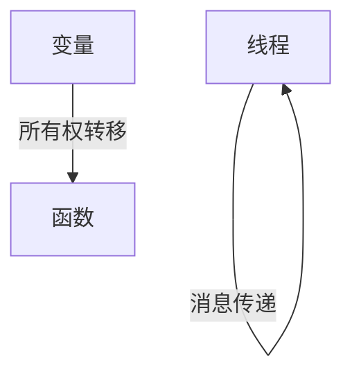

# 3.1 Rust

[返回3.编程语言范式](./README.md) | [返回Refactor总览](../README.md)

## 目录

- [3.1 Rust](#31-rust)
  - [目录](#目录)
  - [1. 概述](#1-概述)
  - [2. 主流技术与架构](#2-主流技术与架构)
  - [3. 形式化论证与多表征](#3-形式化论证与多表征)
  - [4. 相关性引用](#4-相关性引用)

---

## 1. 概述

Rust是一门注重安全、并发和性能的系统级编程语言。其独特的所有权模型和零成本抽象，使其在WebAssembly、嵌入式、后端和前端等领域广受欢迎。

## 2. 主流技术与架构

- 所有权与借用检查：编译期内存安全，无需GC。
- 并发模型：无数据竞争的多线程。
- Cargo包管理与构建系统。
- WebAssembly支持：wasm-bindgen、wasm-pack。
- 主流框架：Actix、Axum（后端），Yew、Leptos（前端）。

## 3. 形式化论证与多表征

- 所有权模型：以有向图描述变量生命周期。
- 类型系统：静态强类型，泛型与特征（Trait）。
- 并发安全：Send/Sync trait建模。
- 代码示例：

```rust
fn main() {
    let s = String::from("hello");
    println!("{}", s);
}
```

- 图示：



## 4. 相关性引用

- [2.3 Rust前端全栈](../2.技术栈与框架/2.3 Rust前端全栈.md)
- [2.5 WebAssembly](../2.技术栈与框架/2.5 WebAssembly.md)
