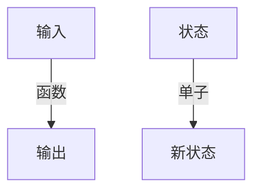

# 3.2 Haskell

[返回3.编程语言范式](./README.md) | [返回Refactor总览](../README.md)

## 目录

- [3.2 Haskell](#32-haskell)
  - [目录](#目录)
  - [1. 概述](#1-概述)
  - [2. 主流技术与架构](#2-主流技术与架构)
  - [3. 形式化论证与多表征](#3-形式化论证与多表征)
  - [4. 相关性引用](#4-相关性引用)

---

## 1. 概述

Haskell是一门纯函数式编程语言，强调不可变性、类型安全和高阶抽象。其懒惰求值和强类型系统推动了函数式编程范式在前端、后端和学术领域的发展。

## 2. 主流技术与架构

- 类型系统：代数数据类型（ADT）、类型类（Typeclass）。
- 函数式响应式编程（FRP）：reflex、Yampa。
- Web开发：Yesod、Servant、reflex-dom。
- 并发与并行：STM、轻量级线程。
- 工具链：Stack、Cabal、GHC。

## 3. 形式化论证与多表征

- Lambda演算：Haskell语义基础。
- 类型推导：Hindley-Milner系统。
- 单子（Monad）：副作用建模。
- 代码示例：

```haskell
-- 纯函数示例
add :: Int -> Int -> Int
add x y = x + y
```

- 图示：



## 4. 相关性引用

- [2.4 Haskell-Scala前端](../2.技术栈与框架/2.4 Haskell-Scala前端.md)
- [3.3 Scala](../3.编程语言范式/3.3 Scala.md)
