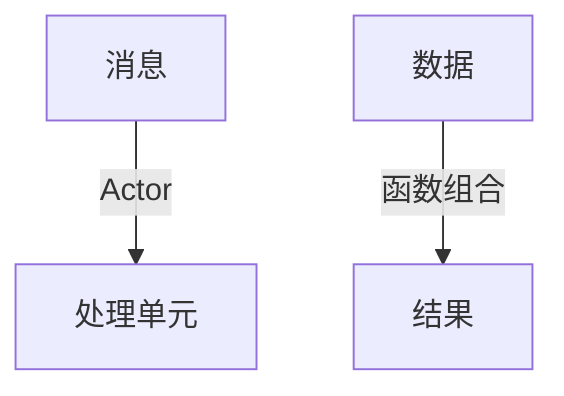

# 3.3 Scala

[返回3.编程语言范式](./README.md) | [返回Refactor总览](../README.md)

## 目录

- [3.3 Scala](#33-scala)
  - [目录](#目录)
  - [1. 概述](#1-概述)
  - [2. 主流技术与架构](#2-主流技术与架构)
  - [3. 形式化论证与多表征](#3-形式化论证与多表征)
  - [4. 相关性引用](#4-相关性引用)

---

## 1. 概述
Scala是一门融合了面向对象与函数式编程范式的多范式语言，运行于JVM。Scala以其高抽象能力、类型推导和并发模型，在大数据、分布式系统和前端（Scala.js）等领域广泛应用。

## 2. 主流技术与架构
- 类型系统：泛型、模式匹配、类型类。
- 并发模型：Akka Actor、Future、Promise。
- Web开发：Play Framework、Scala.js。
- 函数式编程：不可变数据结构、高阶函数。
- 工具链：sbt、Ammonite、ScalaTest。

## 3. 形式化论证与多表征
- 类型推导：局部类型推断与泛型约束。
- Actor模型：并发与分布式建模。
- 函数组合：以组合子模式描述数据流。
- 代码示例：
```scala
// Scala 函数式示例
def add(x: Int, y: Int): Int = x + y
```
- 图示：


## 4. 相关性引用
- [2.4 Haskell-Scala前端](../2.技术栈与框架/2.4 Haskell-Scala前端.md)
- [3.2 Haskell](../3.编程语言范式/3.2 Haskell.md)
