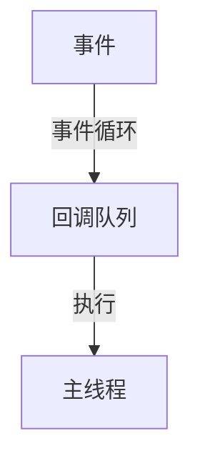

# 3.4 TypeScript-JavaScript

[返回3.编程语言范式](./README.md) | [返回Refactor总览](../README.md)

## 目录

- [3.4 TypeScript-JavaScript](#34-typescript-javascript)
  - [目录](#目录)
  - [1. 概述](#1-概述)
  - [2. 主流技术与架构](#2-主流技术与架构)
  - [3. 形式化论证与多表征](#3-形式化论证与多表征)
  - [4. 相关性引用](#4-相关性引用)

---

## 1. 概述

JavaScript是Web前端开发的事实标准语言，TypeScript是其类型安全的超集。两者共同推动了现代Web开发的工程化、模块化和类型安全。

## 2. 主流技术与架构

- JavaScript：ES6+语法、异步编程（Promise、async/await）。
- TypeScript：静态类型、接口、泛型、类型推断。
- 模块化：ESM、CommonJS、AMD。
- 前端工程化：Babel、Webpack、Vite。
- 生态系统：NPM、Yarn、Node.js。

## 3. 形式化论证与多表征

- 类型系统：TypeScript的结构化类型系统。
- 事件循环：JS的单线程异步模型。
- UML类图/时序图：建模对象关系与异步流程。
- 代码示例：

```typescript
// TypeScript 函数示例
function add(x: number, y: number): number {
  return x + y;
}
```

- 图示：



## 4. 相关性引用

- [2.1 前端主流框架](../2.技术栈与框架/2.1 前端主流框架.md)
- [5.1 UI-UE-UX设计规范](../5.技术规范与标准/5.1 UI-UE-UX设计规范.md)
