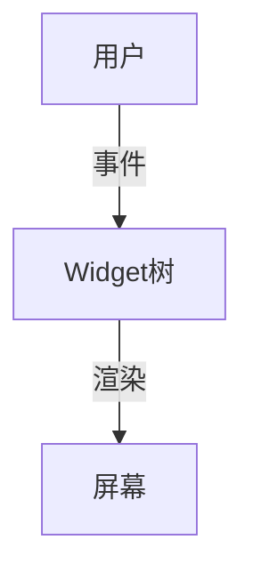

# 3.5 Dart-Flutter

[返回3.编程语言范式](./README.md) | [返回Refactor总览](../README.md)

## 目录

- [3.5 Dart-Flutter](#35-dart-flutter)
  - [目录](#目录)
  - [1. 概述](#1-概述)
  - [2. 主流技术与架构](#2-主流技术与架构)
  - [3. 形式化论证与多表征](#3-形式化论证与多表征)
  - [4. 相关性引用](#4-相关性引用)

---

## 1. 概述

Dart是一门现代化、面向对象的编程语言，Flutter是其主力UI框架，专注于高性能、跨平台的移动、Web和桌面应用开发。Flutter以声明式UI、热重载和丰富的组件生态著称。

## 2. 主流技术与架构

- Dart语言：强类型、JIT/AOT编译、异步支持。
- Flutter框架：Widget树、响应式编程、Material/Cupertino组件。
- 跨平台渲染：Skia引擎，统一UI表现。
- 状态管理：Provider、Bloc、Riverpod、GetX。
- 工程化工具：pub、Flutter CLI、DevTools。

## 3. 形式化论证与多表征

- Widget树建模：以有向树描述UI结构。
- 响应式数据流：Stream、Future建模异步与事件。
- UML组件图：描述模块与依赖关系。
- 代码示例：

```dart
// Flutter 组件示例
class HelloWorld extends StatelessWidget {
  @override
  Widget build(BuildContext context) {
    return Text('Hello, Flutter!');
  }
}
```

- 图示：



## 4. 相关性引用

- [1.2 移动端](../1.终端类型/1.2 移动端.md)
- [2.2 跨端框架](../2.技术栈与框架/2.2 跨端框架.md)
