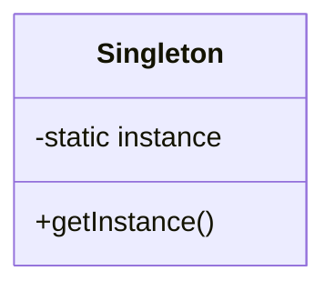

# 4.1 GoF设计模式

[返回4.设计模式与架构](./README.md) | [返回Refactor总览](../README.md)

## 目录

- [4.1 GoF设计模式](#41-gof设计模式)
  - [目录](#目录)
  - [1. 概述](#1-概述)
  - [2. 主流技术与架构](#2-主流技术与架构)
  - [3. 形式化论证与多表征](#3-形式化论证与多表征)
  - [4. 相关性引用](#4-相关性引用)

---

## 1. 概述

GoF设计模式（Gang of Four Patterns）是软件工程中经典的23种设计模式，涵盖创建型、结构型、行为型三大类。它们为软件架构提供了可复用、可扩展、可维护的解决方案。

## 2. 主流技术与架构

- 创建型模式：单例、工厂、抽象工厂、建造者、原型。
- 结构型模式：适配器、桥接、组合、装饰、外观、享元、代理。
- 行为型模式：责任链、命令、解释器、迭代器、中介者、备忘录、观察者、状态、策略、模板方法、访问者。
- UML图与模式实现。
- 设计原则：SOLID、开闭原则、依赖倒置等。

## 3. 形式化论证与多表征

- UML类图：建模各类设计模式结构。
- 设计模式的数学抽象：如工厂模式可视为对象生成函数f: 配置→对象。
- 代码示例：

```typescript
// 单例模式示例
class Singleton {
  private static instance: Singleton;
  private constructor() {}
  static getInstance() {
    if (!Singleton.instance) Singleton.instance = new Singleton();
    return Singleton.instance;
  }
}
```

- 图示：



## 4. 相关性引用

- [4.2 结构型-行为型-创建型模式](./4.2 结构型-行为型-创建型模式.md)
- [4.3 组件化与架构模式](./4.3 组件化与架构模式.md)
