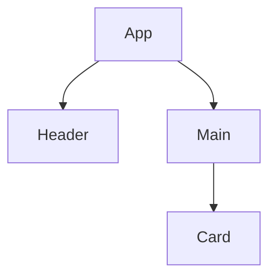

# 4.3 组件化与架构模式

[返回4.设计模式与架构](./README.md) | [返回Refactor总览](../README.md)

## 目录

- [4.3 组件化与架构模式](#43-组件化与架构模式)
  - [目录](#目录)
  - [1. 概述](#1-概述)
  - [2. 主流技术与架构](#2-主流技术与架构)
  - [3. 形式化论证与多表征](#3-形式化论证与多表征)
  - [4. 相关性引用](#4-相关性引用)

---

## 1. 概述

组件化与架构模式是现代前端和软件工程的核心思想，通过将系统拆分为独立、可复用、可组合的组件，提升开发效率、可维护性和扩展性。

## 2. 主流技术与架构

- 组件化：React/Vue/Angular等前端框架的基础。
- 微前端架构：多个独立前端应用协作。
- 插件化架构：功能模块可插拔。
- 单向数据流、依赖注入、服务注册与发现。
- 领域驱动设计（DDD）、分层架构、事件驱动架构（EDA）。

## 3. 形式化论证与多表征

- 组件树：以有向无环图（DAG）描述组件依赖。
- UML组件图/包图：建模模块关系。
- 事件流：以有向图描述事件传播。
- 代码示例：

```jsx
// React 组件化示例
function Card({ title, children }) {
  return <div className="card"><h2>{title}</h2>{children}</div>;
}
```

- 图示：



## 4. 相关性引用

- [2.1 前端主流框架](../2.技术栈与框架/2.1 前端主流框架.md)
- [4.1 GoF设计模式](./4.1 GoF设计模式.md)
